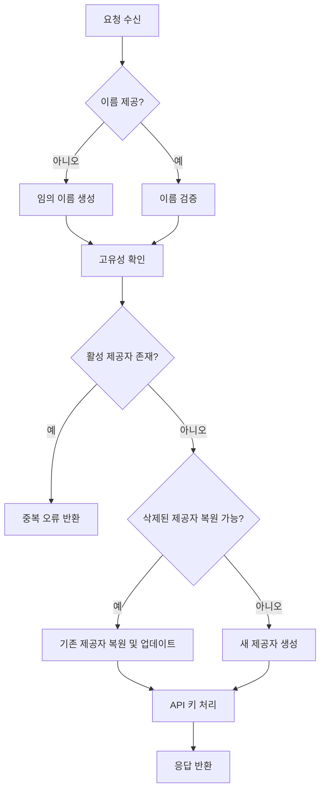
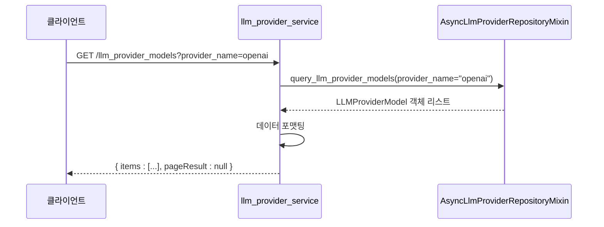

# LLM 제공자 API

<cite>
**이 문서에서 참조한 파일**
- [llm.yaml](file://aperag/api/components/schemas/llm.yaml)
- [model.yaml](file://aperag/api/components/schemas/model.yaml)
- [llm_provider_service.py](file://aperag/service/llm_provider_service.py)
- [llm_provider.py](file://aperag/db/repositories/llm_provider.py)
- [view_models.py](file://aperag/schema/view_models.py)
- [llm-provider.ts](file://web/src/api/models/llm-provider.ts)
- [llm-provider-model.ts](file://web/src/api/models/llm-provider-model.ts)
- [utils.py](file://aperag/views/utils.py)
</cite>

## 목차
1. [소개](#소개)
2. [핵심 기능 개요](#핵심-기능-개요)
3. [LLM 제공자 관리](#llm-제공자-관리)
4. [모델 구성 관리](#모델-구성-관리)
5. [API 스키마 정의](#api-스키마-정의)
6. [보안 및 인증 정보 처리](#보안-및-인증-정보-처리)
7. [시스템 기본 모델 및 우선순위](#시스템-기본-모델-및-우선순위)
8. [지원 모델 목록 조회](#지원-모델-목록-조회)

## 소개

이 문서는 LiteLLM 기반의 LLM(Large Language Model) 제공자를 관리하는 API에 대한 포괄적인 설명을 제공합니다. 이 시스템은 OpenAI, Anthropic 등 다양한 LLM 제공업체를 통합하여 단일 인터페이스로 접근할 수 있도록 설계되었습니다. 사용자는 새로운 LLM 제공자를 등록하고, 각 제공자의 API 키를 설정하며, 지원 모델을 구성하고 활성화 또는 비활성화할 수 있습니다. 또한, 민감한 인증 정보를 안전하게 저장하고 표시하기 위한 보안 전략도 포함되어 있습니다.

**Section sources**
- [llm_provider_service.py](file://aperag/service/llm_provider_service.py#L0-L556)
- [llm.yaml](file://aperag/api/components/schemas/llm.yaml#L0-L300)

## 핵심 기능 개요

LLM 제공자 관리 API는 다음과 같은 핵심 기능을 제공합니다:
- **LLM 제공자 등록**: 사용자는 고유한 이름과 레이블, API 기본 URL 등을 지정하여 새로운 LLM 제공자를 생성할 수 있습니다.
- **API 키 관리**: 각 제공자에 대해 사용자 지정 API 키를 설정하거나 업데이트할 수 있으며, 이를 통해 인증된 요청을 수행할 수 있습니다.
- **모델 구성**: 제공자가 지원하는 특정 모델(예: `gpt-4o-mini`, `claude-3-haiku`)을 등록하고, 컨텍스트 윈도우 크기, 최대 입력/출력 토큰 등의 속성을 정의할 수 있습니다.
- **활성화/비활성화**: 제공자 또는 개별 모델의 상태를 활성화(enable) 또는 비활성화(disable)하여 시스템 내에서의 가용성을 제어할 수 있습니다.
- **지원 모델 목록 조회**: 등록된 모든 제공자가 지원하는 모델의 전체 목록을 가져올 수 있습니다.
- **보안 마스킹**: 응답에서 API 키를 마스킹하여 노출되지 않도록 합니다.

이러한 기능들은 `llm_provider_service.py` 서비스 계층과 `llm_provider.py` 리포지토리 계층을 통해 구현되며, RESTful API 엔드포인트를 통해 외부에 노출됩니다.

**Section sources**
- [llm_provider_service.py](file://aperag/service/llm_provider_service.py#L0-L556)
- [llm_provider.py](file://aperag/db/repositories/llm_provider.py#L0-L799)

## LLM 제공자 관리

LLM 제공자 관리는 제공자의 수명 주기를 관리하는 핵심 기능입니다. 이는 제공자의 생성, 조회, 수정, 삭제를 포함합니다.

### 제공자 생성 (`POST /llm_providers`)
새로운 LLM 제공자를 생성합니다. 요청 본문에는 `LLMProviderCreateWithApiKey` 스키마가 사용됩니다. `name` 필드를 생략하면 시스템이 고유한 임의 이름을 생성합니다. 동일한 이름의 활성 제공자가 이미 존재하면 오류가 발생합니다. 제공자는 소프트 삭제되므로, 동일한 이름으로 다시 생성하려면 먼저 복원됩니다.



**Diagram sources**
- [llm_provider_service.py](file://aperag/service/llm_provider_service.py#L137-L168)
- [llm_provider.py](file://aperag/db/repositories/llm_provider.py#L300-L350)

### 제공자 조회 (`GET /llm_providers`, `GET /llm_providers/{provider_name}`)
등록된 모든 LLM 제공자 목록 또는 특정 제공자의 상세 정보를 조회할 수 있습니다. 관리자는 공용(public) 제공자와 자신의 개인 제공자 모두를 볼 수 있지만, 일반 사용자는 자신의 개인 제공자만 볼 수 있습니다. 응답에는 마스킹된 API 키가 포함됩니다.

### 제공자 수정 (`PUT /llm_providers/{provider_name}`)
기존 제공자의 구성(레이블, 기본 URL 등)을 업데이트합니다. `status` 파라미터를 사용하여 제공자를 명시적으로 활성화(`enable`) 또는 비활성화(`disable`)할 수 있습니다. `enable` 상태로 설정하면 새 API 키가 설정되거나 기존 키가 유지되며, `disable` 상태로 설정하면 관련 API 키가 물리적으로 삭제됩니다.

### 제공자 삭제 (`DELETE /llm_providers/{provider_name}`)
제공자를 소프트 삭제합니다. 이는 제공자 자체와 그 하위 모델들을 논리적으로 삭제하지만, 데이터베이스에서 영구적으로 제거하지는 않습니다. 이 작업은 멱등적(idempotent)이며, 이미 삭제된 제공자에 대해 호출해도 성공으로 간주됩니다.

**Section sources**
- [llm_provider_service.py](file://aperag/service/llm_provider_service.py#L70-L103)
- [llm_provider.py](file://aperag/db/repositories/llm_provider.py#L350-L450)

## 모델 구성 관리

각 LLM 제공자는 하나 이상의 모델을 구성할 수 있습니다. 이 기능은 제공자가 지원하는 특정 모델을 등록하고 관리하는 데 사용됩니다.

### 모델 생성 (`POST /llm_providers/{provider_name}/models`)
특정 제공자에 새로운 모델을 추가합니다. 요청 본문에는 `LLMProviderModelCreate` 스키마가 사용됩니다. `api` 필드는 `completion`, `embedding`, `rerank` 중 하나여야 합니다. 동일한 `provider_name`, `api`, `model` 조합의 활성 모델이 이미 존재하면 오류가 발생합니다.

### 모델 조회 (`GET /llm_provider_models`, `GET /llm_providers/{provider_name}/models`)
모든 등록된 모델 목록 또는 특정 제공자의 모델 목록을 조회할 수 있습니다. 조회 결과는 사용자가 액세스할 수 있는 제공자(자신의 개인 제공자 또는 공용 제공자)에 한정됩니다.

### 모델 수정 (`PUT /llm_providers/{provider_name}/models/{api}/{model}`)
기존 모델의 구성(컨텍스트 윈도우, 태그 등)을 업데이트합니다.

### 모델 삭제 (`DELETE /llm_providers/{provider_name}/models/{api}/{model}`)
특정 모델을 소프트 삭제합니다. 이 작업은 멱등적이며, 이미 삭제되었거나 존재하지 않는 모델에 대해서도 성공으로 간주됩니다.

**Section sources**
- [llm_provider_service.py](file://aperag/service/llm_provider_service.py#L439-L472)
- [llm_provider.py](file://aperag/db/repositories/llm_provider.py#L600-L700)

## API 스키마 정의

API 요청과 응답의 구조는 OpenAPI 스펙에 따라 엄격하게 정의되어 있습니다.

### 요청 스키마

#### `LLMProviderCreateWithApiKey`
LLM 제공자 생성 요청에 사용되는 스키마입니다.

| 필드 | 유형 | 설명 |
| :--- | :--- | :--- |
| `name` | string | 제공자의 고유 식별자 이름 (생략 가능) |
| `label` | string | 사용자에게 표시되는 친숙한 이름 |
| `base_url` | string | 제공자의 API 기본 URL |
| `completion_dialect` | string | 채팅/완성 API에 사용되는 다이얼렉트 (기본값: "openai") |
| `embedding_dialect` | string | 임베딩 API에 사용되는 다이얼렉트 (기본값: "openai") |
| `rerank_dialect` | string | 재순위 지정 API에 사용되는 다이얼렉트 (기본값: "jina_ai") |
| `allow_custom_base_url` | boolean | 사용자가 기본 URL을 재정의할 수 있는지 여부 |
| `extra` | string | JSON 형식의 추가 구성 데이터 |
| `api_key` | string | 제공자에 연결하기 위한 API 키 |
| `status` | string | 제공자 상태 ("enable" 또는 "disable") |

#### `LLMProviderModelCreate`
LLM 제공자 모델 생성 요청에 사용되는 스키마입니다.

| 필드 | 유형 | 설명 |
| :--- | :--- | :--- |
| `api` | enum | 모델이 속한 API 유형 (`completion`, `embedding`, `rerank`) |
| `model` | string | 모델의 이름/식별자 (예: "gpt-4o-mini") |
| `custom_llm_provider` | string | LiteLLM에서 사용되는 사용자 정의 제공자 구현 이름 |
| `context_window` | integer | 모델의 전체 컨텍스트 창 크기 (토큰 단위) |
| `max_input_tokens` | integer | 최대 입력 토큰 수 |
| `max_output_tokens` | integer | 최대 출력 토큰 수 |
| `tags` | array[string] | 모델 분류를 위한 태그 목록 (예: ["free", "recommend"]) |

### 응답 구조

#### `LLMProvider`
LLM 제공자 정보를 담는 응답 객체입니다.

| 필드 | 유형 | 설명 |
| :--- | :--- | :--- |
| `name` | string | 제공자의 고유 식별자 이름 |
| `user_id` | string | 제공자 소유자의 사용자 ID ("public"은 시스템 제공자) |
| `label` | string | 사용자에게 표시되는 친숙한 이름 |
| `completion_dialect` | string | 채팅/완성 API 다이얼렉트 |
| `embedding_dialect` | string | 임베딩 API 다이얼렉트 |
| `rerank_dialect` | string | 재순위 지정 API 다이얼렉트 |
| `allow_custom_base_url` | boolean | 사용자 정의 기본 URL 허용 여부 |
| `base_url` | string | API 기본 URL |
| `extra` | string | 추가 구성 데이터 (JSON) |
| `api_key` | string | 마스킹된 API 키 |
| `created` | string | 생성 타임스탬프 |
| `updated` | string | 마지막 업데이트 타임스탬프 |

#### `LLMProviderModel`
LLM 제공자 모델 정보를 담는 응답 객체입니다.

| 필드 | 유형 | 설명 |
| :--- | :--- | :--- |
| `provider_name` | string | 모델이 속한 제공자의 이름 |
| `api` | enum | 모델의 API 유형 |
| `model` | string | 모델 이름/식별자 |
| `custom_llm_provider` | string | LiteLLM 사용자 정의 제공자 구현 |
| `context_window` | integer | 컨텍스트 창 크기 |
| `max_input_tokens` | integer | 최대 입력 토큰 수 |
| `max_output_tokens` | integer | 최대 출력 토큰 수 |
| `tags` | array[string] | 분류 태그 목록 |
| `created` | string | 생성 타임스탬프 |
| `updated` | string | 마지막 업데이트 타임스탬프 |

**Section sources**
- [model.yaml](file://aperag/api/components/schemas/model.yaml#L100-L148)
- [view_models.py](file://aperag/schema/view_models.py#L1540-L1568)
- [llm-provider.ts](file://web/src/api/models/llm-provider.ts)
- [llm-provider-model.ts](file://web/src/api/models/llm-provider-model.ts)

## 보안 및 인증 정보 처리

민감한 인증 정보를 안전하게 처리하는 것은 이 시스템의 핵심 요건입니다.

### API 키 저장
사용자의 API 키는 `ModelServiceProvider`라는 별도의 데이터베이스 테이블에 저장됩니다. 이 테이블은 `name` (제공자 이름), `api_key` (암호화된 키), `status` (활성/삭제됨) 필드를 포함합니다. 이 분리는 LLM 제공자 메타데이터와 인증 정보를 분리하여 보안을 강화합니다.

### API 키 마스킹
API 키는 절대로 평문으로 클라이언트에 반환되지 않습니다. 대신, `mask_api_key` 유틸리티 함수를 사용하여 마스킹된 형태로 반환됩니다. 이 함수는 키의 처음 4자와 마지막 4자를 보여주고, 중간 부분은 실제 숨겨진 문자 수만큼 `*` 문자로 대체합니다. 예를 들어, `sk-1234567890abcdef`는 `sk-1********cdef`로 표시됩니다. 키 길이가 8자 이하인 경우 마스킹 없이 원래 값이 반환됩니다.

```python
def mask_api_key(api_key: str) -> str:
    if not api_key or len(api_key) <= 8:
        return api_key
    masked_length = len(api_key) - 8
    mask_chars = "*" * masked_length
    return f"{api_key[:4]}{mask_chars}{api_key[-4:]}"
```

이 마스킹은 `get_llm_configuration` 및 `get_llm_provider` 서비스 함수에서 수행되며, 사용자가 자신의 키만 조회할 수 있도록 엄격한 권한 체크가 선행됩니다.

**Section sources**
- [llm_provider.py](file://aperag/db/repositories/llm_provider.py#L50-L100)
- [utils.py](file://aperag/views/utils.py#L54-L78)
- [llm_provider_service.py](file://aperag/service/llm_provider_service.py#L70-L103)

## 시스템 기본 모델 및 우선순위

이 문서에서는 시스템 기본 모델 설정과 우선순위 정책에 대한 직접적인 코드 분석이 발견되지 않았습니다. 그러나 `llm_available_model_service.py` 파일의 `filter_models_by_tags` 함수를 통해 태그 기반 필터링을 통해 모델 선택 우선순위를 암시적으로 설정할 수 있음을 알 수 있습니다. 예를 들어, `["recommend"]` 태그가 붙은 모델을 우선적으로 추천 목록에 포함시킬 수 있습니다. 구체적인 기본 모델 설정 로직은 다른 서비스나 설정 파일에 위치할 수 있으나, 현재 분석 범위 내에서는 확인되지 않았습니다.

## 지원 모델 목록 조회

`GET /llm_provider_models` 엔드포인트를 사용하면 등록된 모든 LLM 제공자가 지원하는 모델의 전체 목록을 가져올 수 있습니다. `provider_name` 쿼리 파라미터를 사용하여 특정 제공자의 모델만 필터링할 수 있습니다. 응답은 `items` 배열과 페이지네이션 정보를 포함하는 객체로 구성됩니다. 이 목록은 사용자가 액세스할 수 있는 제공자(자신의 개인 제공자 또는 관리자 권한으로 인해 접근 가능한 공용 제공자)에 한정됩니다.



**Diagram sources**
- [llm_provider_service.py](file://aperag/service/llm_provider_service.py#L159-L180)
- [llm_provider.py](file://aperag/db/repositories/llm_provider.py#L600-L650)