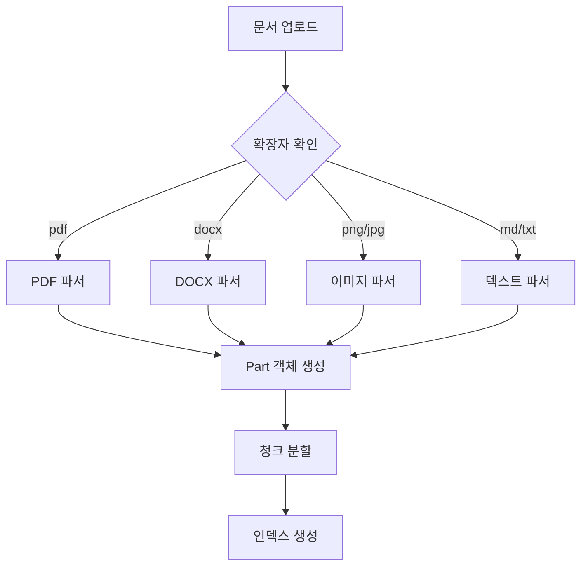

# 문서 API

<cite>
**이 문서에서 참조한 파일**
- [chat_documents.yaml](file://aperag/api/paths/chat_documents.yaml)
- [document_service.py](file://aperag/service/document_service.py)
- [base.py](file://aperag/docparser/base.py)
- [doc_parser.py](file://aperag/docparser/doc_parser.py)
- [document.py](file://aperag/db/repositories/document.py)
- [document.py](file://aperag/tasks/document.py)
</cite>

## 목차
1. [소개](#소개)
2. [문서 업로드](#문서-업로드)
3. [지원되는 파일 형식 및 제한 사항](#지원되는-파일-형식-및-제한-사항)
4. [문서 상태 확인](#문서-상태-확인)
5. [문서 삭제](#문서-삭제)
6. [인덱스 재생성](#인덱스-재생성)
7. [docparser 모듈 통합 흐름](#docparser-모듈-통합-흐름)
8. [클라이언트 폴링 최적화 패턴](#클라이언트-폴링-최적화-패턴)
9. [오류 코드 및 해결 방법](#오류-코드-및-해결-방법)

## 소개
본 문서는 ApeRAG 시스템 내 문서 관리 기능을 위한 API를 상세히 설명합니다. 사용자는 이 API를 통해 문서를 업로드하고, 처리 상태를 추적하며, 필요 시 삭제하거나 인덱스를 재생성할 수 있습니다. 문서는 지식 증강(Knowledge Augmentation)을 위해 채팅 세션에 임시로 연결되며, 다양한 인덱스(벡터, 풀텍스트, 그래프 등)가 비동기적으로 생성됩니다.

**Section sources**
- [chat_documents.yaml](file://aperag/api/paths/chat_documents.yaml#L1-L84)

## 문서 업로드
문서 업로드는 `multipart/form-data` 요청을 통해 수행되며, `/chats/{chat_id}/documents` 엔드포인트로 POST 요청을 보냅니다.

### 요청 구조
```http
POST /chats/{chat_id}/documents HTTP/1.1
Content-Type: multipart/form-data; boundary=----WebKitFormBoundary7MA4YWxkTrZu0gW

------WebKitFormBoundary7MA4YWxkTrZu0gW
Content-Disposition: form-data; name="file"; filename="example.pdf"
Content-Type: application/pdf

<파일 바이너리 데이터>
------WebKitFormBoundary7MA4YWxkTrZu0gW
Content-Disposition: form-data; name="message_id"

msg_12345
------WebKitFormBoundary7MA4YWxkTrZu0gW--
```

### 요청 매개변수
| 필드 | 위치 | 타입 | 필수 여부 | 설명 |
|------|------|------|-----------|------|
| `chat_id` | 경로 | 문자열 | 예 | 문서를 업로드할 채팅 세션의 ID |
| `file` | 본문 | 파일 | 예 | 업로드할 문서 파일 (바이너리) |
| `message_id` | 본문 | 문자열 | 예 | 문서와 연관될 메시지 ID |

### 응답
- **200 OK**: 문서가 성공적으로 업로드됨
- **400 Bad Request**: 요청이 잘못됨 (예: 누락된 필드)
- **401 Unauthorized**: 인증 실패
- **404 Not Found**: 지정된 채팅 세션이 존재하지 않음

**Section sources**
- [chat_documents.yaml](file://aperag/api/paths/chat_documents.yaml#L1-L35)
- [document_service.py](file://aperag/service/document_service.py#L150-L250)

## 지원되는 파일 형식 및 제한 사항
시스템은 다양한 문서 형식을 지원하며, 확장자 기반으로 파싱 가능 여부를 판단합니다.

### 지원되는 형식
- **PDF**: `.pdf`
- **워드 문서**: `.docx`, `.doc`
- **이미지**: `.png`, `.jpg`, `.jpeg`, `.webp`, `.tiff`, `.bmp`
- **마크다운**: `.md`
- **텍스트**: `.txt`
- **압축 파일**: `.zip`, `.tar`, `.gz`, `.bz2` (내부 파일 추출 후 처리)

### 파일 크기 제한
- 최대 파일 크기는 구성 파일(`config.py`)의 `max_document_size` 값에 의해 결정됩니다.
- 초과 시 `400 Bad Request` 오류가 반환되며, 메시지는 `"file size is too large"`입니다.

**Section sources**
- [base.py](file://aperag/docparser/base.py#L60-L65)
- [doc_parser.py](file://aperag/docparser/doc_parser.py)
- [document_service.py](file://aperag/service/document_service.py#L110-L130)

## 문서 상태 확인
문서 처리 상태는 업로드 후 비동기적으로 처리되며, 클라이언트는 상태를 폴링하여 확인할 수 있습니다.

### 상태 조회 엔드포인트
```http
GET /chats/{chat_id}/documents/{document_id} HTTP/1.1
```

### 응답 구조
응답에는 각 인덱스 유형별 상태 정보가 포함됩니다:
- `vector_index_status`: 벡터 인덱스 상태 (`PENDING`, `SUCCESS`, `FAILED`)
- `fulltext_index_status`: 풀텍스트 인덱스 상태
- `graph_index_status`: 지식 그래프 인덱스 상태
- `summary_index_status`: 요약 인덱스 상태
- `vision_index_status`: 비전 인덱스 상태
- `summary`: 문서 요약 내용 (요약 인덱스 생성 후 제공)

**Section sources**
- [document_service.py](file://aperag/service/document_service.py#L550-L600)
- [document.yaml](file://aperag/api/components/schemas/document.yaml)

## 문서 삭제
문서는 소프트 삭제 방식으로 처리되며, 관련 리소스도 함께 정리됩니다.

### 단일 문서 삭제
```http
DELETE /chats/{chat_id}/documents/{document_id}
```

### 다중 문서 삭제
```http
DELETE /chats/{chat_id}/documents
{
  "document_ids": ["doc1", "doc2"]
}
```

삭제 시 다음 작업이 수행됩니다:
1. 데이터베이스에서 문서 상태를 `DELETED`로 변경
2. 오브젝트 스토리지에서 원본 파일 및 청크 삭제
3. 모든 인덱스 항목 삭제 요청
4. 할당량(Quota) 반납
5. 인덱스 재조정 작업 트리거

**Section sources**
- [document_service.py](file://aperag/service/document_service.py#L600-L700)
- [document.py](file://aperag/db/repositories/document.py#L150-L200)

## 인덱스 재생성
실패한 인덱스 또는 특정 인덱스를 재생성할 수 있는 기능을 제공합니다.

### 개별 인덱스 재생성
```http
POST /collections/{collection_id}/documents/{document_id}/rebuild_indexes
{
  "index_types": ["VECTOR", "FULLTEXT"]
}
```

### 실패한 모든 인덱스 재생성
```http
POST /collections/{collection_id}/rebuild_failed_indexes
```

이 작업은 컬렉션 설정에서 해당 인덱스 유형이 활성화되어 있어야 하며, 그렇지 않은 경우 자동으로 제외됩니다.

**Section sources**
- [document_service.py](file://aperag/service/document_service.py#L700-L800)

## docparser 모듈 통합 흐름
문서 처리는 `docparser` 모듈을 중심으로 이루어집니다.

### 처리 흐름
1. `DocParser`가 파일 확장자를 기반으로 적절한 파서 선택
2. 파일을 `Part` 객체 리스트로 파싱 (텍스트, 이미지, 코드 등)
3. 파싱된 내용은 `ParsedDocumentData`로 변환
4. 각 인덱스 생성기가 필요한 데이터를 추출하여 처리

### 주요 컴포넌트
- `BaseParser`: 모든 파서의 추상 기본 클래스
- `DocParser`: 파일 확장자 기반 라우팅
- `chunking.py`: 텍스트 청크 분할 로직



**Diagram sources**
- [base.py](file://aperag/docparser/base.py#L60-L80)
- [doc_parser.py](file://aperag/docparser/doc_parser.py)
- [chunking.py](file://aperag/docparser/chunking.py)

**Section sources**
- [doc_parser.py](file://aperag/docparser/doc_parser.py)
- [document.py](file://aperag/tasks/document.py#L50-L100)

## 클라이언트 폴링 최적화 패턴
문서 처리 완료를 효율적으로 확인하기 위한 권장 패턴입니다.

### 백오프 전략
```python
import asyncio
import time

async def poll_document_status(document_id):
    attempts = 0
    max_attempts = 10
    base_delay = 1  # 초

    while attempts < max_attempts:
        status = await get_status(document_id)
        
        if status.is_final():
            return status
            
        delay = base_delay * (2 ** attempts)  # 지수 백오프
        await asyncio.sleep(delay)
        attempts += 1
        
    raise TimeoutError("문서 처리 시간 초과")
```

### 배치 상태 확인
여러 문서의 상태를 한 번에 확인하는 것이 권장됩니다:
```http
GET /collections/{collection_id}/documents?page=1&page_size=50
```

**Section sources**
- [document_service.py](file://aperag/service/document_service.py#L500-L550)

## 오류 코드 및 해결 방법
API 호출 중 발생할 수 있는 주요 오류와 그 해결 방법입니다.

### 일반 오류 코드
| 상태 코드 | 오류 메시지 | 원인 | 해결 방법 |
|---------|------------|------|----------|
| 400 | unsupported file type .xyz | 지원되지 않는 파일 형식 | PDF, DOCX 등 지원 형식으로 변환 |
| 400 | file size is too large | 파일 크기 초과 | 파일 크기 축소 또는 분할 |
| 400 | documents are too many | 한 번에 너무 많은 파일 업로드 | 50개 이하로 분할하여 업로드 |
| 404 | Chat not found | 잘못된 채팅 ID | 유효한 채팅 ID 사용 |
| 409 | document name conflict | 동일 이름의 다른 문서 존재 | 파일 이름 변경 또는 무시 옵션 사용 |

### 인덱스 생성 실패
- **원인**: LLM 오류, 네트워크 문제, 리소스 부족
- **해결**: `rebuild_indexes` 엔드포인트를 사용하여 재시도
- **지속적 실패 시**: 컬렉션 설정 확인 및 시스템 로그 점검

**Section sources**
- [document_service.py](file://aperag/service/document_service.py#L100-L150)
- [exceptions.py](file://aperag/exceptions.py)