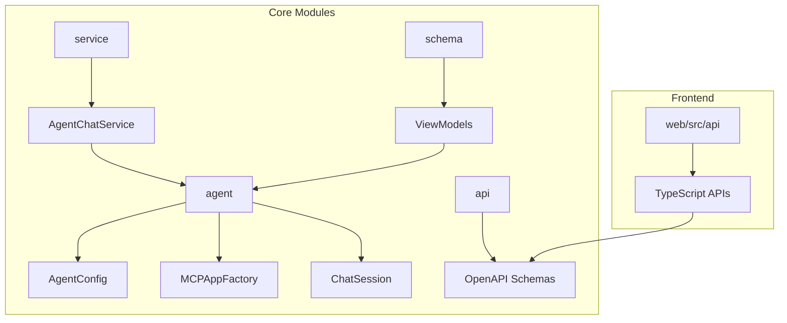

# 에이전트 API

<cite>
**이 문서에서 참조한 파일**
- [agent_config.py](file://aperag/agent/agent_config.py)
- [mcp_app_factory.py](file://aperag/agent/mcp_app_factory.py)
- [agent_session_manager.py](file://aperag/agent/agent_session_manager.py)
- [view_models.py](file://aperag/schema/view_models.py)
- [default-api.ts](file://web/src/api/apis/default-api.ts)
</cite>

## 목차
1. [소개](#소개)
2. [프로젝트 구조](#프로젝트-구조)
3. [핵심 구성 요소](#핵심-구성-요소)
4. [아키텍처 개요](#아키텍처-개요)
5. [상세 구성 요소 분석](#상세-구성-요소-분석)
6. [의존성 분석](#의존성-분석)
7. [성능 고려사항](#성능-고려사항)
8. [문제 해결 가이드](#문제-해결-가이드)
9. [결론](#결론)

## 소개
본 문서는 AI 에이전트(봇) 생성 및 관리를 위한 API를 상세히 설명합니다. 에이전트 구성(프롬프트, 도구 사용 설정, MCP 통합), 도구(tool) 목록 관리, MCP(Model Context Protocol) 통합 설정 및 상태 확인 API, 에이전트 세션 관리와 메모리 상태 초기화 기능을 다룹니다. 실제 사용 사례로 지능형 고객 서비스 봇 생성 프로세스를 예시로 들어 API 호출 순서를 안내합니다.

## 프로젝트 구조
ApeRAG 프로젝트는 에이전트 중심의 대화형 인공지능 시스템을 구현하기 위해 모듈화된 구조를 가지고 있습니다. 주요 디렉터리는 `aperag` 내부에 위치하며, 핵심 기능은 `agent`, `api`, `service`, `schema` 등으로 분리되어 있습니다. 에이전트 관련 로직은 `aperag/agent`에 집중되어 있으며, API 스키마는 OpenAPI 3.0 형식으로 `aperag/api/components/schemas`에 정의되어 있습니다.

**도표 출처**
- [agent_config.py](file://aperag/agent/agent_config.py#L21-L52)
- [mcp_app_factory.py](file://aperag/agent/mcp_app_factory.py#L25-L103)
- [view_models.py](file://aperag/schema/view_models.py#L2515-L2557)

**섹션 출처**
- [agent_config.py](file://aperag/agent/agent_config.py#L1-L53)
- [mcp_app_factory.py](file://aperag/agent/mcp_app_factory.py#L1-L104)
- [agent_session_manager.py](file://aperag/agent/agent_session_manager.py#L1-L251)

## 핵심 구성 요소
AI 에이전트의 핵심 구성 요소는 에이전트 설정, 세션 관리, MCP 통합, 메모리 관리로 나뉩니다. `AgentConfig` 클래스는 사용자 ID, 채팅 ID, LLM 제공자 정보, 기본 모델, 온도, 최대 토큰 수, 언어 설정, 지침(instruction), MCP 서버 URL 및 API 키 등을 포함하여 에이전트 세션 생성에 필요한 모든 설정을 중앙에서 관리합니다. `ChatSession` 클래스는 각 사용자-채팅-제공자 조합에 대해 독립적인 세션을 유지하며, MCP 앱, 에이전트, LLM 인스턴스를 캐싱하여 상태와 메모리를 보존합니다.

**섹션 출처**
- [agent_config.py](file://aperag/agent/agent_config.py#L21-L52)
- [agent_session_manager.py](file://aperag/agent/agent_session_manager.py#L36-L72)

## 아키텍처 개요
시스템 아키텍처는 클라이언트에서 시작하여 백엔드 서비스, 에이전트 세션, MCP 서버로 이어지는 흐름을 따릅니다. 클라이언트는 `AgentMessage` 객체를 통해 쿼리, 컬렉션, 완성 모델 사양, 웹 검색 여부, 언어 선호도 등을 전송합니다. 백엔드는 `AgentChatService`를 통해 요청을 처리하고, `AgentConfig`를 생성한 후 `get_or_create_session` 함수를 사용하여 적절한 채팅 세션을 가져오거나 생성합니다. 세션은 `MCPAppFactory`를 통해 MCP 앱을 초기화하고, `Agent` 인스턴스를 연결하여 LLM 응답을 생성합니다.

**도표 출처**
- [agent_config.py](file://aperag/agent/agent_config.py#L21-L52)
- [mcp_app_factory.py](file://aperag/agent/mcp_app_factory.py#L25-L103)
- [agent_session_manager.py](file://aperag/agent/agent_session_manager.py#L146-L176)

## 상세 구성 요소 분석

### 에이전트 구성 분석
`AgentConfig`는 데이터클래스로 구현되어 있으며, 에이전트 세션의 핵심 설정을 담당합니다. `user_id`, `chat_id`, `provider_name`은 세션 키를 생성하는 데 사용되며, `get_session_key()` 메서드를 통해 `user_id:chat_id:provider_name` 형식의 고유 키를 반환합니다. LLM 설정에는 `api_key`, `base_url`, `default_model`이 포함되며, MCP 통합을 위해 `aperag_api_key`와 `aperag_mcp_url`이 필수입니다. 이 설정들은 MCP 서버에 대한 인증과 연결을 가능하게 합니다.

**도표 출처**
- [agent_config.py](file://aperag/agent/agent_config.py#L21-L52)

### MCP 통합 분석
`MCPAppFactory`는 싱글톤 패턴 없이 간단한 정적 메서드를 사용하여 MCP 앱 인스턴스를 생성합니다. `create_mcp_app_from_config()` 메서드는 `AgentConfig` 객체를 받아 `Settings` 객체를 구성합니다. 이 설정은 `mcp` 섹션에 `aperag`라는 이름의 서버를 정의하며, `streamable_http` 전송 방식, `aperag_mcp_url`, 인증 헤더, 타임아웃 값을 포함합니다. 또한 `openai` 섹션은 LLM 제공자의 `api_key`, `base_url`, `default_model`을 설정합니다. 생성 실패 시 `mcp_init_failed()` 예외를 발생시켜 오류를 처리합니다.

```mermaid
flowchart TD
Start([create_mcp_app_from_config]) --> Validate["필수 매개변수 검증"]
Validate --> |모두 존재| CreateSettings["Settings 객체 생성"]
CreateSettings --> ConfigureMCP["MCPSettings 구성<br/>- transport: streamable_http<br/>- url: aperag_mcp_url<br/>- headers: Authorization, Content-Type"]
ConfigureMCP --> ConfigureOpenAI["OpenAISettings 구성<br/>- api_key, base_url, default_model"]
ConfigureOpenAI --> Instantiate["MCPApp(name='aperag_agent', settings=settings)"]
Instantiate --> Log["로그: MCP app 생성 완료"]
Log --> Return["MCPApp 반환"]
Validate --> |누락됨| RaiseError["agent_config_invalid 예외 발생"]
Instantiate --> |예외 발생| HandleException["mcp_init_failed 예외 발생"]
RaiseError --> End
HandleException --> End
Return --> End
```

**도표 출처**
- [mcp_app_factory.py](file://aperag/agent/mcp_app_factory.py#L25-L103)

### 세션 관리 분석
`get_or_create_session()` 함수는 에이전트 세션을 가져오거나 생성하는 핵심 진입점입니다. 먼저 `config.get_session_key()`를 사용해 세션 키를 생성하고, 전역 `_chat_sessions` 딕셔너리에서 해당 키를 가진 세션을 찾습니다. 세션이 존재하고 준비 상태(`_ready`)이며 만료되지 않았다면, `touch()`로 마지막 사용 시간을 갱신한 후 즉시 반환합니다. 그렇지 않으면 기존 세션을 정리하고(`_cleanup()`), 새로운 `ChatSession`을 생성하여 초기화한 후 딕셔너리에 저장하고 반환합니다. 이 과정에서 경쟁 조건(race condition)을 허용함으로써 복잡한 잠금 메커니즘을 피하고 단순성을 유지합니다.

**도표 출처**
- [agent_session_manager.py](file://aperag/agent/agent_session_manager.py#L146-L176)

**섹션 출처**
- [agent_session_manager.py](file://aperag/agent/agent_session_manager.py#L137-L179)

## 의존성 분석
주요 의존성은 `mcp-agent` 라이브러리와 밀접하게 연결되어 있습니다. `aperag.agent` 모듈은 `mcp-agent.app.MCPApp`, `mcp-agent.agents.Agent`, `mcp-agent.workflows.llm.augmented_llm_openai.OpenAIAugmentedLLM` 등의 클래스를 직접 사용하여 MCP 기반 에이전트를 구축합니다. `MCPAppFactory`는 `mcp-agent.config` 모듈의 `Settings`, `MCPServerSettings`, `MCPSettings`, `OpenAISettings`를 활용하여 MCP 앱 설정을 구성합니다. 이러한 의존성은 에이전트가 다양한 도구와 지식베이스(MCP 서버)에 접근할 수 있도록 하며, 확장 가능한 아키텍처를 제공합니다.

**도표 출처**
- [mcp_app_factory.py](file://aperag/agent/mcp_app_factory.py#L25-L103)
- [agent_session_manager.py](file://aperag/agent/agent_session_manager.py#L36-L72)

**섹션 출처**
- [mcp_app_factory.py](file://aperag/agent/mcp_app_factory.py#L1-L104)

## 성능 고려사항
세션 관리는 성능 최적화를 위해 설계되었습니다. `ChatSession`은 LLM 인스턴스를 캐싱하여 동일한 채팅 내에서 반복적인 초기화 비용을 줄입니다. 전역 `_chat_sessions` 딕셔너리는 O(1) 조회 시간을 제공하며, 불필요한 세션 생성을 방지합니다. 백그라운드 정리 작업(`_cleanup_loop`)은 5분마다 실행되어 만료된 세션(기본 30분)을 제거함으로써 메모리 누수를 방지합니다. `get_or_create_session` 함수는 경쟁 조건을 허용함으로써 복잡한 동시성 제어를 피하고, 단순성과 유지보수성을 우선시합니다.

## 문제 해결 가이드
에이전트 초기화 실패 시 다음과 같은 절차로 문제를 진단할 수 있습니다. 먼저 `MCPConnectionError`가 발생하면 `aperag_mcp_url`과 네트워크 연결을 확인해야 합니다. `MCPAppInitializationError`는 일반적으로 `aperag_api_key` 또는 기타 필수 구성 값이 누락되었음을 나타냅니다. 세션이 자주 재생성되는 경우, `is_expired()`의 타임아웃 값이나 `get_or_create_session`의 논리를 검토해야 합니다. MCP 통합 문제는 `trace.mcp_integration` 모듈의 로깅을 통해 추적할 수 있으며, 트레이싱이 활성화되어 있는지 확인해야 합니다.

**섹션 출처**
- [exceptions.py](file://aperag/agent/exceptions.py#L39-L84)
- [mcp_integration.py](file://aperag/trace/mcp_integration.py#L78-L123)

## 결론
ApeRAG의 에이전트 API는 `AgentConfig`를 중심으로 한 명확한 구성 관리, `get_or_create_session`을 통한 효율적인 세션 관리, `MCPAppFactory`를 활용한 유연한 MCP 통합이라는 세 가지 핵심 원칙 위에 구축되어 있습니다. 이 아키텍처는 확장성과 유지보수성을 극대화하면서도, 복잡한 동시성 문제를 회피함으로써 코드의 단순성과 신뢰성을 보장합니다. 지능형 고객 서비스 봇과 같은 실제 사용 사례에서는, 클라이언트가 `AgentMessage`를 보내면 백엔드가 자동으로 적절한 세션을 관리하고 MCP 서버를 통해 풍부한 지식 기반 응답을 생성하는 원활한 프로세스를 제공합니다.