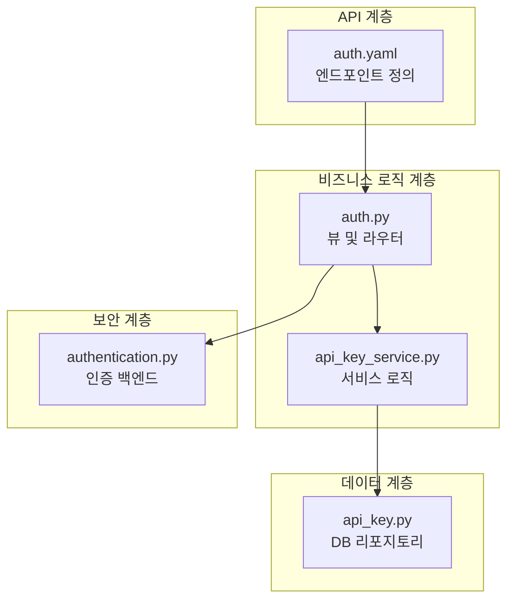
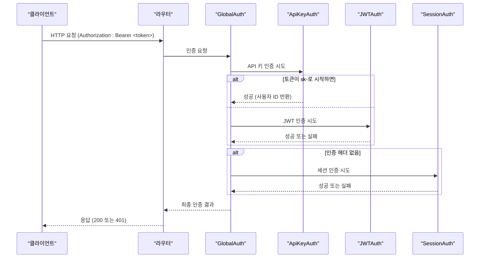
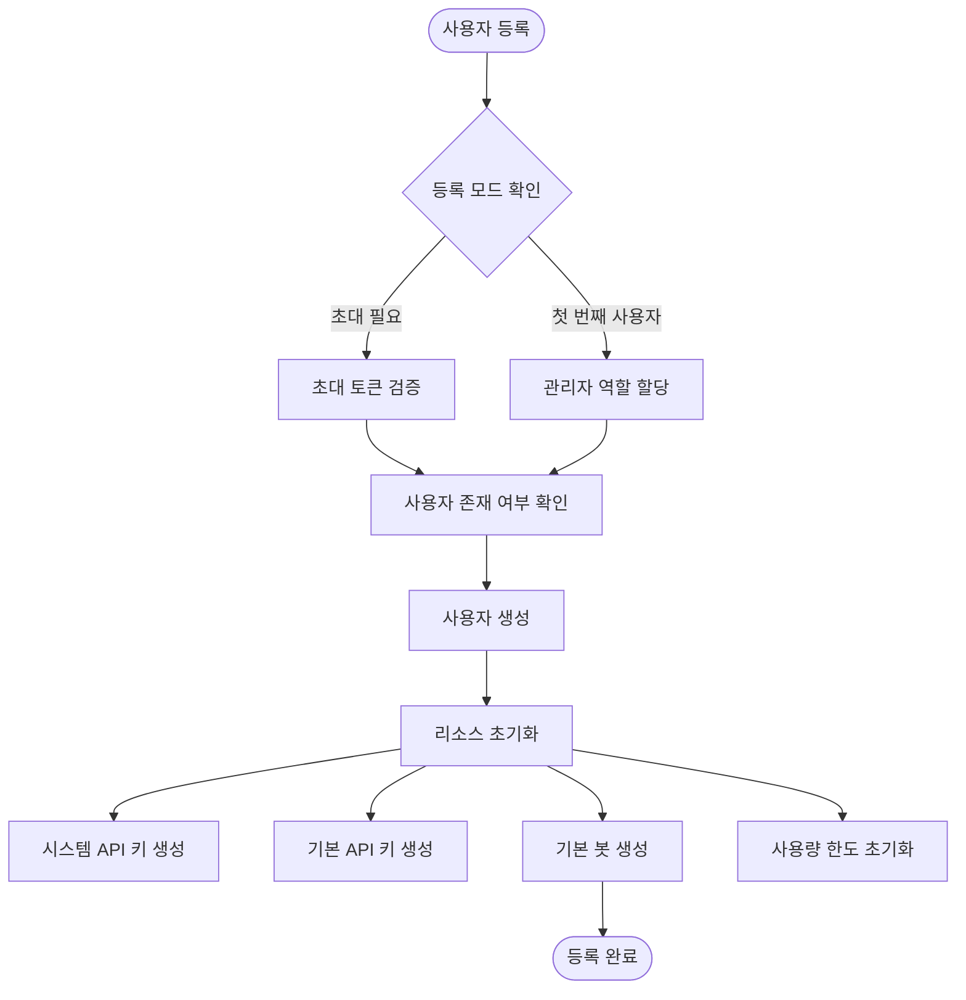
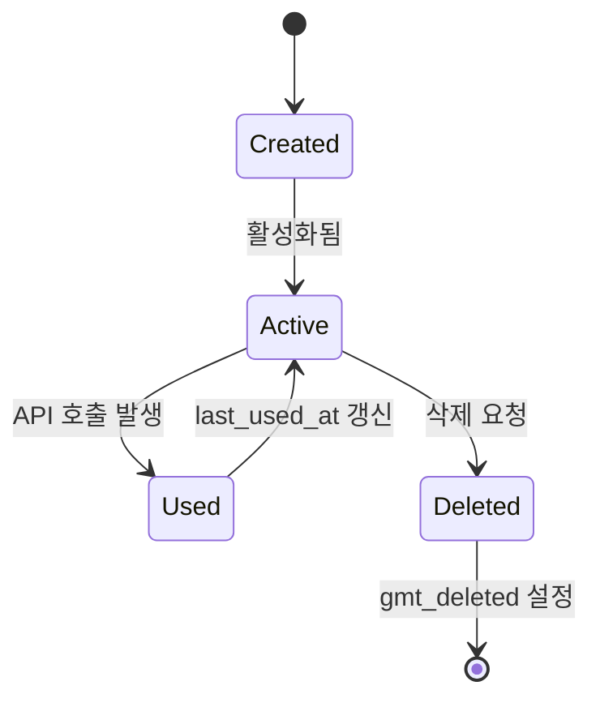
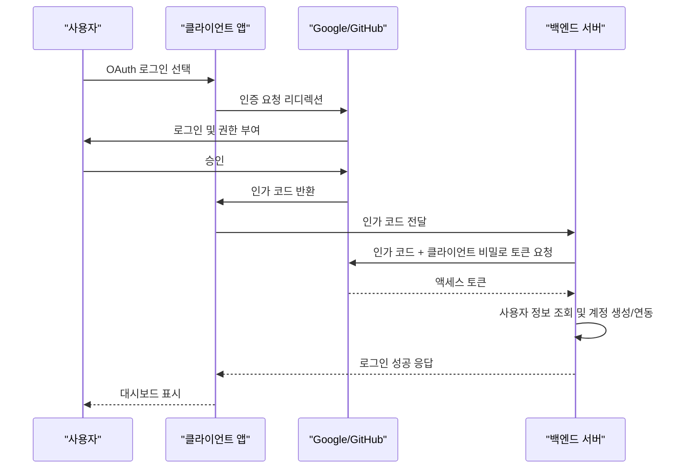
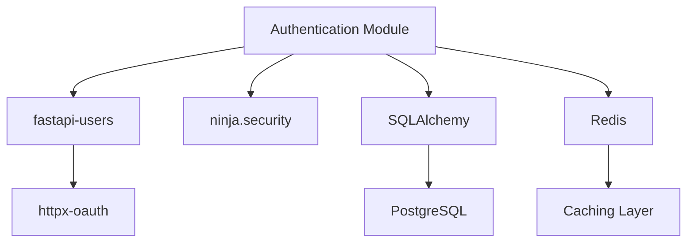

# 인증 API

<cite>
**이 문서에서 참조한 파일**
- [authentication.py](file://aperag/auth/authentication.py)
- [auth.yaml](file://aperag/api/paths/auth.yaml)
- [api_key_service.py](file://aperag/service/api_key_service.py)
- [api_key.py](file://aperag/db/repositories/api_key.py)
- [auth.py](file://aperag/views/auth.py)
</cite>

## 목차
1. [소개](#소개)
2. [프로젝트 구조](#프로젝트-구조)
3. [핵심 구성 요소](#핵심-구성-요소)
4. [아키텍처 개요](#아키텍처-개요)
5. [상세 구성 요소 분석](#상세-구성-요소-분석)
6. [의존성 분석](#의존성-분석)
7. [성능 고려사항](#성능-고려사항)
8. [문제 해결 가이드](#문제-해결-가이드)
9. [결론](#결론)

## 소개
본 문서는 ApeRAG 시스템의 인증 기능을 담당하는 API를 철저히 문서화합니다. 사용자 로그인, API 키 관리, OAuth 통합(Google, GitHub) 등의 핵심 인증 메커니즘을 다룹니다. 각 인증 방식의 작동 원리, 보안 정책, 토큰 수명 주기 및 실제 사용 예시를 포함하여, 개발자와 운영자가 안전하고 효과적으로 시스템을 활용할 수 있도록 지원합니다.

## 프로젝트 구조
ApeRAG의 인증 관련 코드는 `aperag` 디렉터리 내 여러 하위 모듈에 분산되어 있습니다. 주요 구성은 다음과 같습니다:
- `auth/`: 인증 백엔드 및 미들웨어 구현 (`authentication.py`)
- `views/`: HTTP 요청을 처리하는 뷰 함수 및 라우터 (`auth.py`)
- `service/`: 비즈니스 로직 캡슐화 (`api_key_service.py`)
- `db/repositories/`: 데이터베이스 접근 로직 (`api_key.py`)
- `api/paths/`: OpenAPI 사양에 따른 엔드포인트 정의 (`auth.yaml`)

**Diagram sources**
- [auth.yaml](file://aperag/api/paths/auth.yaml#L1-L163)
- [auth.py](file://aperag/views/auth.py#L1-L634)
- [authentication.py](file://aperag/auth/authentication.py#L1-L273)
- [api_key_service.py](file://aperag/service/api_key_service.py#L1-L89)
- [api_key.py](file://aperag/db/repositories/api_key.py#L1-L122)

**Section sources**
- [auth.yaml](file://aperag/api/paths/auth.yaml#L1-L163)
- [auth.py](file://aperag/views/auth.py#L1-L634)
- [authentication.py](file://aperag/auth/authentication.py#L1-L273)
- [api_key_service.py](file://aperag/service/api_key_service.py#L1-L89)
- [api_key.py](file://aperag/db/repositories/api_key.py#L1-L122)

## 핵심 구성 요소
시스템의 인증은 세 가지 주요 방법(JWT, API 키, OAuth)을 지원하며, `GlobalAuth` 클래스를 통해 우선순위 기반으로 조합됩니다. API 키는 `sk-` 접두사를 사용하며, Redis 캐시를 활용하여 성능을 최적화합니다. 모든 인증 정보는 HTTPS를 통해 전송되어야 하며, 민감한 데이터는 암호화된 상태로 저장됩니다.

**Section sources**
- [authentication.py](file://aperag/auth/authentication.py#L1-L273)
- [auth.py](file://aperag/views/auth.py#L1-L634)

## 아키텍처 개요
인증 아키텍처는 클라이언트로부터의 요청을 다양한 인증 메커니즘을 통해 검증하는 계층적 구조를 따릅니다. 가장 높은 우선순위는 관리자 인증이며, 그 다음으로 API 키, JWT, 세션 인증 순서로 적용됩니다. 이 설계는 유연한 인증 옵션과 강력한 보안을 동시에 제공합니다.

**Diagram sources**
- [authentication.py](file://aperag/auth/authentication.py#L1-L273)

## 상세 구성 요소 분석

### 사용자 등록 및 로그인 분석
사용자는 초대(invitation)를 통해 등록하거나, Google/GitHub OAuth를 사용하여 소셜 로그인할 수 있습니다. 첫 번째 사용자는 자동으로 관리자 권한을 부여받습니다. 로그인 후에는 JWT 토큰이 쿠키에 저장되며, 이 토큰은 24시간(86400초) 동안 유효합니다.

#### 사용자 등록 흐름

**Diagram sources**
- [auth.py](file://aperag/views/auth.py#L1-L634)

**Section sources**
- [auth.py](file://aperag/views/auth.py#L1-L634)

### API 키 관리 분석
API 키는 사용자의 서비스 접근을 위한 주요 인증 수단입니다. `sk-`로 시작하는 문자열이며, 생성 시점부터 90일간 유효합니다. 키는 두 가지 유형으로 나뉩니다: 시스템 키(내부 사용, 숨김)와 일반 키(사용자 노출). 각 키는 특정 권한 범위(scope)와 연결되며, 사용 시마다 마지막 사용 시간이 갱신됩니다.

#### API 키 생명주기

**Diagram sources**
- [api_key_service.py](file://aperag/service/api_key_service.py#L1-L89)
- [api_key.py](file://aperag/db/repositories/api_key.py#L1-L122)

**Section sources**
- [api_key_service.py](file://aperag/service/api_key_service.py#L1-L89)
- [api_key.py](file://aperag/db/repositories/api_key.py#L1-L122)

### OAuth 통합 분석
Google 및 GitHub OAuth는 `fastapi-users` 라이브러리를 통해 구현됩니다. 사용자가 OAuth 제공자를 통해 로그인하면, 시스템은 사용자의 이메일을 기준으로 계정을 연동합니다. GitHub 사용자의 경우, 추가적으로 GitHub API를 호출하여 사용자 이름을 가져옵니다.

#### OAuth 로그인 흐름

**Diagram sources**
- [auth.py](file://aperag/views/auth.py#L1-L634)

**Section sources**
- [auth.py](file://aperag/views/auth.py#L1-L634)

## 의존성 분석
인증 시스템은 여러 외부 라이브러리와 긴밀하게 협업합니다. 주요 의존성은 다음과 같습니다:
- `fastapi-users`: 사용자 관리 및 OAuth 통합
- `ninja.security`: HTTP 인증 백엔드 추상화
- `SQLAlchemy`: ORM을 통한 데이터베이스 접근
- `Redis`: API 키 캐싱을 통한 성능 향상

**Diagram sources**
- [authentication.py](file://aperag/auth/authentication.py#L1-L273)
- [auth.py](file://aperag/views/auth.py#L1-L634)

**Section sources**
- [authentication.py](file://aperag/auth/authentication.py#L1-L273)
- [auth.py](file://aperag/views/auth.py#L1-L634)

## 성능 고려사항
API 키 인증은 데이터베이스 쿼리 성능에 민감합니다. 이를 위해 `get_user_from_api_key` 함수는 Redis 캐시를 활용하여 반복적인 DB 조회를 방지합니다. 또한, `AsyncDatabaseOps`를 사용하여 비동기 I/O를 수행함으로써 동시 요청 처리 능력을 극대화합니다.

## 문제 해결 가이드
- **401 Unauthorized 오류**: Authorization 헤더가 누락되었거나 형식이 잘못되었습니다. `Bearer <token>` 형식인지 확인하세요.
- **API 키 인식 불가**: 키가 `sk-`로 시작하지 않으면 JWT 인증으로 처리됩니다. 키 접두사를 확인하세요.
- **OAuth 로그인 실패**: 환경 변수(`google_oauth_client_id`, `github_oauth_client_secret`)가 올바르게 설정되었는지 확인하세요.
- **WebSocket 인증 실패**: 웹소켓 연결 시 세션 쿠키가 함께 전송되는지 확인하세요.

**Section sources**
- [authentication.py](file://aperag/auth/authentication.py#L1-L273)
- [auth.py](file://aperag/views/auth.py#L1-L634)

## 결론
ApeRAG의 인증 API는 JWT, API 키, OAuth를 통합하여 유연하고 안전한 인증 환경을 제공합니다. 각 메커니즘은 명확한 책임을 가지며, `GlobalAuth`를 통해 효율적으로 조합됩니다. 보안을 위해 모든 전송은 HTTPS를 요구하며, 민감한 정보는 암호화된 상태로 저장됩니다. 개발자는 cURL 예제를 참고하여 토큰을 획득한 후, 다른 API 엔드포인트를 안전하게 호출할 수 있습니다.