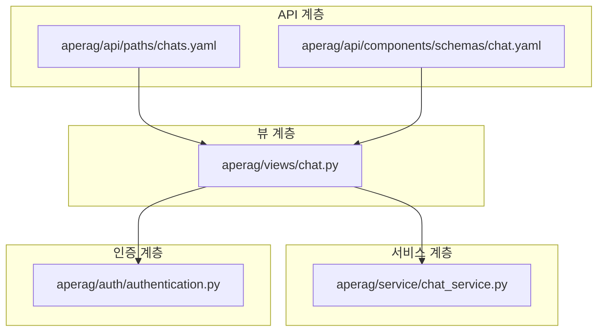
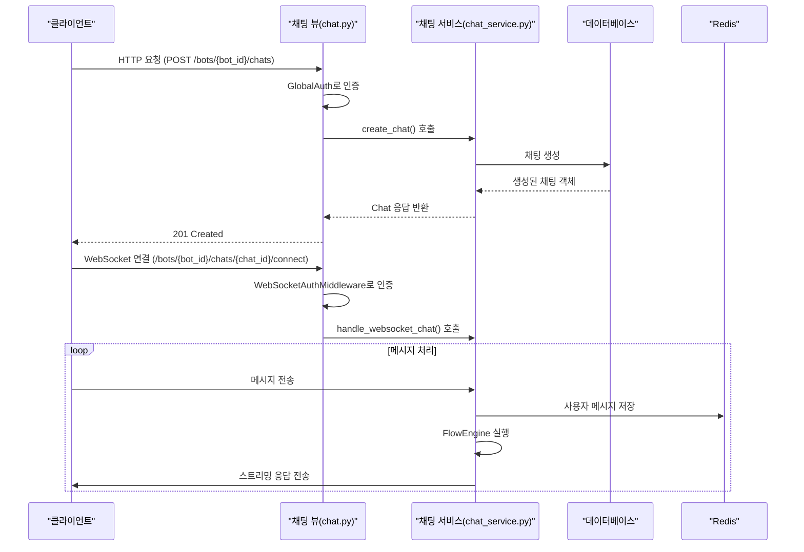
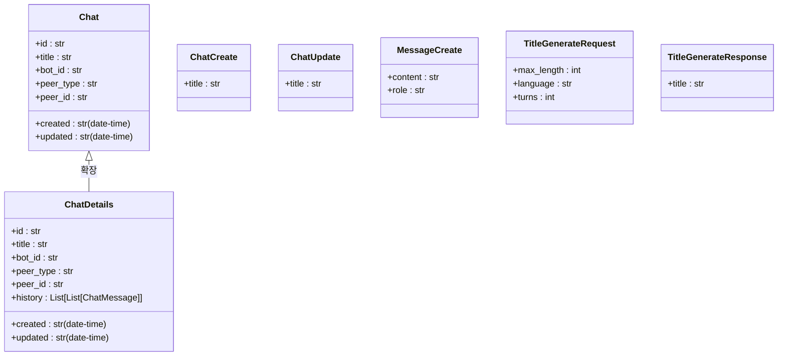
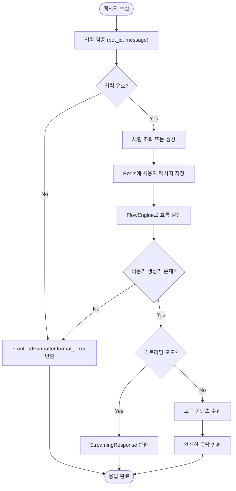
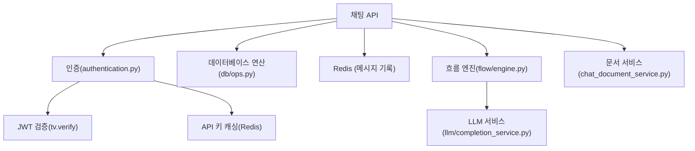

# 채팅 API

<cite>
**이 문서에서 참조한 파일**
- [chats.yaml](file://aperag/api/paths/chats.yaml)
- [chat.yaml](file://aperag/api/components/schemas/chat.yaml)
- [chat.py](file://aperag/views/chat.py)
- [chat_service.py](file://aperag/service/chat_service.py)
- [authentication.py](file://aperag/auth/authentication.py)
</cite>

## 목차
1. [소개](#소개)
2. [프로젝트 구조](#프로젝트-구조)
3. [핵심 구성 요소](#핵심-구성-요소)
4. [아키텍처 개요](#아키텍처-개요)
5. [상세 구성 요소 분석](#상세-구성-요소-분석)
6. [의존성 분석](#의존성-분석)
7. [성능 고려사항](#성능-고려사항)
8. [문제 해결 가이드](#문제-해결-가이드)
9. [결론](#결론)

## 소개
ApeRAG의 채팅 관련 RESTful API는 사용자와 AI 에이전트 간의 대화를 관리하기 위한 핵심 기능을 제공합니다. 이 문서는 채팅 생성, 조회, 수정, 삭제 및 메시지 전송과 같은 주요 작업을 수행하는 데 필요한 HTTP 엔드포인트, 요청/응답 스키마, 인증 방식, 오류 처리 및 스트리밍 응답에 대한 포괄적인 설명을 제공합니다. Pydantic 기반 뷰 모델을 사용하여 요청 및 응답 데이터의 구조를 정의하며, JWT 또는 API 키 기반 인증을 통해 보안을 강화합니다.

## 프로젝트 구조
ApeRAG의 채팅 기능은 여러 계층으로 구성되어 있으며, 각각의 책임이 명확히 구분됩니다. API 경로 정의는 OpenAPI 사양에 따라 `aperag/api/paths` 디렉터리에 YAML 형식으로 작성되며, 해당 스키마는 `aperag/api/components/schemas`에서 관리됩니다. 실제 비즈니스 로직은 `aperag/service/chat_service.py`에 구현되어 있으며, FastAPI 라우터는 `aperag/views/chat.py`에서 엔드포인트를 정의하고 서비스 계층과 연결합니다. 인증은 `aperag/auth/authentication.py`에서 전역적으로 처리됩니다.

**Diagram sources**
- [chats.yaml](file://aperag/api/paths/chats.yaml)
- [chat.yaml](file://aperag/api/components/schemas/chat.yaml)
- [chat.py](file://aperag/views/chat.py)
- [chat_service.py](file://aperag/service/chat_service.py)
- [authentication.py](file://aperag/auth/authentication.py)

**Section sources**
- [chats.yaml](file://aperag/api/paths/chats.yaml)
- [chat.yaml](file://aperag/api/components/schemas/chat.yaml)
- [chat.py](file://aperag/views/chat.py)
- [chat_service.py](file://aperag/service/chat_service.py)
- [authentication.py](file://aperag/auth/authentication.py)

## 핵심 구성 요소
채팅 API의 핵심 구성 요소는 다음과 같습니다:
- **ChatService**: 채팅 생성, 조회, 수정, 삭제 및 메시지 처리와 같은 모든 비즈니스 로직을 담당합니다.
- **FrontendFormatter**: 스트리밍 응답을 위한 SSE(Server-Sent Events) 형식을 생성합니다.
- **RedisChatMessageHistory**: 채팅 메시지 기록을 Redis에 저장하고 관리합니다.
- **FlowEngine**: 채팅 흐름을 실행하고 AI 응답을 생성합니다.
- **GlobalAuth**: API 키 또는 JWT를 통한 인증을 처리합니다.

**Section sources**
- [chat_service.py](file://aperag/service/chat_service.py)
- [chat.py](file://aperag/views/chat.py)

## 아키텍처 개요
채팅 API는 클라이언트 요청을 수신하고, 인증을 거친 후 서비스 계층에서 비즈니스 로직을 실행하며, 최종 결과를 클라이언트에 반환하는 구조를 가지고 있습니다. WebSocket을 통한 실시간 채팅도 지원하며, 이 경우 메시지 스트리밍이 가능합니다. 데이터 지속성은 PostgreSQL과 Redis를 결합하여 처리합니다.

**Diagram sources**
- [chat.py](file://aperag/views/chat.py)
- [chat_service.py](file://aperag/service/chat_service.py)

## 상세 구성 요소 분석

### 채팅 관리 분석
채팅 관리는 CRUD(Create, Read, Update, Delete) 작업을 중심으로 이루어집니다. 각 작업은 특정 HTTP 메서드와 엔드포인트에 매핑됩니다.

#### RESTful 엔드포인트
다음 표는 채팅 관련 주요 엔드포인트를 요약한 것입니다:

| HTTP 메서드 | 엔드포인트 | 설명 | 인증 필요 |
|-------------|----------|------|-----------|
| POST | `/bots/{bot_id}/chats` | 새로운 채팅 생성 | 예 |
| GET | `/bots/{bot_id}/chats` | 채팅 목록 조회 (페이지네이션 포함) | 예 |
| GET | `/bots/{bot_id}/chats/{chat_id}` | 특정 채팅 정보 조회 | 예 |
| PUT | `/bots/{bot_id}/chats/{chat_id}` | 채팅 제목 수정 | 예 |
| DELETE | `/bots/{bot_id}/chats/{chat_id}` | 채팅 삭제 (멱등성 보장) | 예 |
| POST | `/bots/{bot_id}/chats/{chat_id}/title` | 채팅 제목 자동 생성 | 예 |

#### 요청 및 응답 스키마
Pydantic 기반 뷰 모델은 `aperag/schema/view_models.py`에서 정의되며, OpenAPI 스키마는 `aperag/api/components/schemas/chat.yaml`에 명시되어 있습니다.

**Diagram sources**
- [chat.yaml](file://aperag/api/components/schemas/chat.yaml)
- [chat.py](file://aperag/views/chat.py)

**Section sources**
- [chats.yaml](file://aperag/api/paths/chats.yaml)
- [chat.yaml](file://aperag/api/components/schemas/chat.yaml)
- [chat.py](file://aperag/views/chat.py)

### 메시지 전송 및 스트리밍 분석
메시지를 전송하면 `frontend_chat_completions` 메서드가 호출되어 AI 응답을 생성합니다. 이 과정은 스트리밍 모드와 비스트리밍 모드를 모두 지원합니다.

#### 메시지 처리 흐름

**Diagram sources**
- [chat_service.py](file://aperag/service/chat_service.py)

**Section sources**
- [chat_service.py](file://aperag/service/chat_service.py)

## 의존성 분석
채팅 API는 다양한 내부 및 외부 컴포넌트에 의존합니다.

**Diagram sources**
- [chat_service.py](file://aperag/service/chat_service.py)
- [authentication.py](file://aperag/auth/authentication.py)

**Section sources**
- [chat_service.py](file://aperag/service/chat_service.py)
- [authentication.py](file://aperag/auth/authentication.py)

## 성능 고려사항
- **캐싱**: API 키 검증은 Redis 캐시를 사용하여 데이터베이스 조회 횟수를 줄입니다.
- **스트리밍**: 대용량 응답 시 `StreamingResponse`를 사용하여 지연 시간을 최소화합니다.
- **비동기 처리**: 모든 데이터베이스 및 네트워크 작업은 비동기로 수행되어 동시성을 극대화합니다.
- **페이지네이션**: 채팅 목록 조회 시 페이지 크기를 제한(최대 100건)하여 성능 저하를 방지합니다.

## 문제 해결 가이드
다음은 일반적인 오류 코드와 그 의미입니다:

| 상태 코드 | 의미 | 원인 | 해결 방법 |
|---------|------|------|----------|
| 400 Bad Request | 잘못된 요청 | 필수 필드 누락, 유효하지 않은 값 | 요청 본문과 쿼리 파라미터 확인 |
| 401 Unauthorized | 인증 실패 | 유효하지 않은 토큰 또는 API 키 | Authorization 헤더 재확인 |
| 403 Forbidden | 권한 없음 | 리소스 접근 권한 부족 | 사용자 역할 및 권한 확인 |
| 404 Not Found | 리소스 없음 | bot_id 또는 chat_id 불일치 | ID가 올바른지 확인 |
| 500 Internal Server Error | 서버 내부 오류 | 예외 처리되지 않은 오류 | 로그 확인 및 개발팀에 문의 |

**Section sources**
- [exception_handlers.py](file://aperag/exception_handlers.py)
- [chat_service.py](file://aperag/service/chat_service.py)

## 결론
ApeRAG의 채팅 API는 확장 가능하고 안정적인 아키텍처를 기반으로 하며, RESTful 설계 원칙과 OpenAPI 사양을 준수합니다. JWT 및 API 키 기반 인증을 통해 보안을 강화하였으며, WebSocket과 SSE를 활용한 실시간 채팅 기능을 지원합니다. Pydantic 모델과 OpenAPI 스키마를 사용하여 API의 일관성과 문서화 용이성을 보장합니다.