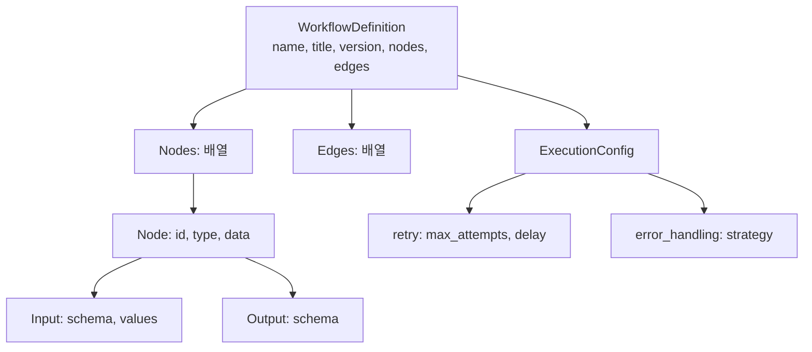
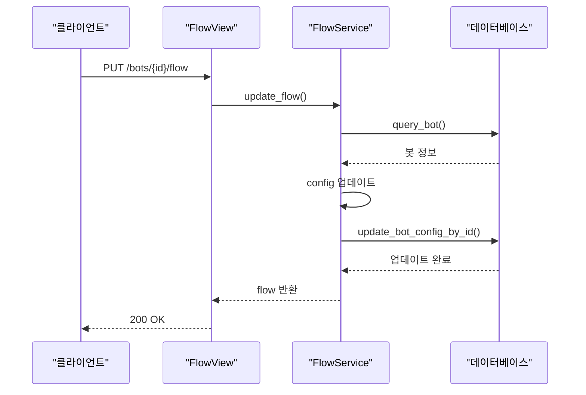
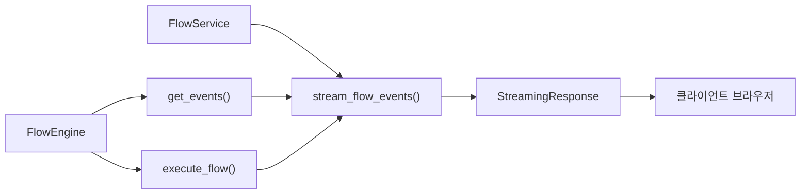

# 플로우 API

<cite>
**이 문서에서 참조한 파일**
- [flow.yaml](file://aperag/api/paths/flow.yaml)
- [flow.yaml](file://aperag/api/components/schemas/flow.yaml)
- [parser.py](file://aperag/flow/parser.py)
- [engine.py](file://aperag/flow/engine.py)
- [flow_service.py](file://aperag/service/flow_service.py)
- [flow.py](file://aperag/views/flow.py)
</cite>

## 목차
1. [소개](#소개)
2. [플로우 정의 스키마](#플로우-정의-스키마)
3. [노드 유형 및 파라미터](#노드-유형-및-파라미터)
4. [API 엔드포인트](#api-엔드포인트)
5. [실행 및 디버그 모드](#실행-및-디버그-모드)
6. [결과 스트리밍](#결과-스트리밍)
7. [실패 재시도 메커니즘](#실패-재시도-메커니즘)
8. [플로우 생성 및 실행 예제](#플로우-생성-및-실행-예제)
9. [일반적인 구성 오류 및 해결 방법](#일반적인-구성-오류-및-해결-방법)

## 소개
이 문서는 ApeRAG 시스템 내 워크플로 기반 플로우 엔진을 제어하기 위한 API를 설명합니다. 사용자는 YAML 형식으로 플로우를 정의하고, 이를 업로드하여 검증하고 실행할 수 있습니다. 이 API는 검색, LLM 호출, 결과 병합 등의 노드를 포함하는 복잡한 워크플로를 구성하고 관리할 수 있도록 설계되었습니다. 또한 디버그 모드 실행, 실시간 이벤트 스트리밍, 실패한 노드에 대한 자동 재시도 기능을 제공합니다.

**Section sources**
- [flow.yaml](file://aperag/api/paths/flow.yaml#L0-L46)
- [flow.yaml](file://aperag/api/components/schemas/flow.yaml#L0-L227)

## 플로우 정의 스키마
플로우는 `WorkflowDefinition` 스키마를 따르는 YAML 파일로 정의됩니다. 이 스키마는 워크플로의 구조적 요소를 명확히 정의하며, 다음 주요 구성 요소를 포함합니다:

- **name**: 워크플로의 기계 판독 가능 식별자
- **title**: 사용자에게 표시되는 이름
- **version**: 버전 정보
- **nodes**: 워크플로 내 노드 목록
- **edges**: 노드 간 연결 관계
- **execution**: 실행 설정 (타임아웃, 재시도 등)
- **schema**: 커스텀 데이터 스키마 정의

각 노드는 입력 및 출력 스키마를 가지며, `SchemaDefinition`은 JSON Schema와 호환되는 형식으로 데이터 구조를 정의합니다.



**Diagram sources**
- [flow.yaml](file://aperag/api/components/schemas/flow.yaml#L0-L227)

**Section sources**
- [flow.yaml](file://aperag/api/components/schemas/flow.yaml#L0-L227)

## 노드 유형 및 파라미터
플로우는 다양한 유형의 노드로 구성되며, 각 노드는 특정 작업을 수행합니다. 지원되는 노드 유형은 다음과 같습니다:

| 노드 유형 | 설명 | 주요 입력 파라미터 |
|---------|------|----------------|
| start | 시작 노드 | query, user |
| vector_search | 벡터 검색 | collection_id, query, top_k |
| fulltext_search | 풀텍스트 검색 | index_name, query, filters |
| graph_search | 그래프 기반 검색 | cypher_query, params |
| merge | 다중 소스 결과 병합 | inputs, strategy |
| rerank | 결과 재순위화 | documents, query, model |
| llm | LLM 호출 | prompt, model, parameters |

입력 값은 정적 값 또는 다른 노드의 출력을 참조하는 템플릿(`{{ .nodes.node_id.output.field }}`) 형태로 지정할 수 있습니다.

**Section sources**
- [flow.yaml](file://aperag/api/components/schemas/flow.yaml#L0-L227)
- [parser.py](file://aperag/flow/parser.py#L0-L97)

## API 엔드포인트
플로우 관리를 위한 RESTful API 엔드포인트는 OpenAPI 사양에 따라 정의됩니다.

### GET /bots/{bot_id}/flow
지정된 봇의 현재 플로우 정의를 가져옵니다.

- **응답 200**: 성공적으로 플로우를 반환
- **응답 401**: 인증 실패

### PUT /bots/{bot_id}/flow
지정된 봇의 플로우 정의를 업데이트합니다.

- **요청 본문**: `WorkflowDefinition` 객체
- **응답 200**: 성공적으로 업데이트됨
- **응답 401**: 인증 실패



**Diagram sources**
- [flow.yaml](file://aperag/api/paths/flow.yaml#L0-L46)
- [flow.py](file://aperag/views/flow.py#L0-L43)
- [flow_service.py](file://aperag/service/flow_service.py#L0-L151)

**Section sources**
- [flow.yaml](file://aperag/api/paths/flow.yaml#L0-L46)
- [flow.py](file://aperag/views/flow.py#L0-L43)

## 실행 및 디버그 모드
플로우는 `FlowEngine` 클래스를 통해 실행되며, 디버그 모드에서는 실시간으로 실행 상태를 확인할 수 있습니다. 엔진은 다음 단계를 수행합니다:

1. 플로우 유효성 검사 및 사이클 탐지
2. 위상 정렬을 통한 실행 순서 결정
3. 병렬 실행 가능한 노드 그룹 식별
4. 노드 순차/병렬 실행

디버그 요청은 초기 쿼리와 사용자 정보를 포함한 `initial_data`로 시작됩니다.

**Section sources**
- [engine.py](file://aperag/flow/engine.py#L0-L455)
- [flow_service.py](file://aperag/service/flow_service.py#L0-L151)

## 결과 스트리밍
결과는 서버 전송 이벤트(SSE)를 통해 실시간으로 스트리밍됩니다. `StreamingResponse`는 두 가지 유형의 이벤트를 전달합니다:

1. **실행 이벤트**: 노드 시작/종료/오류
2. **출력 청크**: LLM 응답의 스트리밍 청크

스트리밍은 `async_generator`를 통해 비동기적으로 처리되며, 최종 노드의 출력이 클라이언트로 실시간 전달됩니다.



**Diagram sources**
- [engine.py](file://aperag/flow/engine.py#L0-L455)
- [flow_service.py](file://aperag/service/flow_service.py#L0-L151)

**Section sources**
- [engine.py](file://aperag/flow/engine.py#L0-L455)
- [flow_service.py](file://aperag/service/flow_service.py#L0-L151)

## 실패 재시도 메커니즘
플로우 수준에서 재시도 정책을 구성할 수 있습니다. `execution.retry` 설정을 통해 다음을 정의할 수 있습니다:

- **max_attempts**: 최대 재시도 횟수 (기본값: 3)
- **delay**: 재시도 간 대기 시간(초) (기본값: 5)

노드 실행 중 오류 발생 시, 설정된 정책에 따라 자동 재시도가 수행됩니다. 오류 처리 전략(`error_handling.strategy`)은 `stop_on_error`(기본값) 또는 `continue_on_error`로 설정 가능합니다.

**Section sources**
- [flow.yaml](file://aperag/api/components/schemas/flow.yaml#L0-L227)
- [engine.py](file://aperag/flow/engine.py#L0-L455)

## 플로우 생성 및 실행 예제
다음은 RAG 플로우를 생성하고 실행하는 전체 과정입니다:

1. `rag_flow.yaml` 파일 작성 (벡터 검색 → 리랭크 → LLM 호출)
2. PUT `/bots/{id}/flow`로 업로드
3. 디버그 모드에서 `query` 매개변수로 실행
4. SSE를 통해 실시간 이벤트 및 LLM 출력 수신

```yaml
name: rag_flow
title: RAG Flow
nodes:
  - id: start
    type: start
    data:
      input:
        schema: {type: object, properties: {query: {type: string}}}
  - id: vector_search_1
    type: vector_search
    data:
      input:
        values:
          query: "{{ .nodes.start.output.query }}"
```

**Section sources**
- [examples/rag_flow.yaml](file://aperag/flow/examples/rag_flow.yaml)
- [flow_service.py](file://aperag/service/flow_service.py#L0-L151)

## 일반적인 구성 오류 및 해결 방법
### Q1: 플로우 실행 중 "Cycle detected" 오류가 발생합니다.
**원인**: 노드 간 순환 의존성이 존재합니다.  
**해결**: 엣지를 검토하여 사이클을 제거하세요.

### Q2: 입력 변수가 제대로 바인딩되지 않습니다.
**원인**: `{{ .nodes.xxx }}` 참조 경로가 잘못되었거나, 노드 ID가 일치하지 않음.  
**해결**: 노드 ID와 출력 필드 이름을 정확히 확인하세요.

### Q3: LLM 응답이 스트리밍되지 않습니다.
**원인**: 최종 노드가 `async_generator`를 반환하지 않음.  
**해결**: LLM 노드가 올바른 스트리밍 인터페이스를 구현했는지 확인하세요.

### Q4: 플로우가 저장되지만 적용되지 않습니다.
**원인**: 봇 구성(config) 업데이트 중 충돌 발생.  
**해결**: `update_bot_config_by_id`가 원자적으로 실행되도록 보장하세요.

**Section sources**
- [engine.py](file://aperag/flow/engine.py#L0-L455)
- [parser.py](file://aperag/flow/parser.py#L0-L97)
- [test_validation.py](file://aperag/flow/tests/test_validation.py)