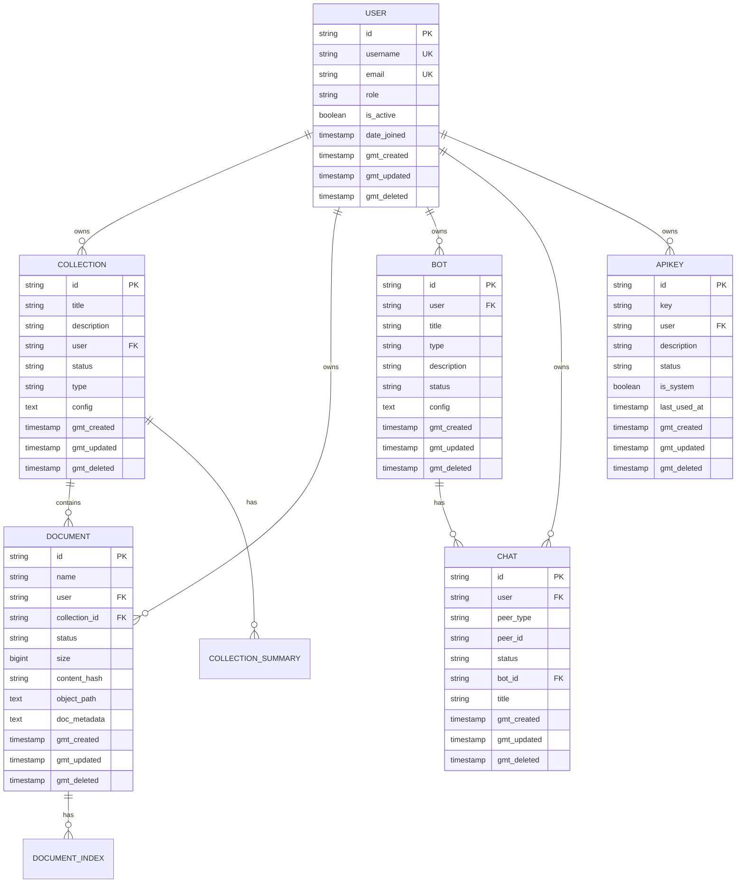

# 데이터 모델

<cite>
**이 문서에서 참조한 파일**
- [models.py](file://aperag/db/models.py)
- [collection.py](file://aperag/db/repositories/collection.py)
- [document.py](file://aperag/db/repositories/document.py)
- [chat.py](file://aperag/db/repositories/chat.py)
- [bot.py](file://aperag/db/repositories/bot.py)
- [user.py](file://aperag/db/repositories/user.py)
- [base.py](file://aperag/db/repositories/base.py)
</cite>

## 목차
1. [소개](#소개)
2. [주요 엔티티 및 ORM 모델](#주요-엔티티-및-orm-모델)
3. [SQLModel 기반 모델 정의 방식](#sqlmodel-기반-모델-정의-방식)
4. [공통 패턴: 소프트 삭제, 인덱싱, 페이징](#공통-패턴-소프트-삭제-인덱싱-페이징)
5. [엔티티 간 관계 및 ER 다이어그램](#엔티티-간-관계-및-er-다이어그램)
6. [데이터 무결성 및 성능 최적화](#데이터-무결성-및-성능-최적화)
7. [생명 주기 콜백 및 커스텀 메서드](#생명-주기-콜백-및-커스텀-메서드)

## 소개
ApeRAG 시스템은 지능형 에이전트와 RAG(Retrieval-Augmented Generation) 기능을 제공하기 위해 다양한 데이터 엔티티를 관리합니다. 이 문서는 ApeRAG의 핵심 데이터베이스 스키마와 SQLModel 기반 ORM 모델을 상세히 설명합니다. 주요 엔티티인 Collection, Document, Chat, Bot, User 등의 필드 정의, 데이터 타입, 기본키/외래키 관계를 분석하고, SQLModel을 사용한 모델 정의 방식과 소프트 삭제, 인덱싱 전략, 페이징 처리 등의 공통 패턴을 설명합니다. 또한 엔티티 간의 관계를 ER 다이어그램으로 표현하고, 각 모델의 생명 주기 콜백이나 커스텀 메서드도 포함합니다.

**Section sources**
- [models.py](file://aperag/db/models.py#L0-L1122)

## 주요 엔티티 및 ORM 모델

### Collection (컬렉션)
Collection은 문서(Document)의 그룹을 나타내며, 지식 저장소의 기본 단위입니다. 각 컬렉션은 고유 ID, 제목, 설명, 유저 정보, 상태, 유형, 설정 정보 등을 포함합니다.

**필드 정의**
- `id`: String(24), 기본키, 랜덤 생성
- `title`: String(256), 제목, null 불가
- `description`: Text, 설명, null 가능
- `user`: String(256), 소유자, 인덱스 생성
- `status`: Enum(CollectionStatus), 상태(INACTIVE, ACTIVE, DELETED), 인덱스 생성
- `type`: Enum(CollectionType), 유형(document, CHAT), null 불가
- `config`: Text, 구성 정보, null 불가
- `gmt_created`: DateTime(timezone=True), 생성 시간
- `gmt_updated`: DateTime(timezone=True), 수정 시간
- `gmt_deleted`: DateTime(timezone=True), 삭제 시간, 인덱스 생성

**Section sources**
- [models.py](file://aperag/db/models.py#L221-L233)

### Document (문서)
Document는 컬렉션에 속한 개별 문서를 나타냅니다. 파일 이름, 크기, 상태, 객체 저장소 경로 등 다양한 메타정보를 포함합니다.

**필드 정의**
- `id`: String(24), 기본키, 랜덤 생성
- `name`: String(1024), 파일 이름, null 불가
- `user`: String(256), 소유자, 인덱스 생성
- `collection_id`: String(24), 소속 컬렉션 ID, 인덱스 생성
- `status`: Enum(DocumentStatus), 상태(UPLOADED, PENDING, RUNNING, COMPLETE, FAILED, DELETED), 인덱스 생성
- `size`: BigInteger, 파일 크기
- `content_hash`: String(64), 내용 해시, 중복 검출용, 인덱스 생성
- `object_path`: Text, 객체 저장소 경로
- `doc_metadata`: Text, 문서 메타데이터(JSON 문자열)
- `gmt_created`: DateTime(timezone=True), 생성 시간
- `gmt_updated`: DateTime(timezone=True), 수정 시간
- `gmt_deleted`: DateTime(timezone=True), 삭제 시간, 인덱스 생성

**Section sources**
- [models.py](file://aperag/db/models.py#L323-L385)

### Chat (채팅)
Chat은 사용자가 특정 Bot과 나누는 대화 세션을 나타냅니다. 피어 정보, 상태, 제목 등을 포함합니다.

**필드 정의**
- `id`: String(24), 기본키, 랜덤 생성
- `user`: String(256), 소유자, 인덱스 생성
- `peer_type`: Enum(ChatPeerType), 피어 유형(system, feishu, weixin 등)
- `peer_id`: String(256), 피어 식별자
- `status`: Enum(ChatStatus), 상태(ACTIVE, DELETED), 인덱스 생성
- `bot_id`: String(24), 연결된 Bot ID, 인덱스 생성
- `title`: String(256), 제목
- `gmt_created`: DateTime(timezone=True), 생성 시간
- `gmt_updated`: DateTime(timezone=True), 수정 시간
- `gmt_deleted`: DateTime(timezone=True), 삭제 시간, 인덱스 생성

**Section sources**
- [models.py](file://aperag/db/models.py#L433-L459)

### Bot (봇)
Bot은 사용자가 생성한 AI 에이전트 또는 지식 기반 챗봇을 나타냅니다. 다양한 유형의 봇을 지원하며, 설정 정보를 포함합니다.

**필드 정의**
- `id`: String(24), 기본키, 랜덤 생성
- `user`: String(256), 소유자, 인덱스 생성
- `title`: String(256), 제목
- `type`: Enum(BotType), 유형(knowledge, common, agent), 기본값 knowledge
- `description`: Text, 설명
- `status`: Enum(BotStatus), 상태(ACTIVE, DELETED), 인덱스 생성
- `config`: Text, 구성 정보, null 불가
- `gmt_created`: DateTime(timezone=True), 생성 시간
- `gmt_updated`: DateTime(timezone=True), 수정 시간
- `gmt_deleted`: DateTime(timezone=True), 삭제 시간, 인덱스 생성

**Section sources**
- [models.py](file://aperag/db/models.py#L388-L400)

### User (사용자)
User는 시스템의 사용자를 나타내며, 인증 정보와 역할을 포함합니다.

**필드 정의**
- `id`: String(24), 기본키, 랜덤 생성
- `username`: String(256), 사용자 이름, 고유
- `email`: String(254), 이메일, 고유
- `role`: Enum(Role), 역할(admin, rw, ro), 기본값 ro
- `hashed_password`: String(128), 해시된 비밀번호
- `is_active`: Boolean, 활성 상태
- `is_superuser`: Boolean, 슈퍼유저 여부
- `is_verified`: Boolean, 인증 여부
- `is_staff`: Boolean, 스태프 여부
- `chat_collection_id`: String(24), 채팅 컬렉션 ID, 인덱스 생성
- `date_joined`: DateTime(timezone=True), 가입 일시
- `gmt_created`: DateTime(timezone=True), 생성 시간
- `gmt_updated`: DateTime(timezone=True), 수정 시간
- `gmt_deleted`: DateTime(timezone=True), 삭제 시간

**Section sources**
- [models.py](file://aperag/db/models.py#L620-L647)

### ApiKey (API 키)
ApiKey는 사용자의 API 접근을 위한 인증 키를 관리합니다.

**필드 정의**
- `id`: String(24), 기본키, 랜덤 생성
- `key`: String(64), API 키 값
- `user`: String(256), 소유자, 인덱스 생성
- `description`: String(256), 설명
- `status`: Enum(ApiKeyStatus), 상태(ACTIVE, DELETED), 인덱스 생성
- `is_system`: Boolean, 시스템 생성 여부, 인덱스 생성
- `last_used_at`: DateTime(timezone=True), 마지막 사용 시간
- `gmt_created`: DateTime(timezone=True), 생성 시간
- `gmt_updated`: DateTime(timezone=True), 수정 시간
- `gmt_deleted`: DateTime(timezone=True), 삭제 시간, 인덱스 생성

**Section sources**
- [models.py](file://aperag/db/models.py#L494-L517)

## SQLModel 기반 모델 정의 방식

ApeRAG은 SQLAlchemy 기반의 ORM 모델을 사용하여 데이터베이스 스키마를 정의합니다. SQLModel 패턴을 따르되, 순수 SQLAlchemy declarative base를 활용하여 유연한 모델링을 수행합니다.

### Enum 처리 전략
데이터베이스 내장 enum 타입 대신 VARCHAR 컬럼을 사용하여 enum 값을 저장합니다. 이는 스키마 변경 시 마이그레이션 복잡성을 줄이고, 애플리케이션 레이어에서 유효성 검사를 수행하는 유연한 설계를 가능하게 합니다.

```python
def EnumColumn(enum_class, **kwargs):
    """Create a String column for enum values to avoid database enum constraints"""
    max_length = max(len(e.value) for e in enum_class) if enum_class and len(enum_class) > 0 else 50
    max_length = max(max_length + 20, 50)
    kwargs.setdefault("length", max_length)
    return String(**kwargs)
```

### 랜덤 ID 생성
UUID 기반의 랜덤 ID를 생성하여 보안성과 예측 불가능성을 확보합니다.

```python
def random_id():
    """Generate a random ID string"""
    return "".join(random.sample(uuid.uuid4().hex, 16))
```

**Section sources**
- [models.py](file://aperag/db/models.py#L15-L50)

## 공통 패턴: 소프트 삭제, 인덱싱, 페이징

### 소프트 삭제 (Soft Delete)
모든 주요 엔티티는 `gmt_deleted` 필드를 통해 소프트 삭제를 지원합니다. 삭제 요청 시 상태를 DELETED로 변경하고 `gmt_deleted` 타임스탬프를 설정함으로써 논리적 삭제를 구현합니다.

```python
class Collection(Base):
    # ...
    status = Column(EnumColumn(CollectionStatus), nullable=False, index=True)
    gmt_deleted = Column(DateTime(timezone=True), nullable=True, index=True)
```

### 인덱싱 전략
빈번한 조회 조건에 대해 인덱스를 생성하여 쿼리 성능을 최적화합니다. 주로 다음과 같은 필드에 인덱스를 적용합니다:
- `user`: 사용자 기반 조회
- `status`: 상태 기반 필터링
- `gmt_deleted`: 소프트 삭제 상태 확인
- 외래키 필드: JOIN 연산 성능 향상

### 페이징 처리
대량의 데이터 조회 시 효율적인 페이징을 위해 `order_by(desc(gmt_created))`와 함께 LIMIT/OFFSET 또는 키셋 페이징(Keyset Pagination)을 사용합니다.

```python
async def query_collections(self, users: List[str]):
    async def _query(session):
        stmt = (
            select(Collection)
            .where(
                Collection.user.in_(users),
                Collection.status != CollectionStatus.DELETED,
                Collection.type != CollectionType.CHAT,
            )
            .order_by(desc(Collection.gmt_created))
        )
        result = await session.execute(stmt)
        return result.scalars().all()
```

**Section sources**
- [models.py](file://aperag/db/models.py#L221-L233)
- [collection.py](file://aperag/db/repositories/collection.py#L100-L120)

## 엔티티 간 관계 및 ER 다이어그램



**Diagram sources**
- [models.py](file://aperag/db/models.py#L221-L233)
- [models.py](file://aperag/db/models.py#L323-L385)
- [models.py](file://aperag/db/models.py#L388-L400)
- [models.py](file://aperag/db/models.py#L433-L459)
- [models.py](file://aperag/db/models.py#L620-L647)
- [models.py](file://aperag/db/models.py#L494-L517)

## 데이터 무결성 및 성능 최적화

### 데이터 무결성 제약 조건
- **고유 제약(UK)**: 사용자 이름, 이메일, API 키 등 중복을 허용하지 않는 필드에 UNIQUE 제약 적용
- **참조 무결성(FK)**: 외래키 관계를 통해 관련 엔티티 간의 일관성 유지
- **체크 제약**: Enum 필드는 애플리케이션 레이어에서 유효성 검사 수행
- **고유 조합 제약**: `UniqueConstraint("collection_id", "name", "gmt_deleted")`와 같이 소프트 삭제를 고려한 고유성 보장

### 인덱스 설계 원칙
- **쿼리 빈도 기반 인덱싱**: 자주 조회되는 필드(user, status 등)에 인덱스 생성
- **복합 인덱스 활용**: WHERE 절에서 함께 사용되는 여러 필드에 대한 복합 인덱스 생성
- **소프트 삭제 고려**: `gmt_deleted IS NULL` 조건을 포함한 쿼리 성능 향상을 위해 `gmt_deleted` 필드에 인덱스 생성
- **정렬 최적화**: ORDER BY 절에 사용되는 필드(gmt_created 등)에 인덱스 생성

**Section sources**
- [models.py](file://aperag/db/models.py#L323-L385)
- [models.py](file://aperag/db/models.py#L221-L233)

## 생명 주기 콜백 및 커스텀 메서드

### CollectionSummary 모델
버전 기반 재조정(reconciliation)을 위한 생명 주기 메서드를 제공합니다.

```python
def update_version(self):
    """Update the version to trigger reconciliation"""
    self.version += 1
    self.gmt_updated = utc_now()
```

### Document 모델
문서 인덱스 상태를 기반으로 전체 상태를 계산하는 커스텀 메서드를 포함합니다.

```python
def get_overall_index_status(self, session) -> "DocumentStatus":
    """Calculate overall status based on document indexes"""
    document_indexes = self.get_document_indexes(session)
    # 상태 로직 구현
```

### ApiKey 모델
API 키 사용 기록을 업데이트하는 비동기 메서드를 제공합니다.

```python
async def update_last_used(self, session):
    """Update the last_used_at timestamp"""
    self.last_used_at = utc_now()
    session.add(self)
    await session.commit()
```

### User 모델
비밀번호 접근을 제한하는 프로퍼티를 정의합니다.

```python
@property
def password(self):
    raise AttributeError("password is not a readable attribute")
```

**Section sources**
- [models.py](file://aperag/db/models.py#L236-L265)
- [models.py](file://aperag/db/models.py#L323-L385)
- [models.py](file://aperag/db/models.py#L494-L517)
- [models.py](file://aperag/db/models.py#L620-L647)