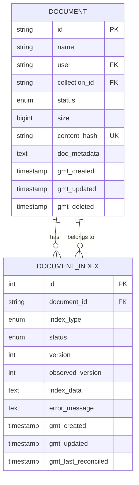
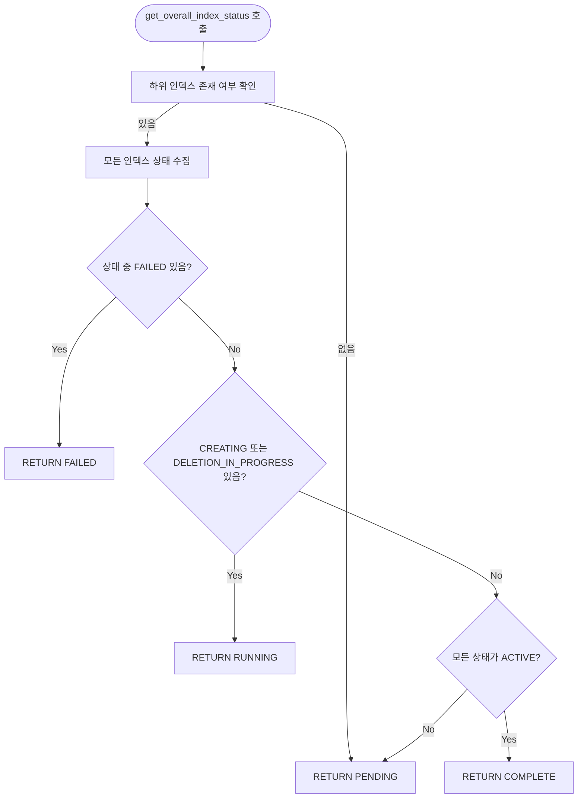
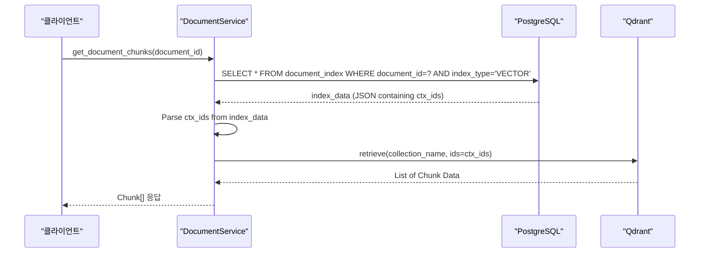
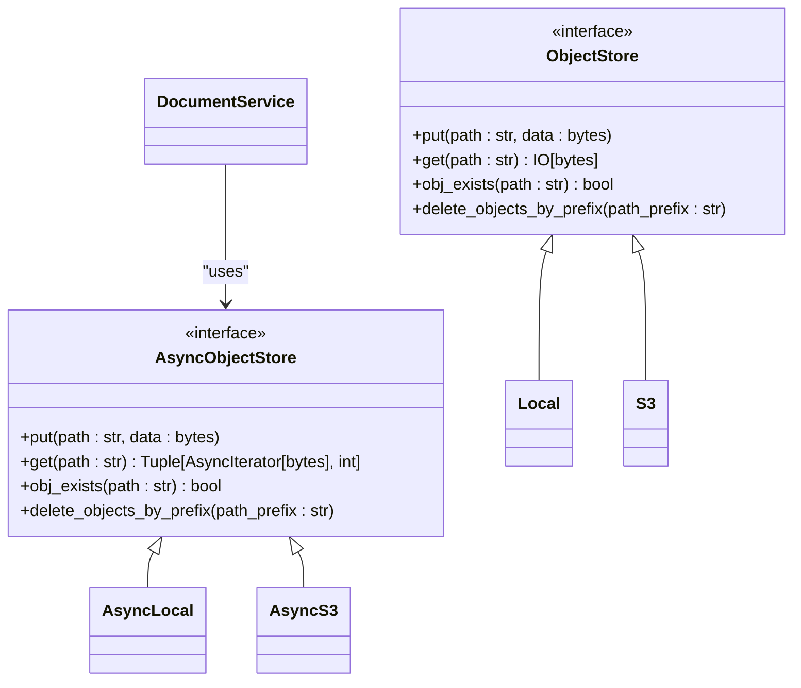
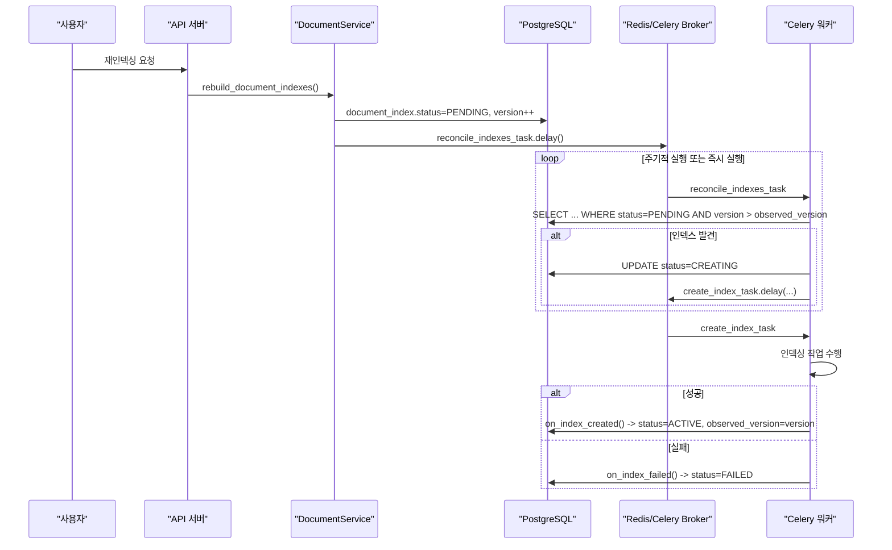

# 문서 모델

<cite>
**이 문서에서 참조된 파일**
- [models.py](file://aperag/db/models.py)
- [document_service.py](file://aperag/service/document_service.py)
- [celery_tasks.py](file://config/celery_tasks.py)
- [reconciler.py](file://aperag/tasks/reconciler.py)
- [manager.py](file://aperag/index/manager.py)
- [base.py](file://aperag/objectstore/base.py)
</cite>

## 목차
1. [소개](#소개)
2. [핵심 데이터 구조](#핵심-데이터-구조)
3. [문서 상태 전이(State Machine)](#문서-상태-전이state-machine)
4. [계층 구조 및 부모-자식 관계](#계층-구조-및-부모-자식-관계)
5. [청크화 및 청크와의 관계](#청크화-및-청크와의-관계)
6. [ObjectStore 연동 및 파일 저장 위치 관리](#objectstore-연동-및-파일-저장-위치-관리)
7. [재인덱싱 요청 처리 흐름](#재인덱싱-요청-처리-흐름)
8. [결론](#결론)

## 소개
이 문서는 ApeRAG 시스템 내 `Document` 엔티티의 데이터 구조, 라이프사이클, 그리고 관련된 핵심 기능들을 상세히 설명합니다. 문서의 생성, 인덱싱, 삭제 등의 전 과정을 다루며, 특히 상태 전이(State Machine) 패턴, 오류 처리, 비동기 태스크 처리 등 복잡한 동작 원리를 분석합니다.

## 핵심 데이터 구조
`Document` 엔티티는 문서의 메타데이터를 저장하는 핵심 테이블입니다. 주요 속성은 다음과 같습니다.

### 문서 기본 정보
| 필드 | 유형 | 설명 |
| :--- | :--- | :--- |
| `id` | String(24) | 문서 고유 식별자 |
| `name` | String(1024) | 사용자가 지정한 문서 이름 (원본 파일명) |
| `user` | String(256) | 문서 소유자 ID |
| `collection_id` | String(24) | 문서가 속한 컬렉션의 ID |
| `status` | EnumColumn(DocumentStatus) | 문서의 전체적인 상태 |
| `size` | BigInteger | 문서의 바이트 단위 크기 |
| `content_hash` | String(64) | 원본 파일 내용의 SHA-256 해시값 (중복 검사용) |
| `gmt_created`, `gmt_updated` | DateTime(timezone=True) | 생성 및 갱신 시간 |

### 파일 메타데이터 및 저장 정보
`doc_metadata` 필드는 JSON 문자열 형태로 추가적인 파일 메타데이터를 저장합니다. 이 필드에는 실제 파일의 저장 경로(`object_path`)가 포함되어 있습니다.



**다이어그램 출처**
- [models.py](file://aperag/db/models.py#L323-L385)
- [models.py](file://aperag/db/models.py#L754-L783)

**섹션 출처**
- [models.py](file://aperag/db/models.py#L323-L385)

## 문서 상태 전이(State Machine)
문서의 상태는 두 가지 레벨에서 관리됩니다: **전체 문서 상태**(Document Status)와 **각 인덱스 상태**(Index Status). 이는 상태 전이(State Machine) 패턴을 적용한 복합적인 상태 관리 시스템입니다.

### DocumentStatus (전체 문서 상태)
`DocumentStatus` 열거형은 문서의 최종적인 상태를 나타냅니다.
*   `PENDING`: 인덱싱 대기 중
*   `RUNNING`: 인덱싱 진행 중
*   `COMPLETE`: 모든 인덱싱 완료
*   `FAILED`: 인덱싱 실패
*   `DELETED`: 삭제됨
*   `UPLOADED`: 일시적으로 업로드된 상태 (임시)
*   `EXPIRED`: 만료된 임시 업로드 상태

### DocumentIndexStatus (개별 인덱스 상태)
`DocumentIndex` 테이블의 각 레코드는 벡터, 풀텍스트, 그래프 등 특정 유형의 인덱스에 대한 상태를 가집니다.
*   `PENDING`: 인덱싱 작업이 예약되었으나 시작되지 않음
*   `CREATING`: 인덱싱 작업이 진행 중
*   `ACTIVE`: 인덱싱 완료, 사용 가능
*   `DELETING`: 삭제 요청됨
*   `DELETION_IN_PROGRESS`: 삭제 작업 진행 중
*   `FAILED`: 인덱싱 또는 삭제 작업 실패

### 상태 전이 로직
전체 문서 상태는 하위 인덱스들의 상태를 종합하여 결정됩니다. 이를 담당하는 메서드는 `Document.get_overall_index_status()`입니다.



**다이어그램 출처**
- [models.py](file://aperag/db/models.py#L351-L369)

**섹션 출처**
- [models.py](file://aperag/db/models.py#L351-L369)

## 계층 구조 및 부모-자식 관계
제공된 코드 기반에서는 `parent_id` 필드를 통한 명시적인 트리 계층 구조는 발견되지 않았습니다. 현재 구현에서는 문서는 `collection_id`를 통해 하나의 컬렉션에 속하며, 컬렉션이 문서들의 논리적 그룹핑 역할을 합니다. 따라서 계층 구조는 `User -> Collection -> Document`의 3단계로 구성됩니다.

## 청크화 및 청크와의 관계
문서는 인덱싱 과정에서 여러 개의 작은 조각으로 나뉘는 '청크화(chunking)'를 거칩니다. 이 청크들은 벡터 저장소(Qdrant)에 저장되며, `DocumentIndex` 레코드의 `index_data` 필드에 해당 청크들의 ID 리스트가 저장됩니다.

### 청크 조회 프로세스
1.  `DocumentService.get_document_chunks()` 메서드가 호출됩니다.
2.  `document_index` 테이블에서 `index_type`이 `VECTOR`이고 `index_data`가 있는 레코드를 조회합니다.
3.  `index_data`를 JSON으로 파싱하여 청크 ID(`ctx_ids`)를 추출합니다.
4.  Qdrant 클라이언트를 사용해 해당 ID들에 해당하는 청크 데이터를 가져옵니다.



**다이어그램 출처**
- [document_service.py](file://aperag/service/document_service.py#L1000-L1050)

**섹션 출처**
- [document_service.py](file://aperag/service/document_service.py#L1000-L1050)

## ObjectStore 연동 및 파일 저장 위치 관리
실제 파일은 데이터베이스가 아닌 ObjectStore(S3 또는 로컬 파일 시스템)에 저장됩니다. 이는 성능과 확장성을 위해 중요한 설계입니다.

### 저장 위치 결정
`Document.object_store_base_path()` 메서드는 저장소 내에서 문서의 파일들이 저장될 기본 경로를 생성합니다.
```python
def object_store_base_path(self) -> str:
    """Generate the base path for object store"""
    user = self.user.replace("|", "-")
    return f"user-{user}/{self.collection_id}/{self.id}"
```
예: `user-user123/colabc/docxyz/`

### 파일 저장 및 접근
*   **저장**: 문서 생성 시, `_create_document_record()` 메서드가 `AsyncObjectStore.put()`을 호출하여 `original{file_suffix}` 경로에 원본 파일을 업로드합니다.
*   **접근**: `get_document_object()` 메서드를 통해 클라이언트는 HTTP Range 요청 등을 사용해 ObjectStore에 저장된 파일을 직접 스트리밍 방식으로 다운로드할 수 있습니다.
*   **삭제**: 문서 삭제 시, `_delete_document()` 메서드가 `delete_objects_by_prefix()`를 호출하여 `object_store_base_path()`로 시작하는 모든 파일(원본, 청크 등)을 한 번에 삭제합니다.



**다이어그램 출처**
- [base.py](file://aperag/objectstore/base.py#L21-L248)
- [document_service.py](file://aperag/service/document_service.py#L200-L250)

**섹션 출처**
- [base.py](file://aperag/objectstore/base.py#L21-L248)
- [document_service.py](file://aperag/service/document_service.py#L200-L250)

## 재인덱싱 요청 처리 흐름
문서의 인덱스를 재생성하거나 실패한 인덱스를 다시 시도하는 요청은 Celery 비동기 태스크 시스템을 통해 처리됩니다. 이는 긴 시간이 걸리는 작업을 백그라운드에서 수행하기 위함입니다.

### 주요 컴포넌트
*   `rebuild_document_indexes()`: 서비스 계층에서 호출되는 API 엔드포인트의 핵심 메서드.
*   `document_index_manager.create_or_update_document_indexes()`: `document_index` 테이블의 상태를 `PENDING`으로 설정하고 버전을 증가시켜 인덱싱을 예약합니다.
*   `reconcile_indexes_task`: 주기적으로 실행되는 Celery 태스크.
*   `DocumentIndexReconciler.reconcile_all()`: `document_index` 테이블을 스캔하여 `PENDING` 상태의 인덱스를 찾아 `CREATING` 상태로 변경하고, 실제 인덱싱 태스크를 스케줄링합니다.
*   `create_index_task`: 실제 인덱싱 작업을 수행하는 Celery 태스크.

### 처리 흐름
1.  사용자는 특정 문서의 인덱스 재생성을 요청합니다.
2.  `DocumentService.rebuild_document_indexes()`가 호출됩니다.
3.  `document_index_manager`를 통해 해당 문서의 `document_index` 레코드들의 상태가 `PENDING`으로 설정되고, `version`이 증가합니다.
4.  `_trigger_index_reconciliation()` 함수가 즉시 `reconcile_indexes_task`를 트리거합니다.
5.  `reconcile_indexes_task`는 `index_reconciler.reconcile_all()`을 실행합니다.
6.  리컨실러는 `version > observed_version`이고 `status == PENDING`인 레코드를 찾아 `CREATING` 상태로 변경합니다.
7.  리컨실러는 `TaskScheduler`를 통해 `create_index_task`를 비동기적으로 실행합니다.
8.  `create_index_task`가 인덱싱 작업을 수행하고 성공하면 `on_index_created()` 콜백을 호출하여 상태를 `ACTIVE`로 변경하고 `observed_version`을 업데이트합니다. 실패하면 `on_index_failed()` 콜백을 호출하여 상태를 `FAILED`로 변경합니다.



**다이어그램 출처**
- [document_service.py](file://aperag/service/document_service.py#L700-L750)
- [celery_tasks.py](file://config/celery_tasks.py#L707-L722)
- [reconciler.py](file://aperag/tasks/reconciler.py#L264-L376)
- [manager.py](file://aperag/index/manager.py#L104-L104)

**섹션 출처**
- [document_service.py](file://aperag/service/document_service.py#L700-L750)
- [celery_tasks.py](file://config/celery_tasks.py#L707-L722)
- [reconciler.py](file://aperag/tasks/reconciler.py#L264-L376)

## 결론
ApeRAG의 문서 모델은 상태 전이(State Machine) 패턴을 활용하여 복잡한 인덱싱 라이프사이클을 효과적으로 관리합니다. `Document`와 `DocumentIndex` 테이블의 분리된 설계는 유연한 인덱스 관리와 효율적인 상태 추적을 가능하게 합니다. ObjectStore와의 연동을 통해 대용량 파일 처리에 적합한 아키텍처를 갖추었으며, Celery 기반의 비동기 태스크 시스템을 통해 안정적인 재인덱싱 처리를 보장합니다. 이러한 설계는 확장성과 유지보수성을 극대화한 것으로 평가할 수 있습니다.