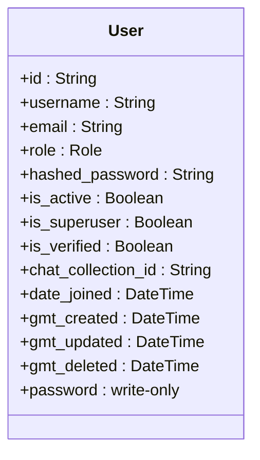
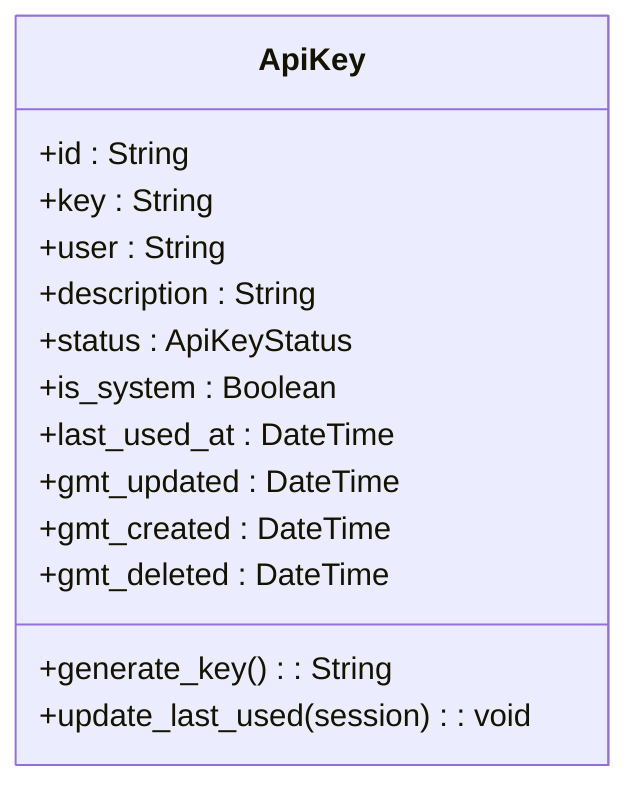
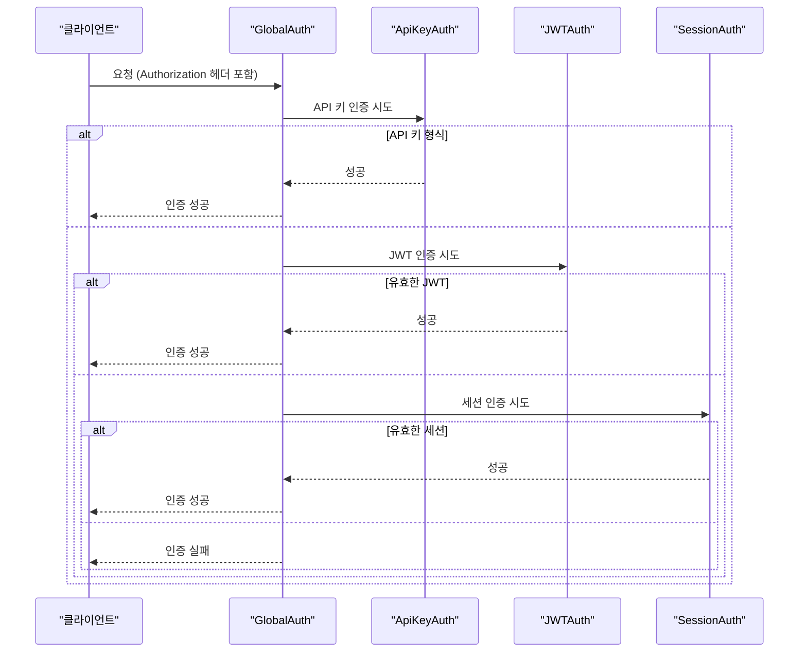
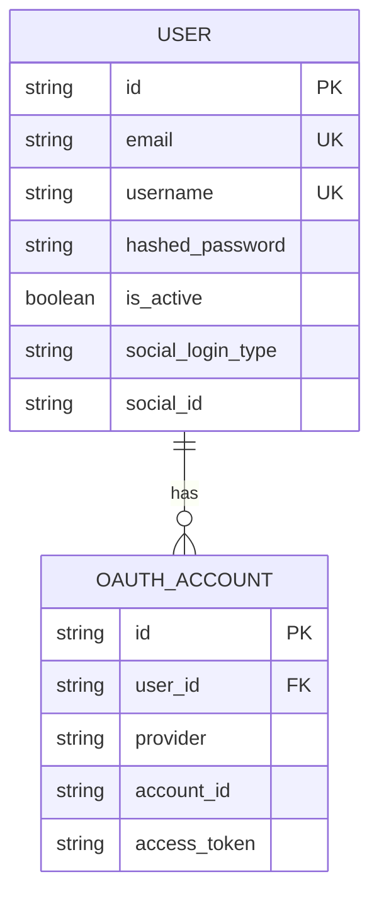
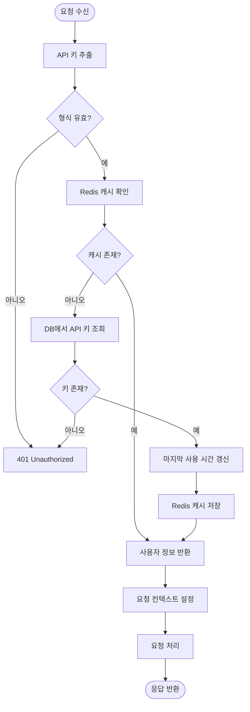
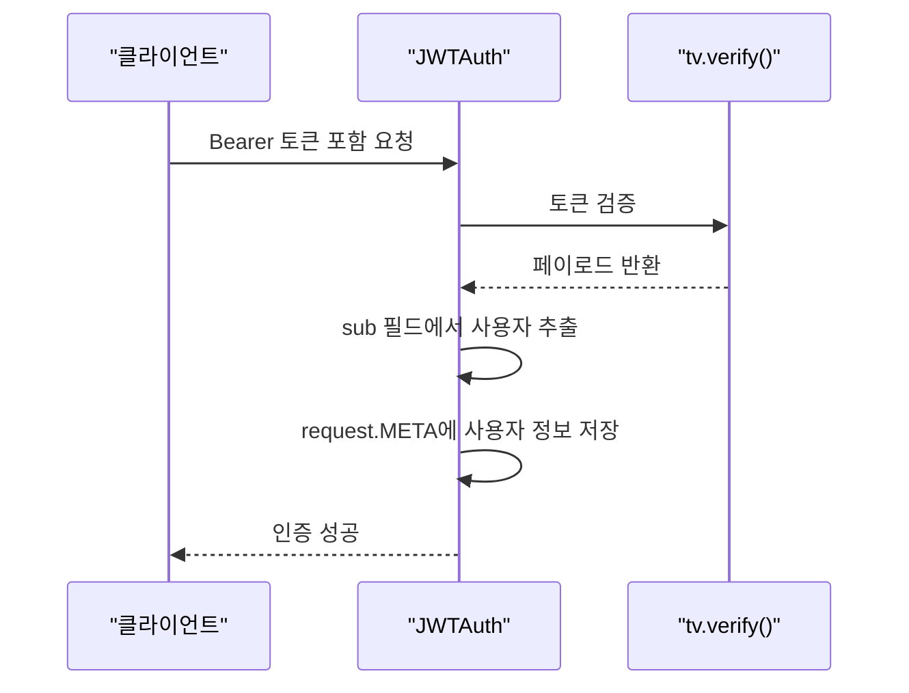
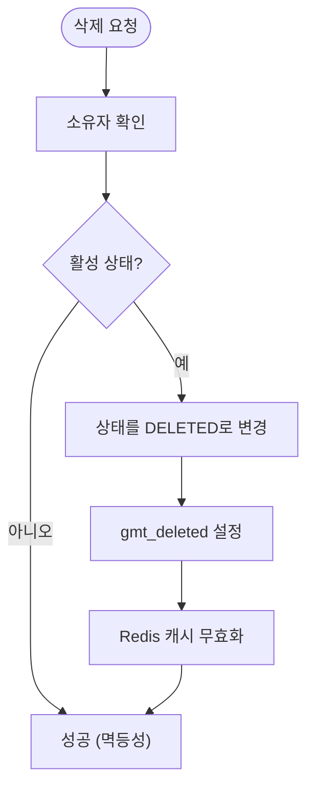

# 사용자 및 인증 모델

<cite>
**이 문서에서 참조한 파일**
- [models.py](file://aperag/db/models.py)
- [authentication.py](file://aperag/auth/authentication.py)
- [api_key_service.py](file://aperag/service/api_key_service.py)
- [api_key.py](file://aperag/db/repositories/api_key.py)
- [user.py](file://aperag/db/repositories/user.py)
</cite>

## 목차
1. [소개](#소개)
2. [사용자 엔티티 구조](#사용자-엔티티-구조)
3. [API 키 엔티티 구조](#api-키-엔티티-구조)
4. [인증 및 권한 부여 메커니즘](#인증-및-권한-부여-메커니즘)
5. [OAuth 통합](#oauth-통합)
6. [API 키 기반 접근 제어](#api-키-기반-접근-제어)
7. [JWT 토큰 연동 흐름](#jwt-토큰-연동-흐름)
8. [API 키 회전 및 폐기 절차](#api-키-회전-및-폐기-절차)
9. [보안 고려사항](#보안-고려사항)
10. [결론](#결론)

## 소개
본 문서는 ApeRAG 시스템의 사용자 및 인증 모델에 대해 설명합니다. User와 ApiKey 엔티티의 구조, 인증/권한 부여 메커니즘, OAuth 통합 방식, API 키 기반 접근 제어 구현 방법을 다룹니다. 또한 JWT 토큰과의 연동 흐름, 인증 미들웨어의 키 검증 로직, API 키 회전(rotation) 및 폐기(revocation) 절차와 보안상 고려사항을 포함합니다.

## 사용자 엔티티 구조
User 엔티티는 시스템 사용자의 정보를 저장하며, 주요 필드는 다음과 같습니다:

- **email**: 사용자의 이메일 주소로, 유니크하게 설정되어 중복을 방지합니다.
- **hashed_password**: 비밀번호는 해시된 상태로 저장되며, 직접 읽을 수 없습니다.
- **is_active**: 사용자의 활성 상태를 나타내며, 비활성화된 사용자는 시스템에 접근할 수 없습니다.
- **social_login_type**, **social_id**: OAuth를 통한 소셜 로그인을 지원하기 위해 제공됩니다.

**다이어그램 출처**
- [models.py](file://aperag/db/models.py#L620-L647)

**섹션 출처**
- [models.py](file://aperag/db/models.py#L620-L647)
- [user.py](file://aperag/db/repositories/user.py)

## API 키 엔티티 구조
ApiKey 엔티티는 API 접근을 위한 키 정보를 저장하며, 주요 필드는 다음과 같습니다:

- **key_hash**: API 키의 해시값으로, 실제 키 값은 저장되지 않습니다.
- **name**: API 키의 이름으로, 사용자가 식별하기 위한 용도입니다.
- **permissions**: 이 키가 가진 권한들을 정의합니다.
- **expires_at**: API 키의 만료 시간을 지정합니다.

**다이어그램 출처**
- [models.py](file://aperag/db/models.py#L494-L517)

**섹션 출처**
- [models.py](file://aperag/db/models.py#L494-L517)
- [api_key.py](file://aperag/db/repositories/api_key.py)

## 인증 및 권한 부여 메커니즘
시스템은 다양한 인증 방식을 지원하며, GlobalAuth 클래스를 통해 우선순위에 따라 처리합니다:

1. **Admin 인증**: 최고 우선순위
2. **API 키 인증**: `sk-`로 시작하는 Bearer 토큰
3. **JWT 인증**: Auth0, Authing, Logto 등의 외부 인증 서비스
4. **세션 인증**: 웹 클라이언트 로그인 후 사용

**다이어그램 출처**
- [authentication.py](file://aperag/auth/authentication.py)

**섹션 출처**
- [authentication.py](file://aperag/auth/authentication.py)

## OAuth 통합
OAuthAccount 모델을 통해 다양한 소셜 로그인 제공자(Google, GitHub 등)와의 통합을 지원합니다. User 엔티티는 OAuthAccount와 일대다 관계를 가지며, 하나의 사용자가 여러 소셜 계정으로 로그인할 수 있습니다.

**다이어그램 출처**
- [models.py](file://aperag/db/models.py#L620-L647)

**섹션 출처**
- [models.py](file://aperag/db/models.py#L620-L647)

## API 키 기반 접근 제어
사용자와 API 키는 일대다 관계를 가지며, 각 사용자는 여러 개의 API 키를 생성하고 관리할 수 있습니다. API 키 기반 접근 제어는 다음 단계로 이루어집니다:

1. 요청 헤더에서 API 키 추출
2. Redis 캐시를 통해 API 키 검증
3. 데이터베이스에서 API 키 정보 조회
4. 사용자 ID 추출 및 요청 컨텍스트 설정

**다이어그램 출처**
- [authentication.py](file://aperag/auth/authentication.py)
- [api_key.py](file://aperag/db/repositories/api_key.py)

**섹션 출처**
- [authentication.py](file://aperag/auth/authentication.py)
- [api_key.py](file://aperag/db/repositories/api_key.py)

## JWT 토큰 연동 흐름
JWT 토큰은 외부 인증 서비스와의 연동을 위해 사용되며, tv.verify() 함수를 통해 토큰 검증 후 사용자 정보를 추출합니다.

**다이어그램 출처**
- [authentication.py](file://aperag/auth/authentication.py)

**섹션 출처**
- [authentication.py](file://aperag/auth/authentication.py)

## API 키 회전 및 폐기 절차
API 키의 회전 및 폐기 절차는 다음과 같습니다:

1. 사용자가 특정 API 키 삭제 요청
2. 시스템에서 사용자 소유 및 활성 상태 확인
3. soft delete 방식으로 상태 변경 (ACTIVE → DELETED)
4. gmt_deleted 타임스탬프 기록
5. 이후 모든 요청에서 해당 키 거부

**다이어그램 출처**
- [api_key.py](file://aperag/db/repositories/api_key.py)
- [api_key_service.py](file://aperag/service/api_key_service.py)

**섹션 출처**
- [api_key.py](file://aperag/db/repositories/api_key.py)
- [api_key_service.py](file://aperag/service/api_key_service.py)

## 보안 고려사항
시스템은 다음과 같은 보안 조치를 취하고 있습니다:

- **해시 알고리즘**: API 키는 SHA-256으로 해시 저장
- **만료 정책**: 모든 API 키는 기본 90일 후 자동 만료
- **최종 사용 시간**: last_used_at 필드로 키 사용 이력 추적
- **Redis 캐싱**: 빈번한 DB 조회 방지를 위한 캐싱
- **soft delete**: 키 삭제 시 데이터 영구 삭제 대신 상태 변경

**섹션 출처**
- [models.py](file://aperag/db/models.py)
- [authentication.py](file://aperag/auth/authentication.py)

## 결론
ApeRAG 시스템은 견고한 사용자 및 인증 모델을 갖추고 있으며, 다양한 인증 방식(OAuth, API 키, JWT, 세션)을 지원합니다. 사용자와 API 키의 일대다 관계를 통해 유연한 접근 제어가 가능하며, 보안상의 이유로 API 키는 항상 해시된 상태로 저장됩니다. 인증 미들웨어는 효율적인 Redis 캐싱을 활용하여 성능을 최적화하면서도 안전한 인증 흐름을 제공합니다.