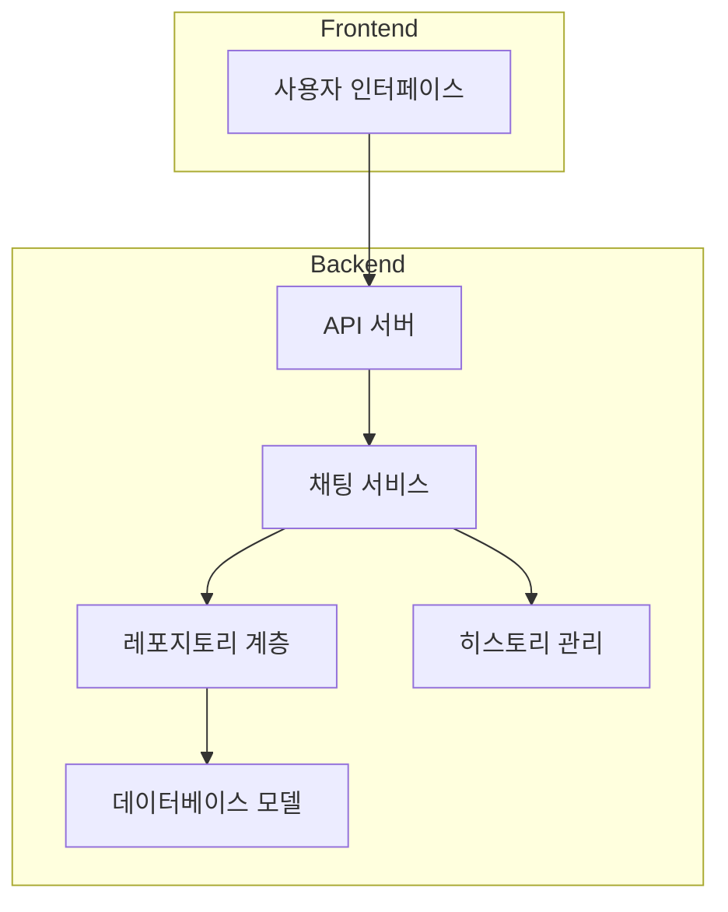
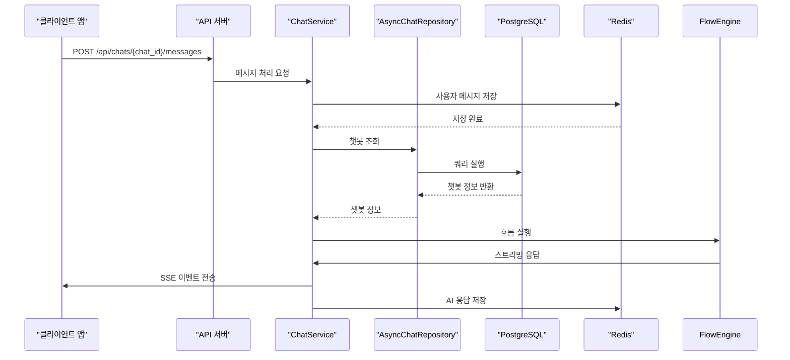
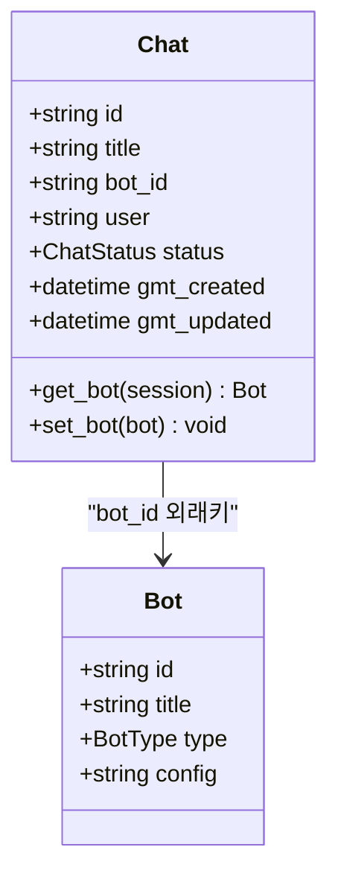
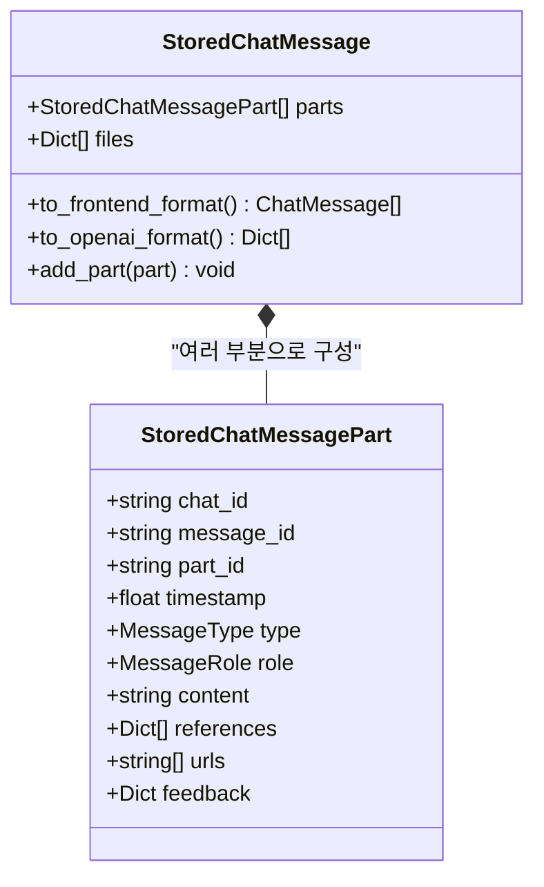
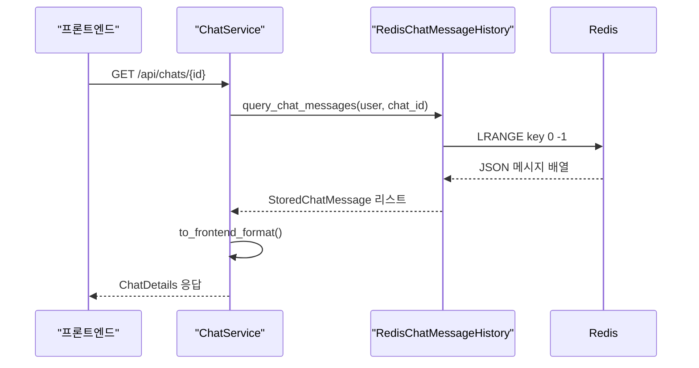
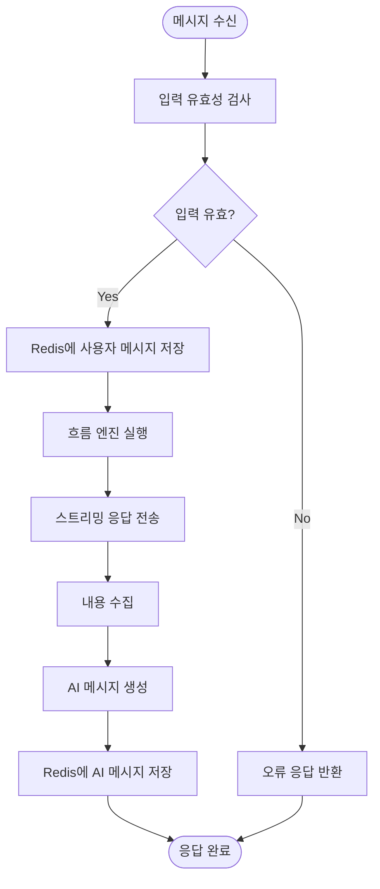
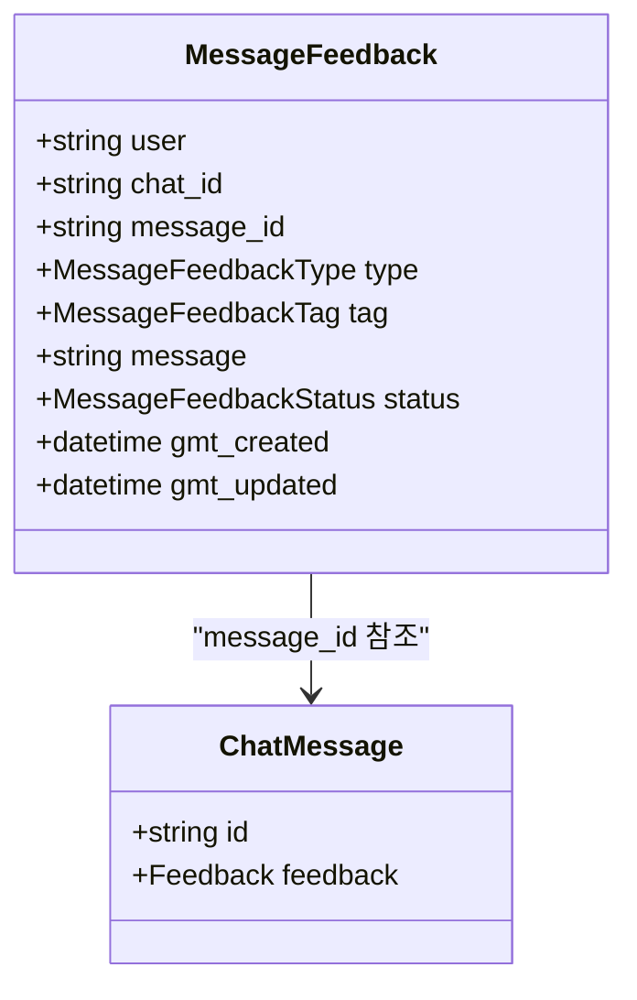
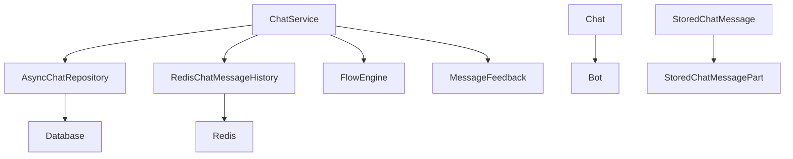

# 채팅 모델

<cite>
**이 문서에서 참조한 파일**
- [Chat](file://aperag/db/models.py#L433-L459)
- [StoredChatMessage](file://aperag/chat/history/message.py#L33-L116)
- [StoredChatMessagePart](file://aperag/chat/history/message.py#L9-L30)
- [ChatMessage](file://aperag/schema/view_models.py#L531-L552)
- [message.yaml](file://aperag/api/paths/message.yaml#L1-L30)
- [chat.yaml](file://aperag/api/components/schemas/chat.yaml#L1-L199)
- [RedisChatMessageHistory](file://aperag/utils/history.py#L178-L331)
- [AsyncChatRepositoryMixin](file://aperag/db/repositories/chat.py#L1-L330)
- [ChatService](file://aperag/service/chat_service.py#L1-L555)
</cite>

## 목차
1. [소개](#소개)
2. [프로젝트 구조](#프로젝트-구조)
3. [핵심 구성 요소](#핵심-구성-요소)
4. [아키텍처 개요](#아키텍처-개요)
5. [상세 구성 요소 분석](#상세-구성-요소-분석)
6. [종속성 분석](#종속성-분석)
7. [성능 고려 사항](#성능-고려-사항)
8. [문제 해결 가이드](#문제-해결-가이드)
9. [결론](#결론)

## 소개
이 문서는 ApeRAG 시스템의 채팅 및 메시지 엔티티 구조와 대화 이력 관리 방식을 설명합니다. Chat 엔티티의 title, bot_id, user_id 필드와 Message 엔티티의 role, content, references 필드를 정의하고, 메시지 간 순차적 관계를 유지하기 위한 created_at 타임스탬프의 중요성을 강조합니다. 또한 챗봇과의 연결(bot_id 외래키), 피드백 기능을 위한 feedback 필드, 그리고 검색 결과 참조(reference) 구조를 설명합니다. 메시지 히스토리 직렬화 형식과 API 응답으로 변환되는 과정을 코드 예시와 함께 제시하며, 장기 보존을 위한 히스토리 아카이빙 전략이나 성능 최적화를 위한 인덱스 설계도 포함합니다.

## 프로젝트 구조
ApeRAG 프로젝트는 채팅 기능을 중심으로 다양한 컴포넌트로 구성되어 있습니다. 주요 디렉터리는 다음과 같습니다:

- `aperag/db/models.py`: 데이터베이스 모델 정의 (Chat, MessageFeedback 등)
- `aperag/chat/history/message.py`: 메시지 저장 및 변환 로직
- `aperag/schema/view_models.py`: API 응답을 위한 뷰 모델 정의
- `aperag/api/components/schemas/`: OpenAPI 스키마 정의
- `aperag/utils/history.py`: Redis 기반 채팅 이력 관리
- `aperag/db/repositories/chat.py`: 채팅 관련 데이터베이스 작업
- `aperag/service/chat_service.py`: 채팅 비즈니스 로직 서비스

**Diagram sources**
- [db/models.py](file://aperag/db/models.py#L433-L459)
- [chat/history/message.py](file://aperag/chat/history/message.py#L9-L116)
- [utils/history.py](file://aperag/utils/history.py#L178-L331)

**Section sources**
- [db/models.py](file://aperag/db/models.py#L433-L459)
- [chat/history/message.py](file://aperag/chat/history/message.py#L9-L116)

## 핵심 구성 요소
ApeRAG 시스템의 핵심은 채팅과 메시지 관리에 있습니다. 주요 구성 요소는 다음과 같습니다:

- **Chat**: 사용자와 챗봇 간의 대화 세션을 나타내는 엔티티
- **StoredChatMessage**: 여러 부분(part)으로 구성된 완전한 채팅 메시지
- **StoredChatMessagePart**: 단일 메시지의 일부분(생각 과정, 내용, 참조 등)
- **RedisChatMessageHistory**: Redis를 사용한 채팅 이력 저장소
- **AsyncChatRepositoryMixin**: 채팅 관련 데이터베이스 작업 제공

**Section sources**
- [db/models.py](file://aperag/db/models.py#L433-L459)
- [chat/history/message.py](file://aperag/chat/history/message.py#L9-L116)
- [utils/history.py](file://aperag/utils/history.py#L178-L331)

## 아키텍처 개요
ApeRAG의 채팅 아키텍처는 클라이언트-서버 모델을 기반으로 하며, 상태 저장(stateful) 대화를 지원합니다. 메시지는 여러 부분으로 나뉘어 저장되며, 각 부분은 역할(role), 타입(type), 타임스탬프(timestamp) 등의 메타데이터를 포함합니다. 대화 이력은 Redis에 저장되어 빠른 접근이 가능하며, 영구 저장을 위해 PostgreSQL 데이터베이스에도 기록됩니다.

**Diagram sources**
- [service/chat_service.py](file://aperag/service/chat_service.py#L1-L555)
- [db/repositories/chat.py](file://aperag/db/repositories/chat.py#L1-L330)
- [utils/history.py](file://aperag/utils/history.py#L178-L331)

## 상세 구성 요소 분석

### Chat 엔티티 분석
Chat 엔티티는 사용자와 챗봇 간의 대화 세션을 나타냅니다. 주요 필드는 다음과 같습니다:

- `id`: 채팅 세션의 고유 식별자
- `title`: 대화 제목 (옵션)
- `bot_id`: 연결된 챗봇의 ID (외래키)
- `user`: 소유자 사용자
- `status`: 활성(active) 또는 삭제됨(deleted)
- `gmt_created`, `gmt_updated`: 생성 및 수정 타임스탬프

**Diagram sources**
- [db/models.py](file://aperag/db/models.py#L433-L459)

**Section sources**
- [db/models.py](file://aperag/db/models.py#L433-L459)

### Message 엔티티 분석
메시지 엔티티는 대화의 기본 단위입니다. ApeRAG에서는 메시지를 유연하게 처리하기 위해 복잡한 구조를 사용합니다.

#### 객체 지향 구성 요소:

**Diagram sources**
- [chat/history/message.py](file://aperag/chat/history/message.py#L9-L116)

#### API/서비스 구성 요소:

**Diagram sources**
- [service/chat_service.py](file://aperag/service/chat_service.py#L1-L555)
- [utils/history.py](file://aperag/utils/history.py#L178-L331)

#### 복잡한 논리 구성 요소:

**Diagram sources**
- [service/chat_service.py](file://aperag/service/chat_service.py#L1-L555)

**Section sources**
- [chat/history/message.py](file://aperag/chat/history/message.py#L9-L116)
- [utils/history.py](file://aperag/utils/history.py#L178-L331)

### 피드백 기능 분석
피드백 기능은 사용자가 메시지에 대해 좋아요/싫어요를 표시할 수 있도록 합니다. 이 정보는 모델 개선에 활용됩니다.

**Diagram sources**
- [db/models.py](file://aperag/db/models.py#L462-L491)
- [schema/view_models.py](file://aperag/schema/view_models.py#L531-L552)

**Section sources**
- [db/models.py](file://aperag/db/models.py#L462-L491)
- [service/chat_service.py](file://aperag/service/chat_service.py#L1-L555)

## 종속성 분석
채팅 시스템은 여러 컴포넌트 간의 긴밀한 협력을 통해 작동합니다. 주요 종속성은 다음과 같습니다:

**Diagram sources**
- [service/chat_service.py](file://aperag/service/chat_service.py#L1-L555)
- [db/repositories/chat.py](file://aperag/db/repositories/chat.py#L1-L330)
- [utils/history.py](file://aperag/utils/history.py#L178-L331)

**Section sources**
- [db/repositories/base.py](file://aperag/db/repositories/base.py#L1-L144)
- [db/ops.py](file://aperag/db/ops.py#L1-L87)

## 성능 고려 사항
ApeRAG의 채팅 시스템은 성능을 위해 다음과 같은 전략을 사용합니다:

1. **Redis 기반 이력 저장**: 빠른 읽기/쓰기 성능을 위해 Redis 사용
2. **데이터베이스 인덱싱**: 자주 쿼리되는 필드에 인덱스 추가
   - `user` 필드: 사용자별 채팅 조회 최적화
   - `bot_id` 필드: 봇별 채팅 조회 최적화
   - `status` 필드: 상태 기반 필터링 최적화
3. **비동기 처리**: 모든 데이터베이스 및 Redis 작업은 비동기로 수행
4. **스트리밍 응답**: 대규모 응답을 위한 Server-Sent Events(SSE) 사용

**Section sources**
- [db/models.py](file://aperag/db/models.py#L433-L459)
- [utils/history.py](file://aperag/utils/history.py#L178-L331)

## 문제 해결 가이드
채팅 기능 관련 일반적인 문제와 해결 방법:

1. **대화 이력이 누락됨**
   - 확인 사항: Redis 연결 상태
   - 해결 방법: `get_async_redis_client()` 함수에서 연결 재설정

2. **메시지 피드백이 저장되지 않음**
   - 확인 사항: 데이터베이스 트랜잭션 상태
   - 해결 방법: `set_message_feedback_state()`의 UPSERT 로직 확인

3. **스트리밍 응답이 지연됨**
   - 확인 사항: 네트워크 지연 및 백엔드 처리 시간
   - 해결 방법: `stream_frontend_sse_response()`의 버퍼링 설정 조정

**Section sources**
- [utils/history.py](file://aperag/utils/history.py#L178-L331)
- [service/chat_service.py](file://aperag/service/chat_service.py#L1-L555)

## 결론
ApeRAG의 채팅 모델은 확장 가능하고 성능이 우수한 아키텍처를 갖추고 있습니다. Chat과 Message 엔티티는 대화 이력을 효과적으로 관리하며, Redis와 PostgreSQL의 조합을 통해 빠른 접근과 영구 저장을 모두 지원합니다. 메시지의 다중 부분 구조는 생각 과정, 참조, 최종 응답 등을 유연하게 표현할 수 있게 해줍니다. 피드백 시스템은 사용자 상호작용을 통해 지속적인 개선이 가능하도록 합니다. 전체 시스템은 비동기 처리와 스트리밍 응답을 통해 원활한 사용자 경험을 제공합니다.