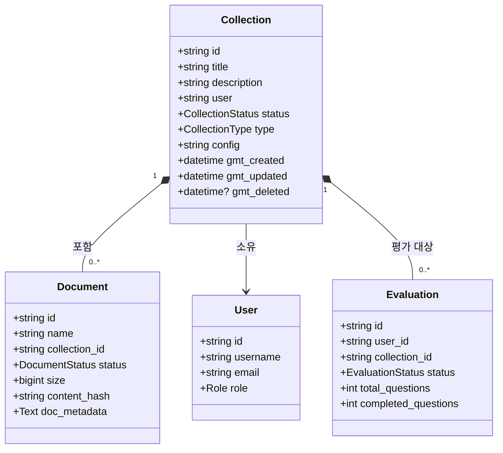
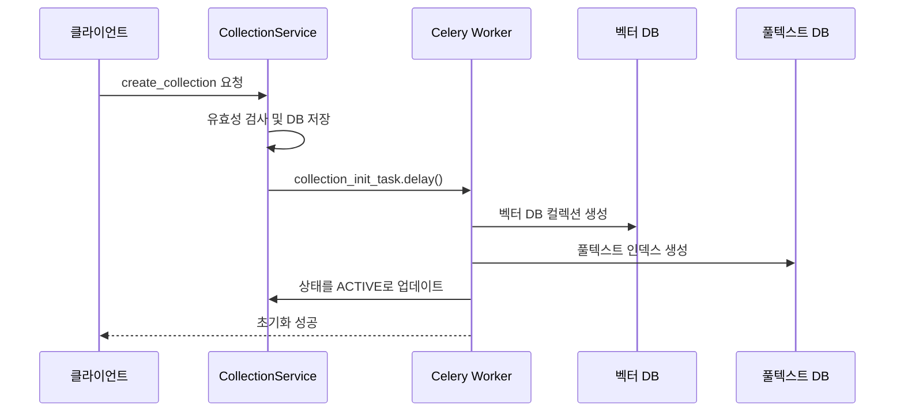

# 컬렉션 모델

<cite>
**이 문서에서 참조한 파일**  
- [models.py](file://aperag/db/models.py)
- [collection.py](file://aperag/db/repositories/collection.py)
- [collection_service.py](file://aperag/service/collection_service.py)
- [collection.py](file://aperag/tasks/collection.py)
</cite>

## 목차
1. [소개](#소개)
2. [핵심 구성 요소](#핵심-구성-요소)
3. [엔티티 구조 및 비즈니스 로직](#엔티티-구조-및-비즈니스-로직)
4. [주요 필드 정의 및 유효성 검사](#주요-필드-정의-및-유효성-검사)
5. [관계 모델링](#관계-모델링)
6. [소프트 삭제 및 인덱싱 상태 관리](#소프트-삭제-및-인덱싱-상태-관리)
7. [비동기 작업 연동](#비동기-작업-연동)
8. [컬렉션 생성 흐름](#컬렉션-생성-흐름)
9. [일반적인 문제 해결](#일반적인-문제-해결)

## 소개
이 문서는 ApeRAG 시스템 내 `Collection` 엔티티의 구조와 관련된 비즈니스 로직을 심층적으로 설명합니다. 이 엔티티는 문서, 사용자, 평가(Evaluation) 등과 밀접하게 연결되어 있으며, 지식 기반 시스템의 핵심 저장 단위 역할을 합니다. 본 문서는 주요 필드의 정의, 유효성 검사 규칙, 기본값 설정 방식, 그리고 관련된 비동기 처리 메커니즘까지 포괄하여 다룹니다.

## 핵심 구성 요소
`Collection` 엔티티는 데이터베이스 레이어부터 서비스 레이어, 태스크 레이어에 이르기까지 여러 구성 요소와 상호작용합니다. 주요 구성 요소는 다음과 같습니다:
- **데이터 모델 (`db.models.Collection`)**: 데이터베이스 스키마를 정의합니다.
- **저장소 레포지토리 (`db.repositories.collection`)**: 데이터베이스 CRUD 연산을 캡슐화합니다.
- **서비스 계층 (`service.collection_service`)**: 비즈니스 로직과 API 인터페이스를 제공합니다.
- **Celery 태스크 (`tasks.collection`)**: 컬렉션 초기화 및 삭제와 같은 무거운 작업을 비동기적으로 처리합니다.

**Section sources**
- [models.py](file://aperag/db/models.py#L221-L233)
- [collection.py](file://aperag/db/repositories/collection.py#L0-L217)
- [collection_service.py](file://aperag/service/collection_service.py#L0-L660)
- [collection.py](file://aperag/tasks/collection.py#L0-L287)

## 엔티티 구조 및 비즈니스 로직
`Collection` 엔티티는 하나 이상의 문서를 포함하는 논리적 그룹입니다. 각 컬렉션은 고유한 ID, 제목, 설명, 소유자(사용자), 상태, 유형 및 구성 정보를 갖습니다. 이 엔티티는 ORM(객체 관계 매핑)을 통해 PostgreSQL 데이터베이스에 매핑되며, `id`, `title`, `description`, `user`, `status`, `type`, `config` 등의 주요 속성을 포함합니다.

**Diagram sources**
- [models.py](file://aperag/db/models.py#L221-L233)
- [models.py](file://aperag/db/models.py#L323-L385)
- [models.py](file://aperag/db/models.py#L620-L647)
- [models.py](file://aperag/db/models.py#L1064-L1089)

## 주요 필드 정의 및 유효성 검사
`Collection` 엔티티의 각 필드는 특정 목적과 제약 조건을 가지고 있습니다.

### 주요 필드
- **`name` (title)**: 컬렉션의 이름으로, `String(256)` 길이 제한이 있으며 `nullable=False`로 반드시 존재해야 합니다.
- **`description`**: 컬렉션에 대한 설명으로, `Text` 형식이며 선택 사항(`nullable=True`)입니다.
- **`source_config`**: 외부 소스(예: Feishu, GitHub)로부터 데이터를 가져오기 위한 구성 정보를 포함합니다. 이 값은 `config` 필드 내 JSON 문자열의 일부로 저장됩니다.
- **`indexing_config`**: 벡터, 풀텍스트, 그래프 등 다양한 인덱싱 전략에 대한 설정을 포함합니다. 이 역시 `config` 필드 내에 포함됩니다.

### 유효성 검사 및 기본값
- **유효성 검사**: `collection_service.py`의 `create_collection` 메서드는 `validate_source_connect_config` 함수를 호출하여 `source_config`의 유효성을 검사합니다. 잘못된 구성이 감지되면 `ValidationException`이 발생합니다.
- **기본값 설정**: 
  - `status` 필드는 기본적으로 `ACTIVE`로 설정됩니다.
  - `gmt_created` 및 `gmt_updated` 필드는 `utc_now()` 함수를 사용하여 현재 UTC 시간으로 자동 설정됩니다.
  - `type` 필드는 현재 `DOCUMENT` 또는 `CHAT` 중 하나여야 하며, 다른 유형은 지원되지 않습니다.

**Section sources**
- [models.py](file://aperag/db/models.py#L221-L233)
- [collection_service.py](file://aperag/service/collection_service.py#L66-L113)

## 관계 모델링
`Collection` 엔티티는 시스템 내 다른 여러 엔티티와 명확한 관계를 맺고 있습니다.

- **`Document`와의 관계**: 일대다 관계입니다. 하나의 컬렉션은 여러 개의 문서를 포함할 수 있으며, `Document` 테이블의 `collection_id` 외래 키를 통해 연결됩니다.
- **`User`와의 관계**: 컬렉션은 하나의 사용자(`user` 필드)에 의해 소유됩니다. 이는 사용자 기반의 접근 제어 및 권한 관리를 가능하게 합니다.
- **`Evaluation`과의 관계**: 평가(Evaluation)는 특정 컬렉션을 대상으로 수행될 수 있습니다. `Evaluation` 테이블의 `collection_id` 필드가 이를 나타냅니다.

이러한 관계는 데이터 무결성을 보장하기 위해 데이터베이스 수준의 외래 키 제약 조건과 함께 설계되었습니다.

**Section sources**
- [models.py](file://aperag/db/models.py#L221-L233)
- [models.py](file://aperag/db/models.py#L323-L385)
- [models.py](file://aperag/db/models.py#L620-L647)
- [models.py](file://aperag/db/models.py#L1064-L1089)

## 소프트 삭제 및 인덱싱 상태 관리
시스템은 물리적 삭제 대신 **소프트 삭제**를 사용합니다.

- **소프트 삭제**: `Collection`의 `status` 필드를 `DELETED`로 변경하고, `gmt_deleted` 타임스탬프를 설정함으로써 삭제를 표시합니다. 실제 데이터는 데이터베이스에 유지되며, 대부분의 쿼리는 `status != DELETED` 조건을 포함하여 삭제된 항목을 필터링합니다.
- **인덱싱 상태 관리**: 문서(Document)는 별도의 `DocumentIndex` 엔티티를 통해 인덱싱 상태를 추적합니다. 주요 상태 플래그는 다음과 같습니다:
  - `fulltext_indexed`: 풀텍스트 인덱스 생성 여부를 나타냅니다.
  - `vector_indexed`: 벡터 인덱스 생성 여부를 나타냅니다.
  - 이러한 상태는 `DocumentIndex` 테이블의 `status` 필드에 저장되며, `PENDING`, `CREATING`, `ACTIVE`, `FAILED` 등의 값을 가집니다.

**Section sources**
- [models.py](file://aperag/db/models.py#L228-L228)
- [models.py](file://aperag/db/models.py#L323-L385)
- [models.py](file://aperag/db/models.py#L1044-L1062)

## 비동기 작업 연동
새로운 컬렉션이 생성되면, 즉시 실행되는 무거운 초기화 작업이 필요합니다. 이를 위해 Celery 기반의 비동기 태스크 시스템과 연동합니다.

- **초기화 태스크 트리거**: `collection_service.create_collection` 메서드는 컬렉션 생성 후 `collection_init_task.delay(instance.id, document_user_quota)`를 호출하여 비동기 태스크를 큐에 추가합니다.
- **초기화 작업 내용**: `CollectionTask.initialize_collection` 메서드는 다음 작업을 수행합니다:
  1. 벡터 데이터베이스(Qdrant)에 새로운 컬렉션을 생성합니다.
  2. 풀텍스트 검색 엔진(Elasticsearch)에 인덱스를 생성합니다.
  3. 컬렉션의 상태를 `ACTIVE`로 업데이트합니다.
- **삭제 작업**: 마찬가지로, 컬렉션 삭제 시 `collection_delete_task`가 트리거되어 관련된 모든 데이터베이스 리소스를 정리합니다.

**Diagram sources**
- [collection_service.py](file://aperag/service/collection_service.py#L66-L113)
- [collection.py](file://aperag/tasks/collection.py#L44-L82)
- [celery_tasks.py](file://config/celery_tasks.py#L771-L794)

## 컬렉션 생성 흐름
`Collection.create()` 메서드의 흐름은 다음과 같습니다:

1. **입력 검증**: 입력된 `collection.type`이 `DOCUMENT`인지 확인합니다.
2. **소스 구성 검증**: `validate_source_connect_config` 함수를 사용하여 `source_config`의 유효성을 검사합니다.
3. **쿼터 체크**: 사용자의 `max_collection_count` 쿼터를 확인하고, 필요한 만큼 소비합니다.
4. **데이터베이스 트랜잭션 시작**: 컬렉션 생성과 쿼터 소비를 하나의 원자적 트랜잭션으로 묶습니다.
5. **JSON 직렬화**: `CollectionConfig` 객체를 `dumpCollectionConfig` 함수를 사용해 JSON 문자열로 변환합니다.
6. **DB 저장**: `Collection` 객체를 데이터베이스에 삽입합니다.
7. **요약 생성 트리거**: `enable_summary` 설정이 활성화된 경우, 요약 생성을 트리거합니다.
8. **비동기 초기화**: `collection_init_task`를 딜레이하여 벡터/풀텍스트 DB 초기화를 시작합니다.
9. **응답 반환**: `build_collection_response`를 사용해 응답 객체를 생성하여 반환합니다.

**Section sources**
- [collection_service.py](file://aperag/service/collection_service.py#L66-L113)

## 일반적인 문제 해결
### 중복 이름
현재 `Collection` 테이블에는 이름(`title`)에 대한 고유 제약 조건이 없습니다. 따라서 동일한 사용자가 동일한 이름의 컬렉션을 여러 개 생성할 수 있습니다. 이 문제를 해결하려면 `__table_args__`에 `UniqueConstraint("user", "title", "gmt_deleted")`를 추가하여, 동일한 사용자에 대해 삭제되지 않은 컬렉션의 이름이 고유하도록 해야 합니다.

### 잘못된 소스 설정
`validate_source_connect_config` 함수가 구성의 유효성을 검사하지만, 실패하면 `ValidationException`이 발생합니다. 이 예외는 적절한 HTTP 상태 코드(예: 400 Bad Request)와 함께 클라이언트에 전달되어, 사용자가 올바른 구성 정보를 제공하도록 유도해야 합니다.

**Section sources**
- [collection_service.py](file://aperag/service/collection_service.py#L66-L113)
- [views/utils.py](file://aperag/views/utils.py#L0-L100) <!-- 가정된 경로 -->