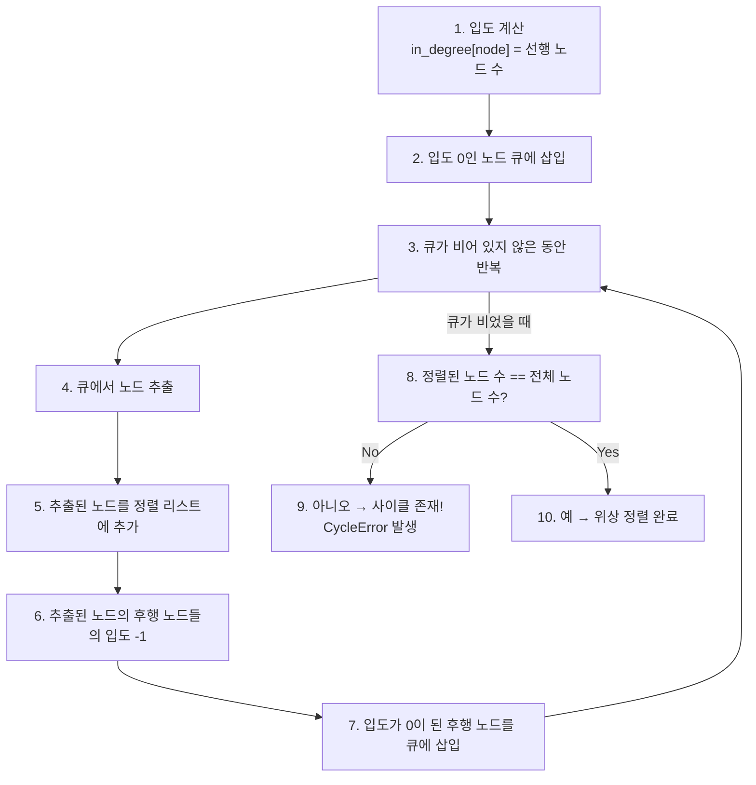

# 플로우 모델

<cite>
**이 문서에서 참조한 파일**
- [engine.py](file://aperag/flow/engine.py)
- [models.py](file://aperag/flow/base/models.py)
- [parser.py](file://aperag/flow/parser.py)
- [rag_flow.yaml](file://aperag/flow/examples/rag_flow.yaml)
- [llm.py](file://aperag/flow/runners/llm.py)
- [vector_search.py](file://aperag/flow/runners/vector_search.py)
- [merge.py](file://aperag/flow/runners/merge.py)
- [start.py](file://aperag/flow/runners/start.py)
</cite>

## 목차
1. [소개](#소개)
2. [플로우 정의 및 YAML 형식](#플로우-정의-및-yaml-형식)
3. [핵심 구성 요소](#핵심-구성-요소)
4. [실행 엔진 및 워크플로우 관리](#실행-엔진-및-워크플로우-관리)
5. [노드 간 의존성 및 입력/출력 바인딩](#노드-간-의존성-및-입력출력-바인딩)
6. **노드 유형 추상화 및 러너 모델**
7. **플로우 실행 기록과 상태 관리**
8. **버전 관리, 롤백 및 재시도 메커니즘**
9. **순환 의존성 방지: 위상 정렬 구현**
10. [결론](#결론)

## 소개
ApeRAG 시스템의 핵심 아키텍처 중 하나인 플로우(Flow) 모델은 복잡한 데이터 처리 및 AI 작업을 정의하고 실행하는 워크플로우 엔진입니다. 이 문서는 `Flow` 엔티티의 구조, YAML 기반 정의 형식, 노드 간 의존성(DAG) 표현 방식, 다양한 노드 유형의 추상화 설계, 그리고 실제 실행 엔진과의 연동 흐름에 대해 설명합니다. 또한 플로우의 버전 관리, 실패 시 재시도 전략, 순환 의존성 방지를 위한 위상 정렬 알고리즘 등 고급 실행 제어 메커니즘을 포함하여 전체적인 작동 원리를 심층적으로 분석합니다.

## 플로우 정의 및 YAML 형식
플로우는 사용자가 정의할 수 있는 워크플로우로서, YAML 파일을 통해 선언적으로 구성됩니다. 이 정의는 플로우의 이름, 설명, 노드들, 그리고 노드 간 연결(엣지)을 포함합니다. 예제 파일 `rag_flow.yaml`은 RAG(Retrieval-Augmented Generation) 파이프라인을 구현한 전형적인 사례를 보여줍니다.

### 주요 필드 설명
- **name**: 플로우의 고유한 이름 (예: `rag_flow`)
- **title**: 사용자에게 표시되는 플로우의 제목 (예: "RAG Knowledge Base Flow")
- **description**: 플로우의 목적과 동작을 설명하는 문자열
- **version**: 플로우 정의의 버전 정보 (예: "1.0.0")
- **execution**: 실행 관련 설정 (타임아웃, 재시도 횟수 등)
- **schema**: 재사용 가능한 데이터 스키마 정의
- **nodes**: 플로우를 구성하는 개별 노드들의 배열
- **edges**: 노드 간의 연결 관계를 정의하는 배열

```yaml
name: rag_flow
title: "RAG Knowledge Base Flow"
description: "A typical RAG flow with parallel retrieval and reranking"
version: "1.0.0"

nodes:
  - id: start
    type: start
    title: Start
    data:
      input:
        properties:
          query:
            type: string
            description: User's question or query
      output:
        properties:
          query:
            type: string
            description: User's question or query
  - id: vector_search_3f8e2c1a
    type: vector_search
    title: Vector Search
    data:
      input:
        properties:
          top_k:
            value: 5
            type: integer
          similarity_threshold:
            value: 0.7
            type: number
          query:
            value: {{ .nodes.start.output.query }}
            type: string
```

**Section sources**
- [rag_flow.yaml](file://aperag/flow/examples/rag_flow.yaml)

## 핵심 구성 요소
플로우 모델의 핵심은 `FlowInstance`, `NodeInstance`, `Edge`와 같은 데이터 클래스로 구성되며, 이들은 플로우의 논리적 구조를 표현합니다.

### FlowInstance
`FlowInstance`는 하나의 플로우 실행 인스턴스를 나타내며, 이름, 제목, 노드 집합, 엣지 리스트를 속성으로 가집니다. 이 클래스는 `validate()` 메서드를 통해 내부적으로 위상 정렬을 수행하여 순환 의존성이 없는지 검증합니다.

### NodeInstance
`NodeInstance`는 플로우 내의 개별 노드를 표현합니다. 각 노드는 고유한 `id`, `type`(예: `llm`, `vector_search`), 입력/출력 스키마, 입력값(`input_values`) 등을 포함합니다. `input_values`에는 다른 노드의 출력을 참조하는 Jinja2 템플릿 표현식(예: `{{ .nodes.start.output.query }}`)이 포함될 수 있습니다.

### Edge
`Edge`는 두 노드 간의 연결을 정의하며, `source`(출발 노드 ID)와 `target`(대상 노드 ID)으로 구성됩니다. 이 엣지들은 방향성 그래프(Directed Acyclic Graph, DAG)를 형성하여 데이터의 흐름을 결정합니다.

**Section sources**
- [models.py](file://aperag/flow/base/models.py#L36-L40)
- [models.py](file://aperag/flow/base/models.py#L24-L32)
- [models.py](file://aperag/flow/base/models.py#L44-L60)

## 실행 엔진 및 워크플로우 관리
플로우의 실제 실행은 `FlowEngine` 클래스가 담당합니다. 이 엔진은 플로우 정의를 받아 비동기적으로 노드들을 실행하고, 실행 상태를 관리하며, 이벤트를 발생시킵니다.

### 실행 흐름
1.  **초기화**: `execute_flow` 메서드가 호출되면 고유한 `execution_id`가 생성되고, 초기 데이터가 전역 컨텍스트에 설정됩니다.
2.  **위상 정렬**: `_topological_sort` 메서드를 사용해 노드들의 실행 순서를 결정합니다. 이 과정에서 순환 의존성이 감지되면 `CycleError`가 발생합니다.
3.  **병렬 그룹화**: `_find_parallel_groups` 메서드는 동시에 실행할 수 있는 노드 그룹을 찾습니다. 이는 입도(in-degree)가 0인 노드들을 레벨 단위로 묶어 병렬 처리를 최적화합니다.
4.  **노드 실행**: `_execute_node_group` 메서드는 각 그룹의 노드를 순차적으로 또는 병렬로 실행합니다. 단일 노드는 직접 실행하고, 여러 노드로 구성된 그룹은 `asyncio.gather`를 사용해 동시 실행합니다.
5.  **이벤트 발생**: 노드 시작, 종료, 오류 등의 중요한 이벤트는 `emit_event` 메서드를 통해 외부 소비자(consumer)에게 전달됩니다.

```mermaid
sequenceDiagram
participant FE as Frontend
participant Engine as FlowEngine
participant Runner as NodeRunner
participant DB as Database
FE->>Engine : execute_flow(flow, initial_data)
activate Engine
Engine->>Engine : generate execution_id
Engine->>Engine : emit_event(FLOW_START)
Engine->>Engine : _topological_sort()
loop 각 노드 그룹에 대해
Engine->>Engine : _execute_node_group(group)
loop 그룹 내 각 노드에 대해
Engine->>Runner : _execute_node(node)
activate Runner
Runner->>Runner : resolve_expression(input_values)
Runner->>Runner : run(user_input, system_input)
alt 성공
Runner-->>Engine : outputs
Engine->>Engine : context.set_output()
Engine->>Engine : emit_event(NODE_END)
else 실패
Runner--x Engine : Exception
Engine->>Engine : emit_event(NODE_ERROR)
break
end
deactivate Runner
end
end
Engine->>Engine : emit_event(FLOW_END)
Engine-->>FE : return outputs
deactivate Engine
```

**Diagram sources**
- [engine.py](file://aperag/flow/engine.py#L100-L166)
- [engine.py](file://aperag/flow/engine.py#L168-L206)
- [engine.py](file://aperag/flow/engine.py#L208-L241)
- [engine.py](file://aperag/flow/engine.py#L243-L255)

**Section sources**
- [engine.py](file://aperag/flow/engine.py#L72-L454)

## 노드 간 의존성 및 입력/출력 바인딩
플로우의 강력함은 노드 간의 데이터 흐름을 명확하게 정의할 수 있는 입력/출력 바인딩 구조에 있습니다. 이 구조는 노드들이 서로 독립적으로 개발되면서도 유연하게 조합될 수 있도록 합니다.

### 입력 값 해석 (resolve_expression)
노드의 입력 값은 리터럴 값뿐만 아니라, 다른 노드의 출력을 참조하는 동적 표현식일 수 있습니다. `FlowEngine`의 `resolve_expression` 메서드는 다음과 같은 방식으로 입력 값을 해석합니다:
1.  **변수 참조**: `{{ .nodes.node_id.output.field }}` 형태의 표현식은 `_resolve_variable` 함수를 통해 해당 노드의 출력에서 특정 필드 값을 가져옵니다.
2.  **Jinja2 템플릿**: 변수 참조 외의 문자열은 Jinja2 템플릿 엔진을 사용해 렌더링되며, 현재까지의 모든 노드 출력(`nodes_ctx`)이 컨텍스트로 제공됩니다.

### 타입 변환 (convert_type_by_schema)
해석된 입력 값은 노드 러너가 정의한 Pydantic 입력 모델의 스키마에 따라 적절한 타입으로 변환됩니다. 예를 들어, 문자열 `"true"`는 불리언 `True`로, JSON 문자열은 딕셔너리로 변환됩니다. 이는 사용자 입력의 일관성을 보장합니다.

**Section sources**
- [engine.py](file://aperag/flow/engine.py#L300-L350)
- [engine.py](file://aperag/flow/engine.py#L352-L380)

## **노드 유형 추상화 및 러너 모델**
다양한 노드 유형(LLM, 검색, 병합 등)을 추상화하기 위해, 시스템은 `BaseNodeRunner` 인터페이스와 `register_node_runner` 데코레이터를 사용하는 플러그인 아키텍처를 채택합니다.

### BaseNodeRunner 인터페이스
모든 노드 러너는 `BaseNodeRunner`를 상속해야 하며, `run(self, ui: Any, si: Dict[str, Any]) -> Tuple[Any, Dict[str, Any]]` 메서드를 구현해야 합니다. 여기서 `ui`는 사용자 정의 입력(Pydantic 모델), `si`는 시스템에서 주입하는 정보(SystemInput)입니다.

### register_node_runner 데코레이터
이 데코레이터는 노드 유형을 글로벌 레지스트리(`NODE_RUNNER_REGISTRY`)에 등록합니다. 등록 시점에 해당 노드의 입력 모델과 출력 모델도 함께 저장되어, 런타임에 입력 유효성 검사와 타입 변환을 가능하게 합니다.

```python
@register_node_runner(
    "llm",
    input_model=LLMInput,
    output_model=LLMOutput,
)
class LLMNodeRunner(BaseNodeRunner):
    async def run(self, ui: LLMInput, si: SystemInput) -> Tuple[LLMOutput, dict]:
        # LLM 호출 로직
        pass
```

### 대표적인 노드 러너
- **StartNodeRunner**: 사용자 쿼리를 입력으로 받아 그대로 출력합니다.
- **VectorSearchNodeRunner**: 벡터 데이터베이스에서 쿼리와 유사한 문서를 검색합니다.
- **MergeNodeRunner**: 여러 검색 결과를 합치고 중복을 제거합니다.
- **LLMNodeRunner**: 프롬프트를 생성하고 LLM API를 호출하여 응답을 생성합니다.

**Section sources**
- [models.py](file://aperag/flow/base/models.py#L120-L120)
- [models.py](file://aperag/flow/base/models.py#L122-L140)
- [llm.py](file://aperag/flow/runners/llm.py)
- [vector_search.py](file://aperag/flow/runners/vector_search.py)
- [merge.py](file://aperag/flow/runners/merge.py)
- [start.py](file://aperag/flow/runners/start.py)

## **플로우 실행 기록과 상태 관리**
플로우의 실행 상태는 `ExecutionContext` 클래스를 통해 관리됩니다. 이 컨텍스트는 세 가지 주요 맵핑을 유지합니다:
- **outputs**: 각 노드 ID를 키로 하고, 그 노드의 출력 데이터를 값으로 하는 딕셔너리.
- **system_outputs**: 노드가 생성한 추가적인 시스템 출력(예: 스트리밍 응답 생성기).
- **global_variables**: 플로우 전체에서 공유되는 전역 변수.

`ExecutionRecord`와 유사한 개념은 직접적인 코드 상 존재는 없지만, `FlowEngine`의 `context` 객체와 `execution_id`가 이를 대신하며, 실행 중인 플로우의 실시간 상태를 반영합니다. 또한, `emit_event`를 통해 발생하는 이벤트는 외부 시스템(예: UI, 로깅)에 실행 기록을 전달하는 역할을 합니다.

**Section sources**
- [models.py](file://aperag/flow/base/models.py#L62-L90)

## **버전 관리, 롤백 및 재시도 메커니즘**
현재 코드 기반에서는 플로우 자체의 버전 관리와 롤백 전략은 YAML 파일의 `version` 필드를 통해 이루어지는 것으로 보이며, 이는 주로 사용자 인터페이스나 배포 프로세스에서 활용될 수 있습니다. 코드 내에서는 이 필드를 직접적으로 사용하지 않습니다.

실패 시 재시도 메커니즘은 `FlowEngine`의 예외 처리 구조를 통해 간접적으로 지원됩니다. `execute_flow` 메서드는 `try-except` 블록으로 전체 실행을 감싸고 있으며, 예외 발생 시 `FLOW_ERROR` 이벤트를 발생시키고 예외를 다시 던집니다. 이는 상위 계층(예: Celery 작업)에서 재시도 정책을 적용할 수 있는 기반을 제공합니다. 그러나 YAML의 `execution.retry` 설정은 현재 코드에서 직접 처리되지 않는 것으로 보입니다.

**Section sources**
- [rag_flow.yaml](file://aperag/flow/examples/rag_flow.yaml)
- [engine.py](file://aperag/flow/engine.py#L100-L166)

## **순환 의존성 방지: 위상 정렬 구현**
플로우의 무한 루프를 방지하기 위해, `FlowEngine`은 `_topological_sort` 메서드를 사용하여 위상 정렬을 수행합니다. 이 알고리즘은 Kahn's algorithm을 기반으로 합니다.

### 알고리즘 절차
1.  **입도 계산**: 각 노드의 입도(in-degree, 즉 자신을 선행하는 노드의 수)를 계산합니다.
2.  **큐 초기화**: 입도가 0인 모든 노드를 큐에 삽입합니다. 만약 큐가 비어 있다면, 그래프에 사이클이 존재하므로 `CycleError`를 발생시킵니다.
3.  **정렬 수행**: 큐에서 노드를 하나씩 꺼내어 정렬된 리스트에 추가합니다. 이후, 이 노드의 후행 노드들의 입도를 1씩 감소시킵니다. 입도가 0이 되는 노드는 다시 큐에 삽입합니다.
4.  **사이클 검사**: 정렬된 노드의 수가 전체 노드 수와 같지 않으면, 일부 노드가 사이클에 포함되어 있다는 의미이므로 `CycleError`를 발생시킵니다.

이 메커니즘은 플로우가 항상 유효한 DAG를 형성하도록 보장하며, 안전한 실행을 가능하게 합니다.



**Diagram sources**
- [engine.py](file://aperag/flow/engine.py#L168-L206)

**Section sources**
- [engine.py](file://aperag/flow/engine.py#L168-L206)
- [models.py](file://aperag/flow/base/models.py#L92-L118)

## 결론
ApeRAG의 플로우 모델은 선언적인 YAML 정의와 강력한 실행 엔진을 결합하여, 복잡한 AI 워크플로우를 유연하고 안정적으로 구축할 수 있는 기반을 제공합니다. 노드 간의 입력/출력 바인딩과 DAG 기반의 의존성 관리는 워크플로우의 명확성과 유지보수성을 극대화합니다. `BaseNodeRunner`를 통한 추상화는 새로운 노드 유형의 확장을 용이하게 하며, 위상 정렬을 통한 순환 의존성 검사는 시스템의 신뢰성을 보장합니다. 이 아키텍처는 RAG 파이프라인뿐만 아니라, 다양한 지능형 애플리케이션의 핵심 엔진으로 활용될 수 있는 잠재력을 가지고 있습니다.