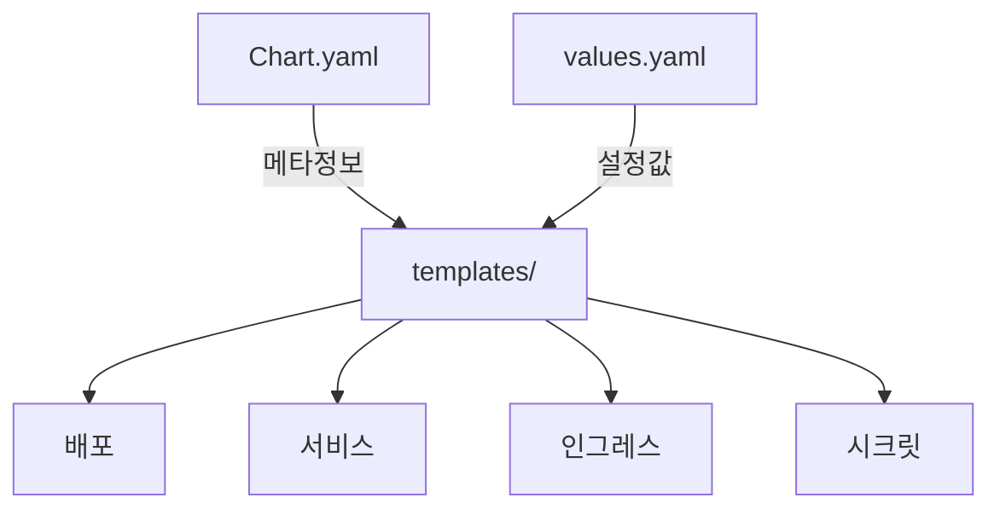
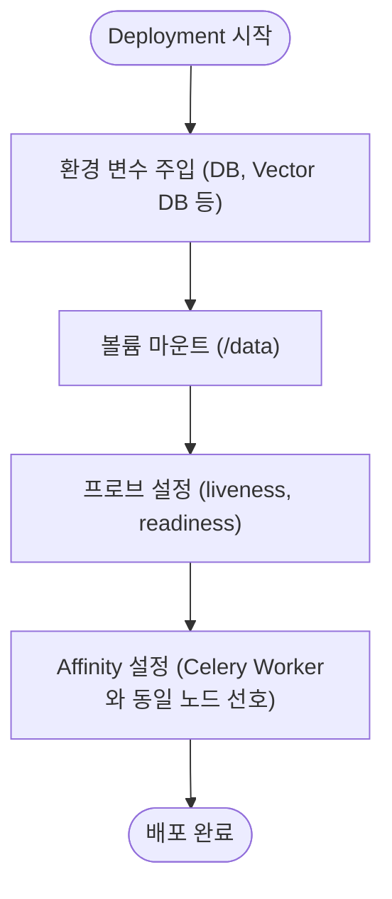
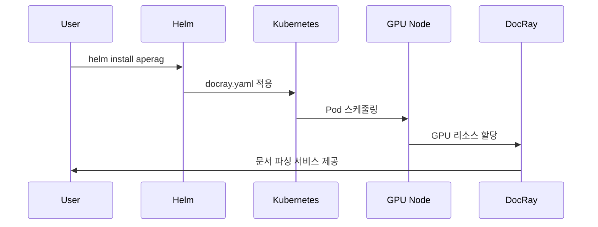
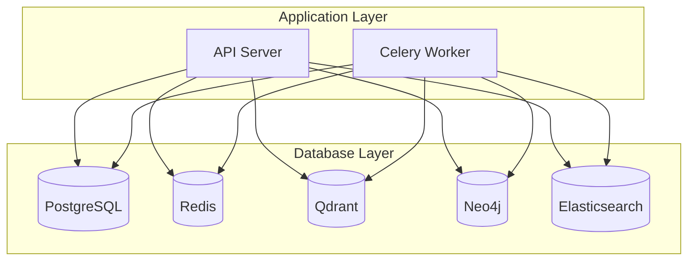
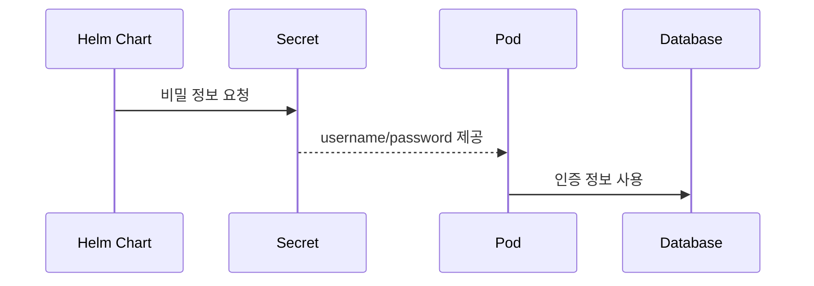

# Kubernetes(Helm) 배포

<cite>
**이 문서에서 참조한 파일**
- [Chart.yaml](file://deploy/aperag/Chart.yaml)
- [values.yaml](file://deploy/aperag/values.yaml)
- [api-deployment.yaml](file://deploy/aperag/templates/api-deployment.yaml)
- [celeryworker-deployment.yaml](file://deploy/aperag/templates/celeryworker-deployment.yaml)
- [frontend-deployment.yaml](file://deploy/aperag/templates/frontend-deployment.yaml)
- [docray.yaml](file://deploy/aperag/templates/docray.yaml)
- [ingress.yaml](file://deploy/aperag/templates/ingress.yaml)
- [postgresql/values.yaml](file://deploy/databases/postgresql/values.yaml)
- [redis/values.yaml](file://deploy/databases/redis/values.yaml)
- [qdrant/values.yaml](file://deploy/databases/qdrant/values.yaml)
- [neo4j/values.yaml](file://deploy/databases/neo4j/values.yaml)
- [elasticsearch/values.yaml](file://deploy/databases/elasticsearch/values.yaml)
- [README.md](file://deploy/databases/README.md)
</cite>

## 목차
1. [소개](#소개)
2. [Helm 차트 구조](#helm-차트-구조)
3. [values.yaml 설정 가이드](#valuesyaml-설정-가이드)
4. [템플릿 파일 분석](#템플릿-파일-분석)
5. [데이터베이스 별도 설치 및 통합](#데이터베이스-별도-설치-및-통합)
6. [네임스페이스 및 인그레스 구성](#네임스페이스-및-인그레스-구성)
7. [비밀 관리 전략](#비밀-관리-전략)
8. [롤링 업데이트 및 롤백 전략](#롤링-업데이트-및-롤백-전략)
9. [liveness/readiness 프로브 설정](#livenessreadiness-프로브-설정)

## 소개
ApeRAG는 Helm 차트를 통해 Kubernetes 클러스터에 배포할 수 있는 RAG(Retrieval-Augmented Generation) 기반 애플리케이션입니다. 본 문서는 ApeRAG의 Helm 기반 배포 절차, 구성 요소별 역할, 사용자 정의 설정 방법, 외부 데이터베이스 통합 방안을 상세히 설명합니다.

## Helm 차트 구조
ApeRAG의 Helm 차트는 `deploy/aperag` 디렉터리에 위치하며, 다음과 같은 주요 구성 요소로 이루어져 있습니다:
- **Chart.yaml**: 차트의 메타데이터(이름, 버전, 설명 등)를 포함합니다.
- **values.yaml**: 사용자 정의 가능한 기본 설정 값을 제공합니다.
- **templates/**: 쿠버네티스 리소스 매니페스트 템플릿을 포함합니다.



**Diagram sources**
- [Chart.yaml](file://deploy/aperag/Chart.yaml)
- [values.yaml](file://deploy/aperag/values.yaml)
- [api-deployment.yaml](file://deploy/aperag/templates/api-deployment.yaml)

**Section sources**
- [Chart.yaml](file://deploy/aperag/Chart.yaml)

## values.yaml 설정 가이드
`values.yaml`은 ApeRAG의 핵심 구성 파일로, 다음 항목들을 커스터마이징할 수 있습니다:

### 리소스 요청 및 제한
```yaml
api:
  resources:
    requests:
      cpu: 100m
      memory: 128Mi
    limits:
      cpu: 200m
      memory: 256Mi
```
CPU 및 메모리 자원을 요청(requests) 및 제한(limits)으로 설정하여 안정적인 운영을 보장합니다.

### 볼륨 마운트
```yaml
api:
  dataPath: /data/aperag
```
`hostPath` 기반 볼륨을 사용해 API와 Celery Worker 간에 업로드된 문서를 공유합니다.

### Replica 수 조정
```yaml
api:
  replicaCount: 2
celery-worker:
  replicaCount: 3
frontend:
  replicaCount: 2
```
각 컴포넌트의 복제본 수를 조정하여 확장성과 가용성을 높일 수 있습니다.

**Section sources**
- [values.yaml](file://deploy/aperag/values.yaml)

## 템플릿 파일 분석
각 템플릿 파일은 특정 서비스의 배포 및 서비스 정의를 담당합니다.

### api-deployment.yaml
API 서버의 배포 정의로, PostgreSQL, Redis, Elasticsearch 등의 환경 변수를 주입하고, liveness/readiness 프로브를 설정합니다.



**Diagram sources**
- [api-deployment.yaml](file://deploy/aperag/templates/api-deployment.yaml)

**Section sources**
- [api-deployment.yaml](file://deploy/aperag/templates/api-deployment.yaml)

### celeryworker-deployment.yaml
비동기 작업 처리를 위한 Celery Worker 배포 정의입니다. GPU 사용 여부에 따라 임베딩 장치를 지정할 수 있으며, API와 동일한 볼륨을 공유합니다.

```mermaid
classDiagram
class CeleryWorker {
+replicaCount : int
+embeddingDevice : string
+resources : object
+livenessProbe : object
+readinessProbe : object
}
CeleryWorker --> |사용| API : "공유 볼륨"
CeleryWorker --> |접속| Redis : "작업 큐"
CeleryWorker --> |접속| PostgreSQL : "상태 저장"
```

**Diagram sources**
- [celeryworker-deployment.yaml](file://deploy/aperag/templates/celeryworker-deployment.yaml)

**Section sources**
- [celeryworker-deployment.yaml](file://deploy/aperag/templates/celeryworker-deployment.yaml)

### frontend-deployment.yaml
프론트엔드 UI를 배포하는 템플릿으로, API 서버 엔드포인트를 환경 변수로 설정합니다.

```yaml
env:
  - name: API_SERVER_ENDPOINT
    value: http://aperag.default.svc.cluster.local:8000
```

**Section sources**
- [frontend-deployment.yaml](file://deploy/aperag/templates/frontend-deployment.yaml)

### docray.yaml
문서 파싱을 위한 DocRay 서비스를 배포합니다. GPU 사용 시 별도의 리소스 요청이 가능하며, nodeSelector 및 tolerations을 통해 GPU 노드에 스케줄링됩니다.



**Diagram sources**
- [docray.yaml](file://deploy/aperag/templates/docray.yaml)

**Section sources**
- [docray.yaml](file://deploy/aperag/templates/docray.yaml)

## 데이터베이스 별도 설치 및 통합
PostgreSQL, Neo4j, Qdrant 등 주요 데이터베이스는 KubeBlocks를 사용해 별도로 설치 및 관리합니다.

### 설치 절차
1. `00-config.sh`에서 필요한 DB 활성화
2. `01-prepare.sh` 실행 (KubeBlocks 준비)
3. `02-install-database.sh` 실행 (DB 클러스터 설치)

### 각 데이터베이스 설정
#### PostgreSQL
```yaml
version: 16.4.0
replicas: 2
cpu: 0.5
memory: 0.5
storage: 5
```

#### Redis
```yaml
version: 7.2.7
mode: standalone
replicas: 1
memory: 0.5
storage: 20
```

#### Qdrant
```yaml
version: 1.10.0
replicas: 1
memory: 0.5
storage: 20
```

#### Neo4j
```yaml
version: 5.26.5
cpu: 2
memory: 4
storage: 20
```

#### Elasticsearch
```yaml
version: "8.8.2"
mode: single-node
memory: 1
storage: 5
```



**Diagram sources**
- [postgresql/values.yaml](file://deploy/databases/postgresql/values.yaml)
- [redis/values.yaml](file://deploy/databases/redis/values.yaml)
- [qdrant/values.yaml](file://deploy/databases/qdrant/values.yaml)
- [neo4j/values.yaml](file://deploy/databases/neo4j/values.yaml)
- [elasticsearch/values.yaml](file://deploy/databases/elasticsearch/values.yaml)

**Section sources**
- [postgresql/values.yaml](file://deploy/databases/postgresql/values.yaml)
- [redis/values.yaml](file://deploy/databases/redis/values.yaml)
- [qdrant/values.yaml](file://deploy/databases/qdrant/values.yaml)
- [neo4j/values.yaml](file://deploy/databases/neo4j/values.yaml)
- [elasticsearch/values.yaml](file://deploy/databases/elasticsearch/values.yaml)
- [README.md](file://deploy/databases/README.md)

## 네임스페이스 및 인그레스 구성
기본적으로 `rag` 네임스페이스에 배포되며, `ingress.yaml`을 통해 외부 접근을 위한 인그레스를 설정할 수 있습니다.

```yaml
ingress:
  className: ""
  annotations: {}
```
필요 시 인그레스 클래스 및 어노테이션을 추가하여 트래픽 라우팅을 구성합니다.

**Section sources**
- [values.yaml](file://deploy/aperag/values.yaml)
- [ingress.yaml](file://deploy/aperag/templates/ingress.yaml)

## 비밀 관리 전략
민감 정보(데이터베이스 비밀번호 등)는 Kubernetes Secrets를 통해 관리됩니다. 예를 들어 PostgreSQL의 경우:

```yaml
POSTGRES_CREDENTIALS_SECRET_NAME: "pg-cluster-postgresql-account-postgres"
```
이 시크릿은 KubeBlocks 설치 시 자동 생성되며, Helm 차트는 이를 참조하여 환경 변수에 주입합니다.



**Diagram sources**
- [values.yaml](file://deploy/aperag/values.yaml)
- [api-deployment.yaml](file://deploy/aperag/templates/api-deployment.yaml)

**Section sources**
- [values.yaml](file://deploy/aperag/values.yaml)

## 롤링 업데이트 및 롤백 전략
모든 배포(Deployment)는 롤링 업데이트 전략을 사용합니다.

```yaml
strategy:
  type: RollingUpdate
```
이를 통해 서비스 중단 없이 새로운 버전으로의 무중단 업데이트가 가능합니다. 필요 시 `kubectl rollout undo` 명령어로 이전 버전으로 롤백할 수 있습니다.

**Section sources**
- [api-deployment.yaml](file://deploy/aperag/templates/api-deployment.yaml)
- [celeryworker-deployment.yaml](file://deploy/aperag/templates/celeryworker-deployment.yaml)

## liveness/readiness 프로브 설정
각 주요 컴포넌트는 건강 상태를 모니터링하기 위한 프로브를 설정합니다.

### API 서버
```yaml
livenessProbe:
  httpGet:
    path: /health
    port: 8000
  initialDelaySeconds: 10
readinessProbe:
  httpGet:
    path: /health
    port: 8000
  initialDelaySeconds: 5
```

### Celery Worker
```yaml
livenessProbe:
  exec:
    command: ["sh", "-c", "celery -A config.celery status -d celery@$(hostname) > /dev/null 2>&1"]
```

### Frontend
```yaml
livenessProbe:
  httpGet:
    path: /
    port: 3000
readinessProbe:
  httpGet:
    path: /
    port: 3000
```

이러한 프로브는 Pod의 재시작 및 트래픽 라우팅 결정에 활용됩니다.

**Section sources**
- [api-deployment.yaml](file://deploy/aperag/templates/api-deployment.yaml)
- [celeryworker-deployment.yaml](file://deploy/aperag/templates/celeryworker-deployment.yaml)
- [frontend-deployment.yaml](file://deploy/aperag/templates/frontend-deployment.yaml)