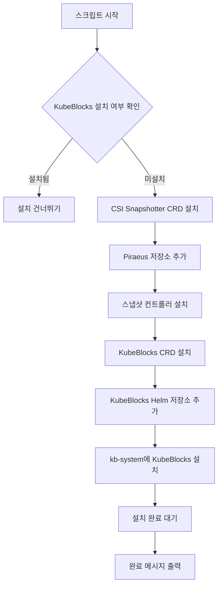
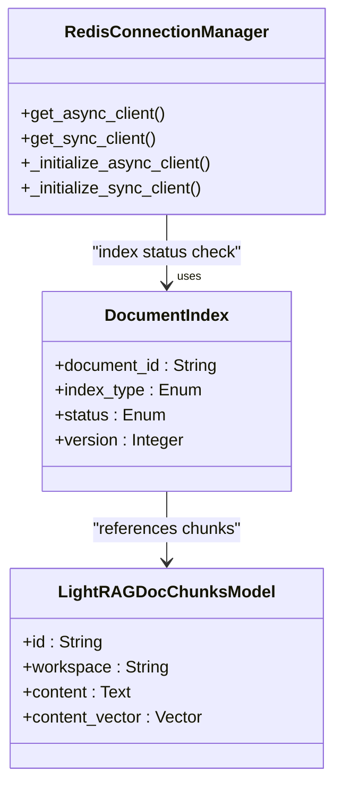

# 데이터베이스 인프라 배포

<cite>
**이 문서에서 참조한 파일**
- [install-kubeblocks.sh](file://deploy/databases/install-kubeblocks.sh)
- [00-config.sh](file://deploy/databases/00-config.sh)
- [01-prepare.sh](file://deploy/databases/01-prepare.sh)
- [02-install-database.sh](file://deploy/databases/02-install-database.sh)
- [README.md](file://deploy/databases/README.md)
- [postgresql/values.yaml](file://deploy/databases/postgresql/values.yaml)
- [redis/values.yaml](file://deploy/databases/redis/values.yaml)
- [qdrant/values.yaml](file://deploy/databases/qdrant/values.yaml)
- [neo4j/values.yaml](file://deploy/databases/neo4j/values.yaml)
- [elasticsearch/values.yaml](file://deploy/databases/elasticsearch/values.yaml)
- [models.py](file://aperag/db/models.py)
- [redis_manager.py](file://aperag/db/redis_manager.py)
</cite>

## 목차
1. [소개](#소개)
2. [사전 준비 조건](#사전-준비-조건)
3. [KubeBlocks 설치 및 설정](#kubeblocks-설치-및-설정)
4. [데이터베이스 구성 관리](#데이터베이스-구성-관리)
5. [주요 데이터베이스 Helm 설치 가이드](#주요-데이터베이스-helm-설치-가이드)
6. [초기화 스크립트 및 백업 전략](#초기화-스크립트-및-백업-전략)
7. [ApeRAG 애플리케이션과의 통합](#aperag-애플리케이션과의-통합)
8. [결론](#결론)

## 소개

ApeRAG는 PostgreSQL, Redis, Neo4j, Qdrant, Elasticsearch 등 다양한 데이터베이스를 통합하여 운영하는 RAG(Retrieval-Augmented Generation) 기반 시스템입니다. 본 문서는 Kubernetes 환경에서 Helm을 사용하여 이러한 데이터베이스를 효율적으로 배포하고 관리하는 방법을 설명합니다. 특히 KubeBlocks를 활용한 자동화된 데이터베이스 관리 프로세스와 각 데이터베이스의 `values.yaml` 기반 리소스, 스토리지, HA(High Availability) 설정에 대해 다룹니다.

**Section sources**
- [README.md](file://deploy/databases/README.md)

## 사전 준비 조건

Kubernetes 환경에서 데이터베이스를 배포하기 위해 다음 도구들이 사전에 설치되어 있어야 합니다:

- **Kubernetes 클러스터**: 로컬 개발에는 Minikube를 사용할 수 있으며, 프로덕션 환경에서는 EKS, GKE, AKS 등의 표준 클러스터를 권장합니다.
- **kubectl**: 쿠버네티스 명령줄 인터페이스로, 공식 가이드에 따라 설치해야 합니다.
- **Helm (v3.x 이상)**: 쿠버네티스 패키지 매니저로, KubeBlocks 및 데이터베이스 차트 설치에 사용됩니다.

이러한 도구들은 `01-prepare.sh` 스크립트 내에서 의존성 검사를 통해 확인되며, 필요 시 추가적인 CRD나 컨트롤러가 설치됩니다.

**Section sources**
- [README.md](file://deploy/databases/README.md)
- [01-prepare.sh](file://deploy/databases/01-prepare.sh)

## KubeBlocks 설치 및 설정

KubeBlocks는 다양한 데이터베이스(SQL, NoSQL, 벡터 DB 등)를 쿠버네티스 상에서 운영할 수 있도록 지원하는 오픈소스 툴킷입니다. `install-kubeblocks.sh` 스크립트는 다음과 같은 절차를 수행합니다:

1. CSI Snapshotter CRD 설치
2. Piraeus Helm 저장소 추가 및 스냅샷 컨트롤러 설치
3. KubeBlocks CRD 및 Helm 저장소 등록
4. `kb-system` 네임스페이스에 KubeBlocks 설치

스크립트는 이미 설치 여부를 확인한 후, 미설치 상태일 경우에만 설치를 진행하며, 설치 완료 후 `kb-system` 네임스페이스 내 포드들이 준비될 때까지 대기합니다.



**Diagram sources**
- [install-kubeblocks.sh](file://deploy/databases/install-kubeblocks.sh)

**Section sources**
- [install-kubeblocks.sh](file://deploy/databases/install-kubeblocks.sh)

## 데이터베이스 구성 관리

모든 데이터베이스의 활성화 여부는 `00-config.sh` 파일에서 제어됩니다. 이 파일은 다음과 같은 주요 변수들을 포함하고 있습니다:

- `ENABLE_POSTGRESQL`, `ENABLE_REDIS`, `ENABLE_QDRANT`, `ENABLE_NEO4J`, `ENABLE_ELASTICSEARCH`: 각 데이터베이스의 설치 여부를 결정합니다.
- `NAMESPACE`: 데이터베이스 클러스터가 설치될 네임스페이스를 지정합니다 (기본값: `default`).
- `KB_VERSION`: 설치할 KubeBlocks 버전을 지정합니다.

이 구성 파일은 `01-prepare.sh` 및 `02-install-database.sh` 스크립트에서 소스로 불러와 사용되며, 전체 배포 프로세스의 중심 역할을 합니다.

**Section sources**
- [00-config.sh](file://deploy/databases/00-config.sh)

## 주요 데이터베이스 Helm 설치 가이드

각 데이터베이스는 별도의 `values.yaml` 파일을 통해 세부 설정이 가능합니다. 아래는 주요 데이터베이스들의 설정 예시입니다.

### PostgreSQL

PostgreSQL은 `replication` 모드로 2개의 복제본을 구성하며, 0.5코어 CPU, 0.5Gi 메모리, 5Gi 스토리지를 할당합니다. `terminationPolicy: Delete` 설정으로 클러스터 삭제 시 리소스 정리가 자동화됩니다.

```yaml
mode: replication
replicas: 2
cpu: 0.5
memory: 0.5
storage: 5
terminationPolicy: Delete
```

**Section sources**
- [postgresql/values.yaml](file://deploy/databases/postgresql/values.yaml)

### Redis

Redis는 `standalone` 모드로 실행되며, 단일 노드 구성입니다. 0.5코어 CPU, 0.5Gi 메모리, 20Gi 스토리지를 사용하며, `disableExporter: true`로 메트릭 수집을 비활성화할 수 있습니다.

```yaml
mode: standalone
replicas: 1
cpu: 0.5
memory: 0.5
storage: 20
extra:
  disableExporter: true
```

**Section sources**
- [redis/values.yaml](file://deploy/databases/redis/values.yaml)

### Qdrant

Qdrant는 벡터 검색 엔진으로, 0.5코어 CPU, 0.5Gi 메모리, 20Gi 스토리지를 할당합니다. `terminationPolicy: Delete`로 안전한 삭제 정책을 적용합니다.

```yaml
replicas: 1
cpu: 0.5
memory: 0.5
storage: 20
extra:
  terminationPolicy: Delete
```

**Section sources**
- [qdrant/values.yaml](file://deploy/databases/qdrant/values.yaml)

### Neo4j

Neo4j는 그래프 데이터베이스로, `singlealone` 모드에서 실행됩니다. 높은 성능을 위해 2코어 CPU, 4Gi 메모리, 20Gi 스토리지를 할당하며, 고가용성을 위한 복제본은 현재 구성되지 않았습니다.

```yaml
mode: singlealone
cpu: 2
memory: 4
storage: 20
replicas: 1
```

**Section sources**
- [neo4j/values.yaml](file://deploy/databases/neo4j/values.yaml)

### Elasticsearch

Elasticsearch는 싱글노드 모드로 구동되며, 0.5코어 CPU, 1Gi 메모리, 5Gi 스토리지를 사용합니다. 검색 성능 최적화를 위해 `disableExporter: true`로 설정됩니다.

```yaml
mode: single-node
cpu: 0.5
memory: 1
storage: 5
extra:
  disableExporter: true
```

**Section sources**
- [elasticsearch/values.yaml](file://deploy/databases/elasticsearch/values.yaml)

## 초기화 스크립트 및 백업 전략

데이터베이스 설치 후 초기화 작업은 `02-install-database.sh` 스크립트가 담당합니다. 이 스크립트는 `helm upgrade --install` 명령을 사용해 각 데이터베이스 클러스터를 설치하며, `--wait` 옵션 없이 자체적으로 준비 상태를 폴링합니다. 타임아웃은 600초로 설정되어 있으며, 모든 포드가 `Running` 상태가 될 때까지 반복 확인합니다.

백업 및 복구 전략은 CSI 기반 볼륨 스냅샷을 활용합니다. `install-kubeblocks.sh`에서 설치되는 CSI Snapshotter CRD를 통해 PVC 기반 영구 볼륨의 스냅샷 생성 및 복원이 가능합니다. 이를 통해 데이터베이스 볼륨의 정기적 백업 및 재해 복구가 가능합니다.

**Section sources**
- [02-install-database.sh](file://deploy/databases/02-install-database.sh)
- [install-kubeblocks.sh](file://deploy/databases/install-kubeblocks.sh)

## ApeRAG 애플리케이션과의 통합

ApeRAG 애플리케이션은 설치된 데이터베이스들과 다음과 같이 통합됩니다:

- **비밀 정보 주입**: PostgreSQL 및 기타 데이터베이스의 인증 정보는 쿠버네티스 Secret으로 관리되며, 애플리케이션 Pod에 환경변수 또는 볼륨 마운트 형태로 주입됩니다.
- **서비스 디스커버리**: 각 데이터베이스는 쿠버네티스 Service 리소스를 통해 내부 DNS 이름(`<release-name>-<db-type>.<namespace>.svc.cluster.local`)으로 접근 가능합니다.
- **Redis 연결 관리**: `redis_manager.py`는 싱크 및 비동기 클라이언트를 위한 연결 풀을 제공하며, `settings.memory_redis_url` 기반으로 동적 연결을 수행합니다.
- **PostgreSQL ORM 매핑**: `models.py`는 SQLAlchemy 기반 ORM을 사용하여 PostgreSQL의 테이블 구조를 파이썬 클래스로 매핑합니다. LightRAG 관련 테이블(`lightrag_doc_chunks`, `lightrag_vdb_entity` 등)도 정의되어 있습니다.



**Diagram sources**
- [redis_manager.py](file://aperag/db/redis_manager.py)
- [models.py](file://aperag/db/models.py)

**Section sources**
- [redis_manager.py](file://aperag/db/redis_manager.py)
- [models.py](file://aperag/db/models.py)

## 결론

본 문서는 ApeRAG 시스템의 핵심 데이터베이스들을 Kubernetes 환경에 Helm과 KubeBlocks를 사용하여 안정적으로 배포하는 절차를 체계적으로 설명하였습니다. 각 데이터베이스의 `values.yaml`을 통한 맞춤형 리소스 및 스토리지 설정, 자동화된 설치 스크립트, 그리고 ApeRAG 애플리케이션과의 통합 방식까지 포괄적으로 다루었습니다. 이를 통해 운영자는 신속하고 일관된 방식으로 데이터 인프라를 구성하고 관리할 수 있습니다.