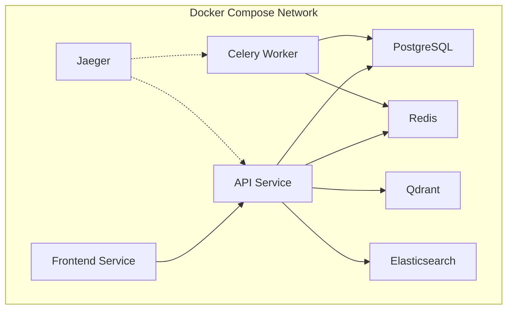
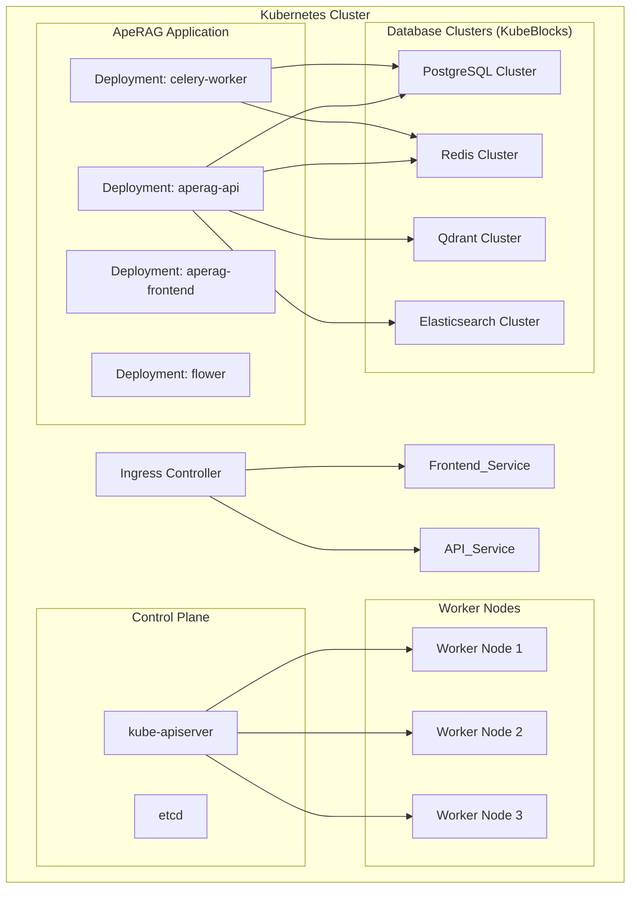
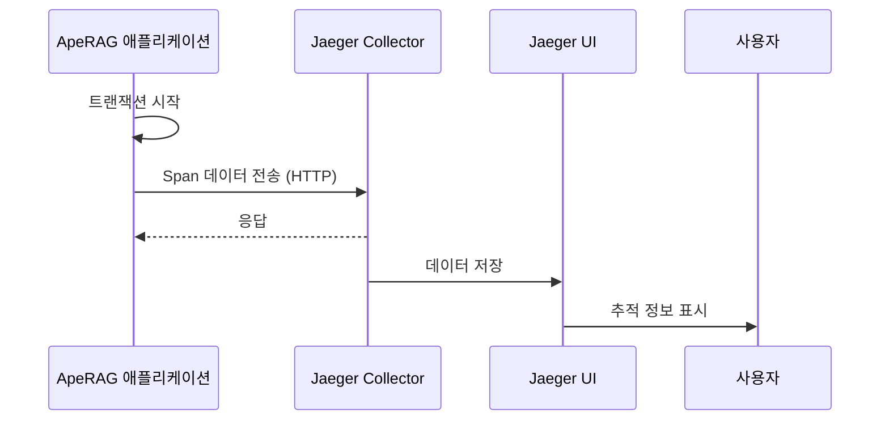

# 배포

<cite>
**이 문서에서 참조한 파일**   
- [docker-compose.yml](file://docker-compose.yml)
- [deploy/databases/00-config.sh](file://deploy/databases/00-config.sh)
- [deploy/databases/README.md](file://deploy/databases/README.md)
- [deploy/databases/01-prepare.sh](file://deploy/databases/01-prepare.sh)
- [deploy/aperag/Chart.yaml](file://deploy/aperag/Chart.yaml)
- [envs/docker.env.overrides](file://envs/docker.env.overrides)
- [scripts/start-api.sh](file://scripts/start-api.sh)
- [aperag/trace/telemetry.py](file://aperag/trace/telemetry.py)
</cite>

## 목차
1. [소개](#소개)
2. [단일 서버 배포: Docker Compose](#단일-서버-배포-docker-compose)
3. [클러스터 배포: Kubernetes 및 Helm 차트](#클러스터-배포-kubernetes-및-helm-차트)
4. [환경 설정 관리](#환경-설정-관리)
5. [로깅 및 모니터링 시스템 연동](#로깅-및-모니터링-시스템-연동)
6. [자동 스케일링 전략](#자동-스케일링-전략)
7. [데이터베이스 마이그레이션 및 롤백](#데이터베이스-마이그레이션-및-롤백)
8. [결론](#결론)

## 소개
ApeRAG은 그래프 기반 RAG(Retrieval-Augmented Generation), 벡터 검색, 풀텍스트 검색을 결합한 프로덕션 준비 완료된 지능형 AI 에이전트 플랫폼입니다. 본 문서는 ApeRAG를 프로덕션 환경에 배포하는 두 가지 주요 방법 — **Docker Compose를 이용한 단일 서버 배포**와 **Kubernetes(Helm 차트)를 이용한 클러스터 배포** — 를 상세히 설명합니다. 각 방식의 절차, 장단점, 리소스 요구 사양, 네트워크 구성, 보안 설정을 비교하고, 환경별 설정 관리, 로깅 및 모니터링, 자동 스케일링, 데이터베이스 마이그레이션 파이프라인 통합과 롤백 절차도 포함합니다.

**Section sources**
- [README.md](file://README.md#L1-L252)

## 단일 서버 배포: Docker Compose

### 배포 절차
Docker Compose는 개발 및 소규모 프로덕션 환경에 적합한 간편한 배포 방법입니다. 다음 단계를 따라 설치할 수 있습니다:

1. 저장소 복제 및 `.env` 파일 생성:
```bash
git clone https://github.com/apecloud/ApeRAG.git
cd ApeRAG
cp envs/env.template .env
```

2. 서비스 시작:
```bash
docker-compose up -d --pull always
```

`docker-compose.yml` 파일은 API 백엔드, 프론트엔드, Celery 워커, 데이터베이스(PostgreSQL, Redis, Qdrant, Elasticsearch), Jaeger 트레이싱 등 다양한 서비스를 정의합니다. `depends_on` 조건을 통해 서비스 간 종속성을 관리하며, 각 컨테이너는 건강 상태 체크 후에 실행됩니다.

### 장단점
- **장점**: 설정이 간단하고, 모든 서비스가 하나의 파일로 관리되며, 로컬 또는 단일 서버에서 쉽게 실행 가능.
- **단점**: 고가용성(HA) 및 자동 확장 기능 부족, 단일 실패 지점(Single Point of Failure) 존재.

### 리소스 요구 사양
- **최소 요구사항**: CPU 2코어 이상, RAM 4GB 이상
- **권장 사양**: CPU 4코어 이상, RAM 8GB 이상 (특히 DocRay GPU 모드 사용 시)

### 네트워크 구성
Docker Compose는 기본적으로 `bridge` 네트워크를 사용하여 컨테이너 간 통신을 처리합니다. 각 서비스는 내부 호스트 이름(예: `aperag-postgres`, `aperag-redis`)으로 서로를 식별하며, 이는 `envs/docker.env.overrides` 파일에서 정의됩니다.

### 보안 설정
- SSL/TLS는 별도의 역방향 프록시(Nginx, Traefik)를 통해 적용해야 합니다.
- 방화벽은 호스트 OS의 방화벽 규칙(UFW, iptables)으로 관리합니다.
- 민감한 정보는 `.env` 파일에 저장되며, Git 추적 대상에서 제외되어야 합니다.

**Diagram sources**
- [docker-compose.yml](file://docker-compose.yml#L1-L265)
- [envs/docker.env.overrides](file://envs/docker.env.overrides#L1-L29)



**Section sources**
- [docker-compose.yml](file://docker-compose.yml#L1-L265)
- [envs/docker.env.overrides](file://envs/docker.env.overrides#L1-L29)
- [README.md](file://README.md#L30-L70)

## 클러스터 배포: Kubernetes 및 Helm 차트

### 배포 절차
Kubernetes는 고가용성, 자동 확장, 선점형 노드 등을 지원하는 프로덕션급 배포에 적합합니다. Helm 차트를 사용하여 ApeRAG를 배포하는 절차는 다음과 같습니다:

1. 저장소 복제:
```bash
git clone https://github.com/apecloud/ApeRAG.git
cd ApeRAG
```

2. KubeBlocks를 사용하여 데이터베이스 배포:
```bash
cd deploy/databases/
bash ./01-prepare.sh          # KubeBlocks 및 애드온 설치
bash ./02-install-database.sh # PostgreSQL, Redis, Qdrant, Elasticsearch 클러스터 배포
```

3. ApeRAG 애플리케이션 배포:
```bash
cd ../../
helm install aperag ./deploy/aperag --namespace default --create-namespace
```

### 장단점
- **장점**: 고가용성, 자동 복구, 자동 스케일링, 리소스 격리, 운영 관리 용이성.
- **단점**: 설정이 복잡하고, 운영 인프라에 대한 이해 필요, 초기 구축 비용 높음.

### 리소스 요구 사양
- **노드 요구사항**: 각 워커 노드는 최소 4vCPU, 8GB RAM 권장.
- **클러스터 크기**: 프로덕션 환경에서는 최소 3개 노드 이상 권장.

### 네트워크 구성
- **서비스 타입**: `ClusterIP`, `NodePort`, `LoadBalancer` 또는 Ingress를 통해 외부 접근 가능.
- **네임스페이스**: `default` 또는 별도의 `rag` 네임스페이스에 배포.
- **내부 통신**: 서비스 이름으로 DNS 기반 서비스 디스커버리 수행.

### 보안 설정
- **SSL/TLS**: Ingress 컨트롤러(Traefik, Nginx)를 통해 Let's Encrypt 인증서 적용.
- **네트워크 정책**: `NetworkPolicy`를 사용하여 Pod 간 통신 제한.
- **비밀 관리**: `Secret` 리소스를 통해 데이터베이스 비밀번호, API 키 등을 안전하게 저장.

**Diagram sources**
- [deploy/databases/00-config.sh](file://deploy/databases/00-config.sh#L1-L22)
- [deploy/databases/01-prepare.sh](file://deploy/databases/01-prepare.sh#L1-L34)
- [deploy/aperag/Chart.yaml](file://deploy/aperag/Chart.yaml#L1-L25)



**Section sources**
- [deploy/databases/00-config.sh](file://deploy/databases/00-config.sh#L1-L22)
- [deploy/databases/README.md](file://deploy/databases/README.md#L1-L171)
- [deploy/aperag/Chart.yaml](file://deploy/aperag/Chart.yaml#L1-L25)

## 환경 설정 관리

### 환경별 설정 파일
- **`.env.production`**: 프로덕션 환경의 환경 변수를 정의합니다.
- **`envs/docker.env.overrides`**: Docker Compose 환경에서 데이터베이스 호스트 및 포트 오버라이드.
- **Helm `values.yaml`**: Kubernetes 환경에서 이미지 태그, 리소스 요청/제한, Ingress 설정 등을 정의.

각 환경은 독립적인 설정 파일을 사용하여 민감 정보를 분리하고, CI/CD 파이프라인에서 환경에 맞게 배포할 수 있습니다.

**Section sources**
- [envs/docker.env.overrides](file://envs/docker.env.overrides#L1-L29)
- [deploy/aperag/values.yaml](file://deploy/aperag/values.yaml)

## 로깅 및 모니터링 시스템 연동

### Jaeger 연동
ApeRAG은 OpenTelemetry를 통해 분산 추적을 지원합니다. `JAEGER_ENABLED=True` 및 `JAEGER_ENDPOINT=http://aperag-jaeger:14268/api/traces` 설정을 통해 Jaeger에 추적이 전송됩니다. `aperag/trace/telemetry.py` 파일에서 Jaeger Exporter가 초기화되며, 실패 시 NoOp Exporter로 폴백합니다.

### Prometheus 연동
Celery 및 FastAPI 메트릭은 `/metrics` 엔드포인트를 통해 노출되며, Prometheus가 이를 수집할 수 있습니다. Kubernetes에서는 `ServiceMonitor` CRD를 사용하여 자동 발견 가능.

**Diagram sources**
- [aperag/trace/telemetry.py](file://aperag/trace/telemetry.py#L82-L148)



**Section sources**
- [aperag/trace/telemetry.py](file://aperag/trace/telemetry.py#L82-L148)
- [docker-compose.yml](file://docker-compose.yml#L230-L245)

## 자동 스케일링 전략

### Horizontal Pod Autoscaler (HPA)
Kubernetes에서는 CPU 및 메모리 사용률 또는 큐 길이(Celery)에 기반하여 HPA를 설정할 수 있습니다. 예를 들어, Celery 워커는 Redis 큐 길이에 따라 자동 확장됩니다.

### Kubernetes Event-driven Autoscaling (KEDA)
KEDA를 사용하면 Celery 큐 길이와 같은 외부 메트릭에 기반한 더 세밀한 스케일링이 가능합니다.

**Section sources**
- [deploy/aperag/values.yaml](file://deploy/aperag/values.yaml)

## 데이터베이스 마이그레이션 및 롤백

### Alembic 마이그레이션 파이프라인 통합
ApeRAG은 Alembic을 사용하여 데이터베이스 스키마 마이그레이션을 관리합니다. `scripts/start-api.sh` 스크립트는 애플리케이션 시작 전에 `alembic upgrade head` 명령을 실행하여 최신 스키마로 자동 업그레이드합니다.

### 롤백 절차
1. 이전 버전의 코드로 되돌림.
2. Alembic 마이그레이션을 다운그레이드:
```bash
alembic downgrade -1  # 마지막 마이그레이션 롤백
```
3. 애플리케이션 재시작.

**Section sources**
- [scripts/start-api.sh](file://scripts/start-api.sh#L1-L10)
- [aperag/migration/versions](file://aperag/migration/versions)

## 결론
Docker Compose는 신속한 배포와 개발에 적합하지만, Kubernetes는 고가용성과 확장성이 요구되는 프로덕션 환경에 더 적합합니다. 각 배포 방식은 리소스 요구 사항, 보안, 운영 복잡성에서 상이하므로, 조직의 인프라 능력과 서비스 요구사항을 기반으로 선택해야 합니다. 또한, 환경 설정, 모니터링, 자동 스케일링, 데이터베이스 마이그레이션 전략을 철저히 설계함으로써 안정적인 프로덕션 운영이 가능합니다.