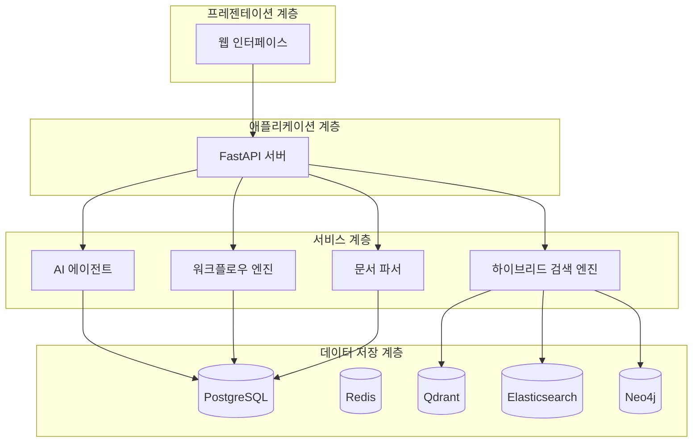

# 소개

<cite>
**이 문서에서 참조한 파일**  
- [app.py](file://aperag/app.py)
- [config.py](file://aperag/config.py)
- [agent_session_manager.py](file://aperag/agent/agent_session_manager.py)
- [models.py](file://aperag/db/models.py)
- [engine.py](file://aperag/flow/engine.py)
- [manager.py](file://aperag/index/manager.py)
- [README-zh.md](file://README-zh.md)
</cite>

## 목차
1. [목적과 핵심 가치](#목적과-핵심-가치)  
2. [주요 사용 사례](#주요-사례)  
3. [아키텍처 개요](#아키텍처-개요)  
4. [핵심 구성 요소와 데이터 흐름](#핵심-구성-요소와-데이터-흐름)  
5. [주요 디렉터리 역할](#주요-디렉터리-역할)  
6. [기여 및 커뮤니티 참여](#기여-및-커뮤니티-참여)

## 목적과 핵심 가치

ApeRAG는 지능형 AI 에이전트와 하이브리드 검색 엔진을 결합한 지식 기반 플랫폼으로, 복잡한 문서 컬렉션 내에서 정확한 정보 추출을 가능하게 합니다. 이 시스템은 **검색 증강 생성**(Retrieval-Augmented Generation, RAG) 기술을 기반으로 하며, 기업용 지식 관리, 과학 연구 지원, 고객 서비스 챗봇 등 다양한 분야에 적용될 수 있습니다.

ApeRAG의 핵심 가치는 다음과 같습니다:
- **다중 인덱스 검색**: 벡터, 전체 텍스트, 그래프, 요약, 시각 정보를 포함한 5가지 인덱스 유형을 통해 다각적인 문서 이해와 최적의 검색 성능을 제공합니다.
- **지능형 AI 에이전트**: MCP(모델 컨텍스트 프로토콜)를 지원하는 내장형 AI 에이전트는 관련 컬렉션을 자동으로 식별하고, 지능적으로 내용을 탐색하며, 웹 검색 기능을 활용하여 포괄적인 답변을 생성합니다.
- **고급 그래프 RAG 및 엔터티 정규화**: LightRAG을 기반으로 한 고도화된 구현으로, 엔터티 통합 기능을 통해 더 명확한 지식 그래프를 구성하고 관계 이해를 향상시킵니다.
- **생산 환경 준비**: 쿠버네티스 배포, Helm 차트, KubeBlocks 통합 등을 통해 기업급 운영 환경에서 안정적으로 배포하고 관리할 수 있습니다.

**Section sources**
- [README-zh.md](file://README-zh.md#L97-L124)

## 주요 사용 사례

ApeRAG는 다음의 주요 사용 사례에 적합합니다:

- **기업용 지식 관리**: 조직 내 산재된 문서, 보고서, 매뉴얼 등을 중앙 집중식으로 관리하고, 직원들이 자연어 질문을 통해 필요한 정보를 빠르게 검색할 수 있도록 지원합니다.
- **과학 연구 지원**: 논문, 실험 데이터, 참고 문헌 등의 대량의 과학 문서를 처리하여 연구자들이 새로운 발견을 위한 인사이트를 도출할 수 있도록 돕습니다.
- **고객 서비스 챗봇**: 제품 설명서, FAQ, 고객 문의 기록 등을 기반으로 정확하고 신속한 응답을 제공하는 지능형 챗봇을 구축할 수 있습니다.
- **법률 및 금융 문서 분석**: 계약서, 법률 조항, 재무 보고서와 같은 복잡한 문서를 분석하여 핵심 정보를 추출하고 요약합니다.

## 아키텍처 개요

ApeRAG는 모듈화된 마이크로서비스 아키텍처를 기반으로 하며, 각 구성 요소는 특정 기능을 담당합니다. 전반적인 아키텍처는 다음과 같은 계층으로 구성됩니다:

1. **프레젠테이션 계층 (Frontend)**: React 기반의 웹 인터페이스를 통해 사용자와 상호작용합니다.
2. **애플리케이션 계층 (Backend)**: FastAPI를 기반으로 한 백엔드 서버가 API 요청을 처리하고 비즈니스 로직을 실행합니다.
3. **서비스 계층 (Services)**: AI 에이전트, 검색 엔진, LLM 통합, 문서 파싱 등 핵심 기능을 제공하는 서비스 모듈들입니다.
4. **데이터 저장 계층 (Data Storage)**: PostgreSQL, Redis, Qdrant, Elasticsearch, Neo4j 등 다양한 데이터베이스가 서로 다른 유형의 데이터를 저장합니다.

**Diagram sources**
- [app.py](file://aperag/app.py#L1-L122)
- [config.py](file://aperag/config.py#L1-L331)

## 핵심 구성 요소와 데이터 흐름

### AI 에이전트 (Agent)
AI 에이전트는 사용자의 질의를 이해하고, 적절한 검색 전략을 결정하며, 여러 소스에서 정보를 수집하여 최종 답변을 생성하는 핵심 컴포넌트입니다. `agent` 디렉터리 내의 모듈들은 세션 관리, 메모리 관리, 이벤트 처리 등을 담당합니다.

- **세션 관리**: `agent_session_manager.py`는 사용자와 채팅 세션 간의 상태를 유지하기 위해 각 세션마다 고유한 MCP 앱, 에이전트, LLM 인스턴스를 생성하고 관리합니다.
- **데이터 흐름**: 사용자 입력 → 세션 확인/생성 → LLM에 연결 → 검색 수행 → 응답 생성 → 출력

### 워크플로우 엔진 (Flow Engine)
`flow/engine.py`에 구현된 워크플로우 엔진은 노드와 엣지로 구성된 플로우 인스턴스를 실행합니다. 이 엔진은 의존성 그래프를 기반으로 노드들을 위상 정렬(topological sort)하여 순환을 방지하고, 병렬로 실행 가능한 노드 그룹을 찾아 효율적으로 작업을 수행합니다.

- **실행 절차**: 플로우 시작 → 글로벌 변수 초기화 → 위상 정렬 → 병렬 그룹 실행 → 결과 반환
- **이벤트 발생**: 노드 시작, 노드 종료, 오류 발생 등의 이벤트를 실시간으로 방출하여 추적 및 모니터링이 가능합니다.

### 인덱스 관리자 (Index Manager)
`index/manager.py`의 `DocumentIndexManager`는 문서의 인덱스 생성 및 삭제를 관리합니다. 문서가 생성되거나 업데이트되면, 해당 문서에 대해 벡터, 전체 텍스트, 그래프 등 다양한 유형의 인덱스를 생성하거나 상태를 '대기 중'(PENDING)으로 설정합니다.

- **인덱스 유형**: 벡터(Vector), 전체 텍스트(Fulltext), 그래프(Graph), 요약(Summary), 시각(Vision)
- **상태 관리**: 각 인덱스는 PENDING, ACTIVE, DELETING 등의 상태를 가지며, 상태 변화에 따라 후속 작업이 트리거됩니다.

### 데이터베이스 모델 (Database Models)
`db/models.py`에는 ApeRAG의 모든 데이터베이스 테이블 스키마가 정의되어 있습니다. 주요 엔터티는 다음과 같습니다:
- **Collection**: 문서 컬렉션을 나타내며, 제목, 설명, 상태 등의 속성을 가집니다.
- **Document**: 개별 문서를 나타내며, 이름, 크기, 상태, 객체 경로 등의 속성을 가집니다.
- **DocumentIndex**: 문서의 각 인덱스를 관리하며, 인덱스 유형과 상태를 추적합니다.
- **User**: 사용자 정보를 저장하며, 역할(Role), 권한 등을 관리합니다.

**Section sources**
- [agent_session_manager.py](file://aperag/agent/agent_session_manager.py#L0-L250)
- [engine.py](file://aperag/flow/engine.py#L0-L455)
- [manager.py](file://aperag/index/manager.py#L0-L105)
- [models.py](file://aperag/db/models.py#L0-L799)

## 주요 디렉터리 역할

| 디렉터리 | 역할 |
|--------|------|
| `aperag/agent` | AI 에이전트의 세션, 메모리, 이벤트 처리를 담당하는 핵심 모듈 |
| `aperag/api` | OpenAPI 스펙에 기반한 API 엔드포인트 정의 |
| `aperag/db` | 데이터베이스 모델, 리포지토리, 연산을 관리 |
| `aperag/docparser` | PDF, 이미지, 오디오 등 다양한 형식의 문서를 파싱하고 청크로 분할 |
| `aperag/flow` | 워크플로우 정의, 파싱, 실행 엔진을 포함한 자동화된 처리 파이프라인 |
| `aperag/graph` | LightRAG 기반의 지식 그래프 생성 및 관리 |
| `aperag/index` | 벡터, 전체 텍스트, 그래프 등 다양한 인덱스의 생성 및 관리 |
| `aperag/llm` | LLM 완성, 임베딩, 재순위화 서비스 및 캐싱 기능 제공 |
| `aperag/service` | 비즈니스 로직을 캡슐화한 서비스 클래스들 |
| `aperag/views` | FastAPI 라우터를 통해 HTTP 요청을 처리 |
| `web` | React 기반의 프론트엔드 웹 애플리케이션 |

## 기여 및 커뮤니티 참여

ApeRAG는 오픈소스 프로젝트로서, 누구나 기여할 수 있습니다. 기여 방법은 다음과 같습니다:

- **코드 기여**: GitHub 저장소에서 이슈를 확인하고, 버그 수정이나 기능 추가를 위한 풀 리퀘스트(PR)를 제출하세요.
- **문서 기여**: README, 개발 가이드, API 문서 등을 개선하여 프로젝트의 접근성을 높이세요.
- **테스트 및 피드백**: Docker Compose 또는 Kubernetes를 통해 로컬 환경에서 ApeRAG를 배포하고, 사용 경험을 공유하세요.

커뮤니티 참여는 다음 채널을 통해 가능합니다:
- **Discord**: [Discord 초대 링크](https://discord.gg/FsKpXukFuB)
- **Feishu**: Feishu 그룹 QR 코드를 스캔하여 참여

또한, ApeRAG는 LightRAG, MinerU 등 여러 우수한 오픈소스 프로젝트를 기반으로 구축되었습니다. 이러한 프로젝트에 대한 적절한 인용과 감사를 표하는 것이 중요합니다.

**Section sources**
- [README-zh.md](file://README-zh.md#L228-L248)