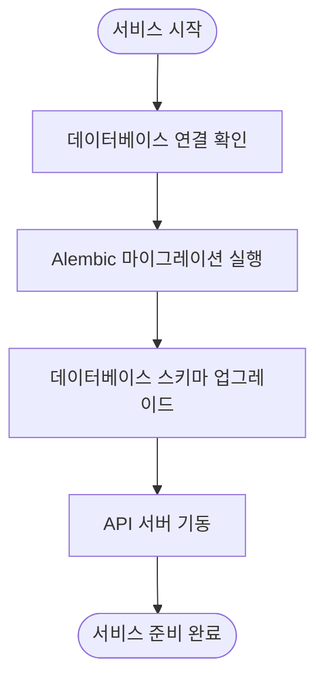
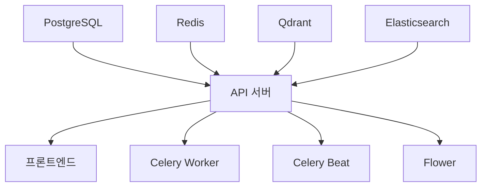

# 시작하기

<cite>
**이 문서에서 참조한 파일**
- [README-zh.md](file://README-zh.md)
- [docker-compose.yml](file://docker-compose.yml)
- [scripts/start-api.sh](file://scripts/start-api.sh)
- [scripts/start-celery-worker.sh](file://scripts/start-celery-worker.sh)
- [deploy/aperag/values.yaml](file://deploy/aperag/values.yaml)
- [deploy/databases/01-prepare.sh](file://deploy/databases/01-prepare.sh)
- [deploy/databases/02-install-database.sh](file://deploy/databases/02-install-database.sh)
</cite>

## 목차
1. [소개](#소개)
2. [Docker Compose를 사용한 빠른 시작](#docker-compose를-사용한-빠른-시작)
3. [Kubernetes 기반 배포](#kubernetes-기반-배포)
4. [환경 설정 및 초기화](#환경-설정-및-초기화)
5. [서버 기동 순서](#서버-기동-순서)
6. [기본 동작 예제](#기본-동작-예제)
7. [흔히 발생하는 문제 및 해결 방법](#흔히-발생하는-문제-및-해결-방법)

## 소개
ApeRAG은 그래프 RAG, 벡터 검색, 풀텍스트 검색 및 고급 AI 에이전트를 결합한 프로덕션 준비된 RAG(검색 증강 생성) 플랫폼입니다. 하이브리드 검색, 멀티모달 문서 처리, 지능형 에이전트 및 엔터프라이즈급 관리 기능을 갖춘 복잡한 AI 애플리케이션을 구축할 수 있습니다.

이 문서는 ApeRAG를 로컬 환경에 설치하고 실행하는 단계별 가이드를 제공합니다. Docker Compose를 이용한 간편한 설치 방법과 Kubernetes 기반의 프로덕션 환경 배포 방법 모두를 포함하며, 각각의 전제 조건, 환경 설정, 서버 기동 순서, 기본 동작 확인 방법 및 일반적인 문제 해결 팁을 상세히 설명합니다.

## Docker Compose를 사용한 빠른 시작

### 전제 조건
Docker Compose를 사용하여 ApeRAG를 설치하기 전에 다음 전제 조건을 충족해야 합니다:
- CPU 코어 2개 이상
- RAM 4GiB 이상
- [Docker](https://docs.docker.com/get-docker/) 설치
- [Docker Compose](https://docs.docker.com/compose/install/) 설치

### 설치 절차
다음 명령어를 순차적으로 실행하여 ApeRAG를 설치하고 실행합니다:

```bash
git clone https://github.com/apecloud/ApeRAG.git
cd ApeRAG
cp envs/env.template .env
docker-compose up -d --pull always
```

### 서비스 구성
`docker-compose.yml` 파일에는 다음과 같은 주요 서비스가 정의되어 있습니다:
- **api**: 백엔드 API 서버 (FastAPI 기반)
- **frontend**: 프론트엔드 웹 인터페이스 (React 기반)
- **celeryworker**: 비동기 작업 처리 워커
- **celerybeat**: 주기적 작업 스케줄러
- **postgres**: PostgreSQL 데이터베이스
- **redis**: Redis 캐시 및 메시지 브로커
- **qdrant**: 벡터 데이터베이스
- **es**: Elasticsearch (풀텍스트 검색용)

**Section sources**
- [docker-compose.yml](file://docker-compose.yml#L1-L265)
- [README-zh.md](file://README-zh.md#L30-L50)

## Kubernetes 기반 배포

### 전제 조건
Kubernetes에 ApeRAG를 배포하려면 다음 전제 조건이 필요합니다:
- [Kubernetes 클러스터](https://kubernetes.io/docs/setup/) (v1.20 이상)
- [`kubectl`](https://kubernetes.io/docs/tasks/tools/) 설치 및 클러스터 연결 구성
- [Helm v3+](https://helm.sh/docs/intro/install/) 설치

### 설치 절차
1. **저장소 복제**
   ```bash
   git clone https://github.com/apecloud/ApeRAG.git
   cd ApeRAG
   ```

2. **데이터베이스 서비스 배포**
   ApeRAG는 PostgreSQL, Redis, Qdrant, Elasticsearch가 필요합니다. 두 가지 옵션이 있습니다:
   
   **옵션 A: 기존 데이터베이스 사용**
   `deploy/aperag/values.yaml` 파일을 수정하여 데이터베이스 연결 정보를 구성한 후 2단계로 건너뜁니다.
   
   **옵션 B: KubeBlocks를 사용한 데이터베이스 배포**
   자동화된 데이터베이스 배포 스크립트를 사용합니다:
   ```bash
   cd deploy/databases/
   bash ./01-prepare.sh          # KubeBlocks 설치
   bash ./02-install-database.sh # 데이터베이스 배포
   cd ../../
   ```
   모든 데이터베이스 파드의 상태가 `Running`이 될 때까지 기다린 후 계속 진행합니다.

3. **ApeRAG 애플리케이션 배포**
   ```bash
   helm install aperag ./deploy/aperag --namespace default --create-namespace
   ```

4. **배포 모니터링**
   ```bash
   kubectl get pods -n default -l app.kubernetes.io/instance=aperag
   ```

**Section sources**
- [README-zh.md](file://README-zh.md#L180-L250)
- [deploy/databases/01-prepare.sh](file://deploy/databases/01-prepare.sh)
- [deploy/databases/02-install-database.sh](file://deploy/databases/02-install-database.sh)
- [deploy/aperag/values.yaml](file://deploy/aperag/values.yaml#L1-L392)

## 환경 설정 및 초기화

### .env 파일 설정
`.env` 파일은 ApeRAG의 핵심 환경 변수를 포함합니다. 설치 전에 `envs/env.template` 파일을 `.env`로 복사하고 필요한 값을 설정해야 합니다. 주요 환경 변수는 다음과 같습니다:

| 환경 변수 | 설명 | 기본값 |
|-----------|------|--------|
| `JWT_SECRET` | JWT 토큰 서명을 위한 비밀 키 | a-very-secret-key-that-you-should-change |
| `VECTOR_DB_TYPE` | 사용할 벡터 DB 유형 | qdrant |
| `OBJECT_STORE_TYPE` | 객체 저장소 유형 | local |
| `DEBUG` | 디버그 모드 활성화 여부 | False |

### 데이터베이스 초기화
백엔드 API 서버가 시작될 때 데이터베이스 마이그레이션 스크립트가 자동으로 실행됩니다. 이 과정은 Alembic을 사용하여 스키마를 최신 상태로 업데이트합니다.



**Diagram sources**
- [scripts/start-api.sh](file://scripts/start-api.sh#L7)
- [docker-compose.yml](file://docker-compose.yml#L15-L25)

**Section sources**
- [scripts/start-api.sh](file://scripts/start-api.sh#L1-L10)
- [deploy/aperag/values.yaml](file://deploy/aperag/values.yaml#L150-L180)

## 서버 기동 순서

### Docker Compose 환경
Docker Compose를 사용할 경우, `docker-compose up` 명령어가 모든 서비스를 올바른 순서로 자동으로 기동합니다. 종속성은 다음과 같습니다:



### Kubernetes 환경
Helm 차트를 사용하면 Pod 간의 종속성이 적절하게 설정되며, readiness probe와 liveness probe를 통해 서비스 간 의존성을 관리합니다.

**Diagram sources**
- [docker-compose.yml](file://docker-compose.yml#L15-L25)
- [deploy/aperag/templates/api-deployment.yaml](file://deploy/aperag/templates/api-deployment.yaml#L50-L100)

**Section sources**
- [docker-compose.yml](file://docker-compose.yml#L1-L265)
- [deploy/aperag/templates/api-deployment.yaml](file://deploy/aperag/templates/api-deployment.yaml#L1-L224)

## 기본 동작 예제

### 웹 인터페이스 접근
설치 후 다음 URL을 통해 ApeRAG에 접근할 수 있습니다:
- **웹 인터페이스**: http://localhost:3000/web/
- **API 문서**: http://localhost:8000/docs

### API 엔드포인트 호출 예제
```bash
# API 헬스 체크
curl http://localhost:8000/health

# 컬렉션 목록 조회
curl http://localhost:8000/api/v1/collections
```

### 샘플 쿼리 실행
1. 웹 인터페이스에서 새 컬렉션 생성
2. PDF 또는 텍스트 파일 업로드
3. 자연어 질문 입력 (예: "이 문서의 핵심 내용은 무엇인가요?")
4. AI 에이전트가 문서를 분석하고 답변 제공

**Section sources**
- [README-zh.md](file://README-zh.md#L60-L70)
- [docker-compose.yml](file://docker-compose.yml#L50-L60)

## 흔히 발생하는 문제 및 해결 방법

### 포트 충돌
기본적으로 ApeRAG는 여러 포트를 사용합니다:
- 8000: API 서버
- 3000: 프론트엔드
- 5432: PostgreSQL
- 6379: Redis
- 6333: Qdrant
- 9200: Elasticsearch

**해결 방법**: 다른 포트를 사용하도록 `docker-compose.yml` 파일을 수정하거나, 충돌하는 로컬 서비스를 중지합니다.

### 의존성 오류
Celery 워커가 시작되지 않는 경우, 종속성 서비스(PostgreSQL, Redis 등)가 정상적으로 실행되었는지 확인하세요.

**해결 방법**: 
```bash
# 서비스 상태 확인
docker-compose ps

# 로그 확인
docker-compose logs api
docker-compose logs celeryworker
```

### 데이터베이스 연결 실패
Kubernetes 환경에서 데이터베이스 연결 실패가 발생하면, `values.yaml` 파일의 연결 정보와 실제 데이터베이스 서비스 이름이 일치하는지 확인하세요.

**해결 방법**: `kubectl get svc` 명령어로 서비스 이름을 확인하고, `values.yaml` 파일을 수정합니다.

**Section sources**
- [README-zh.md](file://README-zh.md#L250-L260)
- [docker-compose.yml](file://docker-compose.yml#L200-L220)