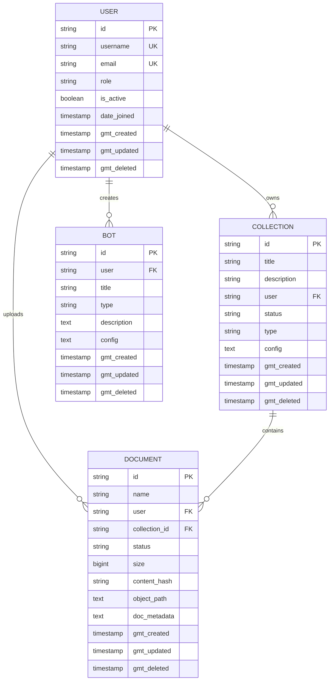

# 관계형 데이터 아키텍처

<cite>
**이 문서에서 참조한 파일**
- [models.py](file://aperag/db/models.py)
- [collection.py](file://aperag/db/repositories/collection.py)
- [document.py](file://aperag/db/repositories/document.py)
- [bot.py](file://aperag/db/repositories/bot.py)
- [user.py](file://aperag/db/repositories/user.py)
- [values.yaml](file://deploy/databases/postgresql/values.yaml)
</cite>

## 목차
1. [소개](#소개)
2. [핵심 엔티티 모델 설계](#핵심-엔티티-모델-설계)
3. [저장소 패턴과 데이터 접근 계층](#저장소-패턴과-데이터-접근-계층)
4. [관계형 데이터베이스 아키텍처 다이어그램](#관계형-데이터베이스-아키텍처-다이어그램)
5. [고급 ORM 기능 및 커스텀 필드 타입](#고급-orm-기능-및-커스텀-필드-타입)
6. [소프트 삭제와 인덱스 전략](#소프트-삭제와-인덱스-전략)
7. [배포 및 확장성: Helm 차트를 통한 PostgreSQL 구성](#배포-및-확장성-helm-차트를-통한-postgresql-구성)
8. [결론](#결론)

## 소개

ApeRAG는 SQLModel을 기반으로 한 강력한 ORM 설계를 통해 관계형 데이터베이스에 핵심 엔티티들을 저장하고 관리합니다. 이 문서는 ApeRAG의 관계형 데이터 아키텍처를 심층적으로 분석하며, Collection, Document, Bot, User 등의 주요 엔티티가 PostgreSQL 데이터베이스에 어떻게 구조화되어 있는지 설명합니다.

본 문서는 다음과 같은 핵심 요소를 다룹니다:
- **ORM 설계 원칙**: SQLModel과 SQLAlchemy를 활용한 객체-관계 매핑
- **엔티티 간 관계**: 일대다, 다대다 관계의 구현 방식
- **소프트 삭제 패턴**: `gmt_deleted` 필드를 통한 논리적 삭제 구현
- **인덱스 전략**: 쿼리 성능 최적화를 위한 인덱스 배치
- **커스텀 필드 타입**: `EnumColumn`과 같은 사용자 정의 필드 타입의 활용
- **저장소 패턴**: 비즈니스 로직과 데이터 접근 계층의 명확한 분리
- **마이그레이션 관리**: Alembic을 통한 스키마 버전 관리
- **배포 및 확장성**: Helm 차트를 통한 PostgreSQL 클러스터 구성

이 아키텍처는 확장성, 유지보수성, 그리고 데이터 무결성을 보장하는 견고한 기반을 제공합니다.

## 핵심 엔티티 모델 설계

ApeRAG의 핵심은 `aperag/db/models.py` 파일에 정의된 여러 ORM 모델들입니다. 이러한 모델들은 SQLAlchemy의 declarative base를 상속받아 작성되며, 각각의 테이블과 열, 제약 조건을 Python 클래스로 명확하게 표현합니다.

### Collection (컬렉션) 모델

`Collection` 모델은 문서들의 그룹을 나타내며, 지식 베이스의 기본 단위입니다. 이 모델은 다음과 같은 특징을 가집니다:

- **id**: 고유 식별자로, "col" 접두사와 함께 랜덤 ID가 생성됩니다.
- **title**, **description**: 컬렉션의 이름과 설명을 저장합니다.
- **user**: 이 컬렉션을 소유한 사용자의 ID를 저장합니다.
- **status**: `CollectionStatus` Enum을 사용하여 ACTIVE, INACTIVE, DELETED 상태를 관리합니다.
- **type**: `CollectionType` Enum을 사용하여 DOCUMENT 또는 CHAT 유형을 구분합니다.
- **config**: JSON 형식의 문자열로, 컬렉션의 다양한 설정(예: 인덱싱 옵션)을 저장합니다.
- **gmt_created**, **gmt_updated**, **gmt_deleted**: 생성, 수정, 삭제 시간을 추적합니다.

**Section sources**
- [models.py](file://aperag/db/models.py#L221-L233)

### Document (문서) 모델

`Document` 모델은 개별 문서 파일을 나타냅니다. 하나의 `Collection`은 여러 개의 `Document`를 포함할 수 있으므로, 이는 일대다 관계를 형성합니다.

- **id**: 고유 식별자로, "doc" 접두사와 함께 랜덤 ID가 생성됩니다.
- **name**: 문서의 원래 파일 이름을 저장합니다.
- **user**: 문서를 업로드한 사용자를 참조합니다.
- **collection_id**: 속해 있는 `Collection`의 외래 키입니다.
- **status**: `DocumentStatus` Enum을 사용하여 UPLOADED, PENDING, RUNNING, COMPLETE 등 다양한 처리 상태를 관리합니다.
- **size**: 문서의 바이트 크기를 저장합니다.
- **content_hash**: SHA-256 해시를 저장하여 중복 문서를 감지합니다.
- **object_path**: S3나 로컬 스토리지에 저장된 실제 파일 경로를 저장합니다.

또한, `Document` 모델은 `get_document_indexes()`와 `get_overall_index_status()`와 같은 메서드를 통해 관련 인덱스들과의 관계를 동적으로 조회할 수 있습니다.

**Section sources**
- [models.py](file://aperag/db/models.py#L323-L385)

### Bot (봇) 모델

`Bot` 모델은 AI 에이전트 또는 챗봇을 나타냅니다. 이 모델은 사용자가 특정 지식을 기반으로 상호작용할 수 있는 인터페이스를 제공합니다.

- **id**: 고유 식별자로, "bot" 접두사와 함께 랜덤 ID가 생성됩니다.
- **user**: 봇을 생성한 사용자를 참조합니다.
- **title**, **description**: 봇의 이름과 설명을 저장합니다.
- **type**: `BotType` Enum을 사용하여 KNOWLEDGE, COMMON, AGENT 유형을 구분합니다.
- **config**: 봇의 동작을 정의하는 JSON 형식의 설정을 저장합니다.

`Bot`은 `Chat` 엔티티와 연결되어 대화 기록을 관리하며, `Collection`과 연결되어 지식 소스로 사용됩니다.

**Section sources**
- [models.py](file://aperag/db/models.py#L388-L400)

### User (사용자) 모델

`User` 모델은 시스템의 사용자를 나타냅니다. 이 모델은 인증 및 권한 부여의 중심 역할을 합니다.

- **id**: 고유 식별자로, "user" 접두사와 함께 랜덤 ID가 생성됩니다.
- **username**, **email**: 사용자의 로그인 정보를 저장합니다.
- **role**: `Role` Enum을 사용하여 ADMIN, RW, RO 등의 역할을 관리합니다.
- **hashed_password**: 암호화된 비밀번호를 저장합니다.
- **is_active**, **is_verified**: 사용자의 활성 상태와 인증 여부를 추적합니다.
- **chat_collection_id**: 사용자의 기본 채팅 컬렉션을 참조합니다.

이 모델은 FastAPI-Users와 통합되어 안전한 사용자 인증을 제공합니다.

**Section sources**
- [models.py](file://aperag/db/models.py#L620-L647)

## 저장소 패턴과 데이터 접근 계층

ApeRAG는 비즈니스 로직과 데이터 접근 로직을 철저히 분리하기 위해 저장소(Repository) 패턴을 채택했습니다. 이는 코드의 재사용성과 테스트 용이성을 크게 향상시킵니다.

### 저장소 디렉터리 구조

`aperag/db/repositories/` 디렉터리에는 각 엔티티별로 전용 저장소 파일이 존재합니다:
- `collection.py`: Collection 엔티티에 대한 CRUD 작업
- `document.py`: Document 엔티티에 대한 CRUD 작업
- `bot.py`: Bot 엔티티에 대한 CRUD 작업
- `user.py`: User 엔티티에 대한 CRUD 작업

이러한 구조는 관심사의 분리를 명확히 하며, 각 저장소는 해당 엔티티의 데이터 접근만 책임집니다.

### 믹스인(Mixin) 클래스를 통한 코드 재사용

저장소는 `AsyncRepositoryProtocol`과 같은 프로토콜을 기반으로 하는 믹스인 클래스를 사용합니다. 예를 들어, `AsyncCollectionRepositoryMixin`은 `create_collection`, `update_collection_by_id`, `delete_collection_by_id` 등의 비동기 메서드를 제공합니다.

```python
async def create_collection(
    self, user: str, title: str, description: str, collection_type, config: str = None
) -> Collection:
    """Create a new collection in database"""

    async def _operation(session):
        instance = Collection(
            user=user,
            type=collection_type,
            status=CollectionStatus.INACTIVE,
            title=title,
            description=description,
            config=config,
        )
        session.add(instance)
        await session.flush()
        await session.refresh(instance)
        return instance

    return await self.execute_with_transaction(_operation)
```

이 패턴을 통해 트랜잭션 관리, 세션 처리, 오류 복구 등의 공통 로직을 중앙에서 관리할 수 있으며, 각 저장소는 비즈니스 규칙에 집중할 수 있습니다.

**Section sources**
- [collection.py](file://aperag/db/repositories/collection.py)
- [document.py](file://aperag/db/repositories/document.py)
- [bot.py](file://aperag/db/repositories/bot.py)
- [user.py](file://aperag/db/repositories/user.py)

## 관계형 데이터베이스 아키텍처 다이어그램

다음 다이어그램은 ApeRAG의 핵심 엔티티들 간의 관계를 시각적으로 표현합니다.



**Diagram sources**
- [models.py](file://aperag/db/models.py#L221-L233)
- [models.py](file://aperag/db/models.py#L323-L385)
- [models.py](file://aperag/db/models.py#L388-L400)
- [models.py](file://aperag/db/models.py#L620-L647)

## 고급 ORM 기능 및 커스텀 필드 타입

ApeRAG는 표준 ORM 기능을 넘어, 데이터베이스 독립성과 유연성을 높이기 위한 고급 기술을 적용했습니다.

### EnumColumn: 데이터베이스 독립적인 Enum 관리

SQLAlchemy의 기본 Enum 타입은 특정 데이터베이스에 종속될 수 있습니다. 이를 해결하기 위해 ApeRAG는 `EnumColumn`이라는 커스텀 함수를 정의했습니다.

```python
def EnumColumn(enum_class, **kwargs):
    """Create a String column for enum values to avoid database enum constraints"""
    max_length = max(len(e.value) for e in enum_class) if enum_class and len(enum_class) > 0 else 50
    max_length = max(max_length + 20, 50)
    kwargs.setdefault("length", max_length)
    return String(**kwargs)
```

이 함수는 Enum 값을 VARCHAR(문자열)로 저장함으로써, PostgreSQL뿐만 아니라 MySQL, SQLite 등 다른 데이터베이스에서도 동일한 스키마를 사용할 수 있도록 합니다. 이는 마이그레이션의 유연성을 크게 향상시킵니다.

**Section sources**
- [models.py](file://aperag/db/models.py#L52-L65)

## 소프트 삭제와 인덱스 전략

ApeRAG는 데이터 무결성과 사용자 경험을 위해 소프트 삭제(Soft Delete) 패턴을 철저히 적용하고 있습니다.

### 소프트 삭제 (Soft Delete) 패턴

대부분의 핵심 모델(`Collection`, `Document`, `Bot`, `User`)은 `gmt_deleted`라는 타임스탬프 필드를 가지고 있습니다. 이 필드는 실제로 행을 삭제하지 않고, 삭제 요청 시점의 시간을 기록합니다.

- **실제 삭제 없음**: 데이터는 물리적으로 삭제되지 않으므로, 실수로 삭제된 경우 복구가 가능합니다.
- **쿼리 필터링**: 대부분의 쿼리는 `status != DELETED` 및 `gmt_deleted.is_(None)` 조건을 추가하여 삭제된 항목을 자동으로 제외합니다.
- **논리적 삭제**: 이는 사용자에게는 삭제된 것처럼 보이지만, 백엔드에서는 여전히 데이터가 존재하는 효과를 줍니다.

이 패턴은 데이터 복구, 감사 로그(Audit Log), 그리고 과거 데이터 분석에 매우 유용합니다.

### 인덱스 전략

ApeRAG는 빈번한 쿼리를 위한 인덱스를 전략적으로 배치하여 성능을 극대화합니다.

- **user 필드 인덱스**: 모든 주요 엔티티(`Collection`, `Document`, `Bot`)는 `user` 필드에 인덱스를 가지고 있어, 특정 사용자의 리소스를 빠르게 조회할 수 있습니다.
- **status 필드 인덱스**: `status` 필드에도 인덱스가 있으며, 활성/비활성 상태를 기반으로 한 필터링 쿼리의 성능을 향상시킵니다.
- **gmt_deleted 인덱스**: 소프트 삭제된 항목을 효율적으로 관리하기 위해 `gmt_deleted` 필드에도 인덱스가 설정되어 있습니다.
- **복합 유니크 제약조건**: `Document` 테이블은 `collection_id`, `name`, `gmt_deleted`의 조합에 대해 유니크 제약조건을 가지며, 동일한 이름의 문서가 같은 컬렉션에 중복 저장되는 것을 방지합니다.

이러한 인덱스 전략은 대규모 데이터셋에서도 응답 속도를 유지하는 데 핵심적인 역할을 합니다.

**Section sources**
- [models.py](file://aperag/db/models.py#L52-L65)
- [models.py](file://aperag/db/models.py#L221-L233)
- [models.py](file://aperag/db/models.py#L323-L385)
- [models.py](file://aperag/db/models.py#L388-L400)
- [models.py](file://aperag/db/models.py#L620-L647)

## 배포 및 확장성: Helm 차트를 통한 PostgreSQL 구성

ApeRAG는 Kubernetes 환경에서 쉽게 배포되고 확장될 수 있도록 Helm 차트를 제공합니다. 특히, `deploy/databases/postgresql/values.yaml` 파일을 통해 PostgreSQL 데이터베이스의 구성과 확장성을 명확하게 정의합니다.

### PostgreSQL 클러스터 구성

Helm 차트를 통해 구성 가능한 주요 파라미터는 다음과 같습니다:

| 파라미터 | 설명 | 기본값 |
|--------|------|-------|
| `version` | PostgreSQL 버전 | 16.4.0 |
| `mode` | 클러스터 토폴로지 모드 (replication) | replication |
| `replicas` | 복제본 수 | 2 |
| `cpu` | 할당 CPU 코어 수 | 0.5 |
| `memory` | 할당 메모리 (GiB) | 0.5 |
| `storage` | 스토리지 크기 (GiB) | 5 |
| `terminationPolicy` | 클러스터 종료 정책 | Delete |

이 구성은 고가용성(High Availability)을 위해 `replicas: 2`로 설정되어 있으며, 마스터-슬레이브 복제 아키텍처를 형성합니다. 이는 장애 발생 시 서비스 중단 없이 운영을 계속할 수 있도록 합니다.

### 확장성 및 유지보수

- **수평 확장**: `replicas` 값을 증가시켜 더 많은 읽기 트래픽을 처리할 수 있습니다.
- **수직 확장**: `cpu`, `memory`, `storage` 값을 조정하여 각 노드의 성능을 향상시킬 수 있습니다.
- **버전 관리**: `version` 파라미터를 변경하여 PostgreSQL의 메이저/마이너 업그레이드를 안전하게 수행할 수 있습니다.
- **자동화된 배포**: Helm을 사용하면 전체 데이터베이스 클러스터를 단일 명령으로 배포, 업데이트, 롤백할 수 있어 운영의 일관성과 신뢰성을 보장합니다.

이러한 구성은 ApeRAG가 작은 팀부터 대규모 조직까지 다양한 규모의 요구사항을 충족할 수 있도록 합니다.

**Section sources**
- [values.yaml](file://deploy/databases/postgresql/values.yaml)

## 결론

ApeRAG의 관계형 데이터 아키텍처는 현대적인 웹 애플리케이션을 위한 모범 사례를 잘 반영하고 있습니다. SQLModel과 SQLAlchemy를 기반으로 한 ORM 설계는 코드의 가독성과 유지보수성을 극대화하며, 저장소 패턴을 통해 비즈니스 로직과 데이터 접근을 명확히 분리합니다.

소프트 삭제 패턴과 전략적인 인덱스 배치는 데이터 무결성과 쿼리 성능을 동시에 보장합니다. `EnumColumn`과 같은 커스텀 필드 타입은 데이터베이스 독립성을 제공하여 미래의 마이그레이션을 용이하게 합니다.

마지막으로, Helm 차트를 통한 PostgreSQL 구성은 ApeRAG가 클라우드 네이티브 환경에서 쉽게 배포되고 확장될 수 있도록 하며, 고가용성과 안정성을 보장합니다. 이러한 견고한 데이터 아키텍처는 ApeRAG가 복잡한 RAG(Retrieval-Augmented Generation) 워크플로우를 안정적으로 처리할 수 있는 기반을 마련합니다.