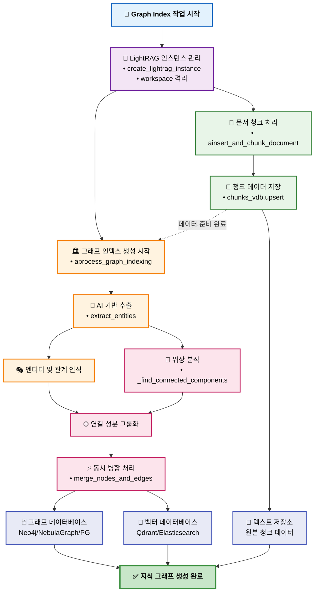
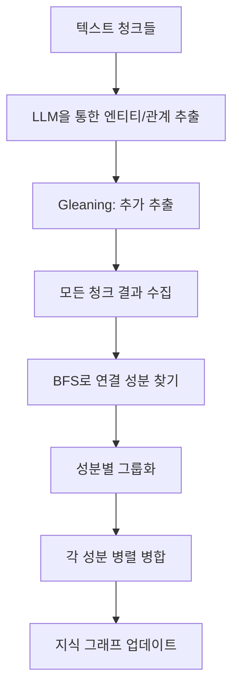
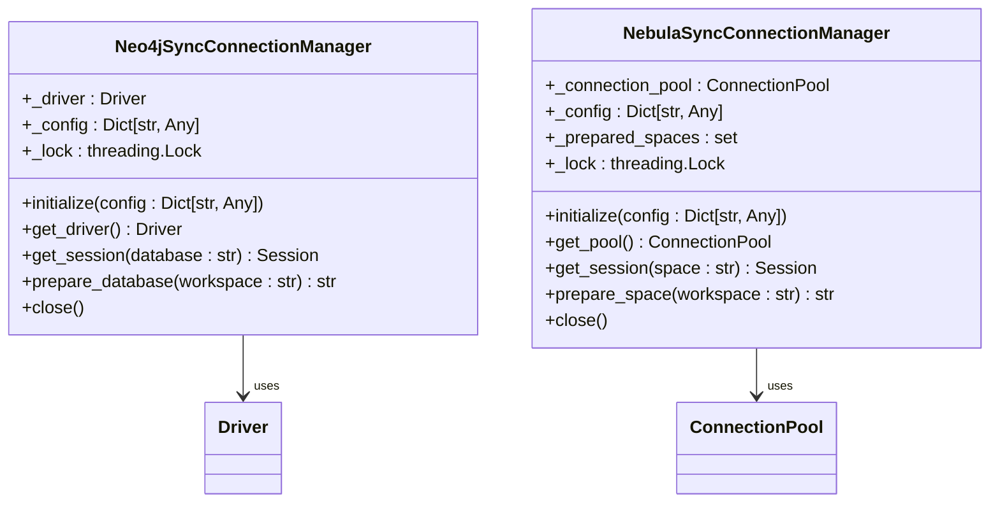

# 그래프 데이터 아키텍처

<cite>
**이 문서에서 참조한 파일**  
- [lightrag.py](file://aperag/graph/lightrag/lightrag.py)
- [neo4j_sync_manager.py](file://aperag/db/neo4j_sync_manager.py)
- [nebula_sync_manager.py](file://aperag/db/nebula_sync_manager.py)
- [graph_index.py](file://aperag/index/graph_index.py)
- [graph_service.py](file://aperag/service/graph_service.py)
</cite>

## 목차
1. [소개](#소개)
2. [LightRAG 기반 지식 그래프 구조](#lightrag-기반-지식-그래프-구조)
3. [엔티티 추출 및 관계 맺기 과정](#엔티티-추출-및-관계-맺기-과정)
4. [컨텍스트 생성 및 경로 탐색](#컨텍스트-생성-및-경로-탐색)
5. [데이터 동기화 메커니즘](#데이터-동기화-메커니즘)
6. [그래프 스키마 설계 및 레이블 전략](#그래프-스키마-설계-및-레이블-전략)
7. [고성능 쿼리를 위한 인덱스 전략](#고성능-쿼리를-위한-인덱스-전략)
8. [운영 환경 구성: Neo4j Helm 차트](#운영-환경-구성-neo4j-helm-차트)
9. [결론](#결론)

## 소개
ApeRAG은 LightRAG을 기반으로 한 고성능 지식 그래프 아키텍처를 제공합니다. 이 시스템은 문서 내의 엔티티와 관계를 추출하여 Neo4j 또는 NebulaGraph와 같은 그래프 데이터베이스에 저장하고, 벡터 인덱스 및 관계형 DB와의 동기화를 통해 다중 모드 검색을 지원합니다. 본 문서는 ApeRAG의 핵심 구성 요소인 `lightrag.py`, `neo4j_sync_manager.py`, `nebula_sync_manager.py`를 중심으로 그래프 데이터 처리 흐름과 운영 구조를 설명합니다.

## LightRAG 기반 지식 그래프 구조
ApeRAG은 원본 LightRAG의 제약사항을 해결하고 프로덕션 환경에 적합하도록 심층적으로 리팩토링되었습니다. 주요 변경 사항은 다음과 같습니다:

- **무상태 아키텍처**: 각 작업은 독립적인 LightRAG 인스턴스를 생성하여 글로벌 상태 의존성을 제거하고 진정한 동시성을 지원합니다.
- **워크스페이스 기반 격리**: `workspace` 개념을 도입하여 서로 다른 컬렉션 간 데이터 충돌 없이 독립된 지식 그래프를 유지할 수 있습니다.
- **모듈화된 처리 파이프라인**: 문서 삽입(`ainsert_and_chunk_document`)과 그래프 인덱싱(`aprocess_graph_indexing`)을 분리하여 유연한 처리와 유지보수성을 확보했습니다.

**다이어그램 소스**
- [lightrag.py](file://aperag/graph/lightrag/lightrag.py#L34-L98)
- [graph_index.py](file://aperag/index/graph_index.py#L233-L263)

**섹션 소스**
- [lightrag.py](file://aperag/graph/lightrag/lightrag.py#L1-L100)
- [CHANGELOG.md](file://aperag/graph/lightrag/CHANGELOG.md#L0-L318)

## 엔티티 추출 및 관계 맺기 과정
엔티티 추출과 관계 맺기는 `lightrag.py` 내부의 `extract_entities` 및 `merge_nodes_and_edges` 함수를 통해 수행됩니다.

### 1. 엔티티 추출 (extract_entities)
- **병렬 처리 전략**: LLM 호출 수를 제한하기 위해 세마포어를 사용하며, 각 텍스트 청크를 독립적으로 처리합니다.
- **다단계 추출 메커니즘(Gleaning)**: 초기 추출 후, 누락된 엔티티를 보완하기 위해 추가 추출 단계를 수행합니다. LLM이 더 이상 추출할 항목이 없다고 판단할 때까지 반복합니다.
- **출력 형식**: 추출된 엔티티는 이름, 유형, 설명, 소스 ID 등을 포함하는 딕셔너리 형태로 반환되며, 관계는 소스-타겟 쌍과 가중치, 설명으로 구성됩니다.

### 2. 엔티티 병합 및 관계 통합 (merge_nodes_and_edges)
- **교차 청크 데이터 수집**: 모든 청크에서 추출된 동일한 이름의 엔티티와 관계를 수집합니다.
- **연결 성분 최적화**: BFS(너비 우선 탐색) 알고리즘을 사용해 엔티티 간의 연결 관계를 분석하고, 관련성이 높은 엔티티 그룹(연결 성분)을 형성합니다.
- **병렬 병합 처리**: 각 연결 성분을 독립적으로 병합 처리하여 잠재적인 데드락을 방지하고 성능을 극대화합니다.
- **가중치 누적**: 동일한 관계가 여러 번 등장하면 가중치를 누적하여 관계의 중요도를 반영합니다.

**다이어그램 소스**
- [lightrag.py](file://aperag/graph/lightrag/lightrag.py#L34-L98)
- [lightrag_entity_extraction_and_merging.md](file://docs/design/lightrag_entity_extraction_and_merging.md#L0-L361)

**섹션 소스**
- [lightrag.py](file://aperag/graph/lightrag/lightrag.py#L34-L98)
- [lightrag_entity_extraction_and_merging.md](file://docs/design/lightrag_entity_extraction_and_merging.md#L0-L361)

## 컨텍스트 생성 및 경로 탐색
지식 그래프는 질의 응답(Q&A) 시 정확한 컨텍스트를 생성하는 데 핵심적인 역할을 합니다.

- **컨텍스트 생성**: `build_query_context` 함수는 사용자 질의와 일치하는 엔티티 및 관계를 그래프에서 검색하여, LLM이 답변을 생성할 수 있는 풍부한 컨텍스트를 제공합니다.
- **경로 탐색 활용 사례**: 
  - **직접 연결**: 두 엔티티 간의 직접적인 관계를 찾습니다 (예: "John은 어떤 회사에서 일하나요?").
  - **간접 연결**: 중간 엔티티를 통해 연결된 경로를 탐색합니다 (예: "John과 Product Department 사이의 관계는 무엇인가요?").
  - **최단 경로**: 가장 짧은 경로를 찾아 정보의 연관성을 효율적으로 파악합니다.
  - **높은 가중치 경로**: 가중치가 높은 관계를 우선시하여 가장 중요한 연결을 강조합니다.

이러한 경로 탐색은 `kg_query` 함수를 통해 실행되며, 복잡한 질문에 대한 깊이 있는 답변을 가능하게 합니다.

**섹션 소스**
- [lightrag.py](file://aperag/graph/lightrag/lightrag.py#L34-L98)

## 데이터 동기화 메커니즘
ApeRAG은 그래프 데이터베이스와 다른 저장소 간의 데이터 일관성을 유지하기 위해 동기화 매니저를 사용합니다.

### 1. Neo4j 동기화 매니저 (neo4j_sync_manager.py)
- **게으른 로딩(Lazy Loading)**: 워커 프로세스 내에서 처음 사용될 때만 드라이버를 초기화하여 불필요한 리소스 할당을 피합니다.
- **워커 수준 재사용**: 동일한 워커 내의 모든 작업이 하나의 공유 드라이버 인스턴스를 사용하여 연결 풀을 효율적으로 활용합니다.
- **스레드 안전성**: `threading.Lock`을 사용하여 초기화 과정에서 스레드 간 충돌을 방지합니다.
- **자동 정리**: 프로세스 종료 시 연결이 자동으로 닫힙니다.

### 2. NebulaGraph 동기화 매니저 (nebula_sync_manager.py)
- **연결 풀 관리**: `ConnectionPool`을 사용하여 고성능 네뷸라 클러스터와의 안정적인 연결을 유지합니다.
- **스페이스 준비 최적화**: `prepare_space` 함수는 지정된 워크스페이스에 해당하는 네뷸라 스페이스를 생성하거나 확인하고, 필요한 경우 스키마(태그 및 에지)를 설정합니다.
- **빠른 경로 체크**: 이미 준비된 스페이스는 캐시되어 다음 요청 시 즉시 반환됩니다.
- **신뢰성 있는 스키마 준비**: 스페이스 생성 후, 실제 데이터 삽입 테스트를 통해 스키마가 완전히 준비되었는지 확인합니다.

**다이어그램 소스**
- [neo4j_sync_manager.py](file://aperag/db/neo4j_sync_manager.py#L27-L154)
- [nebula_sync_manager.py](file://aperag/db/nebula_sync_manager.py#L50-L344)

**섹션 소스**
- [neo4j_sync_manager.py](file://aperag/db/neo4j_sync_manager.py#L1-L168)
- [nebula_sync_manager.py](file://aperag/db/nebula_sync_manager.py#L1-L358)

## 그래프 스키마 설계 및 레이블 전략
ApeRAG은 다양한 백엔드에 대해 일관된 스키마를 설계합니다.

### 1. 노드 및 엣지 레이블 전략
- **노드 레이블**: 기본적으로 `base`라는 태그를 사용하며, `entity_type` 속성으로 엔티티의 유형(예: Person, Organization)을 구분합니다.
- **엣지 레이블**: 방향성 있는 관계를 나타내기 위해 `DIRECTED`라는 에지를 사용합니다. 관계의 의미는 `keywords` 속성에 저장됩니다.

### 2. 속성 설계
- **공통 속성**: 모든 노드와 엣지는 `entity_id`, `source_id`, `file_path`, `created_at` 등의 공통 속성을 갖습니다.
- **노드 특화 속성**: `description`, `entity_type`
- **엣지 특화 속성**: `weight`(관계 강도), `keywords`(관계 키워드)

이러한 설계는 유연성과 확장성을 제공하며, 다양한 도메인의 지식을 표현할 수 있게 합니다.

**섹션 소스**
- [models.py](file://aperag/db/models.py#L870-L895)
- [nebula_sync_manager.py](file://aperag/db/nebula_sync_manager.py#L50-L344)

## 고성능 쿼리를 위한 인덱스 전략
효율적인 쿼리 성능을 보장하기 위해 다양한 인덱스가 적용됩니다.

- **Neo4j**: `CREATE INDEX IF NOT EXISTS FOR (n:base) ON (n.entity_id)` 명령어를 통해 `entity_id` 속성에 인덱스를 생성합니다.
- **NebulaGraph**: `CREATE TAG INDEX IF NOT EXISTS base_entity_id_index ON base(entity_id(256))` 명령어를 사용하여 `entity_id` 필드에 인덱스를 생성합니다.
- **PostgreSQL**: SQLAlchemy ORM을 통해 `idx_lightrag_graph_nodes_workspace_entity_id`와 같은 복합 인덱스를 생성합니다.

이러한 인덱스는 엔티티 조회, 관계 탐색, 워크스페이스 기반 필터링 등의 작업을 크게 가속화합니다.

**섹션 소스**
- [neo4j_sync_manager.py](file://aperag/db/neo4j_sync_manager.py#L27-L154)
- [nebula_sync_manager.py](file://aperag/db/nebula_sync_manager.py#L50-L344)
- [models.py](file://aperag/db/models.py#L870-L895)

## 운영 환경 구성: Neo4j Helm 차트
ApeRAG은 Kubernetes 환경에서 Helm 차트를 통해 Neo4j를 배포하고 구성합니다.

- **Helm 설치**: `deploy/databases/02-install-database.sh` 스크립트는 `helm upgrade --install neo4j-cluster kubeblocks/neo4j-cluster` 명령어를 사용하여 Neo4j 클러스터를 설치합니다.
- **환경 변수 설정**: `deploy/aperag/values.yaml` 파일에서 `NEO4J_HOST`, `NEO4J_PORT`, `NEO4J_USERNAME`, `NEO4J_PASSWORD` 등의 값을 설정하거나, `NEO4J_CREDENTIALS_SECRET_NAME`을 통해 쿠버네티스 Secret에서 자격 증명을 가져옵니다.
- **배포 설정**: `deploy/aperag/templates/api-deployment.yaml` 등의 배포 파일에서 환경 변수를 컨테이너에 주입하여 애플리케이션이 Neo4j에 연결할 수 있도록 합니다.

이러한 구성은 운영 환경에서의 신뢰성과 보안을 보장합니다.

**섹션 소스**
- [values.yaml](file://deploy/aperag/values.yaml#L80-L100)
- [02-install-database.sh](file://deploy/databases/02-install-database.sh#L15-L36)
- [api-deployment.yaml](file://deploy/aperag/templates/api-deployment.yaml#L123-L153)

## 결론
ApeRAG의 그래프 데이터 아키텍처는 LightRAG의 핵심 아이디어를 바탕으로 하되, 프로덕션 환경에서의 동시성, 안정성, 유지보수성을 극대화하기 위해 심층적인 개선을 거쳤습니다. 무상태 설계, 연결 성분 기반의 병렬 처리, 그리고 Neo4j/NebulaGraph와의 효율적인 동기화 메커니즘을 통해 대규모 지식 그래프를 빠르고 안정적으로 구축할 수 있습니다. 이 아키텍처는 고급 RAG 기능을 구현하는 견고한 기반을 제공합니다.