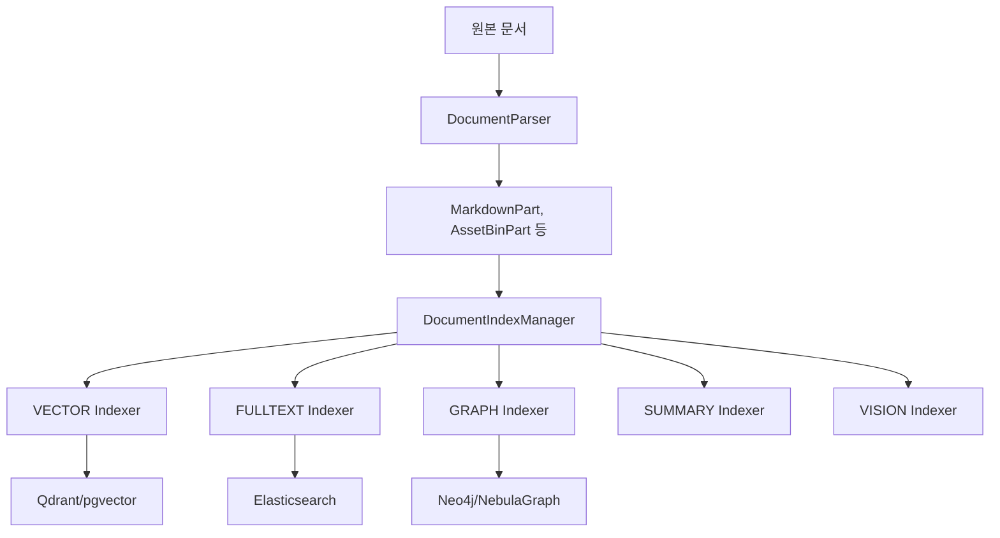
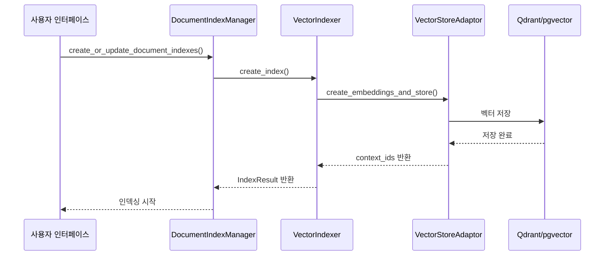
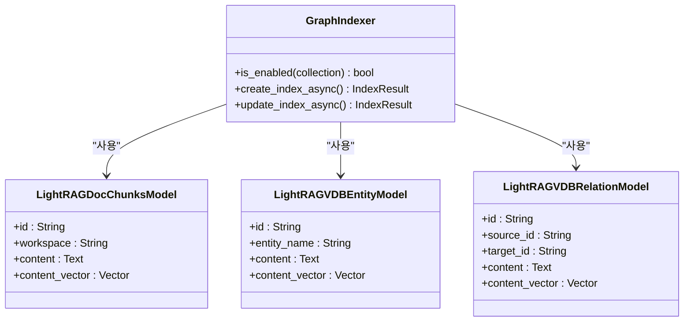
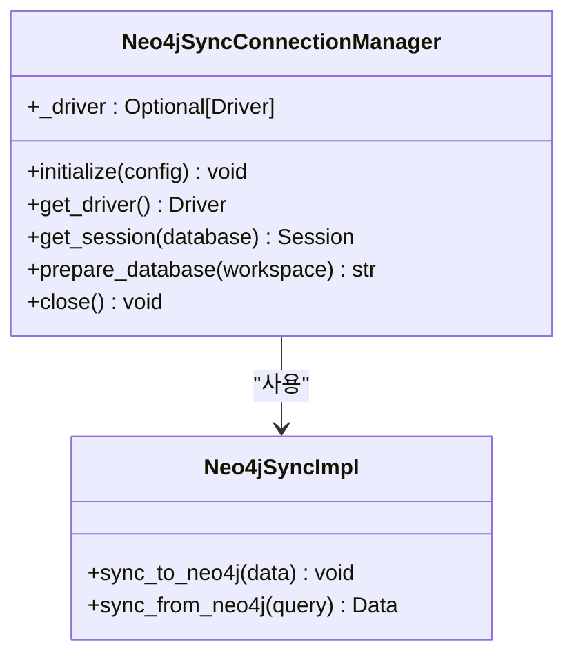

# 데이터 계층 아키텍처

<cite>
**이 문서에서 참조한 파일**  
- [document_parser.py](file://aperag/index/document_parser.py)
- [manager.py](file://aperag/index/manager.py)
- [models.py](file://aperag/db/models.py)
- [vector_index.py](file://aperag/index/vector_index.py)
- [fulltext_index.py](file://aperag/index/fulltext_index.py)
- [graph_index.py](file://aperag/index/graph_index.py)
- [neo4j_sync_manager.py](file://aperag/db/neo4j_sync_manager.py)
- [values.yaml](file://deploy/databases/postgresql/values.yaml)
- [values.yaml](file://deploy/databases/qdrant/values.yaml)
- [values.yaml](file://deploy/databases/elasticsearch/values.yaml)
- [values.yaml](file://deploy/databases/neo4j/values.yaml)
</cite>

## 목차
1. [소개](#소개)
2. [데이터 저장소 개요](#데이터-저장소-개요)
3. [문서 청크 및 인덱스 생성 프로세스](#문서-청크-및-인덱스-생성-프로세스)
4. [관계형 데이터 저장: PostgreSQL](#관계형-데이터-저장-postgresql)
5. [벡터 데이터 저장: Qdrant 또는 pgvector](#벡터-데이터-저장-qdrant-또는-pgvector)
6. [그래프 데이터 저장: Neo4j 또는 NebulaGraph](#그래프-데이터-저장-neo4j-또는-nebulagraph)
7. [전체 텍스트 검색: Elasticsearch](#전체-텍스트-검색-elasticsearch)
8. [저장소 간 동기화 메커니즘](#저장소-간-동기화-메커니즘)
9. [배포 구성: Helm 차트](#배포-구성-helm-차트)

## 소개
ApeRAG은 다양한 유형의 데이터를 효율적으로 저장하고 검색하기 위해 다중 데이터 저장소 아키텍처를 채택하고 있습니다. 이 문서는 ApeRAG의 데이터 계층 구조를 설명하며, 각 저장소의 역할과 선택 이유, 문서 청크가 다양한 인덱스 유형으로 변환되는 과정, 저장소 간의 동기화 메커니즘, 그리고 Helm 차트를 통한 배포 구성 방법을 포함합니다.

## 데이터 저장소 개요
ApeRAG은 네 가지 주요 데이터 저장소를 사용하여 서로 다른 데이터 유형과 검색 요구 사항을 처리합니다:
- **PostgreSQL**: 관계형 데이터를 SQLModel 기반 ORM으로 저장합니다.
- **Qdrant 또는 pgvector**: 벡터 데이터를 저장합니다.
- **Neo4j 또는 NebulaGraph**: 그래프 데이터를 LightRAG 형식으로 저장합니다.
- **Elasticsearch**: 전체 텍스트 검색을 수행합니다.

각 저장소는 특정 작업에 최적화되어 있으며, 함께 작동하여 강력한 RAG(Retrieval-Augmented Generation) 시스템을 제공합니다.

## 문서 청크 및 인덱스 생성 프로세스
문서는 여러 단계를 거쳐 다양한 인덱스로 변환됩니다. 이 프로세스는 `index` 모듈을 중심으로 진행되며, 다음과 같은 주요 컴포넌트로 구성됩니다.



**Diagram sources**
- [document_parser.py](file://aperag/index/document_parser.py#L0-L271)
- [manager.py](file://aperag/index/manager.py#L0-L105)
- [vector_index.py](file://aperag/index/vector_index.py#L0-L241)
- [fulltext_index.py](file://aperag/index/fulltext_index.py#L0-L576)
- [graph_index.py](file://aperag/index/graph_index.py#L0-L264)

**Section sources**
- [document_parser.py](file://aperag/index/document_parser.py#L0-L271)
- [manager.py](file://aperag/index/manager.py#L0-L105)

## 관계형 데이터 저장: PostgreSQL
관계형 데이터는 PostgreSQL 데이터베이스에 저장되며, SQLModel ORM을 통해 접근됩니다. 주요 엔티티는 `db.models` 모듈에 정의되어 있으며, 다음 표와 같습니다.

| 테이블 이름 | 주요 컬럼 | 설명 |
|------------|---------|------|
| `collection` | id, title, user, status | 문서 컬렉션 정보 |
| `document` | id, name, collection_id, status | 문서 메타데이터 |
| `document_index` | document_id, index_type, status, version | 문서별 인덱스 상태 |
| `lightrag_doc_chunks` | id, workspace, content, content_vector | 문서 청크 및 벡터 임베딩 |

`DocumentIndexType` 열거형은 인덱스 유형(VECTOR, FULLTEXT, GRAPH, SUMMARY, VISION)을 정의하며, `DocumentIndexStatus`는 인덱스의 수명 주기 상태(PENDING, CREATING, ACTIVE, DELETING 등)를 관리합니다.

**Section sources**
- [models.py](file://aperag/db/models.py#L104-L122)

## 벡터 데이터 저장: Qdrant 또는 pgvector
벡터 데이터는 `vector_index.py` 모듈의 `VectorIndexer` 클래스를 통해 생성되고 관리됩니다. 이 인덱서는 문서 청크로부터 임베딩을 생성하고 이를 벡터 데이터베이스에 저장합니다.



임베딩 생성에는 `llm.embed.embedding_service`가 사용되며, 결과는 `generate_vector_db_collection_name()` 함수에 의해 생성된 컬렉션 이름으로 저장됩니다.

**Diagram sources**
- [vector_index.py](file://aperag/index/vector_index.py#L0-L241)

**Section sources**
- [vector_index.py](file://aperag/index/vector_index.py#L0-L241)

## 그래프 데이터 저장: Neo4j 또는 NebulaGraph
그래프 데이터는 `graph_index.py` 모듈의 `GraphIndexer` 클래스를 통해 비동기적으로 처리됩니다. 그래프 인덱싱은 LightRAG 형식을 따르며, `lightrag_doc_chunks`, `lightrag_vdb_entity`, `lightrag_vdb_relation` 테이블에 데이터를 저장합니다.



그래프 인덱싱은 컬렉션 설정에서 `enable_knowledge_graph` 옵션이 활성화된 경우에만 수행됩니다.

**Diagram sources**
- [graph_index.py](file://aperag/index/graph_index.py#L0-L264)
- [models.py](file://aperag/db/models.py#L704-L753)

**Section sources**
- [graph_index.py](file://aperag/index/graph_index.py#L0-L264)

## 전체 텍스트 검색: Elasticsearch
전체 텍스트 검색은 `fulltext_index.py` 모듈의 `FulltextIndexer` 클래스를 통해 수행됩니다. 이 인덱서는 문서 청크를 재청크화하고 Elasticsearch에 저장합니다.

```mermaid
flowchart LR
A[문서 청크] --> B[rechunk()]
B --> C[IK Analyzer]
C --> D[Elasticsearch]
D --> E[match 쿼리]
E --> F[검색 결과]
```

Elasticsearch 인덱스는 `generate_fulltext_index_name()` 함수에 의해 생성된 이름을 가지며, `ik_max_word` 및 `ik_smart` 분석기를 사용하여 중국어 텍스트를 처리합니다. 키워드 추출은 IK 분석기 또는 LLM을 사용할 수 있으며, 후자는 `LLMKeywordExtractor` 클래스를 통해 구현됩니다.

**Diagram sources**
- [fulltext_index.py](file://aperag/index/fulltext_index.py#L0-L576)

**Section sources**
- [fulltext_index.py](file://aperag/index/fulltext_index.py#L0-L576)

## 저장소 간 동기화 메커니즘
다양한 저장소 간의 데이터 일관성을 유지하기 위해 동기화 메커니즘이 필요합니다. Neo4j의 경우, `db.neo4j_sync_manager` 모듈의 `Neo4jSyncConnectionManager` 클래스가 연결 관리를 담당합니다.



이 매니저는 워커/프로세스 수준의 연결 재사용을 제공하며, 지연 로딩을 통해 초기화 시 리소스 소비를 줄입니다. 데이터베이스는 워크스페이스 이름을 기반으로 준비되며, 필요한 경우 자동으로 생성됩니다.

**Diagram sources**
- [neo4j_sync_manager.py](file://aperag/db/neo4j_sync_manager.py#L0-L167)

**Section sources**
- [neo4j_sync_manager.py](file://aperag/db/neo4j_sync_manager.py#L0-L167)

## 배포 구성: Helm 차트
ApeRAG은 Kubernetes 환경에서 Helm 차트를 통해 배포되며, 각 데이터 저장소는 별도의 Helm 차트로 관리됩니다. 구성은 `deploy/databases` 디렉토리의 `values.yaml` 파일을 통해 이루어집니다.

### PostgreSQL 구성
```yaml
version: 16.4.0
mode: replication
replicas: 2
cpu: 0.5
memory: 0.5
storage: 5
```

### Qdrant 구성
```yaml
version: 1.10.0
replicas: 1
cpu: 0.5
memory: 0.5
storage: 20
```

### Elasticsearch 구성
```yaml
version: "8.8.2"
mode: single-node
replicas: 1
cpu: 0.5
memory: 1
storage: 5
extra:
  disableExporter: true
```

### Neo4j 구성
```yaml
version: 5.26.5
mode: singlealone
cpu: 2
memory: 4
storage: 20
replicas: 1
```

이러한 구성 파일은 각 데이터베이스의 버전, 복제본 수, CPU, 메모리, 스토리지 용량을 정의하며, `terminationPolicy: Delete`를 통해 삭제 정책을 설정합니다.

**Section sources**
- [values.yaml](file://deploy/databases/postgresql/values.yaml#L0-L33)
- [values.yaml](file://deploy/databases/qdrant/values.yaml#L0-L31)
- [values.yaml](file://deploy/databases/elasticsearch/values.yaml#L0-L36)
- [values.yaml](file://deploy/databases/neo4j/values.yaml#L0-L46)