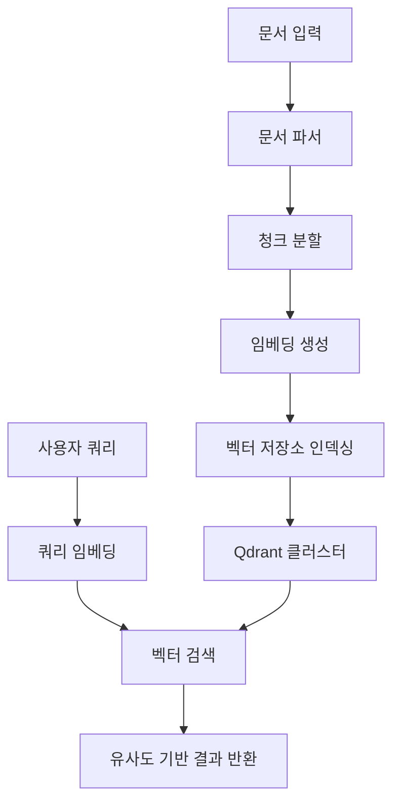
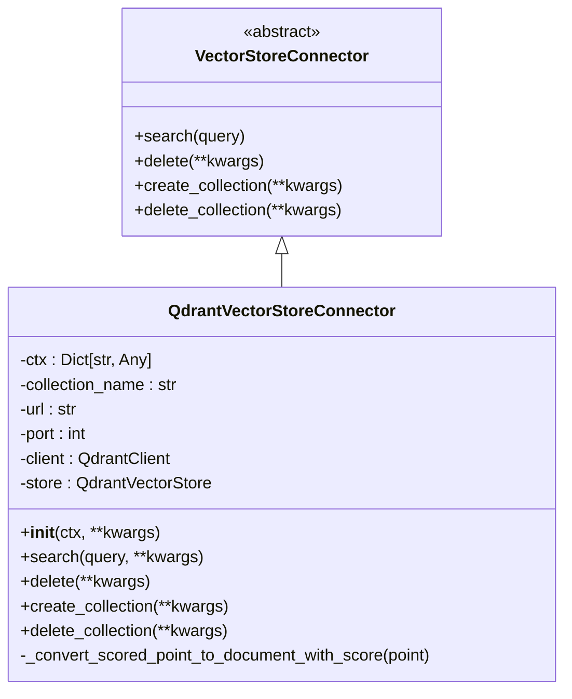
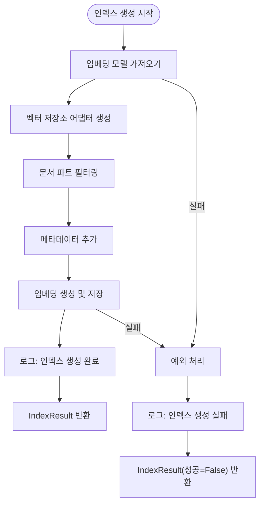
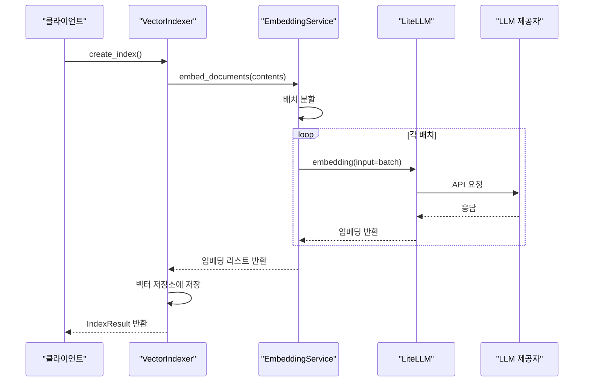
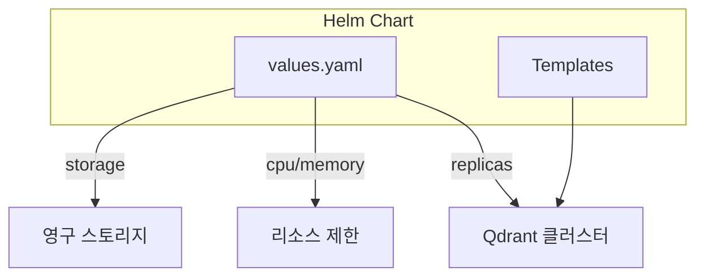

# 벡터 데이터 아키텍처

<cite>
**이 문서에서 참조한 파일**
- [qdrant_connector.py](file://aperag/vectorstore/qdrant_connector.py)
- [vector_index.py](file://aperag/index/vector_index.py)
- [embedding_service.py](file://aperag/llm/embed/embedding_service.py)
- [base_embedding.py](file://aperag/llm/embed/base_embedding.py)
- [image_parser.py](file://aperag/docparser/image_parser.py)
- [values.yaml](file://deploy/databases/qdrant/values.yaml)
</cite>

## 목차
1. [소개](#소개)
2. [벡터 저장소 아키텍처 개요](#벡터-저장소-아키텍처-개요)
3. [Qdrant 연결 및 CRUD 작업](#qdrant-연결-및-crud-작업)
4. [임베딩 생성 및 인덱싱 프로세스](#임베딩-생성-및-인덱싱-프로세스)
5. [멀티모달 이미지 임베딩 처리](#멀티모달-이미지-임베딩-처리)
6. [LiteLLM을 통한 LLM 통합](#litellm을-통한-llm-통합)
7. [벡터 검색 최적화 파라미터](#벡터-검색-최적화-파라미터)
8. [배포 및 확장성 전략](#배포-및-확장성-전략)
9. [결론](#결론)

## 소개
ApeRAG은 의미 기반 문서 검색을 위해 Qdrant 또는 pgvector 기반의 벡터 저장소를 활용하는 고급 RAG(Retrieval-Augmented Generation) 시스템입니다. 본 문서는 ApeRAG의 핵심 구성 요소인 벡터 데이터 아키텍처를 설명하며, 특히 Qdrant와의 통합, 임베딩 생성 및 인덱싱 프로세스, 멀티모달 지원, LiteLLM 통합, 성능 최적화 및 배포 전략에 대해 다룹니다.

## 벡터 저장소 아키텍처 개요
ApeRAG은 `vectorstore` 모듈을 통해 벡터 저장소와의 추상화된 인터페이스를 제공합니다. 이 아키텍처는 다양한 벡터 데이터베이스를 유연하게 지원할 수 있도록 설계되었으며, 현재는 Qdrant가 주요 백엔드로 구현되어 있습니다. 벡터 인덱싱은 `index` 모듈 내 `vector_index.py`에서 관리되며, 문서 청크를 의미 기반으로 검색 가능하게 만듭니다.

**Diagram sources**
- [vector_index.py](file://aperag/index/vector_index.py#L40-L236)
- [qdrant_connector.py](file://aperag/vectorstore/qdrant_connector.py#L17-L99)

**Section sources**
- [vector_index.py](file://aperag/index/vector_index.py#L1-L242)
- [qdrant_connector.py](file://aperag/vectorstore/qdrant_connector.py#L1-L115)

## Qdrant 연결 및 CRUD 작업
`qdrant_connector.py`는 Qdrant 클러스터와의 연결을 담당하는 핵심 컴포넌트입니다. `QdrantVectorStoreConnector` 클래스는 초기화 시 컨텍스트 정보를 바탕으로 Qdrant 클라이언트를 설정하고, 컬렉션 이름, URL, 포트, 벡터 크기, 거리 측정 방식 등을 구성합니다.

CRUD 작업은 다음과 같이 수행됩니다:
- **생성(create)**: `create_collection()` 메서드를 통해 새로운 컬렉션을 생성합니다.
- **읽기(search)**: `search()` 메서드는 쿼리 임베딩을 사용해 유사한 벡터를 검색합니다.
- **삭제(delete)**: `delete()` 메서드는 지정된 ID의 벡터를 삭제합니다.
- **수정(update)**: 기존 벡터를 삭제한 후 새 벡터를 삽입하여 간접적으로 업데이트합니다.

**Diagram sources**
- [qdrant_connector.py](file://aperag/vectorstore/qdrant_connector.py#L17-L99)

**Section sources**
- [qdrant_connector.py](file://aperag/vectorstore/qdrant_connector.py#L1-L115)

## 임베딩 생성 및 인덱싱 프로세스
벡터 인덱싱은 `vector_index.py`의 `VectorIndexer` 클래스에 의해 관리됩니다. 이 프로세스는 다음과 같은 단계로 이루어집니다:

1. **임베딩 모델 가져오기**: `get_collection_embedding_service_sync()`를 호출하여 컬렉션에 설정된 임베딩 서비스를 가져옵니다.
2. **벡터 저장소 어댑터 생성**: `get_vector_db_connector()`를 사용해 Qdrant 연결을 설정합니다.
3. **문서 청크 필터링**: 텍스트 콘텐츠가 있는 파트만 선택합니다.
4. **메타데이터 추가**: 각 파트에 "indexer": "vector" 메타데이터를 추가합니다.
5. **임베딩 생성 및 저장**: `create_embeddings_and_store()` 함수를 통해 청크별 임베딩을 생성하고 벡터 저장소에 저장합니다.

**Diagram sources**
- [vector_index.py](file://aperag/index/vector_index.py#L40-L98)

**Section sources**
- [vector_index.py](file://aperag/index/vector_index.py#L40-L236)

## 멀티모달 이미지 임베딩 처리
ApeRAG은 `image_parser.py`를 통해 이미지 파일의 텍스트 추출을 지원합니다. 이미지에서 OCR(Optical Character Recognition)을 수행하여 텍스트를 추출한 후, 이를 일반 텍스트 문서처럼 처리합니다. 이후 `embedding_service.py`에서 multimodal 플래그가 활성화된 경우, 해당 이미지의 base64 인코딩된 버전을 직접 임베딩 모델에 전달할 수 있습니다.

이 과정은 다음과 같습니다:
1. 이미지를 base64로 인코딩
2. PaddleOCR 서버에 POST 요청 전송
3. 응답에서 텍스트 추출
4. 추출된 텍스트를 문서 파트로 변환
5. 표준 벡터 인덱싱 프로세스 적용

**Section sources**
- [image_parser.py](file://aperag/docparser/image_parser.py#L1-L75)

## LiteLLM을 통한 LLM 통합
ApeRAG은 `EmbeddingService` 클래스를 통해 LiteLLM을 활용하여 다양한 LLM 제공자와 통합합니다. 이 서비스는 `custom_llm_provider`, `model`, `api_base`, `api_key` 등의 설정을 바탕으로 동적으로 임베딩 API를 호출합니다.

주요 기능:
- **배치 처리**: 여러 문서를 병렬로 임베딩
- **캐싱**: 반복 요청에 대한 응답 캐싱
- **에러 래핑**: 공통 에러 타입으로 변환
- **다중 스레드 실행**: ThreadPoolExecutor를 사용한 동시 처리

**Diagram sources**
- [embedding_service.py](file://aperag/llm/embed/embedding_service.py#L50-L206)
- [base_embedding.py](file://aperag/llm/embed/base_embedding.py#L150-L227)

**Section sources**
- [embedding_service.py](file://aperag/llm/embed/embedding_service.py#L1-L207)
- [base_embedding.py](file://aperag/llm/embed/base_embedding.py#L1-L228)

## 벡터 검색 최적화 파라미터
`QdrantVectorStoreConnector.search()` 메서드는 다양한 검색 파라미터를 지원하여 정확도와 성능을 조정할 수 있습니다:
- **consistency**: 일관성 수준 ("majority", "all", "quorum")
- **score_threshold**: 유사도 점수 임계값 (기본값: 0.1)
- **limit**: 반환할 결과 수 (top_k)
- **filter**: 메타데이터 기반 필터링 조건
- **search_params**: 검색 알고리즘 파라미터

이러한 파라미터들은 검색 정확도와 응답 시간 사이의 트레이드오프를 조절하는 데 사용됩니다.

**Section sources**
- [qdrant_connector.py](file://aperag/vectorstore/qdrant_connector.py#L50-L73)

## 배포 및 확장성 전략
ApeRAG은 Helm 차트를 통해 Qdrant 클러스터를 배포하며, `deploy/databases/qdrant/values.yaml` 파일에서 리소스 설정을 관리합니다. 주요 설정 항목:
- **replicas**: 복제본 수 (기본값: 1)
- **cpu**: CPU 코어 할당량 (기본값: 0.5)
- **memory**: 메모리 할당량 (기본값: 0.5Gi)
- **storage**: 스토리지 크기 (기본값: 20Gi)

이 설정을 통해 워크로드에 따라 Qdrant 클러스터를 수평 확장하거나 리소스를 조정할 수 있습니다.

**Diagram sources**
- [values.yaml](file://deploy/databases/qdrant/values.yaml#L1-L31)

**Section sources**
- [values.yaml](file://deploy/databases/qdrant/values.yaml#L1-L32)

## 결론
ApeRAG의 벡터 데이터 아키텍처는 Qdrant와의 긴밀한 통합을 통해 고성능 의미 기반 검색을 제공합니다. `qdrant_connector.py`는 안정적인 CRUD 인터페이스를 제공하며, `vector_index.py`는 문서 청크의 효율적인 인덱싱을 담당합니다. 멀티모달 지원과 LiteLLM 기반의 다양한 LLM 통합은 시스템의 유연성을 높이며, Helm 기반 배포 전략은 운영 환경에서의 확장성을 보장합니다. 이러한 아키텍처는 대규모 문서 기반 질의 응답 시스템에 적합한 기반을 제공합니다.