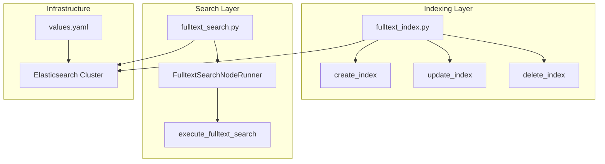
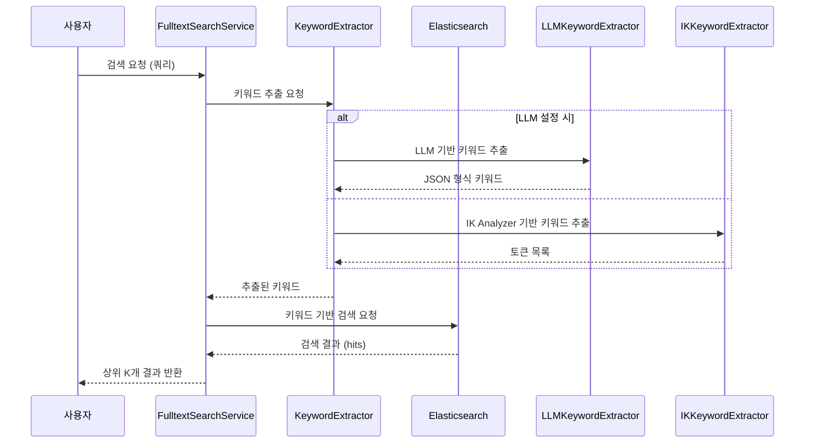
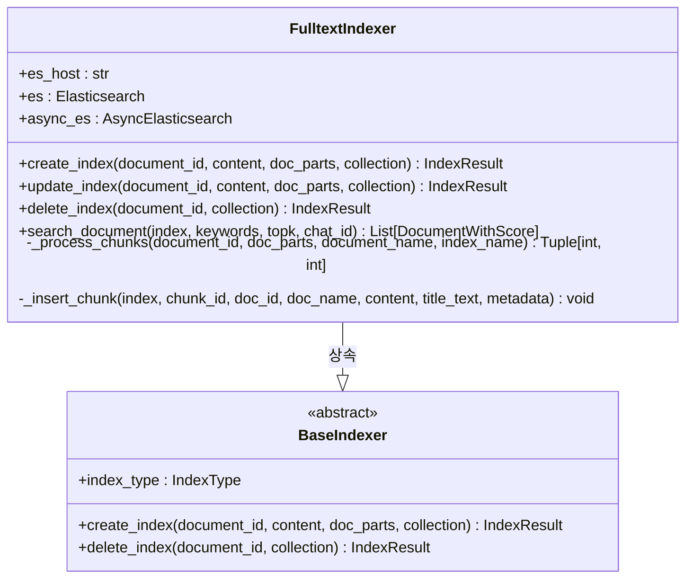
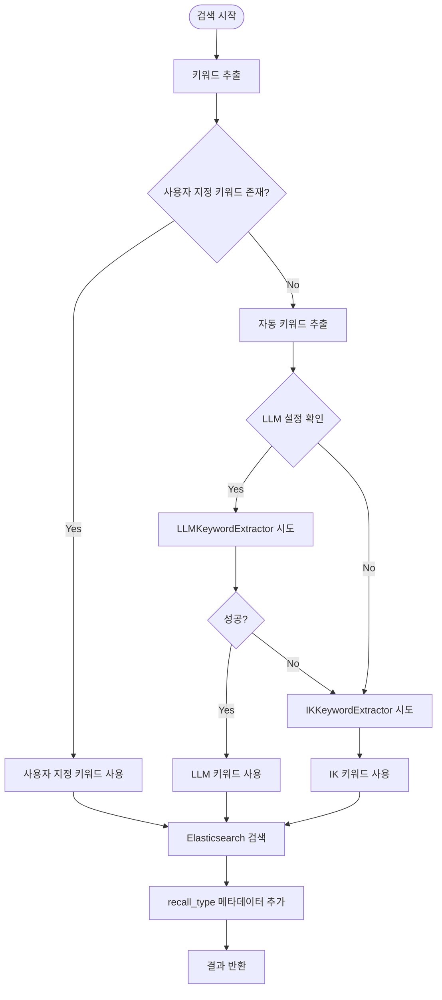
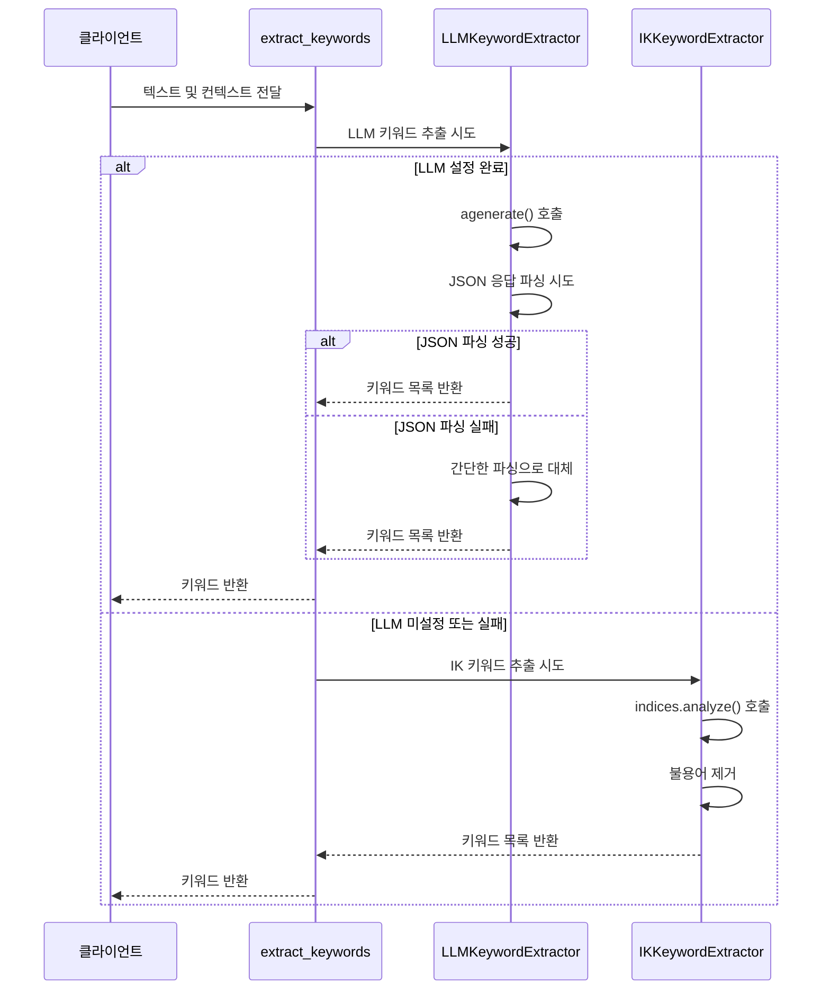
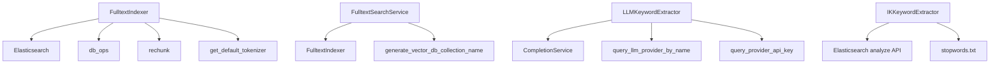

# 풀텍스트 검색 아키텍처

<cite>
**이 문서에서 참조한 파일**
- [fulltext_index.py](file://aperag/index/fulltext_index.py)
- [fulltext_search.py](file://aperag/flow/runners/fulltext_search.py)
- [values.yaml](file://deploy/databases/elasticsearch/values.yaml)
</cite>

## 목차
1. [소개](#소개)
2. [프로젝트 구조](#프로젝트-구조)
3. [핵심 구성 요소](#핵심-구성-요소)
4. [아키텍처 개요](#아키텍처-개요)
5. [상세 구성 요소 분석](#상세-구성-요소-분석)
6. [의존성 분석](#의존성-분석)
7. [성능 고려사항](#성능-고려사항)
8. [문제 해결 가이드](#문제-해결-가이드)
9. [결론](#결론)

## 소개
ApeRAG는 Elasticsearch를 기반으로 정확한 키워드 검색을 제공하는 풀텍스트 검색 아키텍처를 구현합니다. 이 문서는 `fulltext_index.py`를 통해 문서 메타데이터와 본문을 Elasticsearch에 인덱싱하는 과정과, `fulltext_search.py`를 통해 검색 쿼리를 처리하고 결과를 반환하는 흐름을 설명합니다. 또한 검색 정확도를 높이기 위한 Analyzer 설정, 색인 전략, 스코어링 메커니즘을 포함하며, 대용량 문서 처리를 위한 배치 인덱싱 전략과 Elasticsearch Helm 차트를 통한 클러스터 구성 및 리소스 최적화 방법도 다룹니다.

## 프로젝트 구조
ApeRAG의 풀텍스트 검색 관련 핵심 파일은 `aperag/index/fulltext_index.py`와 `aperag/flow/runners/fulltext_search.py`에 위치하며, Elasticsearch 클러스터 구성은 `deploy/databases/elasticsearch/values.yaml`에서 관리됩니다. 전체 아키텍처는 인덱싱, 검색, 키워드 추출이라는 세 가지 주요 기능으로 나뉩니다.

**Diagram sources**
- [fulltext_index.py](file://aperag/index/fulltext_index.py)
- [fulltext_search.py](file://aperag/flow/runners/fulltext_search.py)
- [values.yaml](file://deploy/databases/elasticsearch/values.yaml)

**Section sources**
- [fulltext_index.py](file://aperag/index/fulltext_index.py)
- [fulltext_search.py](file://aperag/flow/runners/fulltext_search.py)
- [values.yaml](file://deploy/databases/elasticsearch/values.yaml)

## 핵심 구성 요소
ApeRAG의 풀텍스트 검색 아키텍처는 세 가지 핵심 구성 요소로 이루어져 있습니다: FulltextIndexer는 문서를 청크 단위로 분할하여 Elasticsearch에 인덱싱하며, FulltextSearchService는 사용자 쿼리를 받아 검색을 수행하고, KeywordExtractor는 IK 또는 LLM 기반 방식으로 검색 키워드를 추출합니다. 이러한 구성 요소들은 Elasticsearch 클러스터와 상호작용하여 정확하고 효율적인 풀텍스트 검색을 가능하게 합니다.

**Section sources**
- [fulltext_index.py](file://aperag/index/fulltext_index.py#L1-L577)
- [fulltext_search.py](file://aperag/flow/runners/fulltext_search.py#L1-L134)

## 아키텍처 개요
ApeRAG의 풀텍스트 검색 아키텍처는 인덱싱 파이프라인과 검색 파이프라인으로 구성됩니다. 인덱싱 파이프라인에서는 문서가 파싱된 후 청크 단위로 분할되어 `ik_max_word` Analyzer를 사용해 Elasticsearch에 저장됩니다. 검색 파이프라인에서는 사용자 쿼리가 먼저 키워드 추출기를 거쳐 검색 키워드로 변환되며, 이후 `ik_smart` Analyzer를 사용해 Elasticsearch에서 관련 문서를 검색합니다. 검색 결과는 `_score` 기준으로 정렬되어 반환됩니다.

**Diagram sources**
- [fulltext_index.py](file://aperag/index/fulltext_index.py#L503-L545)
- [fulltext_search.py](file://aperag/flow/runners/fulltext_search.py#L60-L102)

## 상세 구성 요소 분석

### 인덱싱 구성 요소 분석
FulltextIndexer는 문서를 청크 단위로 분할하여 Elasticsearch에 저장하는 역할을 담당합니다. 문서는 설정된 청크 크기와 오버랩 크기에 따라 재청크화(rechunk)되며, 각 청크는 문서 ID, 청크 ID, 제목, 내용, 메타데이터와 함께 인덱스에 저장됩니다. 인덱스 생성 시에는 `ik_max_word` Analyzer가 필드별로 적용되어 다양한 수준의 토크나이징이 가능하도록 합니다.

**Diagram sources**
- [fulltext_index.py](file://aperag/index/fulltext_index.py#L119-L147)
- [fulltext_index.py](file://aperag/index/fulltext_index.py#L149-L188)
- [fulltext_index.py](file://aperag/index/fulltext_index.py#L190-L209)

**Section sources**
- [fulltext_index.py](file://aperag/index/fulltext_index.py#L1-L577)

### 검색 구성 요소 분석
FulltextSearchNodeRunner는 사용자 쿼리를 처리하여 풀텍스트 검색을 수행하는 핵심 서비스입니다. 이 컴포넌트는 시스템 입력과 사용자 입력을 받아 검색을 실행하며, 채팅 ID가 있는 경우 해당 채팅의 문서만을 대상으로 검색 범위를 좁힐 수 있습니다. 검색 결과는 recall_type 메타데이터를 추가하여 다른 검색 방식과 구분할 수 있도록 합니다.

**Diagram sources**
- [fulltext_search.py](file://aperag/flow/runners/fulltext_search.py#L60-L102)
- [fulltext_index.py](file://aperag/index/fulltext_index.py#L503-L545)

**Section sources**
- [fulltext_search.py](file://aperag/flow/runners/fulltext_search.py#L1-L134)

### 키워드 추출 구성 요소 분석
ApeRAG는 두 가지 방식의 키워드 추출기를 제공합니다. IKKeywordExtractor는 Elasticsearch의 IK Analyzer를 활용해 텍스트를 토큰화하고 불용어(stop words)를 제거하여 키워드를 추출합니다. LLMKeywordExtractor는 LLM을 사용해 구조화된 JSON 형식으로 키워드를 추출하며, 응답 파싱 실패 시 간단한 텍스트 파싱으로 대체합니다. 두 추출기는 우선순위 전략에 따라 LLM → IK 순서로 시도되며, 성공 시 즉시 반환됩니다.

**Diagram sources**
- [fulltext_index.py](file://aperag/index/fulltext_index.py#L420-L451)
- [fulltext_index.py](file://aperag/index/fulltext_index.py#L355-L373)

**Section sources**
- [fulltext_index.py](file://aperag/index/fulltext_index.py#L503-L545)

## 의존성 분석
풀텍스트 검색 아키텍처는 여러 내부 및 외부 의존성을 가지고 있습니다. 내부적으로는 `db_ops`, `docparser.chunking`, `utils.tokenizer` 등의 모듈에 의존하며, 외부적으로는 Elasticsearch 클라이언트와 LLM 서비스에 의존합니다. 특히, 키워드 추출 과정에서 LLMKeywordExtractor는 CompletionService를 통해 외부 LLM 제공자와 통신하며, IKKeywordExtractor는 Elasticsearch의 analyze API를 직접 호출합니다.

**Diagram sources**
- [fulltext_index.py](file://aperag/index/fulltext_index.py)
- [fulltext_search.py](file://aperag/flow/runners/fulltext_search.py)

**Section sources**
- [fulltext_index.py](file://aperag/index/fulltext_index.py)
- [fulltext_search.py](file://aperag/flow/runners/fulltext_search.py)

## 성능 고려사항
대용량 문서 처리를 위해 ApeRAG는 배치 인덱싱 전략을 사용합니다. 문서는 설정된 청크 크기(기본값 512)와 오버랩 크기로 분할되며, 각 청크는 독립적으로 인덱싱되어 병렬 처리가 가능합니다. Elasticsearch 클러스터는 `deploy/databases/elasticsearch/values.yaml`에서 CPU(0.5코어), 메모리(1Gi), 스토리지(5Gi)로 구성되며, single-node 모드로 운영됩니다. 검색 성능을 위해 `minimum_should_match: 80%` 설정을 통해 부분 일치도 고려하면서도 정확도를 유지합니다.

**Section sources**
- [values.yaml](file://deploy/databases/elasticsearch/values.yaml)
- [fulltext_index.py](file://aperag/index/fulltext_index.py#L69-L96)

## 문제 해결 가이드
풀텍스트 검색에서 발생할 수 있는 주요 문제는 인덱스 미존재, 키워드 추출 실패, Elasticsearch 연결 오류 등입니다. 로그 레벨을 INFO 이상으로 설정하면 각 단계에서의 진행 상황과 오류를 확인할 수 있습니다. 특히, `extract_keywords` 함수는 LLM 추출기 실패 시 자동으로 IK 추출기로 폴백(fallback)하므로, 하나의 추출기 오류가 전체 검색 실패로 이어지지 않습니다. 인덱스 생성 시에는 `create_index` 함수가 이미 존재하는 인덱스에 대해 경고를 기록하지만, 작업을 중단하지 않도록 설계되어 있습니다.

**Section sources**
- [fulltext_index.py](file://aperag/index/fulltext_index.py#L503-L545)
- [fulltext_index.py](file://aperag/index/fulltext_index.py#L253-L307)

## 결론
ApeRAG의 풀텍스트 검색 아키텍처는 Elasticsearch를 중심으로 정교한 인덱싱과 검색 기능을 제공합니다. IK Analyzer와 LLM을 결합한 키워드 추출 전략은 다양한 언어와 도메인에 적응할 수 있는 유연성을 제공하며, 청크 기반 인덱싱과 `_score` 기반 정렬은 정확한 검색 결과를 보장합니다. Helm 차트를 통한 클러스터 구성은 배포와 확장을 용이하게 하며, 전체 시스템은 대규모 문서 집합에서도 안정적인 성능을 유지할 수 있도록 설계되었습니다.