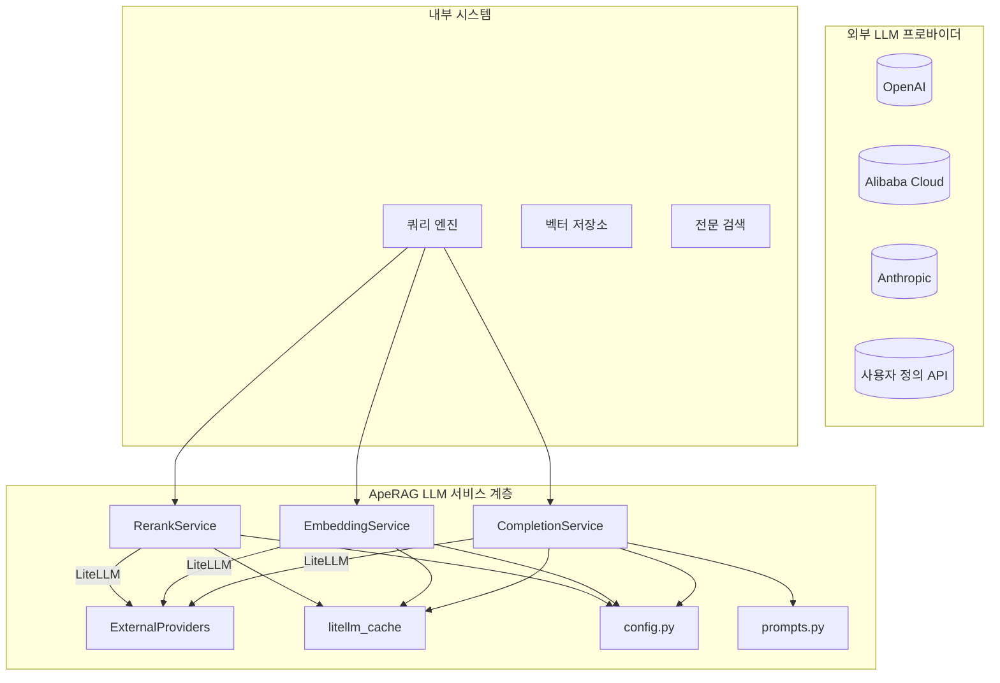
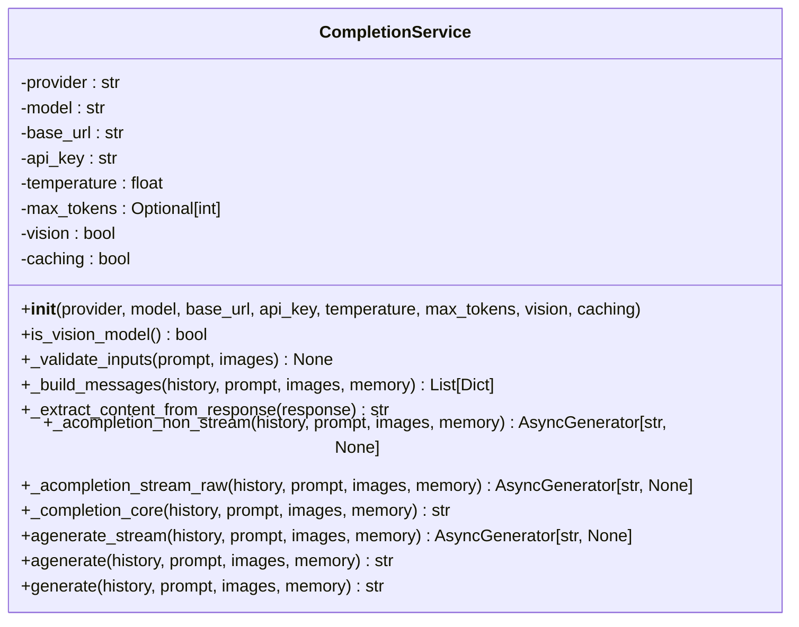
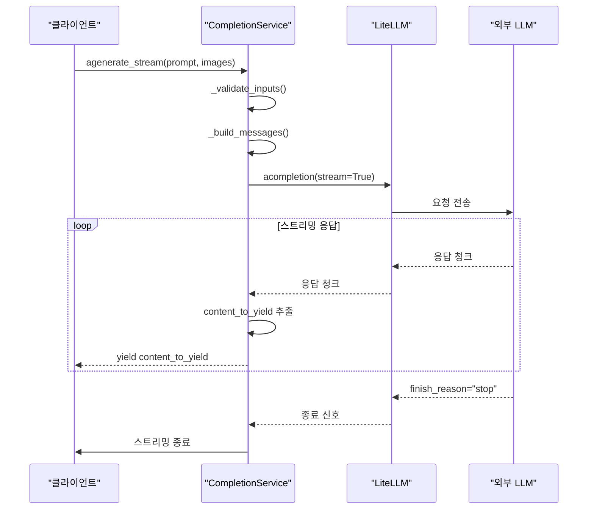
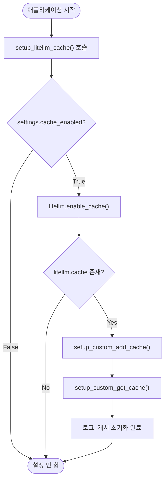

# LLM 서비스

<cite>
**이 문서에서 참조한 파일**
- [completion_service.py](file://aperag/llm/completion/completion_service.py)
- [litellm_cache.py](file://aperag/llm/litellm_cache.py)
- [embedding_service.py](file://aperag/llm/embed/embedding_service.py)
- [rerank_service.py](file://aperag/llm/rerank/rerank_service.py)
- [prompts.py](file://aperag/llm/prompts.py)
- [config.py](file://aperag/config.py)
</cite>

## 목차
1. [소개](#소개)
2. [전체 아키텍처 개요](#전체-아키텍처-개요)
3. [핵심 구성 요소 분석](#핵심-구성-요소-분석)
4. [LLM 통합 및 운영 고려사항](#llm-통합-및-운영-고려사항)
5. [오류 처리 및 복구 전략](#오류-처리-및-복구-전략)
6. [결론](#결론)

## 소개

본 문서는 ApeRAG 시스템 내의 LLM(Large Language Model) 서비스 계층에 대한 포괄적인 설명을 제공합니다. 주요 초점은 `completion_service.py`를 중심으로 한 외부 LLM 프로바이더와의 통합 방식, 스트리밍 응답 처리, 캐싱 메커니즘(`litellm_cache.py`) 및 오류 복구 전략입니다. 또한 임베딩(`embedding_service.py`) 및 리랭크(`rerank_service.py`) 서비스와의 연동, 프롬프트 관리 방식(`prompts.py`)과 같은 핵심 기능을 다룹니다. 인증 정보 처리, 요청 제한(rate limiting), 지연 시간 최적화를 위한 배치 처리 등 운영상의 고려사항도 포함되며, 실제 API 호출 예제와 멀티모달 입력 처리 지원 여부도 설명합니다.

**이 섹션에서는 특정 소스 파일을 직접 분석하거나 인용하지 않으므로 소스 정보가 필요하지 않습니다.**

## 전체 아키텍처 개요

ApeRAG의 LLM 서비스 계층은 다양한 AI 기능을 추상화하고 표준화된 인터페이스를 제공하는 모듈화된 구조로 설계되었습니다. 이 계층은 사용자 요청을 받아들이고, 이를 적절한 LLM 작업(완성, 임베딩, 리랭킹)으로 라우팅하며, LiteLLM 라이브러리를 통해 다양한 외부 LLM 프로바이더와 상호작용합니다. 각각의 서비스는 독립적으로 작동하면서도 공통된 에러 처리 및 설정 관리 메커니즘을 공유합니다.

**다이어그램 소스**
- [completion_service.py](file://aperag/llm/completion/completion_service.py)
- [embedding_service.py](file://aperag/llm/embed/embedding_service.py)
- [rerank_service.py](file://aperag/llm/rerank/rerank_service.py)
- [litellm_cache.py](file://aperag/llm/litellm_cache.py)
- [config.py](file://aperag/config.py)
- [prompts.py](file://aperag/llm/prompts.py)

## 핵심 구성 요소 분석

### 완성(Completion) 서비스

`completion_service.py` 파일에 정의된 `CompletionService` 클래스는 텍스트 생성 작업을 담당합니다. 이 서비스는 LiteLLM을 활용하여 다양한 LLM 프로바이더와의 통합을 단순화합니다.

#### 객체 초기화 및 설정
서비스는 생성자에서 LLM 프로바이더, 모델 이름, API 기본 URL, API 키, 온도, 최대 토큰 수 등의 핵심 파라미터를 초기화합니다. 특히 `vision` 플래그를 통해 멀티모달 입력(텍스트 + 이미지)을 지원할 수 있는지 여부를 결정합니다.

**다이어그램 소스**
- [completion_service.py](file://aperag/llm/completion/completion_service.py#L27-L210)

#### 멀티모달 입력 처리
`is_vision_model()` 메서드는 현재 구성된 모델이 비전 기능을 지원하는지 확인합니다. `_build_messages()` 메서드는 이 정보를 바탕으로 메시지를 구성합니다. 비전 모델인 경우, 텍스트와 이미지 데이터를 하나의 컨텐츠 배열로 결합하여 LLM에 전달합니다. 이는 멀티모달 입력을 원활하게 처리할 수 있게 합니다.

#### 스트리밍 응답 처리
비동기 스트리밍 응답은 `_acompletion_stream_raw()` 메서드를 통해 처리됩니다. 이 메서드는 LiteLLM의 `acompletion` 함수를 `stream=True` 옵션으로 호출하여 청크 단위로 응답을 수신합니다. 수신된 청크는 `delta.content` 또는 `delta.reasoning_content` 필드에서 텍스트를 추출하여 클라이언트에 실시간으로 전달합니다. `agenerate_stream()` 메서드는 이 로우 스트림을 외부에 노출하는 공용 인터페이스 역할을 합니다.

**다이어그램 소스**
- [completion_service.py](file://aperag/llm/completion/completion_service.py#L122-L162)
- [completion_service.py](file://aperag/llm/completion/completion_service.py#L193-L198)

#### 동기 및 비동기 인터페이스
서비스는 `generate()` (동기, 비스트리밍), `agenerate()` (비동기, 비스트리밍), `agenerate_stream()` (비동기, 스트리밍)이라는 세 가지 주요 공용 메서드를 제공합니다. 이들은 각각 `_completion_core()`, `_acompletion_non_stream()`, `_acompletion_stream_raw()`이라는 내부 핵심 메서드를 호출하여 일관된 로직을 적용합니다.

**섹션 소스**
- [completion_service.py](file://aperag/llm/completion/completion_service.py#L27-L210)

### 캐싱 메커니즘

`litellm_cache.py` 파일은 LiteLLM의 캐싱 기능을 설정하고 확장하는 책임을 맡습니다. Redis 또는 디스크 기반 캐싱을 활성화하며, 캐시 히트/미스에 대한 로컬 통계를 추적합니다.

#### 캐시 설정 및 초기화
`setup_litellm_cache()` 함수는 애플리케이션 설정(`config.py`)에 따라 LiteLLM 캐시를 초기화합니다. Redis 호스트, 포트, 비밀번호, TTL(Time-To-Live) 등을 설정 파일에서 가져와 `litellm.enable_cache()`를 호출합니다. 캐시가 성공적으로 초기화되면, 사용자 정의 캐시 핸들러를 설정합니다.

#### 사용자 정의 캐시 핸들러
- `setup_custom_add_cache()`: 캐시에 항목이 추가될 때마다 로컬 통계 `_cache_stats`의 `added` 카운터를 증가시키고 로깅합니다.
- `setup_custom_get_cache()`: 캐시 조회 시 히트(hit) 또는 미스(miss)를 기록합니다. 히트가 발생하면 `hits` 카운터를 증가시키고, 일정 횟수마다 히트율을 로깅하여 캐시 성능을 모니터링합니다.

#### 캐시 통계
`get_cache_stats()` 함수는 현재 프로세스의 로컬 캐시 통계를 반환합니다. 이는 총 요청 수, 히트 수, 미스 수, 추가된 항목 수뿐만 아니라 히트율을 포함합니다. 이 정보는 캐시의 효과성을 평가하는 데 유용합니다.

**다이어그램 소스**
- [litellm_cache.py](file://aperag/llm/litellm_cache.py#L46-L68)
- [litellm_cache.py](file://aperag/llm/litellm_cache.py#L91-L111)
- [litellm_cache.py](file://aperag/llm/litellm_cache.py#L114-L146)

**섹션 소스**
- [litellm_cache.py](file://aperag/llm/litellm_cache.py#L1-L183)
- [config.py](file://aperag/config.py#L1-L332)

### 임베딩 및 리랭크 서비스

#### 임베딩 서비스
`embedding_service.py`의 `EmbeddingService` 클래스는 텍스트나 이미지의 벡터 표현을 생성합니다. 대량의 문서를 효율적으로 처리하기 위해 `ThreadPoolExecutor`를 사용하여 배치 처리를 수행합니다. `_embed_documents()` 메서드는 입력 내용을 유효성 검사하고, 새 줄을 공백으로 대체한 후, `max_chunks`에 따라 배치로 나눕니다. 각 배치는 별도의 스레드에서 `_embed_batch_with_indices()`를 통해 처리되어 결과의 순서를 보장합니다. `_embed_batch()` 메서드는 LiteLLM의 `embedding()` 함수를 호출하여 실제 임베딩을 수행합니다.

**섹션 소스**
- [embedding_service.py](file://aperag/llm/embed/embedding_service.py#L33-L205)

#### 리랭크 서비스
`rerank_service.py`의 `RerankService` 클래스는 검색 결과의 관련성을 재정렬합니다. `async_rerank()` 메서드는 쿼리와 문서 목록을 받아 유효성 검사를 수행한 후, `_rank_texts()`를 호출합니다. `_rank_texts()`는 프로바이더에 따라 다르게 동작합니다. 알리바바 클라우드 프로바이더의 경우, `_call_alibabacloud_rerank_api()`를 통해 DashScope API를 직접 호출하며, 그 외의 프로바이더는 LiteLLM의 `arerank()` 함수를 사용합니다. 응답은 인덱스 리스트로 변환되어 원래의 `DocumentWithScore` 객체들의 순서를 재배열하는 데 사용됩니다.

**섹션 소스**
- [rerank_service.py](file://aperag/llm/rerank/rerank_service.py#L32-L243)

### 프롬프트 관리

`prompts.py` 파일은 다양한 용도의 프롬프트 템플릿을 포함하고 있습니다. 중국어 및 영어로 작성된 여러 버전의 템플릿이 있으며, 각각 다른 사용 사례(예: 일반 질문 답변, 정보 추출, 번역 등)에 맞춰져 있습니다. `CHINESE_PROMPT`와 같은 변수는 금융 분석가 역할을 부여하고, 응답을 위한 지능형 워크플로우(문제 유형 판단 -> 전략 선택 -> 응답 생성)를 정의합니다. `MULTI_ROLE_ZH_PROMPT_TEMPLATES`와 같은 리스트는 다중 역할 기반의 프롬프트를 제공하여 번역, 코드 작성, 문학 창작 등 다양한 작업을 수행할 수 있도록 합니다.

**섹션 소스**
- [prompts.py](file://aperag/llm/prompts.py#L1-L1033)

## LLM 통합 및 운영 고려사항

### LiteLLM을 통한 외부 LLM 프로바이더 통합
시스템은 `base_completion.py` 및 `base_embedding.py` 파일에 위치한 팩토리 함수를 통해 LLM 프로바이더를 동적으로 통합합니다. `get_completion_service()` 함수는 데이터베이스에서 프로바이더의 설정(예: `base_url`)과 사용자의 API 키를 조회한 후, `CompletionService` 인스턴스를 생성합니다. 이 과정에서 모델이 비전 기능을 지원하는지 여부도 데이터베이스에서 조회하여 반영합니다. 이 아키텍처는 새로운 프로바이더를 쉽게 추가하거나 기존 프로바이더의 설정을 변경할 수 있도록 유연성을 제공합니다.

**섹션 소스**
- [base_completion.py](file://aperag/llm/completion/base_completion.py#L90-L183)
- [base_embedding.py](file://aperag/llm/embed/base_embedding.py#L133-L226)

### 운영 고려사항
- **인증 정보 처리**: API 키는 `db_ops.query_provider_api_key()` 함수를 통해 데이터베이스에서 안전하게 조회되며, 메모리에만 유지됩니다.
- **요청 제한(Rate Limiting)**: `llm_error_types.py`에는 `RateLimitError` 및 `QuotaExceededError`와 같은 예외가 정의되어 있으며, `wrap_litellm_error()` 함수는 LiteLLM에서 발생하는 rate limit 오류를 이러한 사용자 정의 예외로 변환합니다. 이는 오류를 일관되게 처리하고 적절한 복구 전략을 적용할 수 있게 합니다.
- **지연 시간 최적화**: 임베딩 서비스는 `ThreadPoolExecutor`를 사용하여 문서를 병렬로 처리함으로써 지연 시간을 크게 줄입니다. 또한 캐싱은 동일한 요청에 대한 응답 시간을 극적으로 단축시킵니다.
- **멀티모달 입력 지원**: `CompletionService`는 `vision` 플래그와 `_build_messages()` 메서드를 통해 멀티모달 입력을 명시적으로 지원합니다. 이미지 데이터는 `image_url` 타입의 메시지로 LLM에 전달됩니다.

## 오류 처리 및 복구 전략

시스템은 `llm_error_types.py` 파일에 정의된 포괄적인 계층적 예외 구조를 통해 오류를 처리합니다. `LLMError`는 모든 LLM 관련 오류의 기본 클래스이며, 구성 오류, API 오류, 완성 오류, 임베딩 오류, 리랭크 오류 등으로 세분화됩니다.

### 예외 계층
- **구성 오류**: `ProviderNotFoundError`, `ModelNotFoundError`, `InvalidConfigurationError`
- **API 오류**: `AuthenticationError`, `RateLimitError`, `TimeoutError`, `ServerError`
- **서비스별 오류**: `InvalidPromptError`, `EmptyTextError`, `TooManyDocumentsError`

### 오류 래핑 및 복구
`wrap_litellm_error()` 함수는 LiteLLM에서 발생하는 원시 예외를 위에서 언급한 사용자 정의 예외로 변환합니다. 예를 들어, "unauthorized" 오류는 `AuthenticationError`로, "rate limit" 오류는 `RateLimitError`로 매핑됩니다. `is_retryable_error()` 함수는 오류가 재시도 가능한지 여부를 판단합니다. `RateLimitError`와 `TimeoutError`는 재시도 가능하지만, `AuthenticationError`나 `InvalidPromptError`는 재시도 불가능으로 간주됩니다. 이는 시스템이 일시적인 네트워크 문제나 과도한 요청에 대해 자동으로 재시도할 수 있도록 하며, 영구적인 오류는 즉시 실패 처리하여 리소스 낭비를 방지합니다.

**섹션 소스**
- [llm_error_types.py](file://aperag/llm/llm_error_types.py#L1-L411)

## 결론

ApeRAG의 LLM 서비스 계층은 모듈화되고 견고한 아키텍처를 갖추고 있습니다. LiteLLM을 중심으로 다양한 외부 프로바이더와의 통합이 단순화되었으며, 스트리밍 응답과 캐싱을 통해 우수한 사용자 경험을 제공합니다. 임베딩 및 리랭크 서비스와의 긴밀한 통합은 강력한 RAG(Retrieval-Augmented Generation) 파이프라인을 가능하게 합니다. 포괄적인 오류 처리 계층과 재시도 전략은 시스템의 안정성과 회복력을 보장합니다. 전체적으로, 이 설계는 확장성, 유지보수성, 그리고 다양한 AI 작업을 효율적으로 처리할 수 있는 능력을 균형 있게 갖춘 것으로 평가할 수 있습니다.

**이 섹션에서는 특정 소스 파일을 직접 분석하거나 인용하지 않으므로 소스 정보가 필요하지 않습니다.**