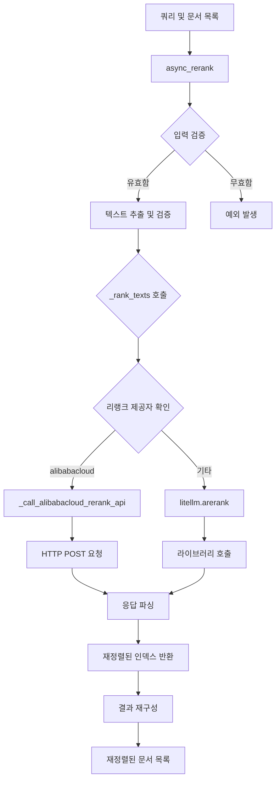
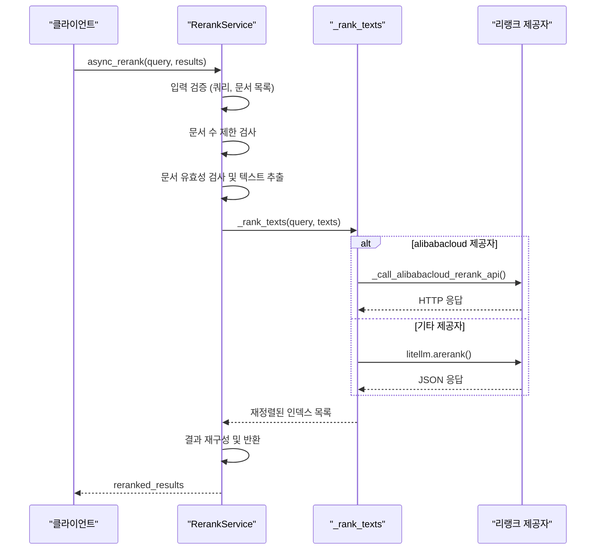
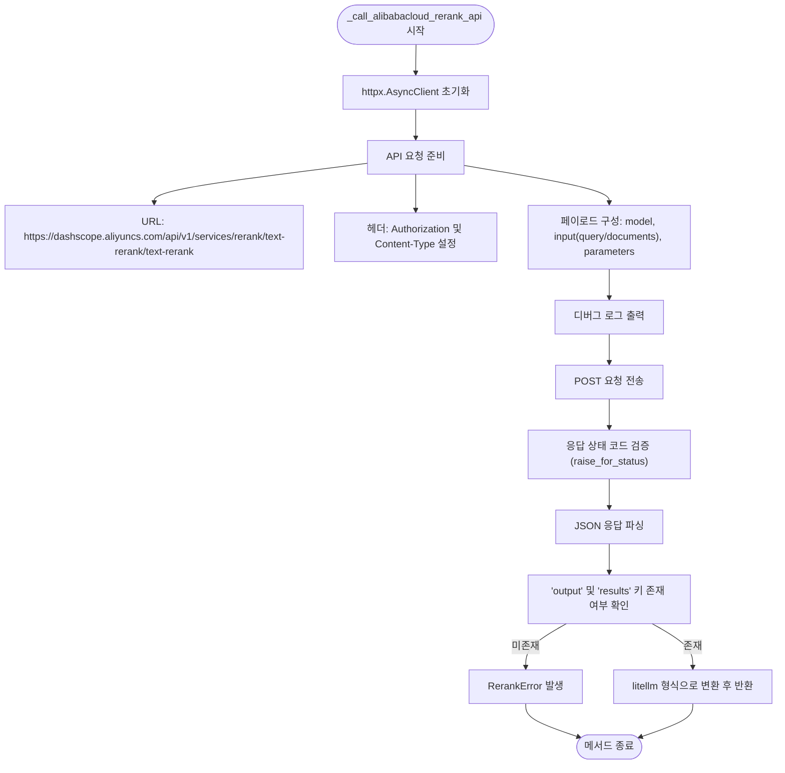
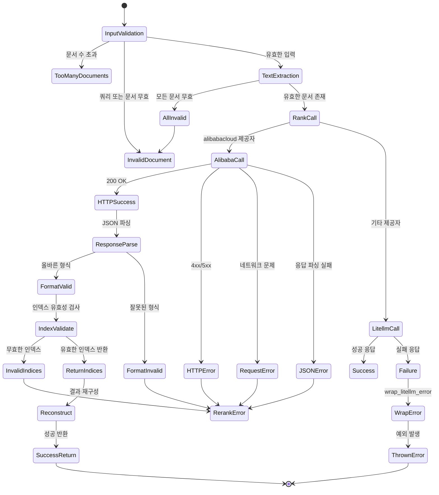
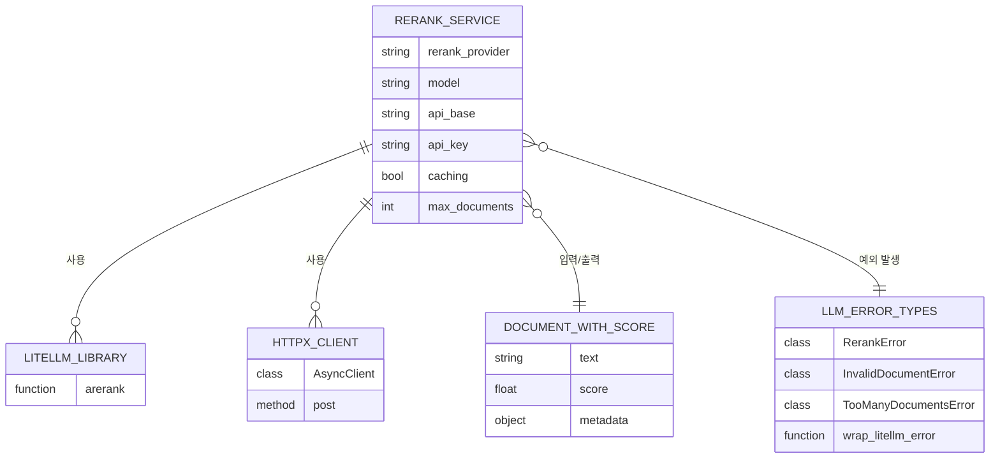

# 리랭크 서비스

<cite>
**이 문서에서 참조한 파일**
- [rerank_service.py](file://aperag/llm/rerank/rerank_service.py)
- [llm_error_types.py](file://aperag/llm/llm_error_types.py)
- [query.py](file://aperag/query/query.py)
</cite>

## 목차
1. [소개](#소개)
2. [핵심 구성 요소](#핵심-구성-요소)
3. [아키텍처 개요](#아키텍처-개요)
4. [상세 구성 요소 분석](#상세-구성-요소-분석)
5. [의존성 분석](#의존성-분석)
6. [성능 고려사항](#성능-고려사항)
7. [문제 해결 가이드](#문제-해결-가이드)
8. [결론](#결론)

## 소개

`RerankService` 클래스는 쿼리와 문서 목록을 입력받아 관련성에 따라 재정렬된 문서 목록을 반환하는 핵심 서비스입니다. 이 문서는 `RerankService`의 설계 원칙과 실행 흐름을 심층적으로 분석하며, 특히 Alibaba Cloud DashScope 전용 API(`_call_alibabacloud_rerank_api`)와 일반 리랭크 제공자(litellm.arerank) 간의 이중 처리 로직을 설명합니다. 또한 입력 검증, 문서 수 제한, 오류 처리, 캐싱 전략 및 설정 유효성 검사 메커니즘을 포함하여 전체 시스템의 신뢰성과 성능을 보장하는 다양한 기능을 다룹니다.

## 핵심 구성 요소

`RerankService`는 쿼리와 문서 목록을 받아 재정렬된 인덱스 목록을 생성하는 주요 비즈니스 로직을 구현합니다. 핵심 메서드인 `async_rerank`는 입력 검증, 문서 추출, 외부 API 호출, 응답 파싱 및 결과 재구성이라는 일련의 단계를 통해 작동합니다. 이 과정은 `DocumentWithScore` 객체 목록을 입력으로 받으며, 각 문서는 텍스트 내용과 관련성 점수를 포함할 수 있습니다. 서비스는 최대 1000개의 문서를 처리할 수 있으며, 이를 초과하면 `TooManyDocumentsError`가 발생합니다. 또한 빈 쿼리나 문서는 `InvalidDocumentError`로 처리되어 시스템의 안정성을 보장합니다.

**Section sources**
- [rerank_service.py](file://aperag/llm/rerank/rerank_service.py#L32-L243)
- [query.py](file://aperag/query/query.py#L19-L22)

## 아키텍처 개요

**Diagram sources**
- [rerank_service.py](file://aperag/llm/rerank/rerank_service.py#L32-L243)

## 상세 구성 요소 분석

### RerankService 분석

`RerankService` 클래스는 초기화 시 리랭크 제공자, 모델 이름, API 엔드포인트, API 키 및 캐싱 여부를 설정합니다. 이 정보는 이후 외부 API와의 통신에 사용됩니다. 가장 중요한 메서드인 `async_rerank`는 다음과 같은 단계를 거쳐 작동합니다:

1. **입력 검증**: 쿼리가 비어 있거나 공백만 있는지, 문서 목록이 존재하는지 확인합니다.
2. **문서 수 제한**: `max_documents`(현재 1000)를 초과하지 않는지 검사합니다.
3. **문서 유효성 검사**: 각 문서의 `text` 속성이 존재하고 비어 있지 않은지 확인하며, 무효한 문서는 경고를 기록하고 플레이스홀더(" ")로 대체합니다.
4. **내부 메서드 호출**: `_rank_texts` 메서드를 호출하여 실제 리랭크 작업을 수행합니다.
5. **결과 재구성**: `_rank_texts`가 반환한 인덱스 목록을 기반으로 원래 `results` 목록에서 문서를 재정렬하여 새로운 목록을 생성합니다.

#### 내부 처리 흐름

**Diagram sources**
- [rerank_service.py](file://aperag/llm/rerank/rerank_service.py#L50-L96)
- [rerank_service.py](file://aperag/llm/rerank/rerank_service.py#L98-L164)

### 이중 처리 로직 분석

`RerankService`는 두 가지 다른 방식으로 리랭크 API를 호출할 수 있도록 설계되었습니다. 이는 특정 제공자(Alibaba Cloud)에 대한 특수 요구 사항을 충족하면서도 다른 모든 제공자는 표준 라이브러리(litellm)를 사용할 수 있게 합니다.

#### Alibaba Cloud 전용 처리

**Diagram sources**
- [rerank_service.py](file://aperag/llm/rerank/rerank_service.py#L166-L228)

#### 일반 제공자 처리
`_rank_texts` 메서드는 `rerank_provider`가 "alibabacloud"인지 확인하고, 그렇지 않으면 `litellm.arerank` 함수를 직접 호출합니다. 이 함수는 다양한 리랭크 제공자와 호환되며, 캐싱, API 키, 엔드포인트 등을 자동으로 처리합니다. 이 접근 방식은 코드의 유연성과 확장성을 극대화합니다.

**Section sources**
- [rerank_service.py](file://aperag/llm/rerank/rerank_service.py#L98-L164)

### 오류 처리 및 예외 관리

시스템은 다양한 예외 상황에 대해 포괄적인 오류 처리 메커니즘을 갖추고 있습니다. `async_rerank` 메서드는 `InvalidDocumentError`, `TooManyDocumentsError`, `RerankError`와 같은 커스텀 예외를 재발생시키며, 그 외의 예외는 `wrap_litellm_error` 유틸리티 함수를 통해 적절한 커스텀 예외로 변환합니다. 이 함수는 원시 예외 메시지를 분석하여 인증 실패, 속도 제한, 시간 초과, 서버 오류 등을 정확하게 식별하고 매핑합니다.

**Diagram sources**
- [rerank_service.py](file://aperag/llm/rerank/rerank_service.py#L50-L96)
- [llm_error_types.py](file://aperag/llm/llm_error_types.py#L312-L377)

## 의존성 분석

`RerankService`는 여러 핵심 외부 의존성과 상호작용합니다. 가장 중요한 것은 `litellm` 라이브러리로, 대부분의 리랭크 제공자와의 통합을 담당합니다. `httpx`는 Alibaba Cloud와의 직접 HTTP 통신을 위해 사용되며, 비동기 클라이언트를 통해 효율적인 네트워크 작업을 가능하게 합니다. `json` 모듈은 API 응답의 직렬화 및 역직렬화에 필수적입니다. 내부적으로는 `aperag.query.DocumentWithScore` 모델을 통해 문서 데이터를 표현하며, `aperag.llm.llm_error_types` 모듈을 통해 일관된 예외 처리 체계를 유지합니다.

**Diagram sources**
- [rerank_service.py](file://aperag/llm/rerank/rerank_service.py#L32-L243)
- [llm_error_types.py](file://aperag/llm/llm_error_types.py#L274-L309)

## 성능 고려사항

`RerankService`는 성능과 신뢰성을 동시에 고려하여 설계되었습니다. 캐싱 기능은 동일한 쿼리와 문서 조합에 대한 반복적인 API 호출을 방지하여 지연 시간을 크게 줄이고 비용을 절감합니다. `max_documents` 제한은 과도한 리소스 소비를 방지하고 시스템의 안정성을 보장합니다. `httpx.AsyncClient`는 타임아웃(60초)을 설정하여 무한 대기를 방지하며, 비동기 처리를 통해 동시 요청을 효율적으로 처리할 수 있습니다. `_rank_texts` 메서드는 복잡한 논리를 캡슐화하여 `async_rerank`의 가독성과 유지보수성을 높였습니다. 그러나 현재 구현에서는 문서 유효성 검사와 텍스트 추출이 순차적으로 이루어지며, 이는 매우 큰 문서 목록의 경우 병렬 처리로 최적화될 수 있는 잠재적인 병목 지점입니다.

## 문제 해결 가이드

리랭크 작업 중 발생할 수 있는 주요 문제와 해결 방법은 다음과 같습니다:

- **`InvalidDocumentError`**: 하나 이상의 문서가 `None`이거나 `text` 속성이 없거나 비어 있을 때 발생합니다. 입력 문서 목록을 검사하고 모든 문서에 유효한 텍스트가 포함되어 있는지 확인하세요.
- **`TooManyDocumentsError`**: 처리하려는 문서 수가 1000개를 초과할 때 발생합니다. 문서 목록을 분할하거나 불필요한 문서를 필터링하세요.
- **`AuthenticationError`**: API 키가 잘못되었거나 누락되었을 때 발생합니다. `api_key` 설정을 확인하고 올바른 키를 제공했는지 검토하세요.
- **`RateLimitError` 또는 `QuotaExceededError`**: 제공자의 API 속도 제한이나 할당량을 초과했을 때 발생합니다. 요청 빈도를 줄이거나 더 높은 할당량을 요청하세요.
- **`TimeoutError`**: 네트워크 지연으로 인해 요청이 60초 내에 완료되지 않았을 때 발생합니다. 네트워크 연결을 확인하거나 제공자의 상태를 점검하세요.
- **`RerankError` (응답 형식 무효)**: 외부 API가 예상과 다른 형식의 응답을 반환했을 때 발생합니다. 이는 제공자의 API 변경으로 인해 발생할 수 있으므로, 응답 스키마를 다시 확인하고 코드를 업데이트해야 할 수 있습니다.

**Section sources**
- [rerank_service.py](file://aperag/llm/rerank/rerank_service.py#L50-L96)
- [llm_error_types.py](file://aperag/llm/llm_error_types.py#L274-L309)

## 결론

`RerankService`는 견고하고 유연한 아키텍처를 갖춘 핵심 컴포넌트입니다. 이 서비스는 입력 검증, 오류 처리, 다중 제공자 지원, 캐싱 등 다양한 기능을 통해 높은 신뢰성과 성능을 제공합니다. Alibaba Cloud와의 직접 통신을 위한 전용 메서드와 `litellm`을 통한 일반적인 통합을 결합함으로써, 특정 요구 사항을 충족하면서도 확장성을 유지합니다. 현재 구현은 이미 강력하지만, 문서 처리 단계의 병렬화와 같은 추가적인 성능 최적화가 가능합니다. 전체적으로 이 서비스는 시스템의 검색 및 추천 기능의 정확성을 향상시키는 데 중요한 역할을 합니다.