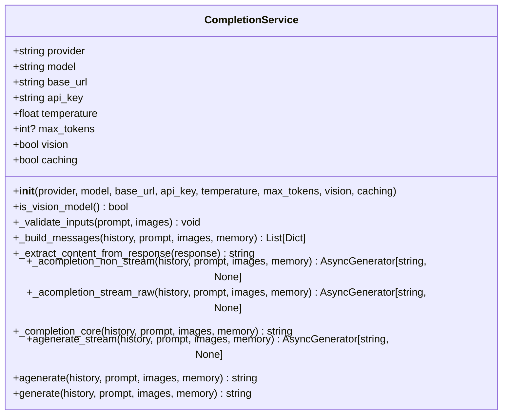
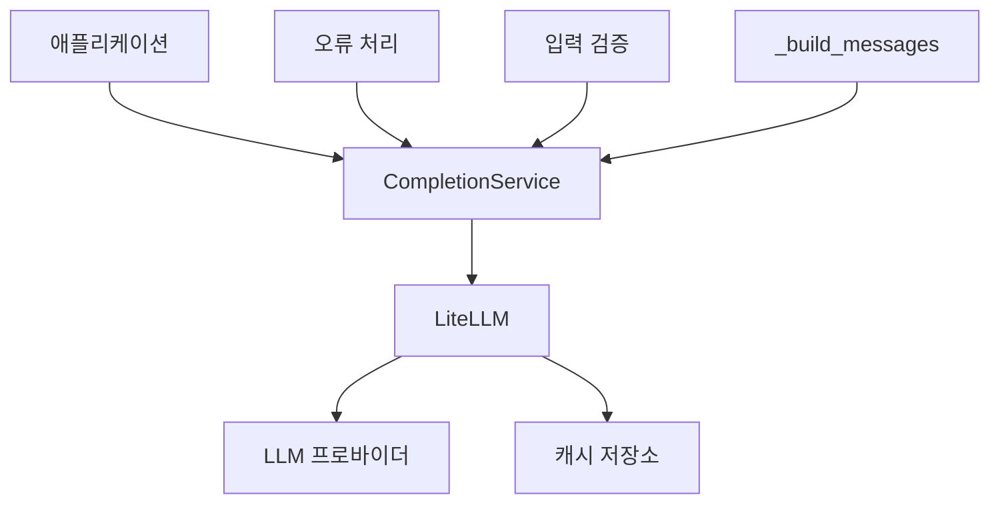
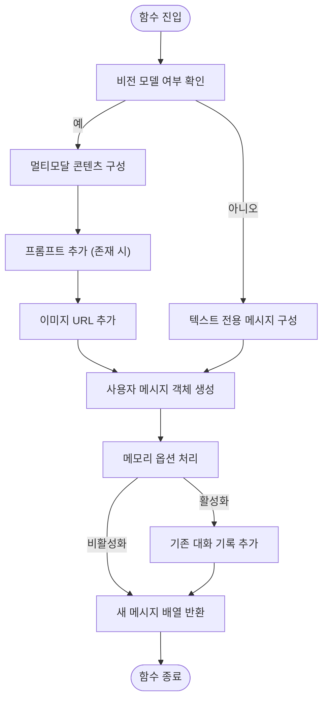
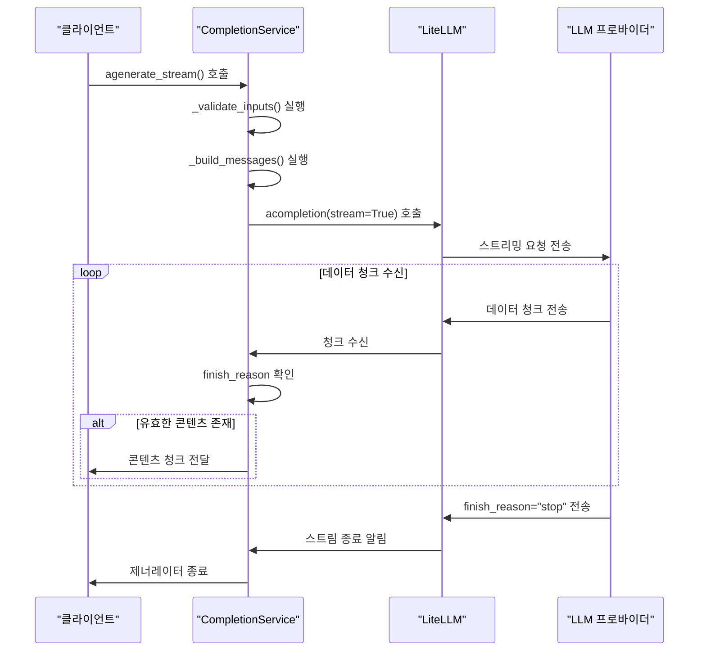
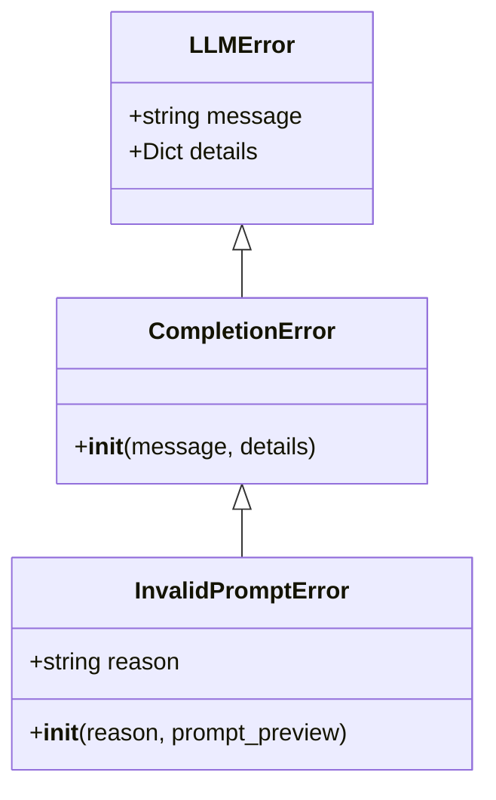
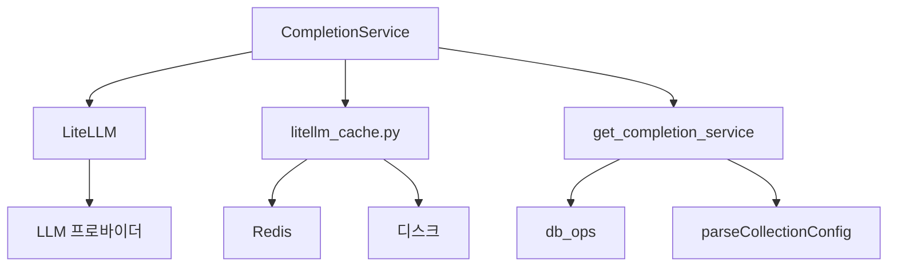

# 완성 서비스

<cite>
**이 문서에서 참조한 파일**
- [completion_service.py](file://aperag\llm\completion\completion_service.py)
- [litellm_cache.py](file://aperag\llm\litellm_cache.py)
- [llm_error_types.py](file://aperag\llm\llm_error_types.py)
- [base_completion.py](file://aperag\llm\completion\base_completion.py)
</cite>

## 목차
1. [소개](#introduction)
2. [핵심 구성 요소](#core-components)
3. [아키텍처 개요](#architecture-overview)
4. [상세 구성 요소 분석](#detailed-component-analysis)
5. [의존성 분석](#dependency-analysis)
6. [성능 고려사항](#performance-considerations)
7. [문제 해결 가이드](#troubleshooting-guide)
8. [결론](#conclusion)

## 소개

CompletionService 클래스는 LiteLLM을 통해 다양한 LLM 프로바이더와 통합되는 핵심 컴포넌트입니다. 이 서비스는 비동기 및 동기 호출 패턴을 지원하며, 스트리밍과 논스트리밍 응답 처리 로직을 제공합니다. 멀티모달 입력(이미지 URL 포함)을 지원하고, 캐싱 기능과 오류 처리 전략을 구현하여 안정적인 LLM 통신을 보장합니다.

## 핵심 구성 요소

CompletionService 클래스는 LLM 완성 요청을 처리하는 주요 기능을 담당합니다. 이 클래스는 초기화 시 프로바이더, 모델, 기본 URL, API 키 등의 설정을 받아들이며, 온도 및 최대 토큰 수와 같은 생성 매개변수를 구성합니다. 비전 모델 여부와 캐싱 활성화 여부를 지정할 수 있습니다.

**Diagram sources**
- [completion_service.py](file://aperag\llm\completion\completion_service.py#L27-L210)

**Section sources**
- [completion_service.py](file://aperag\llm\completion\completion_service.py#L27-L210)

## 아키텍처 개요

CompletionService는 LiteLLM 라이브러리를 중심으로 구축된 아키텍처를 따릅니다. 이 서비스는 내부적으로 LiteLLM의 `acompletion` 및 `completion` 함수를 호출하여 실제 LLM 프로바이더와 통신합니다. 캐싱 계층은 LiteLLM 캐시 메커니즘을 활용하여 Redis 또는 디스크 기반 저장소에 응답을 저장합니다. 오류 처리는 사용자 정의 예외 계층을 통해 일관된 방식으로 관리됩니다.

**Diagram sources**
- [completion_service.py](file://aperag\llm\completion\completion_service.py#L27-L210)
- [litellm_cache.py](file://aperag\llm\litellm_cache.py#L46-L68)

## 상세 구성 요소 분석

### CompletionService 분석

CompletionService 클래스는 LLM 완성 작업을 위한 포괄적인 인터페이스를 제공합니다. 이 클래스는 비동기 및 동기 호출을 모두 지원하며, 스트리밍과 논스트리밍 응답을 처리할 수 있습니다.

#### _build_messages 메서드 분석

**Diagram sources**
- [completion_service.py](file://aperag\llm\completion\completion_service.py#L90-L115)

**Section sources**
- [completion_service.py](file://aperag\llm\completion\completion_service.py#L90-L115)

#### agenerate_stream 메서드 분석

**Diagram sources**
- [completion_service.py](file://aperag\llm\completion\completion_service.py#L170-L180)

**Section sources**
- [completion_service.py](file://aperag\llm\completion\completion_service.py#L170-L180)

### 오류 처리 전략

CompletionService는 계층적 오류 처리 시스템을 구현합니다. `InvalidPromptError`는 잘못된 프롬프트 입력을 감지할 때 발생하며, `CompletionError`는 LLM 응답 처리 중 발생하는 모든 오류의 기본 클래스입니다. 이러한 예외는 LiteLLM에서 발생하는 원시 예외를 래핑하여 더 의미 있는 오류 정보를 제공합니다.

**Diagram sources**
- [llm_error_types.py](file://aperag\llm\llm_error_types.py#L154-L169)

**Section sources**
- [llm_error_types.py](file://aperag\llm\llm_error_types.py#L154-L169)

## 의존성 분석

CompletionService는 여러 핵심 구성 요소와 상호작용합니다. 가장 중요한 의존성은 LiteLLM 라이브러리이며, 이는 다양한 LLM 프로바이더와의 통합을 가능하게 합니다. 캐싱 기능은 litellm_cache.py 모듈을 통해 관리되며, Redis 또는 디스크 기반 캐시를 사용할 수 있습니다. 구성 정보는 데이터베이스에서 조회되며, get_completion_service 함수를 통해 CompletionService 인스턴스가 생성됩니다.

**Diagram sources**
- [completion_service.py](file://aperag\llm\completion\completion_service.py#L27-L210)
- [litellm_cache.py](file://aperag\llm\litellm_cache.py#L46-L68)
- [base_completion.py](file://aperag\llm\completion\base_completion.py#L90-L183)

**Section sources**
- [completion_service.py](file://aperag\llm\completion\completion_service.py#L27-L210)
- [litellm_cache.py](file://aperag\llm\litellm_cache.py#L46-L68)
- [base_completion.py](file://aperag\llm\completion\base_completion.py#L90-L183)

## 성능 고려사항

CompletionService는 성능 최적화를 위해 여러 전략을 사용합니다. 캐싱은 반복적인 요청에 대한 응답 시간을 크게 단축시킵니다. 비동기 호출은 I/O 대기 시간을 줄여 동시 처리 능력을 향상시킵니다. 배치 처리 최적화는 요청 제한을 회피하고 처리 효율성을 높이는 데 도움이 됩니다. 메모리 관리 옵션을 사용하면 대화 기록을 유지하면서도 불필요한 데이터 전송을 방지할 수 있습니다.

## 문제 해결 가이드

CompletionService 관련 문제를 해결할 때는 다음 절차를 따르는 것이 좋습니다:

1. **API 키 및 구성 확인**: 프로바이더 이름, 모델 이름, API 키가 올바르게 설정되었는지 확인합니다.
2. **입력 유효성 검사**: 프롬프트가 비어 있지 않고, 이미지 URL이 유효한지 확인합니다.
3. **캐시 상태 확인**: 캐시가 활성화되어 있고, 적절한 TTL이 설정되었는지 확인합니다.
4. **오류 로그 분석**: 로깅 출력을 검토하여 오류의 정확한 원인을 파악합니다.
5. **네트워크 연결 테스트**: LLM 프로바이더에 대한 네트워크 연결이 가능한지 확인합니다.

특히 `InvalidPromptError`가 발생하면 입력 프롬프트와 이미지 목록을 점검해야 하며, `CompletionError`는 일반적으로 LLM 프로바이더의 응답 문제를 나타냅니다.

**Section sources**
- [llm_error_types.py](file://aperag\llm\llm_error_types.py#L154-L169)
- [completion_service.py](file://aperag\llm\completion\completion_service.py#L60-L70)

## 결론

CompletionService 클래스는 LiteLLM을 통해 다양한 LLM 프로바이더와의 통합을 가능하게 하는 강력한 컴포넌트입니다. 이 서비스는 비동기/동기 호출, 스트리밍/논스트리밍 응답 처리, 멀티모달 입력 지원, 캐싱, 오류 처리 등 LLM 통신에 필요한 핵심 기능을 포괄적으로 제공합니다. `_build_messages` 메서드를 통해 유연한 콘텐츠 구성이 가능하며, `get_completion_service` 함수를 통해 구성 기반의 서비스 인스턴스 생성이 지원됩니다. 이 아키텍처는 확장성과 유지보수성을 갖춘 견고한 LLM 통합 솔루션을 제공합니다.