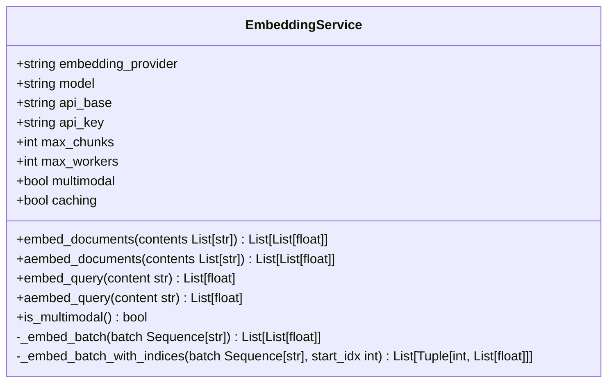
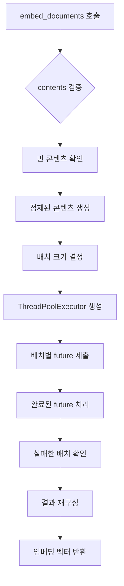
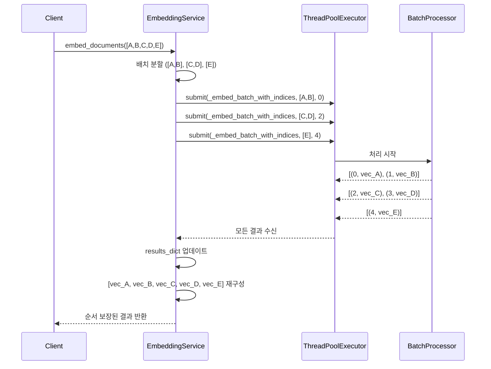
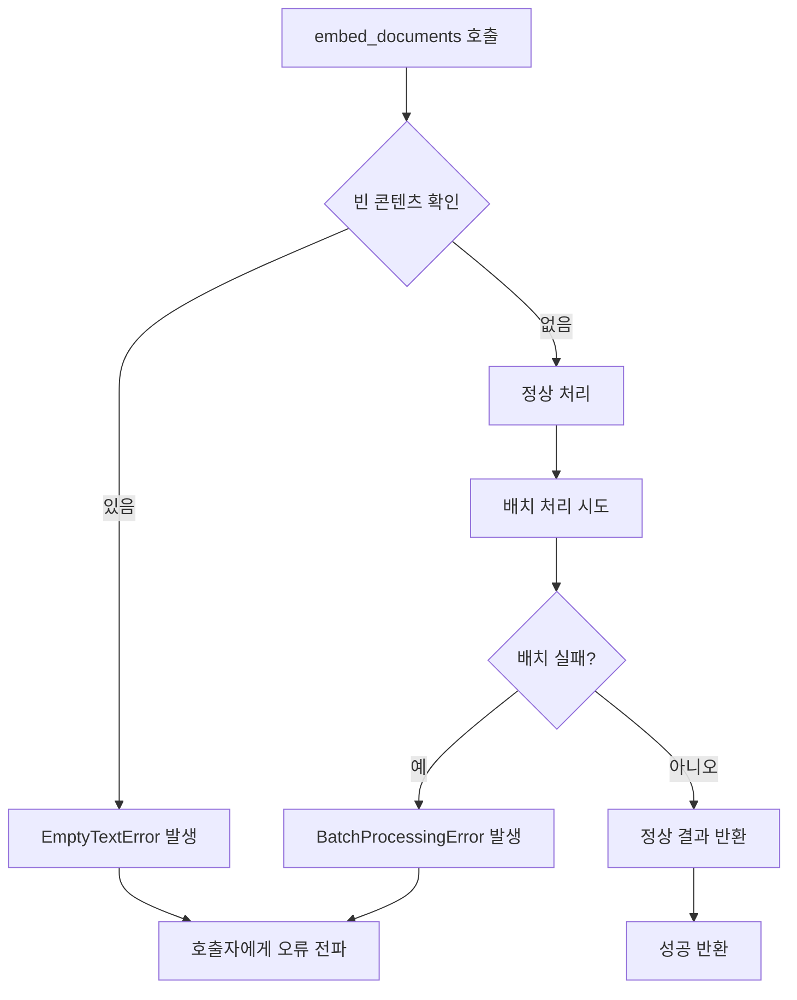

# 임베딩 서비스

<cite>
**이 문서에서 참조한 파일**
- [embedding_service.py](file://aperag\llm\embed\embedding_service.py)
- [llm_error_types.py](file://aperag\llm\llm_error_types.py)
- [base_embedding.py](file://aperag\llm\embed\base_embedding.py)
- [test_embedding_service_cache.py](file://tests\e2e_test\cache\test_embedding_service_cache.py)
</cite>

## 목차
1. [소개](#소개)
2. [핵심 아키텍처](#핵심-아키텍처)
3. [멀티모달 지원](#멀티모달-지원)
4. [배치 처리 및 병렬화](#배치-처리-및-병렬화)
5. [결과 순서 보장 메커니즘](#결과-순서-보장-메커니즘)
6. [litellm.embedding API 통합](#litellmembedding-api-통합)
7. [캐싱 전략](#캐싱-전략)
8. [에러 타입 및 복구 방법](#에러-타입-및-복구-방법)
9. [임베딩 메서드 사용 사례](#임베딩-메서드-사용-사례)
10. [비동기 메서드 내부 동작](#비동기-메서드-내부-동작)

## 소개

`EmbeddingService` 클래스는 텍스트 및 이미지 콘텐츠의 벡터 임베딩을 생성하는 핵심 컴포넌트입니다. 이 문서는 `EmbeddingService`의 아키텍처와 동작 원리를 상세히 설명하며, 멀티모달 임베딩 지원 여부, ThreadPoolExecutor를 활용한 배치 처리 방식, `_embed_batch_with_indices`를 통한 결과 순서 보장 메커니즘 등을 다룹니다. 또한 litellm.embedding API와의 통합, 캐싱 전략, 다양한 에러 타입의 발생 조건과 복구 방법을 문서화합니다.

**Section sources**
- [embedding_service.py](file://aperag\llm\embed\embedding_service.py#L1-L50)

## 핵심 아키텍처

`EmbeddingService` 클래스는 LLM(Large Language Model) 제공업체로부터 텍스트 또는 이미지 콘텐츠를 벡터 공간으로 변환하는 기능을 제공합니다. 이 클래스는 초기화 시 다양한 구성 매개변수를 받아 인스턴스를 설정하며, 주요 속성은 다음과 같습니다:

- **embedding_provider**: 임베딩을 제공하는 LLM 제공업체 이름
- **model**: 사용할 임베딩 모델 이름
- **api_base**: LLM API의 기본 URL
- **api_key**: API 인증을 위한 키
- **max_chunks**: 한 번에 처리할 수 있는 최대 청크 수
- **max_workers**: 스레드 풀에서 사용할 최대 작업자 수
- **multimodal**: 멀티모달(텍스트 및 이미지) 지원 여부
- **caching**: 응답 캐싱 활성화 여부

이 아키텍처는 확장 가능하고 유연한 설계로, 다양한 LLM 제공업체와 모델에 쉽게 적응할 수 있도록 합니다.



**Diagram sources**
- [embedding_service.py](file://aperag\llm\embed\embedding_service.py#L33-L205)

**Section sources**
- [embedding_service.py](file://aperag\llm\embed\embedding_service.py#L33-L205)

## 멀티모달 지원

`EmbeddingService`는 멀티모달 입력을 처리할 수 있는 능력을 제공합니다. 멀티모달 지원 여부는 `multimodal` 플래그를 통해 제어되며, 이 값은 초기화 시 설정됩니다.

### 멀티모달 기능 확인

`is_multimodal()` 메서드는 현재 서비스 인스턴스가 멀티모달 입력을 지원하는지 여부를 반환합니다:

```python
def is_multimodal(self) -> bool:
    return self.multimodal
```

이 메서드는 단순히 내부 상태 변수 `self.multimodal`의 값을 반환하여, 외부에서 서비스의 멀티모달 지원 여부를 쉽게 확인할 수 있도록 합니다.

### 멀티모달 입력 처리

`embed_documents` 메서드는 문자열 리스트를 입력으로 받으며, 이 문자열들은 일반 텍스트일 수도 있고, base64로 인코딩된 이미지 데이터일 수도 있습니다:

```python
def embed_documents(self, contents: List[str]) -> List[List[float]]:
    """
    Args:
        contents: List of documents (texts or base64-encoded images) to embed
    """
```

이 설계는 텍스트와 이미지 모두를 동일한 인터페이스를 통해 처리할 수 있게 하며, 호출자는 각 문자열이 텍스트인지 이미지인지에 따라 적절한 형식으로 데이터를 준비해야 합니다.

**Section sources**
- [embedding_service.py](file://aperag\llm\embed\embedding_service.py#L150-L151)
- [embedding_service.py](file://aperag\llm\embed\embedding_service.py#L53-L120)

## 배치 처리 및 병렬화

`EmbeddingService`는 효율적인 대량 처리를 위해 ThreadPoolExecutor를 활용하여 병렬 배치 처리를 구현합니다.

### ThreadPoolExecutor 활용

`embed_documents` 메서드는 내부적으로 `ThreadPoolExecutor`를 사용하여 여러 배치를 동시에 처리합니다:



**Diagram sources**
- [embedding_service.py](file://aperag\llm\embed\embedding_service.py#L53-L120)

**Section sources**
- [embedding_service.py](file://aperag\llm\embed\embedding_service.py#L53-L120)

### 배치 처리 프로세스

1. **입력 검증**: 빈 콘텐츠나 공백만 있는 콘텐츠를 필터링
2. **콘텐츠 정제**: 개행 문자를 공백으로 대체
3. **배치 분할**: 전체 콘텐츠를 지정된 배치 크기로 분할
4. **병렬 실행**: 각 배치를 별도의 스레드에서 처리
5. **결과 수집**: 모든 스레드의 결과를 수집하고 오류 처리

이 접근 방식은 대규모 문서 집합을 처리할 때 성능을 크게 향상시킵니다.

## 결과 순서 보장 메커니즘

`EmbeddingService`는 입력 순서와 출력 순서가 일치하도록 보장하기 위해 `_embed_batch_with_indices` 메서드를 사용합니다.

### _embed_batch_with_indices 메서드

이 메서드는 배치와 시작 인덱스를 받아, 각 임베딩에 원래 위치 정보를 포함하여 반환합니다:

```python
def _embed_batch_with_indices(self, batch: Sequence[str], start_idx: int) -> List[Tuple[int, List[float]]]:
    try:
        embeddings = self._embed_batch(batch)
        return [(start_idx + i, embedding) for i, embedding in enumerate(embeddings)]
    except Exception as e:
        logger.error(f"Batch embedding with indices failed: {str(e)}")
        raise wrap_litellm_error(e, "embedding", self.embedding_provider, self.model) from e
```

### 순서 보장 프로세스

1. **결과 딕셔너리 생성**: `results_dict`를 사용하여 인덱스 기반 저장
2. **인덱스 포함 반환**: 각 배치 처리 시 시작 인덱스를 포함하여 결과 반환
3. **순차적 재구성**: 원래 순서대로 결과 리스트 재구성



**Diagram sources**
- [embedding_service.py](file://aperag\llm\embed\embedding_service.py#L153-L162)
- [embedding_service.py](file://aperag\llm\embed\embedding_service.py#L53-L120)

**Section sources**
- [embedding_service.py](file://aperag\llm\embed\embedding_service.py#L153-L162)
- [embedding_service.py](file://aperag\llm\embed\embedding_service.py#L53-L120)

## litellm.embedding API 통합

`EmbeddingService`는 litellm 라이브러리를 통해 다양한 LLM 제공업체와 통합됩니다.

### _embed_batch 메서드

실제 임베딩 생성은 `_embed_batch` 메서드에서 litellm.embedding API를 호출하여 수행됩니다:

```python
def _embed_batch(self, batch: Sequence[str]) -> List[List[float]]:
    try:
        response = litellm.embedding(
            custom_llm_provider=self.embedding_provider,
            model=self.model,
            api_base=self.api_base,
            api_key=self.api_key,
            input=list(batch),
            caching=self.caching,
        )
        
        if not response or "data" not in response:
            raise EmbeddingError("Invalid response format from embedding API")
            
        embeddings = [item["embedding"] for item in response["data"]]
        return embeddings
    except Exception as e:
        logger.error(f"Batch embedding API call failed: {str(e)}")
        raise wrap_litellm_error(e, "embedding", self.embedding_provider, self.model) from e
```

### API 통합 특징

- **다양한 제공업체 지원**: `custom_llm_provider` 파라미터를 통해 다양한 LLM 제공업체 지원
- **유연한 구성**: API 기본 URL과 키를 동적으로 설정 가능
- **에러 변환**: litellm 예외를 커스텀 예외 타입으로 변환
- **응답 검증**: 유효하지 않은 응답 형식에 대한 검증 로직 포함

**Section sources**
- [embedding_service.py](file://aperag\llm\embed\embedding_service.py#L164-L205)

## 캐싱 전략

`EmbeddingService`는 성능 향상을 위해 캐싱 기능을 내장하고 있습니다.

### 캐싱 활성화

초기화 시 `caching` 매개변수를 통해 캐싱을 활성화하거나 비활성화할 수 있습니다:

```python
def __init__(self, ..., caching: bool = True):
    self.caching = caching
```

### 캐싱 구현

캐싱은 litellm의 내장 캐싱 메커니즘을 활용하며, `_embed_batch` 메서드에서 직접 전달됩니다:

```python
response = litellm.embedding(
    ...,
    caching=self.caching,
)
```

### 캐싱 효과

- **성능 향상**: 동일한 입력에 대한 후속 요청 시 응답 시간 단축
- **비용 절감**: LLM API 호출 횟수 감소
- **일관성 유지**: 동일한 입력에 대해 항상 동일한 출력 제공

테스트 코드(`test_embedding_service_cache.py`)는 캐싱이 제대로 작동하는지 검증하며, 첫 번째 호출과 두 번째 호출 간의 성능 차이를 측정합니다.

**Section sources**
- [embedding_service.py](file://aperag\llm\embed\embedding_service.py#L33-L205)
- [test_embedding_service_cache.py](file://tests\e2e_test\cache\test_embedding_service_cache.py#L1-L377)

## 에러 타입 및 복구 방법

`EmbeddingService`는 다양한 오류 상황에 대비하여 포괄적인 에러 처리 메커니즘을 제공합니다.

### 주요 에러 타입

#### EmptyTextError

빈 텍스트 또는 공백만 있는 텍스트를 임베딩하려고 할 때 발생합니다:

```python
class EmptyTextError(EmbeddingError):
    """Raised when trying to embed empty or whitespace-only text"""
    def __init__(self, text_count: int = 1):
        message = "Cannot embed empty text"
        if text_count > 1:
            message += f" (found {text_count} empty texts)"
        super().__init__(message, {"text_count": text_count})
```

#### BatchProcessingError

배치 처리 중 하나 이상의 배치가 실패할 때 발생합니다:

```python
class BatchProcessingError(EmbeddingError):
    """Raised when batch processing of embeddings fails"""
    def __init__(self, batch_size: int, failed_indices: list = None, reason: str = "Batch processing failed"):
        message = f"Batch processing error (batch size: {batch_size}): {reason}"
        details = {"batch_size": batch_size, "reason": reason}
        if failed_indices:
            details["failed_indices"] = failed_indices
        super().__init__(message, details)
```

### 에러 처리 및 복구



**Diagram sources**
- [llm_error_types.py](file://aperag\llm\llm_error_types.py#L250-L300)
- [embedding_service.py](file://aperag\llm\embed\embedding_service.py#L53-L120)

**Section sources**
- [llm_error_types.py](file://aperag\llm\llm_error_types.py#L250-L300)
- [embedding_service.py](file://aperag\llm\embed\embedding_service.py#L53-L120)

## 임베딩 메서드 사용 사례

`EmbeddingService`는 문서와 쿼리에 따라 다른 사용 사례를 가진 두 가지 주요 임베딩 메서드를 제공합니다.

### embed_documents vs embed_query

| 특성 | embed_documents | embed_query |
|------|----------------|-------------|
| **목적** | 여러 문서 임베딩 | 단일 쿼리 임베딩 |
| **입력** | 문자열 리스트 | 단일 문자열 |
| **내부 처리** | 배치 및 병렬 처리 | 단일 문서로 처리 |
| **사용 사례** | 문서 인덱싱, 벡터 저장소 구축 | 검색 쿼리 처리, 유사도 계산 |

### embed_query 구현

`embed_query` 메서드는 내부적으로 `embed_documents`를 재사용하여 일관된 처리 로직을 유지합니다:

```python
def embed_query(self, content: str) -> List[float]:
    if not content or not content.strip():
        raise EmptyTextError(1)
    try:
        return self.embed_documents([content])[0]
    except (EmptyTextError, EmbeddingError):
        raise
    except Exception as e:
        logger.error(f"Query embedding failed: {str(e)}")
        raise wrap_litellm_error(e, "embedding", self.embedding_provider, self.model) from e
```

이 설계는 코드 중복을 줄이고, 동일한 오류 처리 및 전처리 로직을 공유할 수 있게 합니다.

**Section sources**
- [embedding_service.py](file://aperag\llm\embed\embedding_service.py#L125-L145)
- [embedding_service.py](file://aperag\llm\embed\embedding_service.py#L53-L120)

## 비동기 메서드 내부 동작

`EmbeddingService`는 비동기 프로그래밍을 지원하기 위해 `asyncio.to_thread`를 활용합니다.

### aembed_documents 구현

```python
async def aembed_documents(self, contents: List[str]) -> List[List[float]]:
    return await asyncio.to_thread(self.embed_documents, contents)
```

### aembed_query 구현

```python
async def aembed_query(self, content: str) -> List[float]:
    return await asyncio.to_thread(self.embed_query, content)
```

### asyncio.to_thread 활용

`asyncio.to_thread`는 다음 장점을 제공합니다:

- **비차단 I/O**: 메인 이벤트 루프를 차단하지 않고 CPU 집약적 작업 수행
- **간편한 통합**: 기존 동기 코드를 수정하지 않고 비동기적으로 호출 가능
- **효율적인 리소스 사용**: 스레드 풀을 관리하여 리소스 효율성 극대화

이 접근 방식은 동기 메서드의 복잡한 리팩토링 없이 비동기 기능을 추가할 수 있게 하며, 기존 코드의 안정성을 유지하면서 비동기 환경과의 호환성을 보장합니다.

**Section sources**
- [embedding_service.py](file://aperag\llm\embed\embedding_service.py#L122-L123)
- [embedding_service.py](file://aperag\llm\embed\embedding_service.py#L147-L148)