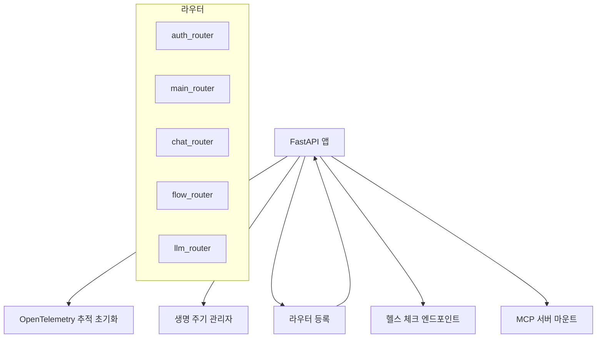
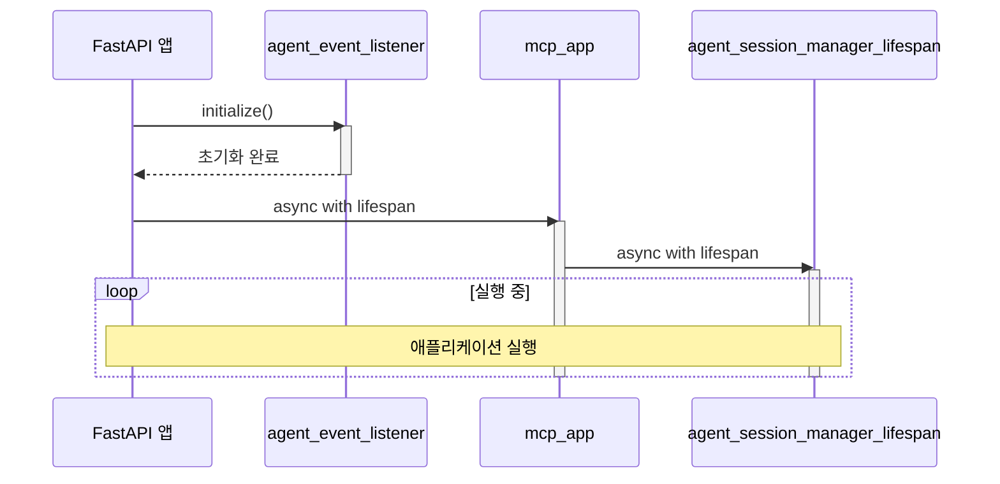
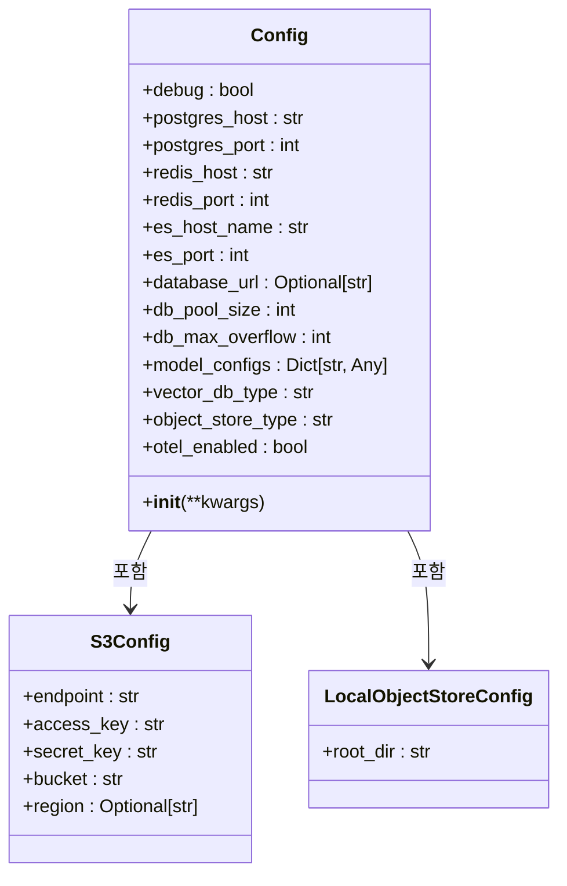
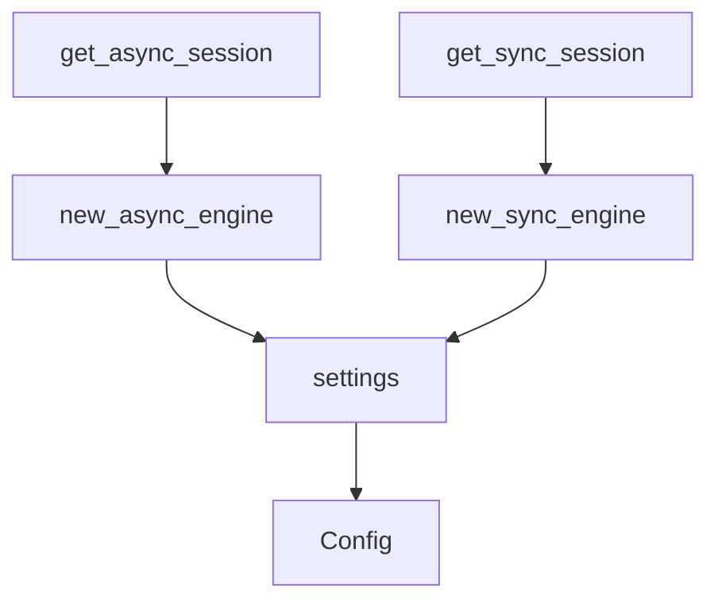
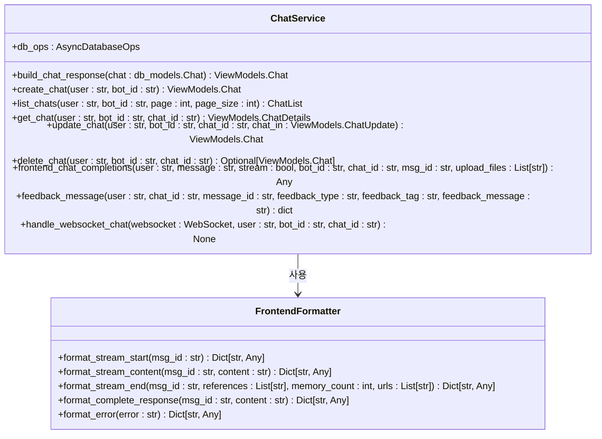
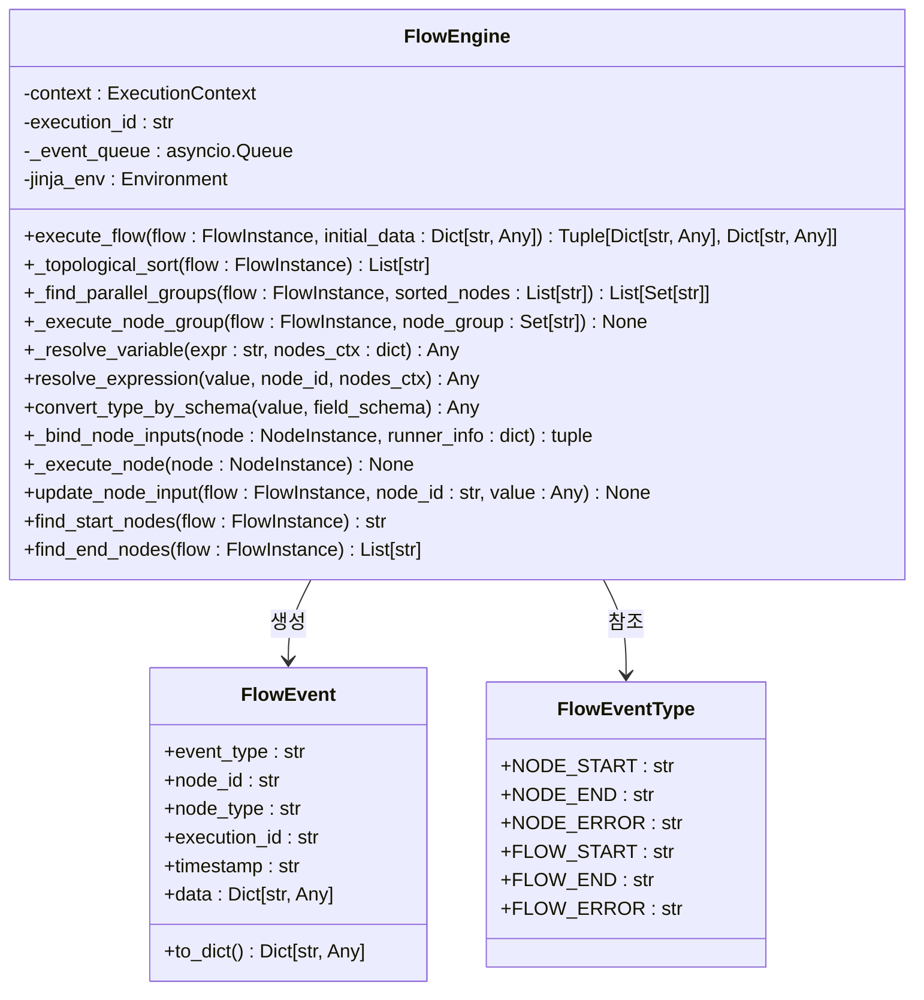
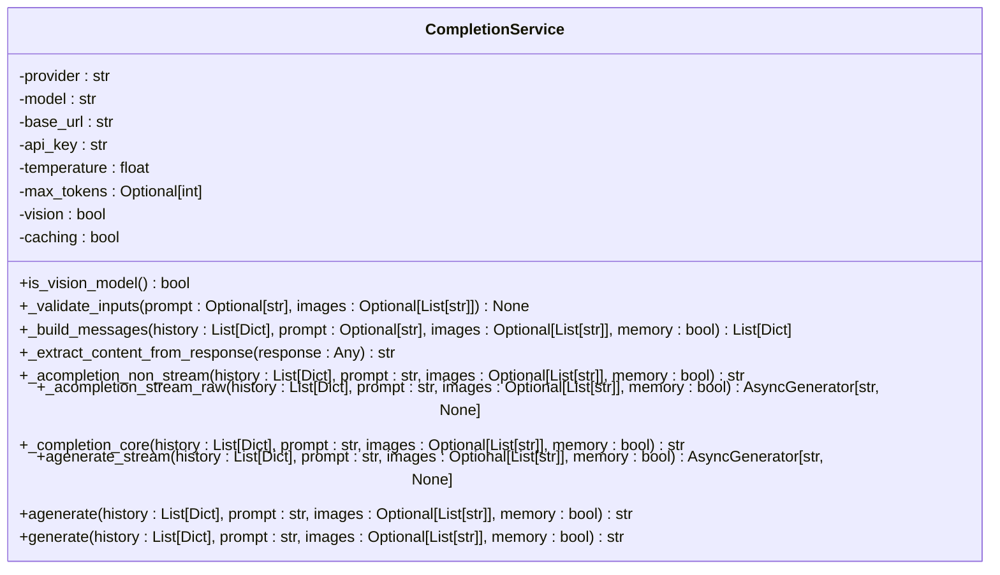
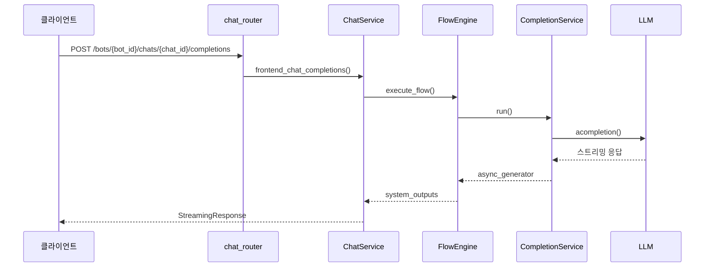
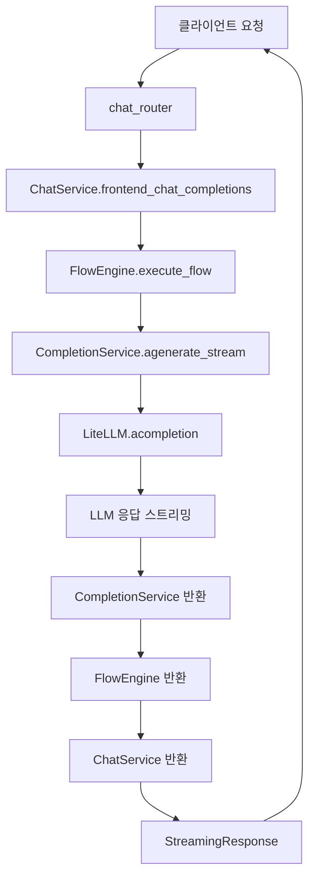

# 백엔드 아키텍처

<cite>
**이 문서에서 참조한 파일**  
- [app.py](file://aperag/app.py)
- [config.py](file://aperag/config.py)
- [chat_service.py](file://aperag/service/chat_service.py)
- [engine.py](file://aperag/flow/engine.py)
- [completion_service.py](file://aperag/llm/completion/completion_service.py)
- [chat.py](file://aperag/views/chat.py)
- [parser.py](file://aperag/flow/parser.py)
</cite>

## 목차
1. [소개](#소개)
2. [진입점 및 라우팅](#진입점-및-라우팅)
3. [설정 관리](#설정-관리)
4. [서비스 계층](#서비스-계층)
5. [플로우 엔진](#플로우-엔진)
6. [LLM 호출 처리](#llm-호출-처리)
7. [제어 흐름과 데이터 흐름](#제어-흐름과-데이터-흐름)
8. [비동기 처리 및 오류 전파](#비동기-처리-및-오류-전파)
9. [요청 처리 경로 추적](#요청-처리-경로-추적)
10. [결론](#결론)

## 소개

ApeRAG은 지식 관리 및 검색 시스템을 위한 고급 백엔드 아키텍처를 제공합니다. 이 문서는 FastAPI 기반의 진입점부터 시작하여, 설정 관리, 서비스 계층, 플로우 엔진, LLM 호출 처리까지의 전체 구조와 동작 방식을 상세히 설명합니다. 각 컴포넌트 간의 제어 흐름과 데이터 흐름을 명확히 하고, 비동기 처리 및 오류 전파 메커니즘을 분석합니다.

**Section sources**
- [app.py](file://aperag/app.py#L1-L122)
- [config.py](file://aperag/config.py#L1-L331)

## 진입점 및 라우팅

ApeRAG의 진입점은 `app.py`에 위치한 FastAPI 애플리케이션 인스턴스입니다. 이 파일은 OpenTelemetry 초기화, 생명 주기 이벤트 처리, 라우터 등록 등을 담당합니다.



**Diagram sources**
- [app.py](file://aperag/app.py#L1-L122)

### 생명 주기 이벤트 처리

`combined_lifespan` 함수는 애플리케이션의 생명 주기를 관리합니다. 이 함수는 MCP 서버와 에이전트 세션 관리자의 생명 주기를 결합하여, 애플리케이션 시작 시 초기화하고 종료 시 정리 작업을 수행합니다.



**Diagram sources**
- [app.py](file://aperag/app.py#L72-L88)

### 라우터 등록

`app.py`는 다양한 기능별 라우터를 등록합니다. 각 라우터는 특정 기능 영역을 담당하며, `/api/v1` 또는 `/v1` 등의 접두사를 사용합니다.

```mermaid
graph TD
app[FastAPI 앱] --> auth_router[auth_router]
app --> main_router[main_router]
app --> collections_router[collections_router]
app --> api_key_router[api_key_router]
app --> audit_router[audit_router]
app --> flow_router[flow_router]
app --> llm_router[llm_router]
app --> graph_router[graph_router]
app --> marketplace_router[marketplace_router]
app --> settings_router[settings_router]
app --> web_router[web_router]
app --> evaluation_router[evaluation_router]
app --> bot_router[bot_router]
app --> chat_router[chat_router]
app --> openai_router[openai_router]
app --> config_router[config_router]
app --> test_router[test_router]
style auth_router fill:#f9f,stroke:#333
style main_router fill:#f9f,stroke:#333
style collections_router fill:#f9f,stroke:#333
style api_key_router fill:#f9f,stroke:#333
style audit_router fill:#f9f,stroke:#333
style flow_router fill:#f9f,stroke:#333
style llm_router fill:#f9f,stroke:#333
style graph_router fill:#f9f,stroke:#333
style marketplace_router fill:#f9f,stroke:#333
style settings_router fill:#f9f,stroke:#333
style web_router fill:#f9f,stroke:#333
style evaluation_router fill:#f9f,stroke:#333
style bot_router fill:#f9f,stroke:#333
style chat_router fill:#f9f,stroke:#333
style openai_router fill:#f9f,stroke:#333
style config_router fill:#f9f,stroke:#333
style test_router fill:#f9f,stroke:#333
```



**Diagram sources**
- [app.py](file://aperag/app.py#L90-L122)

**Section sources**
- [app.py](file://aperag/app.py#L1-L122)

## 설정 관리

설정 관리는 `config.py` 파일에서 Pydantic Settings를 사용하여 환경별 구성 로딩을 수행합니다. 이 파일은 데이터베이스 연결, Redis, Elasticsearch, 모델 구성 등 다양한 설정을 관리합니다.



**Diagram sources**
- [config.py](file://aperag/config.py#L1-L331)

### 설정 클래스

`Config` 클래스는 모든 설정 값을 필드로 가지며, `__init__` 메서드에서 환경 변수와 JSON 파일로부터 설정을 로드합니다. 또한, 데이터베이스 URL, Celery 브로커 URL 등은 필요시 자동으로 생성됩니다.

```python
[SPEC SYMBOL](file://aperag/config.py#L100-L150)
```

### 의존성 주입

설정 값은 전역 변수 `settings`를 통해 다른 모듈에서 접근할 수 있습니다. 또한, 데이터베이스 세션은 `get_async_session`과 `get_sync_session` 함수를 통해 의존성 주입됩니다.



**Diagram sources**
- [config.py](file://aperag/config.py#L276-L331)

**Section sources**
- [config.py](file://aperag/config.py#L1-L331)

## 서비스 계층

비즈니스 로직은 `service` 디렉터리 내의 여러 서비스 클래스에서 캡슐화됩니다. 대표적인 예로 `ChatService`가 있으며, 채팅 관련 비즈니스 로직을 담당합니다.



**Diagram sources**
- [chat_service.py](file://aperag/service/chat_service.py#L110-L549)

### 채팅 서비스

`ChatService` 클래스는 채팅 생성, 조회, 업데이트, 삭제 등의 CRUD 작업을 제공합니다. 또한, `frontend_chat_completions` 메서드를 통해 프론트엔드용 채팅 완성 기능을 제공합니다.

```python
[SPEC SYMBOL](file://aperag/service/chat_service.py#L300-L549)
```

### 피드백 처리

`feedback_message` 메서드는 채팅 메시지에 대한 피드백을 처리합니다. 사용자가 좋아요/싫어요를 누르면 해당 상태를 데이터베이스에 저장하거나 제거합니다.

```python
[SPEC SYMBOL](file://aperag/service/chat_service.py#L500-L549)
```

**Section sources**
- [chat_service.py](file://aperag/service/chat_service.py#L110-L549)

## 플로우 엔진

플로우 엔진은 DAG(Directed Acyclic Graph) 기반 워크플로우를 실행합니다. `engine.py` 파일에 정의된 `FlowEngine` 클래스는 흐름의 실행을 담당합니다.



**Diagram sources**
- [engine.py](file://aperag/flow/engine.py#L72-L454)

### 흐름 실행

`execute_flow` 메서드는 흐름 인스턴스를 실행합니다. 이 메서드는 토폴로지 정렬을 수행하여 사이클을 감지하고, 노드 그룹을 병렬로 실행합니다.

```python
[SPEC SYMBOL](file://aperag/flow/engine.py#L100-L150)
```

### 노드 실행

`_execute_node` 메서드는 단일 노드를 실행합니다. 이 메서드는 입력 값을 바인딩하고, 러너를 호출하며, 출력 값을 컨텍스트에 저장합니다.

```python
[SPEC SYMBOL](file://aperag/flow/engine.py#L350-L400)
```

### 파서

`parser.py` 파일의 `FlowParser` 클래스는 YAML 형식의 흐름 구성 파일을 파싱하여 `FlowInstance` 객체로 변환합니다.

```python
[SPEC SYMBOL](file://aperag/flow/parser.py#L10-L50)
```

**Section sources**
- [engine.py](file://aperag/flow/engine.py#L72-L454)
- [parser.py](file://aperag/flow/parser.py#L1-L97)

## LLM 호출 처리

LLM 호출은 `completion_service.py` 파일의 `CompletionService` 클래스를 통해 LiteLLM 래퍼를 거쳐 수행됩니다.



**Diagram sources**
- [completion_service.py](file://aperag/llm/completion/completion_service.py#L27-L210)

### 비동기 스트리밍 호출

`_acompletion_stream_raw` 메서드는 스트리밍 응답을 위한 핵심 메서드입니다. 이 메서드는 LiteLLM의 `acompletion` 함수를 호출하고, 결과를 비동기 제너레이터로 반환합니다.

```python
[SPEC SYMBOL](file://aperag/llm/completion/completion_service.py#L150-L200)
```

### 동기 호출

`_completion_core` 메서드는 동기 호출을 위한 핵심 메서드입니다. 이 메서드는 LiteLLM의 `completion` 함수를 호출하고, 결과를 문자열로 반환합니다.

```python
[SPEC SYMBOL](file://aperag/llm/completion/completion_service.py#L180-L210)
```

**Section sources**
- [completion_service.py](file://aperag/llm/completion/completion_service.py#L27-L210)

## 제어 흐름과 데이터 흐름

각 컴포넌트 간의 제어 흐름과 데이터 흐름은 다음과 같습니다.



**Diagram sources**
- [chat.py](file://aperag/views/chat.py#L150-L200)
- [chat_service.py](file://aperag/service/chat_service.py#L300-L549)
- [engine.py](file://aperag/flow/engine.py#L100-L150)
- [completion_service.py](file://aperag/llm/completion/completion_service.py#L150-L200)

**Section sources**
- [chat.py](file://aperag/views/chat.py#L150-L200)
- [chat_service.py](file://aperag/service/chat_service.py#L300-L549)
- [engine.py](file://aperag/flow/engine.py#L100-L150)
- [completion_service.py](file://aperag/llm/completion/completion_service.py#L150-L200)

## 비동기 처리 및 오류 전파

ApeRAG은 비동기 처리를 중심으로 설계되어 있으며, 오류 전파 메커니즘도 잘 정의되어 있습니다.

### 비동기 처리

모든 I/O 작업은 비동기적으로 수행됩니다. FastAPI는 기본적으로 비동기 요청을 처리할 수 있으며, 데이터베이스 연산, LLM 호출, 파일 처리 등은 모두 `async`/`await` 패턴을 사용합니다.

```python
[SPEC SYMBOL](file://aperag/service/chat_service.py#L300-L549)
```

### 오류 전파

오류는 예외를 통해 전파됩니다. `exception_handlers.py` 파일에 정의된 전역 예외 핸들러가 예외를 포착하고, 적절한 HTTP 응답을 반환합니다.

```python
[SPEC SYMBOL](file://aperag/exception_handlers.py#L1-L50)
```

**Section sources**
- [chat_service.py](file://aperag/service/chat_service.py#L300-L549)
- [exception_handlers.py](file://aperag/exception_handlers.py#L1-L50)

## 요청 처리 경로 추적

사용자의 요청이 들어와서 응답이 생성되기까지의 전체 경로를 추적해보겠습니다.

### 일반적인 요청 경로

1. 클라이언트가 `/bots/{bot_id}/chats/{chat_id}/completions` 엔드포인트로 POST 요청을 보냅니다.
2. `chat_router`가 요청을 받아 `ChatService`의 `frontend_chat_completions` 메서드를 호출합니다.
3. `ChatService`는 `FlowEngine`을 사용하여 흐름을 실행합니다.
4. `FlowEngine`은 `CompletionService`를 통해 LLM 호출을 수행합니다.
5. `CompletionService`는 LiteLLM을 사용하여 실제 LLM에 요청을 보내고, 응답을 받습니다.
6. 응답은 `FlowEngine`을 거쳐 `ChatService`로 돌아오고, `StreamingResponse` 형태로 클라이언트에 반환됩니다.



**Diagram sources**
- [chat.py](file://aperag/views/chat.py#L150-L200)
- [chat_service.py](file://aperag/service/chat_service.py#L300-L549)
- [engine.py](file://aperag/flow/engine.py#L100-L150)
- [completion_service.py](file://aperag/llm/completion/completion_service.py#L150-L200)

### 웹소켓 요청 경로

웹소켓을 통한 실시간 채팅의 경우, `handle_websocket_chat` 메서드가 메시지를 처리합니다.

```python
[SPEC SYMBOL](file://aperag/service/chat_service.py#L500-L549)
```

**Section sources**
- [chat.py](file://aperag/views/chat.py#L150-L200)
- [chat_service.py](file://aperag/service/chat_service.py#L300-L549)
- [engine.py](file://aperag/flow/engine.py#L100-L150)
- [completion_service.py](file://aperag/llm/completion/completion_service.py#L150-L200)

## 결론

ApeRAG의 백엔드 아키텍처는 모던하고 확장 가능한 설계를 따르고 있습니다. FastAPI를 기반으로 한 진입점은 유연한 라우팅과 생명 주기 관리를 제공하며, Pydantic Settings를 활용한 설정 관리는 환경별 구성 로딩을 용이하게 합니다. 서비스 계층은 비즈니스 로직을 깔끔하게 캡슐화하고, 플로우 엔진은 DAG 기반 워크플로우를 효율적으로 실행합니다. LLM 호출은 completion_service.py를 통해 LiteLLM 래퍼를 거쳐 안정적으로 수행되며, 비동기 처리와 오류 전파 메커니즘은 시스템의 신뢰성을 높여줍니다. 이러한 구조는 유지보수성과 확장성을 극대화하며, 복잡한 AI 기반 애플리케이션 개발에 이상적인 기반을 제공합니다.