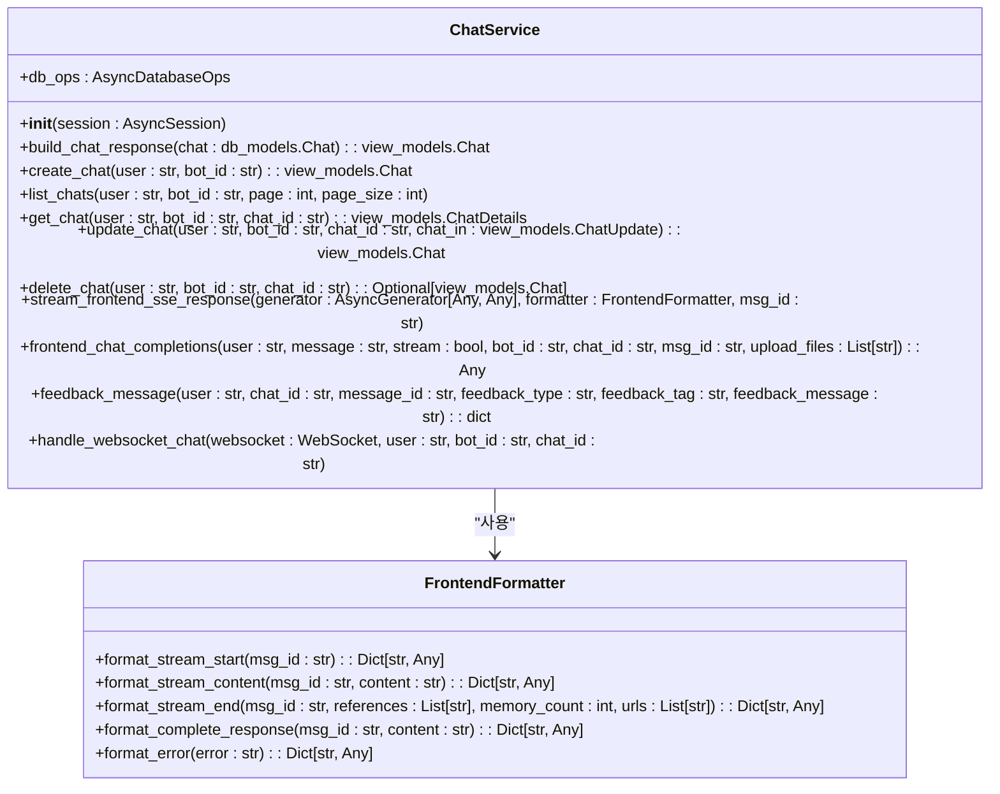
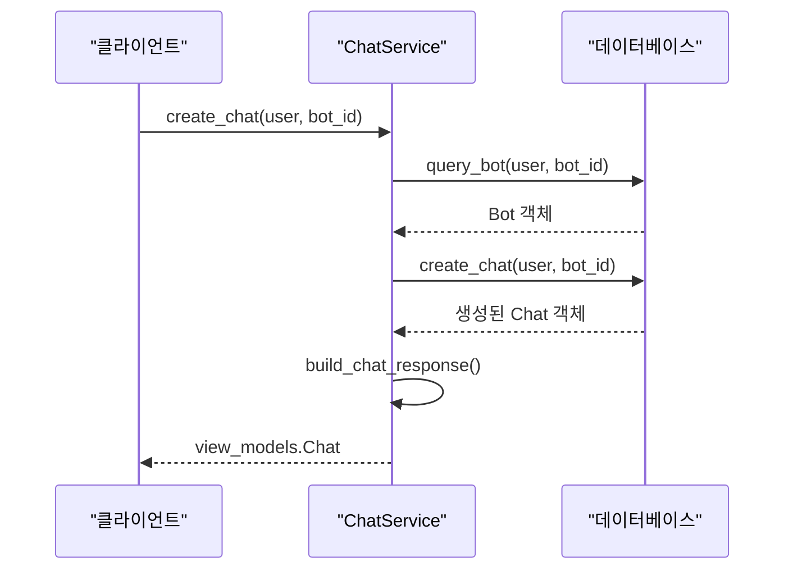
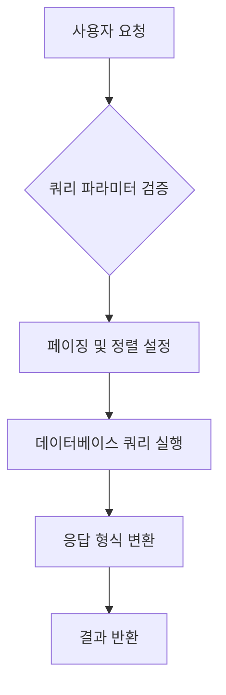
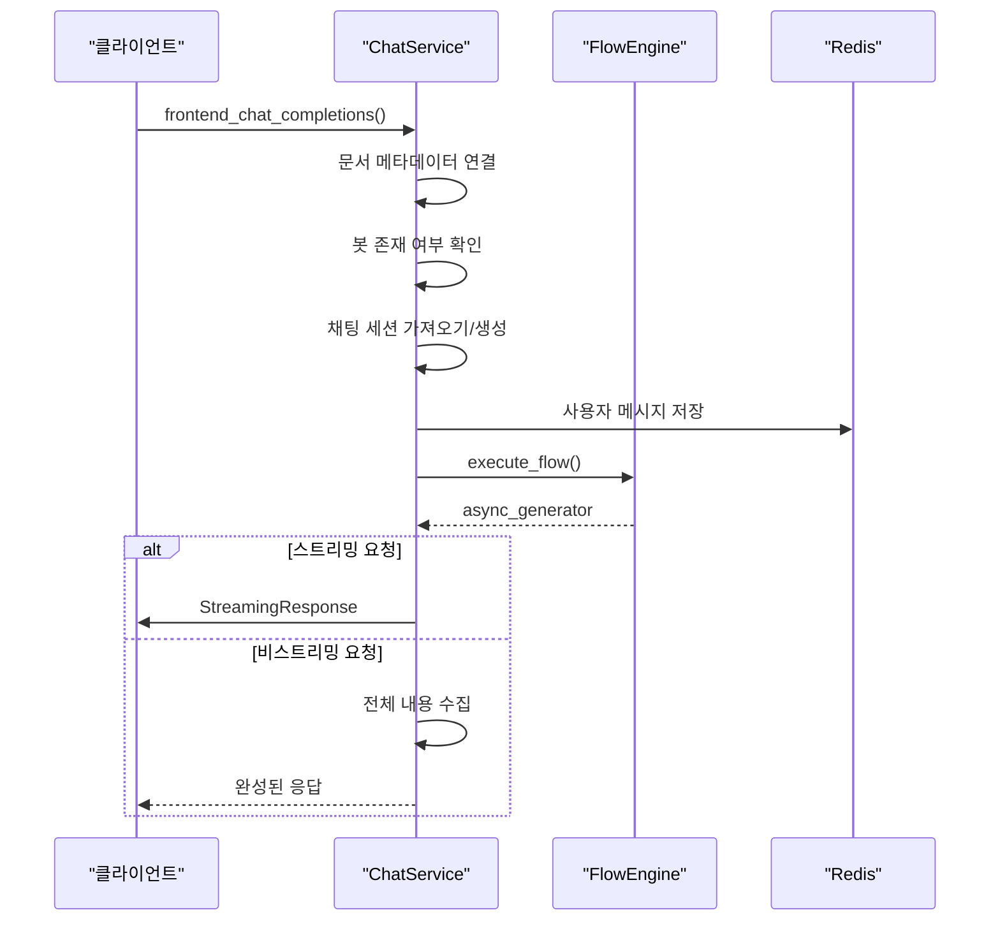
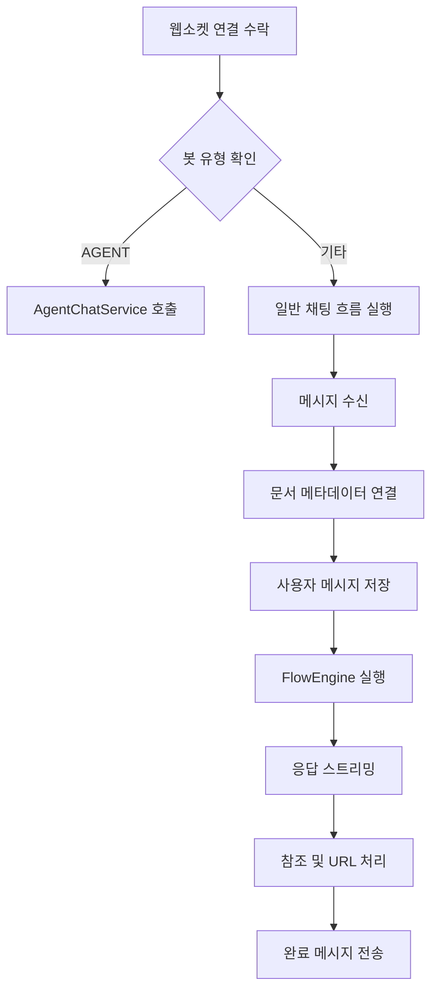
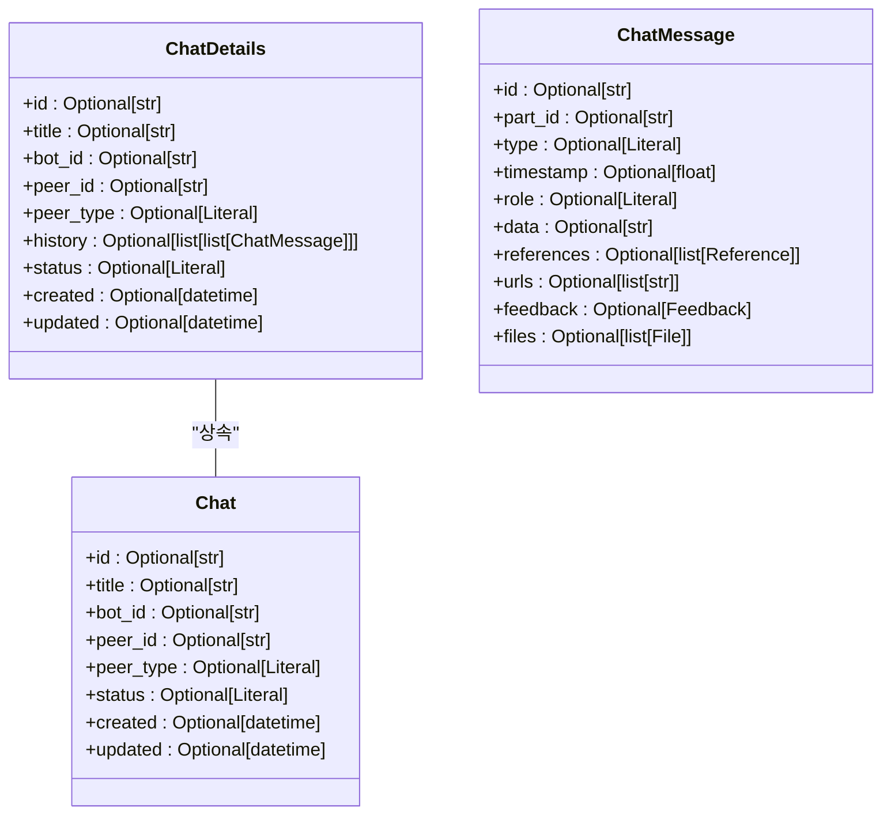
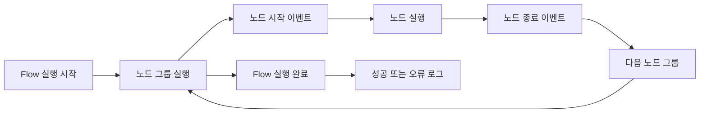
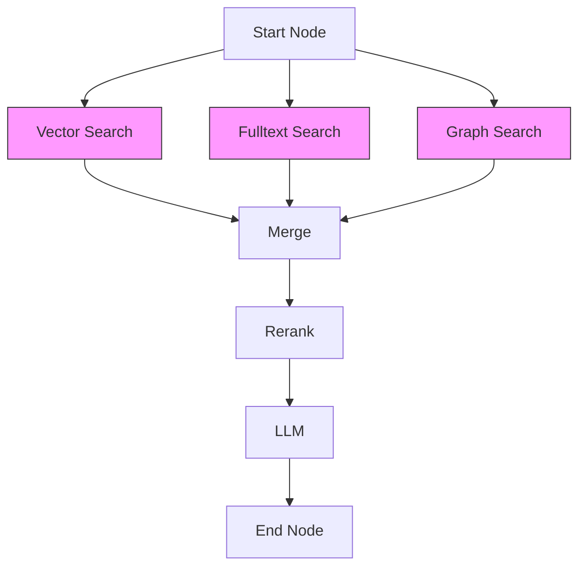

# 채팅 서비스

<cite>
**이 문서에서 참조한 파일**
- [chat_service.py](file://aperag/service/chat_service.py)
- [view_models.py](file://aperag/schema/view_models.py)
- [engine.py](file://aperag/flow/engine.py)
- [parser.py](file://aperag/flow/parser.py)
- [history.py](file://aperag/utils/history.py)
- [db/models.py](file://aperag/db/models.py)
</cite>

## 목차
1. [소개](#소개)
2. [핵심 구성 요소 분석](#핵심-구성-요소-분석)
3. [채팅 세션 관리](#채팅-세션-관리)
4. [메시지 처리 및 에이전트 통신 흐름](#메시지-처리-및-에이전트-통신-흐름)
5. [입력/출력 모델과의 연동](#입력출력-모델과의-연동)
6. [예외 처리 및 감사 로그 기록](#예외-처리-및-감사-로그-기록)
7. [성능 최적화 및 동시성 제어](#성능-최적화-및-동시성-제어)
8. [결론](#결론)

## 소개
ApeRAG의 채팅 서비스는 사용자와 AI 간의 대화를 관리하고 처리하는 핵심 기능을 제공합니다. 이 문서는 `chat_service.py`에서 구현된 주요 기능인 채팅 세션 관리, 메시지 처리, 에이전트 통신 흐름을 심층적으로 분석합니다. 또한 Service 계층에서 비즈니스 로직을 어떻게 처리하고 FlowEngine과 상호작용하는지 단계별로 설명하며, Pydantic 기반의 입력/출력 모델(`view_models.py`)과의 연동 방식, 예외 처리 전략, 감사 로그 기록 등을 포함합니다. 실제 코드 예제를 통해 채팅 생성, 메시지 전송, 응답 스트리밍 과정을 추적하고, 주요 메서드(`chat_completion`, `create_chat` 등)의 시그니처와 사용 사례를 문서화합니다.

**Section sources**
- [chat_service.py](file://aperag/service/chat_service.py#L1-L50)

## 핵심 구성 요소 분석

### ChatService 클래스
`ChatService` 클래스는 채팅 관련 비즈니스 로직을 처리하는 핵심 서비스입니다. 이 클래스는 데이터베이스 작업을 위한 `AsyncDatabaseOps` 인스턴스를 내부적으로 유지하며, 다양한 채팅 관련 작업을 수행합니다.



**Diagram sources**
- [chat_service.py](file://aperag/service/chat_service.py#L110-L549)

**Section sources**
- [chat_service.py](file://aperag/service/chat_service.py#L110-L549)

## 채팅 세션 관리

### 채팅 생성 및 조회
`ChatService`는 채팅 세션의 생성, 조회, 업데이트, 삭제를 담당합니다. 각 메서드는 데이터베이스 트랜잭션을 적절히 처리하며, 필요한 경우 Redis를 활용하여 채팅 기록을 관리합니다.

#### 채팅 생성 (create_chat)


**Diagram sources**
- [chat_service.py](file://aperag/service/chat_service.py#L132-L141)

#### 채팅 목록 조회 (list_chats)


**Diagram sources**
- [chat_service.py](file://aperag/service/chat_service.py#L143-L197)

**Section sources**
- [chat_service.py](file://aperag/service/chat_service.py#L132-L230)

## 메시지 처리 및 에이전트 통신 흐름

### 채팅 완료 처리 (frontend_chat_completions)
`frontend_chat_completions` 메서드는 사용자의 메시지를 처리하고 AI의 응답을 생성하는 핵심 흐름을 담당합니다. 이 과정에서는 FlowEngine을 사용하여 복잡한 처리 흐름을 실행합니다.



**Diagram sources**
- [chat_service.py](file://aperag/service/chat_service.py#L265-L366)

### 웹소켓 채팅 처리 (handle_websocket_chat)
웹소켓을 통한 실시간 채팅은 별도의 처리 흐름을 따릅니다. 이 메서드는 에이전트 유형에 따라 다른 서비스로 라우팅합니다.



**Diagram sources**
- [chat_service.py](file://aperag/service/chat_service.py#L415-L549)

**Section sources**
- [chat_service.py](file://aperag/service/chat_service.py#L265-L549)

## 입력/출력 모델과의 연동

### Pydantic 기반 View Models
`view_models.py` 파일에는 Pydantic을 사용하여 정의된 다양한 입력/출력 모델이 포함되어 있습니다. 이 모델들은 API 입출력의 일관성을 보장하고, 타입 안정성을 제공합니다.



**Diagram sources**
- [view_models.py](file://aperag/schema/view_models.py#L500-L600)

**Section sources**
- [view_models.py](file://aperag/schema/view_models.py#L1-L799)

## 예외 처리 및 감사 로그 기록

### 예외 처리 전략
채팅 서비스는 다양한 예외 상황을 처리하기 위해 체계적인 예외 처리 전략을 사용합니다. 주요 예외 유형으로는 리소스를 찾을 수 없는 경우와 채팅을 찾을 수 없는 경우가 있습니다.

```python
# 예외 클래스 정의
class ResourceNotFoundException(Exception):
    """요청한 리소스를 찾을 수 없을 때 발생"""
    pass

class ChatNotFoundException(Exception):
    """요청한 채팅을 찾을 수 없을 때 발생"""
    pass
```

각 메서드는 이러한 예외를 적절히 처리하며, 프론트엔드에 맞는 오류 응답 형식으로 변환합니다.

### 감사 로그 기록
시스템의 중요한 동작은 감사 로그로 기록됩니다. 특히 FlowEngine의 실행 과정은 상세한 로깅을 통해 추적 가능합니다.



**Section sources**
- [chat_service.py](file://aperag/service/chat_service.py#L265-L366)
- [engine.py](file://aperag/flow/engine.py#L100-L166)

## 성능 최적화 및 동시성 제어

### FlowEngine의 병렬 실행
FlowEngine은 의존성 그래프를 기반으로 노드들을 병렬로 실행할 수 있도록 설계되었습니다. `_find_parallel_groups` 메서드는 위상 정렬을 통해 동시에 실행 가능한 노드 그룹을 식별합니다.



위 다이어그램에서 Vector Search, Fulltext Search, Graph Search 노드는 동시에 실행될 수 있습니다.

### 동시성 제어
시스템은 Redis를 사용하여 채팅 기록을 관리함으로써, 여러 클라이언트 간의 상태 일관성을 유지합니다. `RedisChatMessageHistory` 클래스는 비동기적으로 메시지를 저장하고 조회합니다.

```python
class RedisChatMessageHistory:
    async def add_user_message(self, message: str, message_id: str, files: List[Dict[str, Any]] = None):
        """사용자 메시지를 Redis에 추가"""
        stored_message = create_user_message(
            content=message,
            chat_id=self.session_id,
            message_id=message_id,
            files=files,
        )
        await self.add_stored_message(stored_message)
```

**Section sources**
- [engine.py](file://aperag/flow/engine.py#L208-L241)
- [history.py](file://aperag/utils/history.py#L120-L212)

## 결론
ApeRAG의 채팅 서비스는 모던한 아키텍처 패턴을 적용하여 확장성과 유지보수성을 갖춘 시스템입니다. Service 계층은 비즈니스 로직을 명확하게 분리하고, FlowEngine을 통해 복잡한 처리 흐름을 유연하게 구성할 수 있습니다. Pydantic 기반의 입력/출력 모델은 타입 안정성을 보장하며, 체계적인 예외 처리와 로깅 전략은 시스템의 신뢰성을 높입니다. 또한, 병렬 실행과 효율적인 상태 관리를 통해 우수한 성능을 제공합니다.