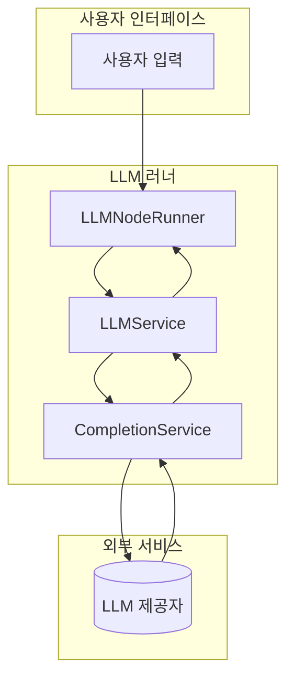
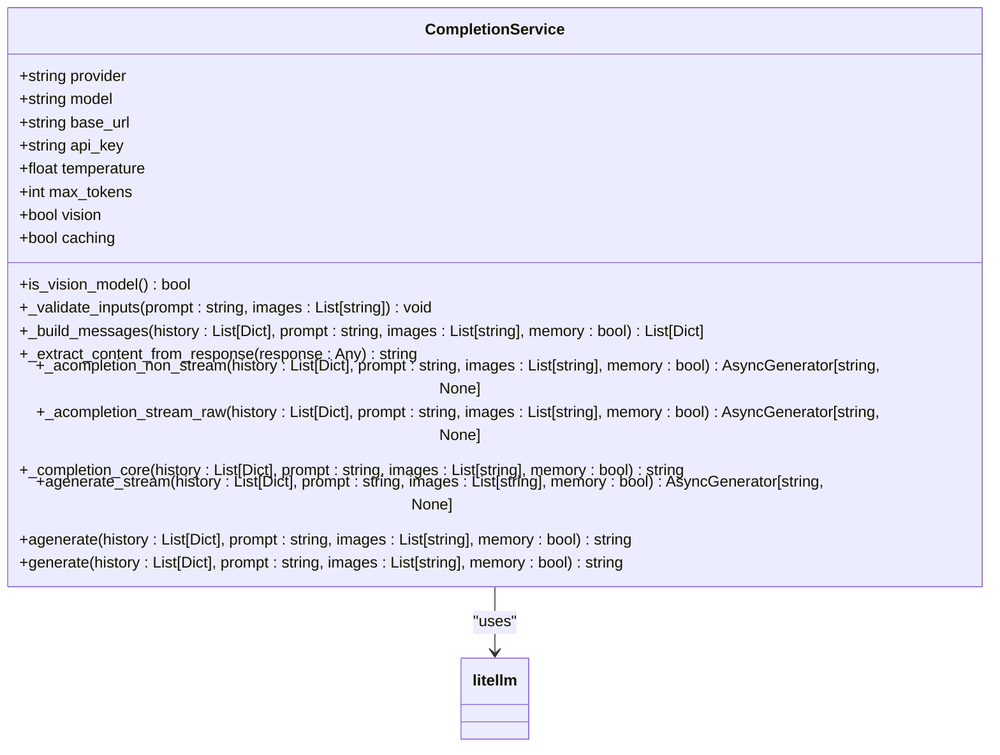
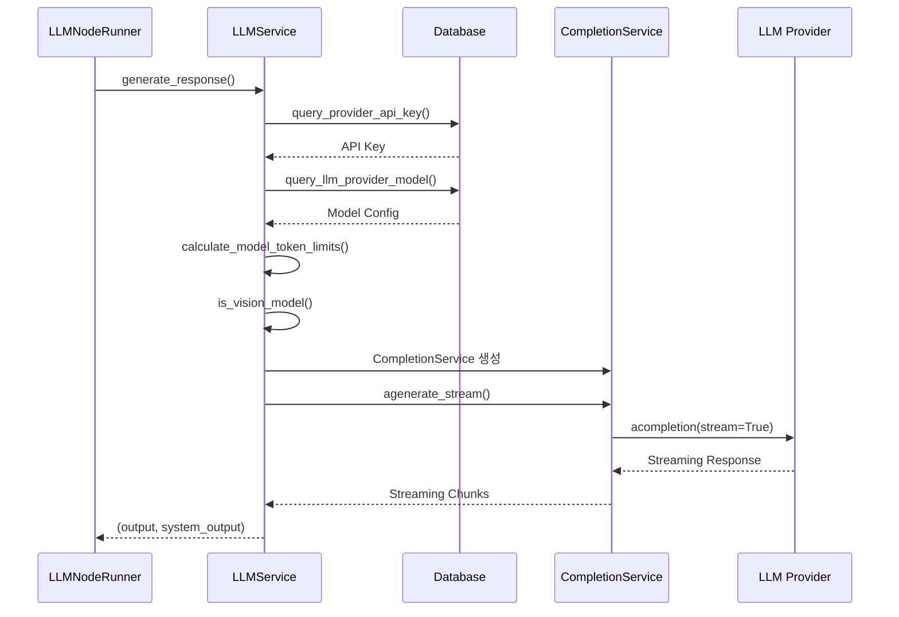
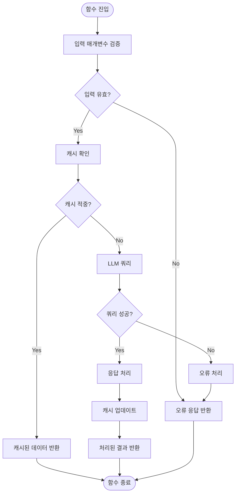

# LLM 러너

<cite>
**이 문서에서 참조된 파일**
- [completion_service.py](file://aperag/llm/completion/completion_service.py)
- [llm.py](file://aperag/flow/runners/llm.py)
- [litellm_cache.py](file://aperag/llm/litellm_cache.py)
- [llm_error_types.py](file://aperag/llm/llm_error_types.py)
</cite>

## 목차
1. [소개](#introduction)
2. [핵심 구성 요소](#core-components)
3. [아키텍처 개요](#architecture-overview)
4. [상세 구성 요소 분석](#detailed-component-analysis)
5. [의존성 분석](#dependency-analysis)
6. [성능 고려 사항](#performance-considerations)
7. [문제 해결 가이드](#troubleshooting-guide)
8. [결론](#conclusion)

## 소개

LLM 러너는 다양한 LLM 제공자와의 통합, 스트리밍 응답 처리, 캐싱 전략, 오류 재시도 메커니즘을 포함하여 ApeRAG 시스템 내에서 대규모 언어 모델(LLM) 호출을 관리하는 핵심 컴포넌트입니다. 이 문서는 LLM 러너의 구현 세부 사항을 설명하며, 특히 litellm을 통한 다양한 LLM 제공자와의 통합 방식, 시스템 프롬프트와 사용자 입력의 결합 로직, 컨텍스트 윈도우 관리, 토큰 수 계산 및 절단 전략에 중점을 둡니다.

LLM 러너는 CompletionService와 밀접하게 협력하여 노드 정의에서 LLM 호출로 이어지는 데이터 흐름을 추적합니다. 또한 성능 최적화를 위한 배치 처리 및 비용 모니터링 기능을 포함하고 있습니다. 이 문서는 실제 코드 예제를 통해 이러한 기능들이 어떻게 구현되고 상호작용하는지를 보여줍니다.

## 핵심 구성 요소

LLM 러너의 핵심은 `CompletionService` 클래스와 `LLMNodeRunner` 클래스 간의 상호작용에 있습니다. `CompletionService`는 litellm 라이브러리를 활용하여 다양한 LLM 제공자와의 통합을 담당하며, 동기 및 비동기 완성 요청을 처리합니다. 이 서비스는 `_acompletion_non_stream`, `_acompletion_stream_raw`, `_completion_core` 등의 내부 메서드를 통해 비동기 및 스트리밍 응답을 지원합니다.

반면, `LLMNodeRunner`는 플로우 엔진의 일환으로 작동하며, 사용자 입력과 시스템 입력을 받아 `LLMService`를 통해 LLM 응답을 생성합니다. 이 과정에서 `calculate_model_token_limits` 함수가 모델의 토큰 제한을 계산하여 컨텍스트 윈도우를 효과적으로 관리합니다.

**Section sources**
- [completion_service.py](file://aperag/llm/completion/completion_service.py#L27-L210)
- [llm.py](file://aperag/flow/runners/llm.py#L324-L352)

## 아키텍처 개요



**Diagram sources**
- [llm.py](file://aperag/flow/runners/llm.py#L324-L352)
- [completion_service.py](file://aperag/llm/completion/completion_service.py#L27-L210)

## 상세 구성 요소 분석

### CompletionService 분석

`CompletionService`는 LLM 호출의 핵심을 담당하는 클래스로, 다양한 LLM 제공자와의 통합을 가능하게 합니다. 이 클래스는 초기화 시 제공자(provider), 모델(model), 기본 URL(base_url), API 키(api_key) 등의 매개변수를 받아 설정합니다. 주요 메서드로는 `_validate_inputs`, `_build_messages`, `_extract_content_from_response` 등이 있으며, 각각 입력 검증, 메시지 배열 생성, 응답 내용 추출을 담당합니다.

비동기 완성 요청은 `_acompletion_non_stream` 및 `_acompletion_stream_raw` 메서드를 통해 처리되며, 이들은 litellm의 `acompletion` 함수를 호출하여 결과를 반환합니다. 동기 요청은 `_completion_core` 메서드를 통해 처리됩니다.

#### 클래스 다이어그램


**Diagram sources**
- [completion_service.py](file://aperag/llm/completion/completion_service.py#L27-L210)

**Section sources**
- [completion_service.py](file://aperag/llm/completion/completion_service.py#L27-L210)

### LLMNodeRunner 분석

`LLMNodeRunner`는 플로우 엔진에서 LLM 노드를 실행하는 역할을 담당합니다. 이 클래스는 `register_node_runner` 데코레이터를 사용하여 "llm" 유형의 노드 러너로 등록되며, `run` 메서드를 통해 실행됩니다. `run` 메서드는 사용자 입력(ui)과 시스템 입력(si)을 받아 `LLMService`의 `generate_response` 메서드를 호출하여 응답을 생성합니다.

`LLMService`는 `LLMRepository`를 의존성으로 가지며, 데이터베이스 작업을 수행합니다. `generate_response` 메서드는 API 키 조회, 모델 구성 조회, 컨텍스트 윈도우 계산, 이미지 처리 등을 포함하여 복잡한 비즈니스 로직을 수행합니다.

#### 시퀀스 다이어그램


**Diagram sources**
- [llm.py](file://aperag/flow/runners/llm.py#L324-L352)
- [completion_service.py](file://aperag/llm/completion/completion_service.py#L27-L210)

**Section sources**
- [llm.py](file://aperag/flow/runners/llm.py#L324-L352)

### 캐싱 전략 분석

LLM 러너는 `litellm_cache.py` 모듈을 통해 캐싱 전략을 구현합니다. 이 모듈은 Redis 또는 디스크 캐시를 사용하여 LLM 응답을 저장하고 재사용함으로써 성능을 향상시킵니다. `setup_litellm_cache` 함수는 캐시를 초기화하고, `setup_custom_get_cache` 및 `setup_custom_add_cache` 함수는 캐시 조회 및 추가 시 로컬 통계를 추적합니다.

캐시 키는 모델, 메시지, 온도, logit_bias 등의 매개변수를 조합하여 생성되며, `custom_get_cache_key` 함수를 통해 사용자 정의됩니다. 캐시 통계는 `_cache_stats` 전역 변수에 저장되며, `get_cache_stats` 함수를 통해 조회할 수 있습니다.

#### 흐름도


**Diagram sources**
- [litellm_cache.py](file://aperag/llm/litellm_cache.py#L0-L182)

**Section sources**
- [litellm_cache.py](file://aperag/llm/litellm_cache.py#L0-L182)

## 의존성 분석

LLM 러너는 여러 외부 모듈과 밀접하게 의존하고 있습니다. 가장 중요한 의존성은 litellm 라이브러리로, 다양한 LLM 제공자와의 통합을 가능하게 합니다. 또한 Redis 또는 디스크 캐시를 사용하여 응답을 저장하고 재사용함으로써 성능을 향상시킵니다.

데이터베이스 의존성으로는 `async_db_ops` 모듈을 통해 LLM 제공자 정보, API 키, 모델 구성 등을 조회합니다. 객체 저장소(`objectstore`)는 이미지 자산을 가져오는 데 사용됩니다.

```mermaid
graph TD
LLMRunner --> litellm : "LLM 통합"
LLMRunner --> Redis : "캐시 저장"
LLMRunner --> Database : "모델 구성 조회"
LLMRunner --> ObjectStore : "이미지 자산 가져오기"
```

**Diagram sources**
- [completion_service.py](file://aperag/llm/completion/completion_service.py#L27-L210)
- [llm.py](file://aperag/flow/runners/llm.py#L324-L352)
- [litellm_cache.py](file://aperag/llm/litellm_cache.py#L0-L182)

**Section sources**
- [completion_service.py](file://aperag/llm/completion/completion_service.py#L27-L210)
- [llm.py](file://aperag/flow/runners/llm.py#L324-L352)
- [litellm_cache.py](file://aperag/llm/litellm_cache.py#L0-L182)

## 성능 고려 사항

LLM 러너는 성능 최적화를 위해 여러 전략을 사용합니다. 첫째, 캐싱을 통해 반복적인 LLM 호출을 방지하고 응답 시간을 단축합니다. 둘째, 비동기 처리를 통해 I/O 대기 시간을 최소화하고 동시성을 높입니다. 셋째, 컨텍스트 윈도우를 효율적으로 관리하여 토큰 사용량을 최적화합니다.

`calculate_model_token_limits` 함수는 모델의 입력 및 출력 토큰 제한을 계산하여, 입력 길이가 너무 길거나 출력 공간이 부족하지 않도록 합니다. 이는 비용 효율성과 성능 모두에 긍정적인 영향을 미칩니다.

또한, `TOKEN_TO_CHAR_RATIO` 상수를 사용하여 문자 수를 토큰 수로 변환함으로써, 중국어나 혼합 콘텐츠에 대한 보수적인 추정치를 제공합니다. 이는 토큰 한도를 초과하는 것을 방지하는 데 도움이 됩니다.

## 문제 해결 가이드

LLM 러너는 다양한 오류 상황에 대해 포괄적인 오류 처리 메커니즘을 제공합니다. `llm_error_types.py` 모듈은 `LLMError`를 기반으로 하는 계층적 예외 구조를 정의하며, 구성 오류, API 오류, 완성 전용 오류, 임베딩 전용 오류 등을 구분합니다.

주요 예외 유형으로는 `ProviderNotFoundError`, `ModelNotFoundError`, `InvalidConfigurationError`, `AuthenticationError`, `RateLimitError`, `TimeoutError`, `QuotaExceededError`, `ServerError`, `InvalidPromptError` 등이 있습니다. `wrap_litellm_error` 함수는 litellm에서 발생한 예외를 이러한 사용자 정의 예외로 변환합니다.

`is_retryable_error` 함수는 오류가 재시도 가능한지 여부를 판단합니다. 구성 오류, 입력 검증 오류, 인증 오류, 할당량 초과 오류는 재시도할 수 없으며, 반면 속도 제한 오류, 타임아웃 오류, 서버 오류는 재시도할 수 있습니다.

**Section sources**
- [llm_error_types.py](file://aperag/llm/llm_error_types.py#L0-L410)

## 결론

LLM 러너는 ApeRAG 시스템에서 핵심적인 역할을 하는 컴포넌트로, 다양한 LLM 제공자와의 통합, 스트리밍 응답 처리, 캐싱 전략, 오류 재시도 메커니즘을 포함하여 복잡한 기능을 제공합니다. CompletionService와 LLMNodeRunner의 협력을 통해 노드 정의에서 LLM 호출로 이어지는 데이터 흐름을 효과적으로 관리하며, 성능 최적화를 위한 배치 처리 및 비용 모니터링 기능도 포함하고 있습니다.

이 문서는 LLM 러너의 구현 세부 사항을 깊이 있게 분석하여, 개발자들이 이 컴포넌트를 이해하고 확장할 수 있도록 돕습니다.