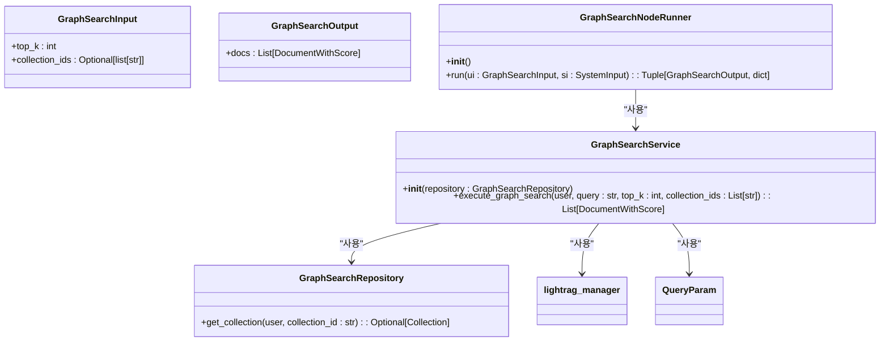
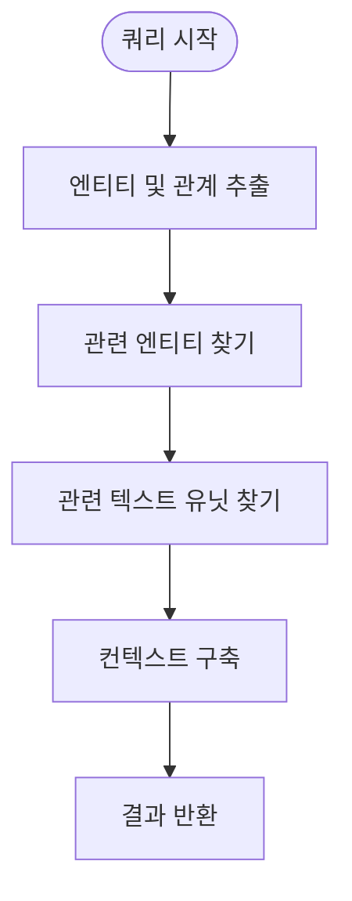
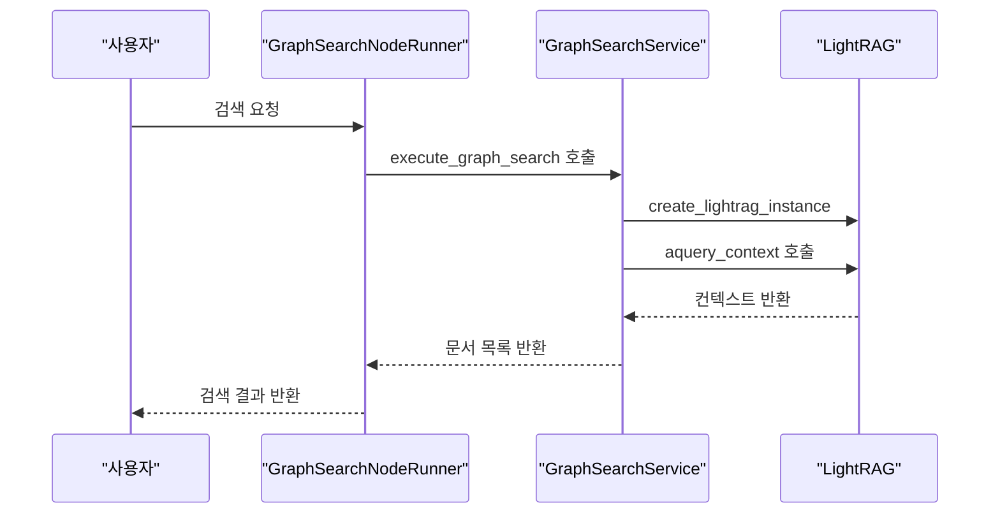
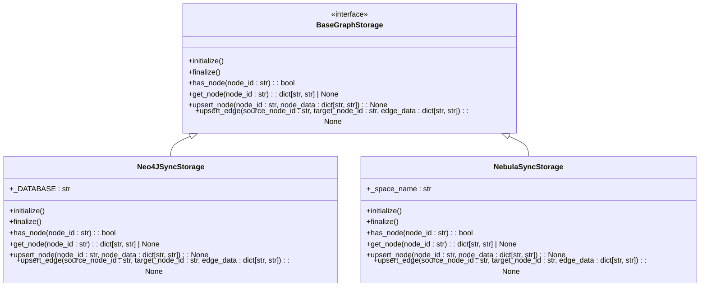
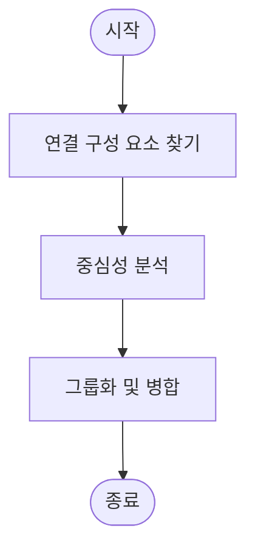
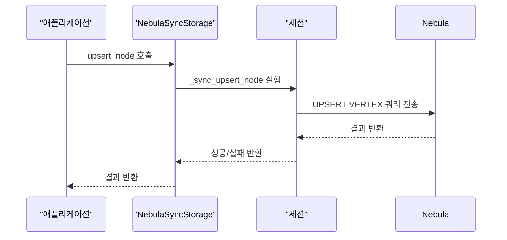

# 그래프 검색 러너

<cite>
**이 문서에서 참조한 파일**
- [graph_search.py](file://aperag/flow/runners/graph_search.py)
- [lightrag.py](file://aperag/graph/lightrag/lightrag.py)
- [operate.py](file://aperag/graph/lightrag/operate.py)
- [nebula_sync_impl.py](file://aperag/graph/lightrag/kg/nebula_sync_impl.py)
- [neo4j_sync_impl.py](file://aperag/graph/lightrag/kg/neo4j_sync_impl.py)
- [utils_graph.py](file://aperag/graph/lightrag/utils_graph.py)
</cite>

## 목차
1. [소개](#소개)
2. [핵심 구성 요소](#핵심-구성-요소)
3. [엔티티 및 관계 검색 메커니즘](#엔티티-및-관계-검색-메커니즘)
4. [Cypher 쿼리 생성 로직](#cypher-쿼리-생성-로직)
5. [그래프 데이터베이스 연동](#그래프-데이터베이스-연동)
6. [고급 그래프 알고리즘 활용](#고급-그래프-알고리즘-활용)
7. [그래프 데이터 동기화 및 일관성 유지](#그래프-데이터-동기화-및-일관성-유지)
8. [결론](#결론)

## 소개
이 문서는 ApeRAG 시스템 내의 그래프 검색 러너의 내부 동작을 설명합니다. LightRAG 기반 지식 그래프를 활용하여 엔티티 및 관계를 검색하는 방식, Cypher 쿼리 생성 로직, Neo4j 또는 NebulaGraph와의 연동 방법을 다룹니다. 또한 경로 탐색, 중심성 분석, 연결 구성 요소 최적화 등의 고급 그래프 알고리즘 활용 사례와 그래프 데이터의 실시간 동기화(nebula_sync_impl.py) 및 일관성 유지 전략도 포함합니다.

**Section sources**
- [graph_search.py](file://aperag/flow/runners/graph_search.py#L0-L109)

## 핵심 구성 요소
그래프 검색 러너는 주로 `GraphSearchNodeRunner` 클래스를 중심으로 구성되며, 이는 사용자 입력과 시스템 입력을 받아 그래프 검색을 수행합니다. 검색 결과는 상위 `k`개의 문서로 반환되며, 컬렉션 ID가 제공되지 않으면 기본적으로 첫 번째 컬렉션이 사용됩니다. LightRAG 인스턴스는 컬렉션 설정에 따라 생성되며, 하이브리드 모드에서만 컨텍스트를 필요로 하는 쿼리가 실행됩니다.

**Diagram sources**
- [graph_search.py](file://aperag/flow/runners/graph_search.py#L38-L108)

**Section sources**
- [graph_search.py](file://aperag/flow/runners/graph_search.py#L38-L108)

## 엔티티 및 관계 검색 메커니즘
LightRAG은 지식 그래프에서 엔티티와 관계를 추출하고 검색하기 위해 다양한 함수를 사용합니다. `_find_most_related_entities_from_relationships` 함수는 엣지 데이터로부터 관련된 엔티티를 찾으며, 노드 정보와 차수(degree)를 동시에 가져옵니다. `_find_related_text_unit_from_relationships` 함수는 엣지 데이터로부터 관련된 텍스트 유닛을 찾습니다. `kg_query` 함수는 지식 그래프 쿼리를 수행하며, 엔티티, 관계, 텍스트 유닛을 조합하여 최종 컨텍스트를 생성합니다.

**Diagram sources**
- [operate.py](file://aperag/graph/lightrag/operate.py#L1581-L1732)
- [lightrag.py](file://aperag/graph/lightrag/lightrag.py#L1734-L1761)

**Section sources**
- [operate.py](file://aperag/graph/lightrag/operate.py#L1581-L1732)
- [lightrag.py](file://aperag/graph/lightrag/lightrag.py#L1734-L1761)

## Cypher 쿼리 생성 로직
그래프 검색 러너는 Cypher 쿼리를 직접 생성하지 않고, LightRAG의 내부 메커니즘을 통해 검색을 수행합니다. `QueryParam` 객체를 사용하여 쿼리 모드(hybrid), 컨텍스트 필요 여부(only_need_context), 상위 k개 결과(top_k) 등을 설정합니다. 이후 `rag.aquery_context` 메서드를 호출하여 실제 쿼리를 실행합니다. 이 과정에서 LightRAG은 내부적으로 적절한 Cypher 쿼리를 생성하고 실행합니다.

**Diagram sources**
- [graph_search.py](file://aperag/flow/runners/graph_search.py#L69-L108)
- [lightrag.py](file://aperag/graph/lightrag/lightrag.py#L1734-L1761)

**Section sources**
- [graph_search.py](file://aperag/flow/runners/graph_search.py#L69-L108)
- [lightrag.py](file://aperag/graph/lightrag/lightrag.py#L1734-L1761)

## 그래프 데이터베이스 연동
ApeRAG은 Neo4j와 NebulaGraph 모두와 연동할 수 있도록 설계되어 있습니다. `Neo4JSyncStorage`와 `NebulaSyncStorage` 클래스는 각각 Neo4j와 NebulaGraph를 위한 저장소 구현체입니다. 두 클래스 모두 `BaseGraphStorage`를 상속받아 일관된 인터페이스를 제공합니다. `STORAGES` 딕셔너리는 저장소 구현체 이름과 클래스를 매핑하여 동적으로 인스턴스를 생성할 수 있게 합니다.

**Diagram sources**
- [neo4j_sync_impl.py](file://aperag/graph/lightrag/kg/neo4j_sync_impl.py#L60-L633)
- [nebula_sync_impl.py](file://aperag/graph/lightrag/kg/nebula_sync_impl.py#L158-L815)
- [kg/__init__.py](file://aperag/graph/lightrag/kg/__init__.py#L32-L67)

**Section sources**
- [neo4j_sync_impl.py](file://aperag/graph/lightrag/kg/neo4j_sync_impl.py#L60-L633)
- [nebula_sync_impl.py](file://aperag/graph/lightrag/kg/nebula_sync_impl.py#L158-L815)
- [kg/__init__.py](file://aperag/graph/lightrag/kg/__init__.py#L32-L67)

## 고급 그래프 알고리즘 활용
LightRAG은 경로 탐색, 중심성 분석, 연결 구성 요소 최적화 등의 고급 그래프 알고리즘을 활용합니다. `_find_connected_components` 함수는 추출된 엔티티와 관계에서 연결된 구성 요소를 찾습니다. `node_degree`와 `edge_degree` 함수는 노드와 엣지의 차수를 계산하여 중심성을 분석합니다. `merge_nodes_and_edges` 함수는 연결된 구성 요소를 그룹화하여 병합 처리를 수행합니다.

**Diagram sources**
- [lightrag.py](file://aperag/graph/lightrag/lightrag.py#L1850-L1889)
- [operate.py](file://aperag/graph/lightrag/operate.py#L1850-L1889)

**Section sources**
- [lightrag.py](file://aperag/graph/lightrag/lightrag.py#L1850-L1889)
- [operate.py](file://aperag/graph/lightrag/operate.py#L1850-L1889)

## 그래프 데이터 동기화 및 일관성 유지
`NebulaSyncStorage` 클래스는 NebulaGraph와의 동기화를 담당합니다. `initialize` 메서드는 저장소를 초기화하고, `finalize` 메서드는 리소스를 정리합니다. `upsert_node`와 `upsert_edge` 메서드는 노드와 엣지를 삽입하거나 업데이트합니다. `remove_nodes`와 `remove_edges` 메서드는 노드와 엣지를 삭제합니다. 이러한 작업들은 작은 배치 크기로 처리되어 쿼리 계획 트리 깊이 제한을 피합니다.

**Diagram sources**
- [nebula_sync_impl.py](file://aperag/graph/lightrag/kg/nebula_sync_impl.py#L158-L815)

**Section sources**
- [nebula_sync_impl.py](file://aperag/graph/lightrag/kg/nebula_sync_impl.py#L158-L815)

## 결론
이 문서는 ApeRAG의 그래프 검색 러너가 LightRAG 기반 지식 그래프에서 엔티티 및 관계를 검색하는 방식, Cypher 쿼리 생성 로직, Neo4j 또는 NebulaGraph와의 연동 방법을 설명했습니다. 또한 경로 탐색, 중심성 분석, 연결 구성 요소 최적화 등의 고급 그래프 알고리즘 활용 사례와 그래프 데이터의 실시간 동기화 및 일관성 유지 전략을 다뤘습니다. 이를 통해 ApeRAG의 그래프 검색 기능의 내부 동작을 이해할 수 있습니다.