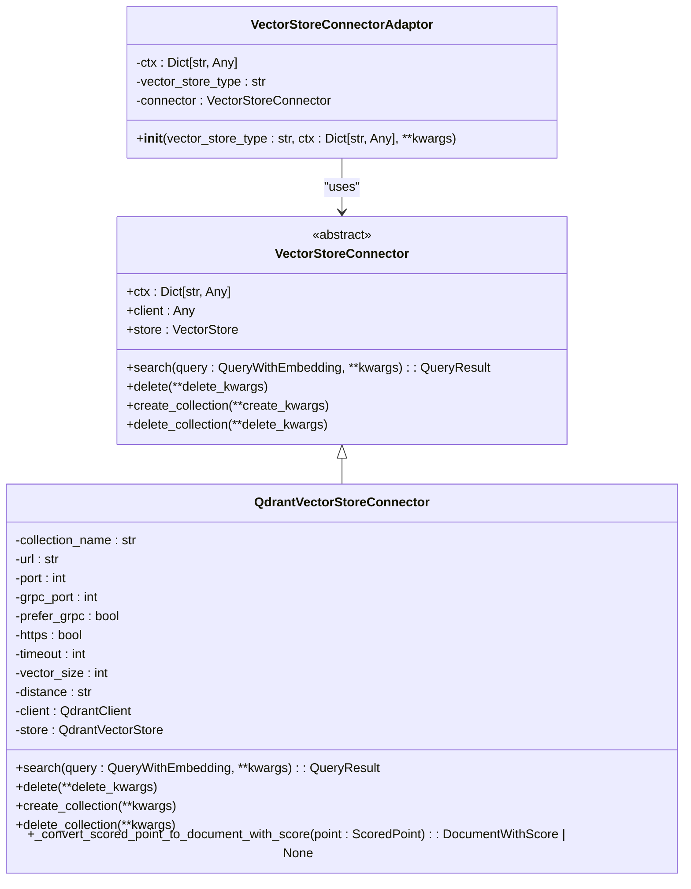
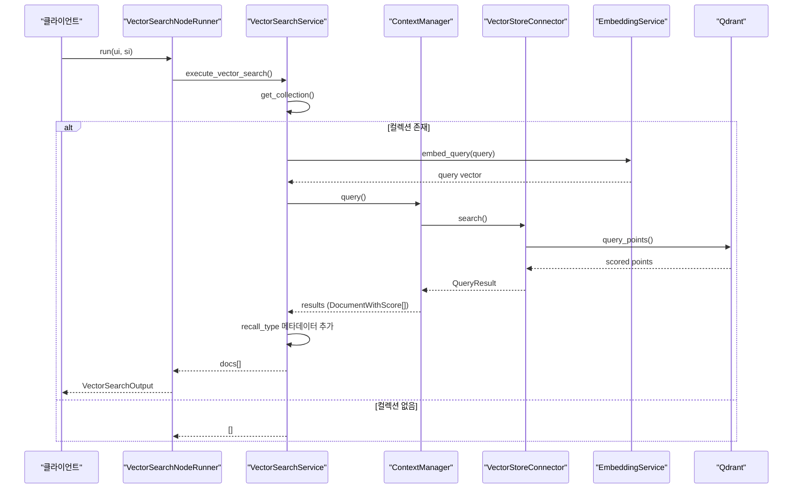
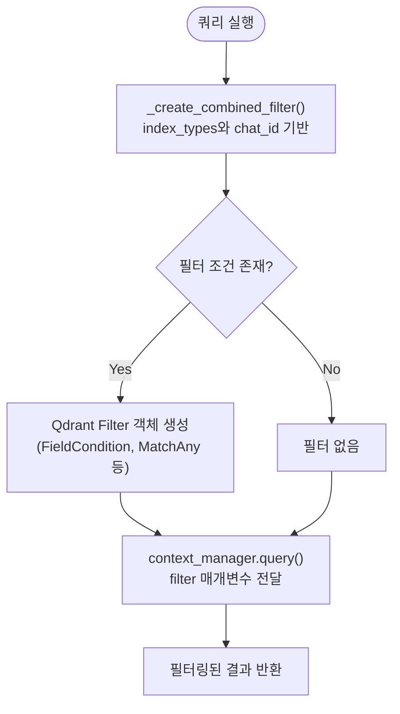
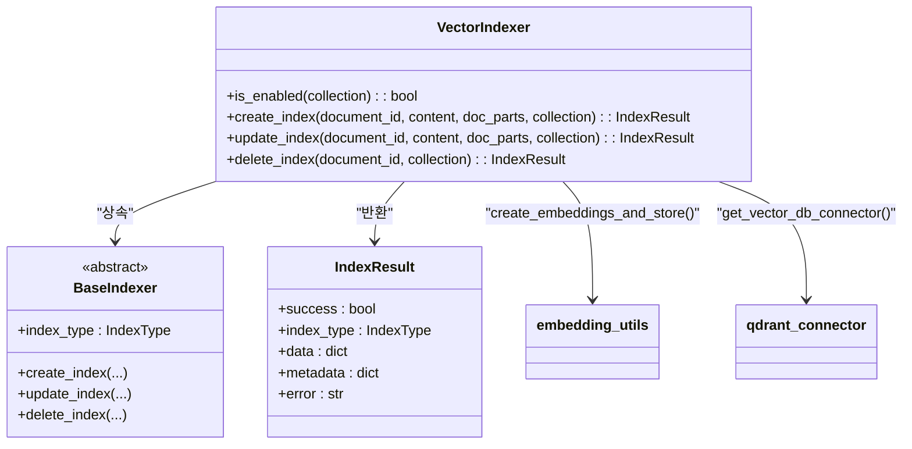

# 벡터 검색 러너

<cite>
**이 문서에서 참조한 파일**
- [vector_search.py](file://aperag/flow/runners/vector_search.py)
- [vector_index.py](file://aperag/index/vector_index.py)
- [qdrant_connector.py](file://aperag/vectorstore/qdrant_connector.py)
- [context.py](file://aperag/context/context.py)
- [base_embedding.py](file://aperag/llm/embed/base_embedding.py)
- [embedding_utils.py](file://aperag/llm/embed/embedding_utils.py)
</cite>

## 목차
1. [소개](#소개)
2. [벡터 저장소 연결 구조](#벡터-저장소-연결-구조)
3. [임베딩 생성 및 검색 흐름](#임베딩-생성-및-검색-흐름)
4. [검색 파라미터 설정](#검색-파라미터-설정)
5. [필터링 조건 적용](#필터링-조건-적용)
6. [멀티모달 지원 여부](#멀티모달-지원-여부)
7. [성능 최적화 및 인덱스 전략](#성능-최적화-및-인덱스-전략)
8. [vector_index.py와의 상호작용](#vector_indexpy와의-상호작용)

## 소개
이 문서는 ApeRAG 시스템 내 벡터 검색 러너(Vector Search Runner)의 작동 원리를 상세히 설명합니다. Qdrant 기반 벡터 저장소와의 연결 방식, 임베딩 생성 후 유사도 기반 검색 수행 과정, 검색 파라미터(최대 결과 수, 유사도 임계값 등)의 설정 방법을 다룹니다. 또한 필터링 조건 적용 방법과 멀티모달 지원 여부를 분석하며, 검색 성능 최적화를 위한 인덱스 전략과 HNSW 파라미터 튜닝 가이드를 포함합니다. 마지막으로 `vector_index.py` 모듈과의 상호작용을 코드 예제 중심으로 설명합니다.

## 벡터 저장소 연결 구조
ApeRAG는 Qdrant를 주요 벡터 저장소로 사용하며, 이를 추상화한 어댑터 패턴을 통해 유연한 연결을 제공합니다. `VectorStoreConnectorAdaptor`는 벡터 저장소 타입에 따라 적절한 커넥터를 동적으로 로드하여 연결을 관리합니다.

**다이어그램 출처**
- [qdrant_connector.py](file://aperag/vectorstore/qdrant_connector.py#L16-L114)
- [connector.py](file://aperag/vectorstore/connector.py#L3-L15)
- [base.py](file://aperag/vectorstore/base.py#L9-L30)

**섹션 출처**
- [qdrant_connector.py](file://aperag/vectorstore/qdrant_connector.py#L16-L114)
- [connector.py](file://aperag/vectorstore/connector.py#L3-L15)

## 임베딩 생성 및 검색 흐름
벡터 검색은 사용자 쿼리에 대한 임베딩 생성부터 시작되어, 벡터 저장소에서 유사도 기반 검색을 수행하는 일련의 과정을 포함합니다. 이 과정은 `ContextManager`를 중심으로 구성되며, `VectorSearchService`가 비즈니스 로직을 담당합니다.

**다이어그램 출처**
- [vector_search.py](file://aperag/flow/runners/vector_search.py#L59-L118)
- [context.py](file://aperag/context/context.py#L21-L149)
- [qdrant_connector.py](file://aperag/vectorstore/qdrant_connector.py#L16-L114)

**섹션 출처**
- [vector_search.py](file://aperag/flow/runners/vector_search.py#L59-L118)
- [context.py](file://aperag/context/context.py#L21-L149)

## 검색 파라미터 설정
벡터 검색 러너는 사용자가 다양한 파라미터를 통해 검색 동작을 제어할 수 있도록 설계되어 있습니다. 주요 파라미터는 다음과 같습니다:

| 파라미터 이름 | 설명 | 기본값 | 데이터 타입 |
|---------------|------|--------|-----------|
| `top_k` | 반환할 최대 결과 수 | 5 | 정수 |
| `similarity_threshold` | 유사도 임계값 (점수가 이 값 이상인 결과만 반환) | 0.2 | 실수 |
| `collection_ids` | 검색 대상 컬렉션 ID 목록 | 빈 리스트 | 문자열 배열 |
| `chat_id` | 특정 채팅 세션의 문서만 검색하기 위한 ID | None | 문자열 |

이들 파라미터는 `VectorSearchInput` Pydantic 모델을 통해 정의되며, `VectorSearchNodeRunner`가 시스템 입력(`SystemInput`)과 결합하여 `VectorSearchService`에 전달합니다.

**섹션 출처**
- [vector_search.py](file://aperag/flow/runners/vector_search.py#L34-L55)

## 필터링 조건 적용
시스템은 두 가지 핵심 필터링 조건을 지원합니다: 인덱스 타입 필터링과 채팅 ID 기반 필터링입니다. `ContextManager._create_combined_filter()` 메서드는 Qdrant 전용 필터 객체를 생성하여, 지정된 인덱스 타입(`index_types`) 또는 채팅 ID(`chat_id`)에 맞춰 검색 결과를 좁힙니다.

예를 들어, `index_types=["vector"]`로 설정하면 벡터 인덱스만 검색 대상이 되며, 기존 벡터 중 `indexer` 필드가 없는 경우를 위해 호환성을 유지하는 `IsEmptyCondition`도 함께 적용됩니다. `chat_id`가 지정되면 해당 채팅과 연관된 문서만 반환됩니다.

**다이어그램 출처**
- [context.py](file://aperag/context/context.py#L21-L149)

**섹션 출처**
- [context.py](file://aperag/context/context.py#L21-L149)

## 멀티모달 지원 여부
현재 벡터 검색 러너는 텍스트 기반 검색을 중심으로 동작하지만, 시스템 전체적으로 멀티모달 지원을 위한 기반 구조가 마련되어 있습니다. `EmbeddingService` 클래스는 `multimodal` 플래그를 통해 멀티모달 모델 사용 여부를 결정하며, `embed_documents()` 메서드는 이론적으로 이미지와 텍스트를 모두 처리할 수 있는 확장 가능성을 가지고 있습니다.

그러나 현재 `create_embeddings_and_store()` 함수는 `Part` 객체의 `content`를 텍스트로 간주하여 처리하고 있으며, 이미지 데이터를 직접 처리하는 로직은 구현되어 있지 않습니다. 따라서 **이미지-텍스트 검색 기능은 현재 활성화되지 않았으며**, 향후 `docparser`와 `vision_index.py` 모듈의 확장을 통해 구현될 것으로 예상됩니다.

**섹션 출처**
- [embedding_service.py](file://aperag/llm/embed/embedding_service.py#L33-L205)
- [embedding_utils.py](file://aperag/llm/embed/embedding_utils.py#L34-L117)
- [vision_index.py](file://aperag/index/vision_index.py#L139-L139)

## 성능 최적화 및 인덱스 전략
벡터 검색 성능은 주로 Qdrant의 HNSW(Hierarchical Navigable Small World) 인덱스 전략에 의해 결정됩니다. 시스템은 검색 요청 시 `search_params={"hnsw_ef": 128, "exact": False}`를 기본으로 설정하여, 균형 잡힌 정확도와 속도를 제공합니다.

- `hnsw_ef`: 검색 효율성 파라미터로, 값이 클수록 정확도는 높아지지만 속도는 느려집니다.
- `exact`: 정밀 검색 여부. `False`일 경우 근사 근접 검색(Approximate Nearest Neighbor)을 수행하여 속도를 우선시합니다.

또한, 임베딩 서비스는 `ThreadPoolExecutor`를 사용하여 배치 임베딩을 병렬 처리하며, `max_workers=8`로 설정하여 CPU 리소스를 효과적으로 활용합니다. 캐싱 기능(`caching=True`)도 활성화되어 있어 반복적인 쿼리에 대해 응답 시간을 크게 단축시킵니다.

**섹션 출처**
- [context.py](file://aperag/context/context.py#L21-L149)
- [embedding_service.py](file://aperag/llm/embed/embedding_service.py#L33-L205)

## vector_index.py와의 상호작용
`vector_index.py` 모듈의 `VectorIndexer` 클래스는 문서의 벡터 인덱스 생성, 업데이트, 삭제를 담당합니다. 이는 `vector_search.py`의 검색 기능과 밀접하게 연동됩니다.

- **인덱스 생성**: `create_index()` 메서드는 문서 파트를 청크화하고, `create_embeddings_and_store()`를 호출하여 임베딩을 생성하고 Qdrant에 저장합니다.
- **인덱스 업데이트**: 기존 벡터를 삭제한 후 새로운 벡터를 생성하여 일관성을 유지합니다.
- **인덱스 삭제**: `DocumentIndex` DB에서 context ID를 조회한 후, Qdrant 커넥터를 통해 해당 벡터를 삭제합니다.

이러한 인덱싱 작업은 검색 전제 조건이며, `vector_search.py`는 오직 인덱싱된 데이터만을 대상으로 검색을 수행합니다.

**다이어그램 출처**
- [vector_index.py](file://aperag/index/vector_index.py#L30-L236)

**섹션 출처**
- [vector_index.py](file://aperag/index/vector_index.py#L30-L236)
- [embedding_utils.py](file://aperag/llm/embed/embedding_utils.py#L34-L117)
- [vector_search.py](file://aperag/flow/runners/vector_search.py#L59-L118)