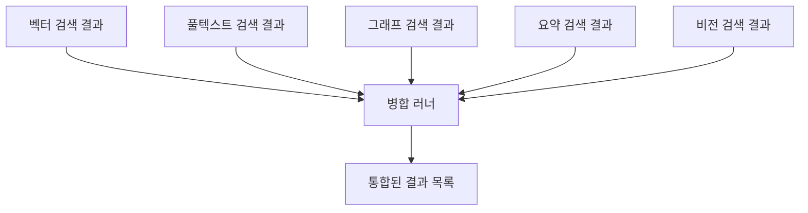
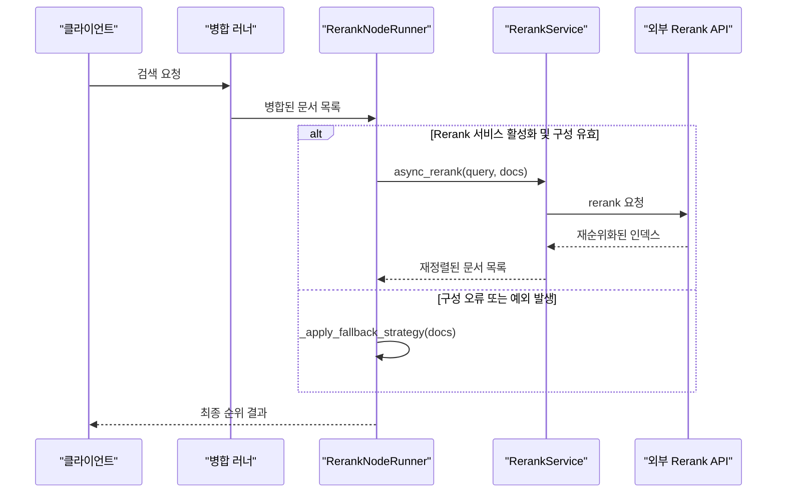

# 병합 러너

<cite>
**이 문서에서 참조한 파일**
- [merge.py](file://aperag/flow/runners/merge.py)
- [rerank_service.py](file://aperag/llm/rerank/rerank_service.py)
- [rerank.py](file://aperag/flow/runners/rerank.py)
</cite>

## 목차
1. [소개](#소개)
2. [병합 전략 및 구현](#병합-전략-및-구현)
3. [결과 재순위화(reranking) 프로세스](#결과-재순위화reranking-프로세스)
4. [중복 제거 알고리즘](#중복-제거-알고리즘)
5. [지연 시간 및 정확도 간 트레이드오프와 최적화 가이드](#지연-시간-및-정확도-간-트레이드오프와-최적화-가이드)
6. [플러그인 아키텍처 및 확장성](#플러그인-아키텍처-및-확장성)

## 소개

이 문서는 ApeRAG 시스템 내에서 다양한 검색 결과(벡터, 풀텍스트, 그래프 등)를 통합하는 핵심 컴포넌트인 **병합 러너**(Merge Runner)의 역할과 구현을 설명합니다. 이 컴포넌트는 사용자 쿼리에 대한 포괄적인 응답을 생성하기 위해 다중 소스 검색 결과를 효과적으로 결합하고, 중복을 제거하며, 최종 결과의 순위를 재조정하는 과정을 담당합니다.

## 병합 전략 및 구현

병합 러너는 `MergeNodeRunner` 클래스로 구현되어 있으며, 벡터, 풀텍스트, 그래프, 요약, 비전 검색 등 여러 검색 노드로부터 반환된 문서 목록을 하나의 통합된 결과 집합으로 결합합니다.

### 지원되는 병합 전략

현재 구현에서는 단일한 병합 전략만 지원합니다:

- **Union (합집합)**: 모든 입력 소스에서 반환된 문서들을 단순히 연결(concatenate)하여 하나의 긴 목록으로 만듭니다. 각 문서는 원본 검색 유형 정보를 메타데이터에 유지합니다.



**Section sources**
- [merge.py](file://aperag/flow/runners/merge.py#L45-L76)

## 결과 재순위화(reranking) 프로세스

병합된 결과 목록은 `RerankNodeRunner`에 의해 최종 순위가 재조정되며, 이 과정은 고급 rerank 서비스 또는 내장된 대체 전략을 활용합니다.

### Rerank 서비스 통합

`RerankService` 클래스는 외부 rerank 모델(예: Alibaba Cloud DashScope, Jina AI 등)과 상호 작용하여 쿼리와 문서 간의 관련성을 더 정교하게 평가합니다.

#### 주요 기능:
- **다양한 공급자 지원**: litellm 인터페이스를 통해 다양한 LLM 공급자를 지원하며, Alibaba Cloud 특화 경로도 포함합니다.
- **점수 정규화**: 외부 API 응답을 표준화된 형식으로 변환하여 일관된 처리를 보장합니다.
- **오류 처리 및 폴백**: 네트워크 오류, 구성 문제 발생 시 자동으로 내장 폴백 전략으로 전환됩니다.



**Diagram sources**
- [rerank_service.py](file://aperag/llm/rerank/rerank_service.py#L32-L243)
- [rerank.py](file://aperag/flow/runners/rerank.py#L51-L195)

**Section sources**
- [rerank_service.py](file://aperag/llm/rerank/rerank_service.py#L32-L243)
- [rerank.py](file://aperag/flow/runners/rerank.py#L51-L195)

## 중복 제거 알고리즘

병합 러너는 선택적으로 중복 제거 기능을 제공하여 동일하거나 매우 유사한 콘텐츠를 가진 문서를 필터링합니다.

### 구현 세부 사항

- **기준**: 문서의 `text` 필드 내용을 기준으로 중복 여부를 판단합니다.
- **방법**: Python의 `set` 자료구조를 사용하여 이미 본 텍스트를 추적합니다.
- **순서 유지**: 첫 번째로 등장한 문서의 순서를 유지합니다.

```python
seen = set()
unique_docs = []
for doc in all_docs:
    if doc.text not in seen:
        seen.add(doc.text)
        unique_docs.append(doc)
```

이 방법은 간단하면서도 효과적이지만, 의미상 동일하지만 문장 구조가 다른 문서는 서로 다른 것으로 간주한다는 점에 주의해야 합니다.

**Section sources**
- [merge.py](file://aperag/flow/runners/merge.py#L60-L70)

## 지연 시간 및 정확도 간 트레이드오프와 최적화 가이드

시스템 성능과 정확도 사이의 균형을 맞추는 것은 중요한 설계 고려사항입니다.

### 트레이드오프 분석

| 전략 | 지연 시간 | 정확도 | 설명 |
|------|----------|--------|------|
| **Rerank 서비스 사용** | 높음 | 높음 | 외부 API 호출로 인해 추가 지연 발생하지만, 정교한 의미 분석을 통해 가장 정확한 순위 제공 |
| **내장 폴백 전략** | 낮음 | 중간 | 즉각적인 처리 가능. 그래프 검색 결과를 우선시하고 나머지는 점수 기반으로 정렬 |

### 최적화 가이드

1. **조건부 Reranking**: 사용 사례에 따라 `use_rerank_service` 플래그를 조절하세요. 실시간 응답이 중요한 경우 폴백 전략을 사용하세요.
2. **입력 크기 제한**: `RerankService`는 1000개 문서까지 처리할 수 있도록 제한되어 있습니다. 너무 큰 입력은 성능 저하를 초래할 수 있으므로 사전 필터링을 고려하세요.
3. **캐싱 활용**: `RerankService`는 `caching=True` 옵션을 지원하므로 반복적인 쿼리에 대해 응답 시간을 단축할 수 있습니다.
4. **그래프 검색 활용**: 정확도가 중요한 경우, 그래프 검색 결과를 신뢰하고 이를 폴백 전략에서도 우선 순위를 두도록 하세요.

**Section sources**
- [rerank.py](file://aperag/flow/runners/rerank.py#L51-L195)
- [rerank_service.py](file://aperag/llm/rerank/rerank_service.py#L43-L76)

## 플러그인 아키텍처 및 확장성

시스템은 새로운 병합 전략이나 rerank 공급자의 통합을 용이하게 하는 플러그인 가능한 아키텍처를 따릅니다.

### 확장을 위한 인터페이스

- **노드 러너 등록**: `@register_node_runner` 데코레이터를 사용하면 새로운 유형의 노드 러너를 쉽게 추가할 수 있습니다.
- **모듈화된 서비스**: `RerankService`는 공급자별 로직(`_call_alibabacloud_rerank_api`)을 분리하여 새로운 공급자 추가가 용이합니다.
- **입력/출력 모델**: Pydantic 모델(`MergeInput`, `RerankInput`)을 사용하여 명확한 계약을 정의하고, 필요 시 필드를 확장할 수 있습니다.

이러한 구조는 미래에 Reciprocal Rank Fusion(RRF)나 가중 평균 같은 더 정교한 병합 전략을 도입할 때 유연한 기반을 제공합니다.

**Section sources**
- [merge.py](file://aperag/flow/runners/merge.py#L23-L42)
- [rerank.py](file://aperag/flow/runners/rerank.py#L34-L50)
- [rerank_service.py](file://aperag/llm/rerank/rerank_service.py#L32-L42)