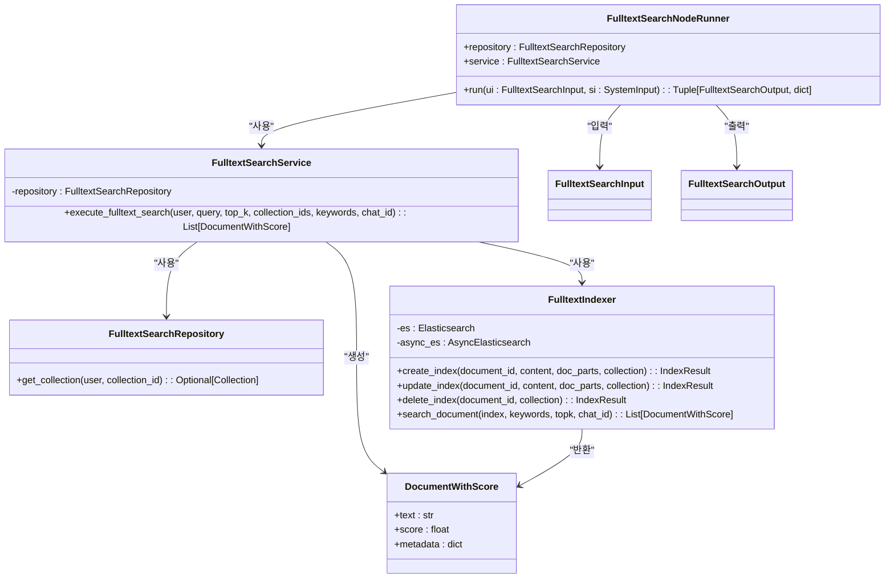

# 풀텍스트 검색 러너

<cite>
**이 문서에서 참조된 파일**
- [fulltext_search.py](file://aperag/flow/runners/fulltext_search.py)
- [fulltext_index.py](file://aperag/index/fulltext_index.py)
- [config.py](file://aperag/config.py)
- [query.py](file://aperag/query/query.py)
</cite>

## 목차
1. [소개](#소개)
2. [풀텍스트 검색 러너 아키텍처](#풀텍스트-검색-러너-아키텍처)
3. [Elasticsearch 통합](#elasticsearch-통합)
4. [검색 쿼리 파싱 및 확장 전략](#검색-쿼리-파싱-및-확장-전략)
5. [검색 결과 스코어링 및 정렬 로직](#검색-결과-스코어링-및-정렬-로직)
6. [n-gram 설정 및 성능 고려사항](#n-gram-설정-및-성능-고려사항)
7. [의존 관계 및 전처리 과정](#의존-관계-및-전처리-과정)

## 소개
이 문서는 ApeRAG 시스템 내 풀텍스트 검색 러너(Fulltext Search Runner)의 구현 내용을 설명합니다. 이 컴포넌트는 사용자 쿼리를 기반으로 Elasticsearch를 활용하여 정확한 텍스트 매칭을 수행하며, 다양한 검색 전략과 후처리 과정을 통해 최적의 검색 결과를 제공하는 핵심 역할을 합니다. 본 문서에서는 Elasticsearch와의 통합 방식, 검색 쿼리의 파싱 및 확장 전략(형태소 분석, 동의어 확장), 검색 결과의 스코어링 및 정렬 로직, 대용량 텍스트 처리를 위한 n-gram 설정과 성능 최적화 사항, 그리고 `fulltext_index.py` 모듈과의 의존 관계 및 다른 검색 결과와의 병합 전처리 과정에 대해 상세히 다룹니다.

## 풀텍스트 검색 러너 아키텍처

**다이어그램 출처**
- [fulltext_search.py](file://aperag/flow/runners/fulltext_search.py#L110-L132)
- [fulltext_index.py](file://aperag/index/fulltext_index.py#L43-L307)

**섹션 출처**
- [fulltext_search.py](file://aperag/flow/runners/fulltext_search.py#L110-L132)
- [fulltext_index.py](file://aperag/index/fulltext_index.py#L43-L307)

## Elasticsearch 통합

풀텍스트 검색 러너는 Elasticsearch를 주요 검색 엔진으로 사용하여 고성능의 풀텍스트 검색 기능을 제공합니다. 시스템은 `fulltext_index.py` 파일 내에 정의된 `FulltextIndexer` 클래스를 통해 Elasticsearch 클라이언트 인스턴스를 생성하고 관리합니다. 이 클래스는 초기화 시 `settings.es_host`에 지정된 호스트 주소를 기반으로 동기(synchronous) 및 비동기(asynchronous) 두 가지 클라이언트(`self.es` 및 `self.async_es`)를 모두 생성합니다. 비동기 클라이언트는 검색 요청과 같은 I/O 집약적인 작업에서 성능을 극대화하기 위해 사용됩니다.

Elasticsearch 인덱스는 `create_index` 함수를 통해 생성되며, 각 컬렉션(collection)별로 고유한 이름의 인덱스가 생성됩니다. 인덱스의 매핑(mapping)은 `ik_max_word`와 `ik_smart`라는 IK 한문자분석기를 사용하도록 구성되어 있어, 한국어를 포함한 아시아 언어의 형태소 분석을 효과적으로 지원합니다. `content` 및 `title` 필드는 `ik_max_word` 분석기를 사용하여 색인되고, 검색 시에는 `ik_smart` 분석기를 사용하여 더 정교한 검색을 수행합니다. 이는 검색 정확도와 성능 사이의 균형을 맞추기 위한 전략입니다.

**섹션 출처**
- [fulltext_index.py](file://aperag/index/fulltext_index.py#L43-L51)
- [fulltext_index.py](file://aperag/index/fulltext_index.py#L389-L400)

## 검색 쿼리 파싱 및 확장 전략

검색 쿼리의 파싱 및 확장은 검색 정확도를 높이는 핵심 단계입니다. `FulltextSearchService` 클래스는 사용자의 원본 쿼리(query)를 직접 사용하지 않고, 먼저 관련 키워드(keyword)를 추출하는 과정을 거칩니다. 이 과정은 `extract_keywords` 함수를 통해 수행되며, 우선순위 기반의 폴백(fallback) 전략을 따릅니다.

첫 번째 선택지는 LLM(Large Language Model)을 이용한 키워드 추출입니다. `LLMKeywordExtractor`는 설정된 LLM 프로바이더와 모델을 사용하여 입력 쿼리에서 중요한 개념을 포착하는 명사, 동사, 형용사를 중심으로 키워드를 추출합니다. 응답은 JSON 형식으로 제한되어 있으며, 이를 파싱하여 키워드 리스트를 얻습니다. 이 방법은 의미론적으로 더 풍부한 키워드를 생성할 수 있는 장점이 있습니다.

LLM 추출기가 구성되지 않았거나 실패한 경우, 두 번째 선택지인 `IKKeywordExtractor`가 활성화됩니다. 이 추출기는 Elasticsearch의 `analyze` API를 직접 호출하여, `ik_smart` 분석기를 사용해 쿼리 텍스트를 형태소 단위로 분석하고 토큰(token)을 추출합니다. 여기서는 `misc/stopwords.txt` 파일에 정의된 불용어(stop words)가 제거됩니다. 이러한 계층적 접근 방식은 다양한 환경에서도 안정적인 키워드 추출을 보장합니다.

**섹션 출처**
- [fulltext_search.py](file://aperag/flow/runners/fulltext_search.py#L60-L102)
- [fulltext_index.py](file://aperag/index/fulltext_index.py#L324-L373)
- [fulltext_index.py](file://aperag/index/fulltext_index.py#L376-L500)
- [fulltext_index.py](file://aperag/index/fulltext_index.py#L503-L545)

## 검색 결과 스코어링 및 정렬 로직

검색 결과의 스코어링과 정렬은 Elasticsearch의 기본 점수 산정 메커니즘에 크게 의존합니다. `FulltextIndexer`의 `search_document` 메서드는 추출된 키워드들을 바탕으로 Elasticsearch DSL 쿼리를 구성합니다. 이 쿼리는 `bool` 쿼리 내에 `should` 절을 사용하여, 각 키워드가 `content` 필드 또는 `title` 필드에 매칭되는지를 확인합니다. 즉, 하나의 키워드라도 일치하면 해당 문서는 후보군에 포함됩니다.

매칭된 문서들의 순위는 `_score` 필드에 의해 결정되며, 이는 Elasticsearch의 TF-IDF(Term Frequency-Inverse Document Frequency) 알고리즘에 기반한 relevancy score입니다. 일반적으로, 쿼리 키워드가 문서 내에서 더 자주 등장하거나, 드물게 등장하는 키워드일수록 더 높은 스코어를 받습니다. 검색 결과는 `sort` 옵션을 통해 `_score` 필드를 기준으로 내림차순(descending order)으로 정렬되며, 가장 관련성이 높은 문서가 먼저 반환됩니다. 또한, `minimum_should_match: "80%"` 설정을 통해 대부분의 키워드가 일치해야만 문서가 반환되도록 하여 검색의 정밀도를 높일 수 있습니다.

**섹션 출처**
- [fulltext_index.py](file://aperag/index/fulltext_index.py#L253-L307)

## n-gram 설정 및 성능 고려사항

본 시스템은 Elasticsearch의 n-gram 기능을 직접적으로 사용하는 대신, IK 한문자분석기를 활용하여 유사한 효과를 달성합니다. IK 분석기는 중국어, 일본어, 한국어와 같은 CJK(Character set for Chinese, Japanese, and Korean) 언어를 위한 특화된 분석기로, 연속된 문자열을 의미 있는 단위(형태소)로 분리하는 데 매우 효과적입니다. 이는 n-gram이 단순히 문자 단위로 조각내는 것과는 차별화됩니다.

성능 최적화를 위해 다음과 같은 전략들이 적용되었습니다:
1.  **비동기 I/O**: 검색 작업은 `AsyncElasticsearch` 클라이언트를 통해 비동기적으로 수행되어, 여러 요청을 동시에 처리할 수 있어 전체적인 처리 지연(latency)을 줄입니다.
2.  **예외 처리 및 폴백**: 검색 중 예외가 발생하더라도 빈 리스트를 반환함으로써, 검색 파이프라인이 완전히 중단되는 것을 방지합니다.
3.  **메모리 효율적인 청크 처리**: 문서는 `chunk_size` (기본값 400)와 `chunk_overlap_size` (기본값 20)에 따라 작은 청크(chunk)로 분할되어 인덱싱됩니다. 이는 대용량 문서를 효율적으로 처리하고, 검색 결과의 정확도를 높이며, 메모리 사용량을 제어하는 데 도움이 됩니다.
4.  **필터링**: 특정 채팅 세션(chat session)과 관련된 문서만 검색하려면 `chat_id`를 쿼리에 포함시켜 `metadata.chat_id` 필드를 필터링할 수 있습니다.

**섹션 출처**
- [fulltext_index.py](file://aperag/index/fulltext_index.py#L69-L96)
- [fulltext_index.py](file://aperag/index/fulltext_index.py#L253-L307)
- [config.py](file://aperag/config.py#L315-L316)

## 의존 관계 및 전처리 과정

풀텍스트 검색 러너는 `fulltext_index.py` 모듈과 긴밀하게 의존하고 있습니다. `FulltextSearchService`는 `fulltext_indexer`라는 전역 싱글톤 인스턴스를 직접 가져와 사용하여, 실제 검색 작업을 위임합니다. 이는 코드 재사용성을 높이고, 인덱스 관리 로직을 중앙집중화하는 설계입니다.

또한, 이 러너는 전체 검색 파이프라인의 일부로서, 다른 검색 러너들과 함께 작동합니다. `MergeNodeRunner`는 벡터 검색, 그래프 검색, 요약 검색 등의 결과를 `union` 전략으로 병합합니다. 이때, `FulltextSearchNodeRunner`는 자신의 검색 결과(`docs`)를 `MergeInput` 객체의 `fulltext_search_docs` 필드에 제공합니다. 병합 과정에서 `deduplicate` 옵션이 활성화되면, 중복된 텍스트를 가진 문서가 제거되어 최종 결과의 질이 향상됩니다. 모든 검색 결과는 `DocumentWithScore`라는 공통 데이터 구조를 따르며, `recall_type` 메타데이터를 통해 어떤 검색 전략으로 검색되었는지를 식별할 수 있습니다.

**섹션 출처**
- [fulltext_search.py](file://aperag/flow/runners/fulltext_search.py#L60-L102)
- [merge.py](file://aperag/flow/runners/merge.py#L50-L76)
- [query.py](file://aperag/query/query.py#L19-L22)