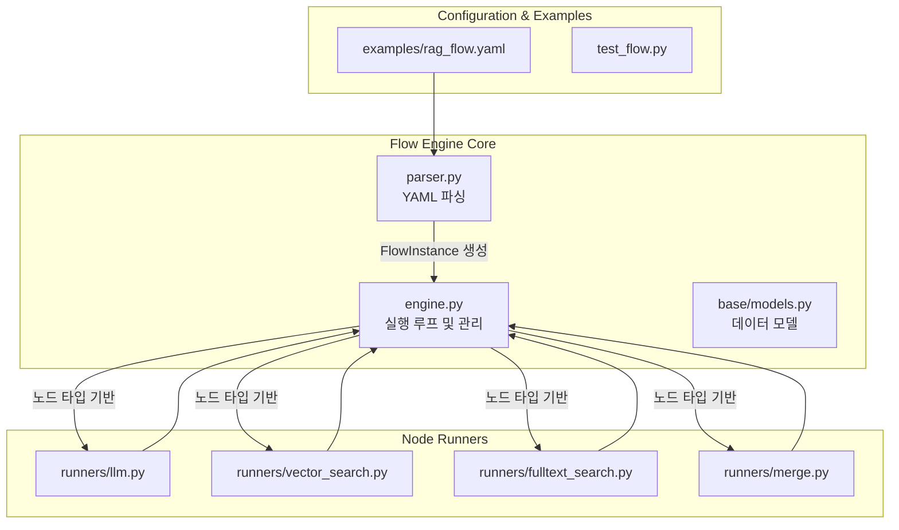
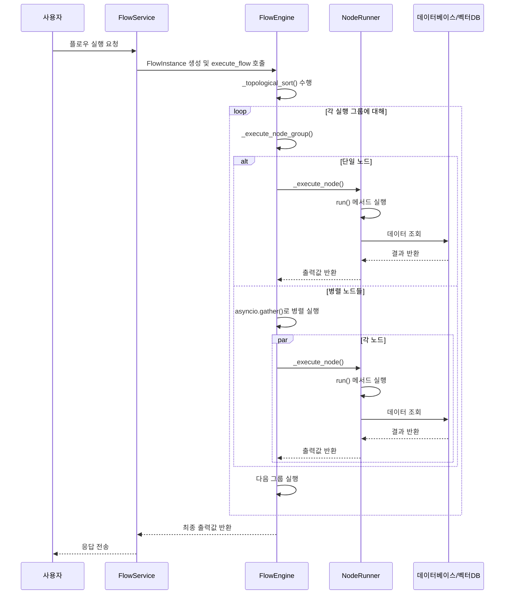
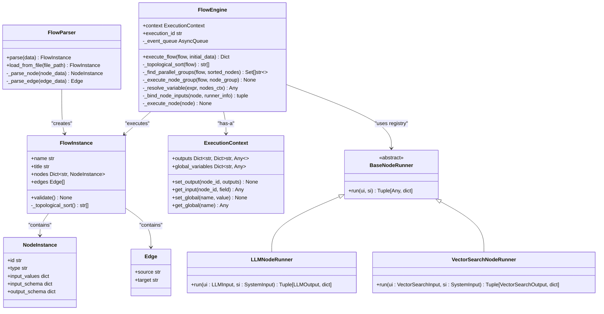

# 플로우 엔진

<cite>
**이 문서에서 참조한 파일**
- [engine.py](file://aperag/flow/engine.py)
- [parser.py](file://aperag/flow/parser.py)
- [rag_flow.yaml](file://aperag/flow/examples/rag_flow.yaml)
- [llm.py](file://aperag/flow/runners/llm.py)
- [vector_search.py](file://aperag/flow/runners/vector_search.py)
- [fulltext_search.py](file://aperag/flow/runners/fulltext_search.py)
- [base/models.py](file://aperag/flow/base/models.py)
</cite>

## 목차
1. [소개](#소개)
2. [프로젝트 구조](#프로젝트-구조)
3. [핵심 구성 요소](#핵심-구성-요소)
4. [아키텍처 개요](#아키텍처-개요)
5. [상세 구성 요소 분석](#상세-구성-요소-분석)
6. [의존성 분석](#의존성-분석)
7. [성능 고려사항](#성능-고려사항)
8. [문제 해결 가이드](#문제-해결-가이드)
9. [결론](#결론)

## 소개
이 문서는 ApeRAG 프로젝트 내 DAG 기반 플로우 엔진의 내부 작동 원리를 상세히 설명합니다. 이 엔진은 YAML로 정의된 플로우를 파싱하고, 순환 의존성을 방지하기 위해 위상 정렬을 수행하며, 노드 간 데이터 전달 메커니즘을 통해 복잡한 워크플로우를 실행합니다. 주요 기능으로는 LLM, 검색 등 다양한 노드 유형에 대한 Runner 구현, 병렬 실행 그룹화, 오류 발생 시 재시도 및 전파 전략, 상태 저장 및 복구 기능이 포함됩니다. 또한 실제 RAG(Retrieval-Augmented Generation) 플로우 예제를 기반으로 실행 흐름을 추적하고, 커스텀 노드 확장을 위한 `@register_node_runner` 데코레이터 사용법과 성능 모니터링을 위한 로깅 전략도 안내합니다.

## 프로젝트 구조
플로우 엔진은 `aperag/flow` 디렉터리에 위치하며, 핵심 구성 요소들은 다음과 같은 구조로 조직되어 있습니다:

```
aperag/flow/
├── base/
│   ├── models.py          # 플로우, 노드, 엣지 등의 기본 데이터 모델 정의
│   └── exceptions.py      # 플로우 실행 중 발생할 수 있는 예외 정의
├── runners/               # 각 노드 유형별 실행 로직 구현
│   ├── llm.py
│   ├── vector_search.py
│   ├── fulltext_search.py
│   ├── merge.py
│   └── ...
├── examples/
│   └── rag_flow.yaml      # RAG 플로우의 실제 예제
├── parser.py              # YAML 형식의 플로우 정의를 파싱하는 파서
├── engine.py              # 플로우 실행의 핵심 엔진
└── test_flow.py           # 플로우 실행 테스트 코드
```

이 구조는 관심사 분리(Separation of Concerns) 원칙을 따르며, 파싱, 실행 엔진, 노드 실행기(runner)가 명확하게 분리되어 유지보수성과 확장성을 높입니다.



**다이어그램 출처**
- [parser.py](file://aperag/flow/parser.py)
- [engine.py](file://aperag/flow/engine.py)
- [base/models.py](file://aperag/flow/base/models.py)
- [runners/llm.py](file://aperag/flow/runners/llm.py)
- [runners/vector_search.py](file://aperag/flow/runners/vector_search.py)
- [runners/fulltext_search.py](file://aperag/flow/runners/fulltext_search.py)
- [runners/merge.py](file://aperag/flow/runners/merge.py)

**섹션 출처**
- [parser.py](file://aperag/flow/parser.py)
- [engine.py](file://aperag/flow/engine.py)
- [base/models.py](file://aperag/flow/base/models.py)

## 핵심 구성 요소

### 플로우 파서 (FlowParser)
`parser.py` 파일에 구현된 `FlowParser` 클래스는 YAML 또는 JSON 형식의 플로우 정의를 파싱하여 메모리 내 객체로 변환합니다. 이 과정은 다음 단계를 포함합니다:
1.  **YAML 파싱**: `yaml.safe_load()`를 사용하여 문자열을 Python 사전(dict)으로 변환합니다.
2.  **$ref 해제**: `jsonref.replace_refs()`를 사용하여 `$ref` 키워드를 통해 참조된 스키마를 인라인으로 확장합니다.
3.  **노드 및 엣지 파싱**: `nodes`와 `edges` 배열을 순회하며, 각각 `NodeInstance`와 `Edge` 객체로 변환합니다.
4.  **FlowInstance 생성**: 파싱된 노드와 엣지를 바탕으로 `FlowInstance` 객체를 생성합니다.
5.  **유효성 검사**: 생성된 `FlowInstance`는 자동으로 `_topological_sort()` 메서드를 호출하여 순환 의존성이 없는지 검증합니다.

이러한 파싱 과정은 선언적인 플로우 정의를 실행 가능한 객체 그래프로 신뢰성 있게 변환합니다.

### 플로우 엔진 (FlowEngine)
`engine.py` 파일에 구현된 `FlowEngine` 클래스는 플로우 실행의 핵심입니다. 하나의 `FlowEngine` 인스턴스는 하나의 플로우 실행에만 사용되며, 고유한 실행 컨텍스트(`ExecutionContext`)와 실행 ID를 유지합니다. 주요 메서드는 다음과 같습니다:
-   `execute_flow()`: 플로우 실행의 진입점. 초기 데이터를 설정하고, 위상 정렬을 수행한 후 노드 그룹을 순차적으로 실행합니다.
-   `_topological_sort()`: Kahn's 알고리즘을 사용하여 DAG의 순환 여부를 검사하고, 노드 실행 순서를 결정합니다.
-   `_find_parallel_groups()`: 위상 정렬 결과를 바탕으로 동시에 실행할 수 있는 노드 그룹(레벨)을 찾습니다.
-   `_execute_node_group()`: 단일 노드 또는 여러 노드를 병렬로 실행합니다.
-   `_resolve_variable()`: `{{ .nodes.start.output.query }}`와 같은 Jinja2 템플릿 표현식을 해석하여 이전 노드의 출력값을 현재 노드의 입력으로 연결합니다.

엔진은 실행 중 발생하는 모든 이벤트(노드 시작, 종료, 오류 등)를 비동기 큐를 통해 외부로 방출하여 실시간 모니터링과 로깅이 가능하게 합니다.

### 노드 러너 (Node Runners)
`runners/` 디렉터리에는 각 노드 유형별로 실행 로직을 담당하는 Runner 클래스들이 위치합니다. 모든 Runner는 `BaseNodeRunner`를 상속하며, `run()`이라는 동일한 인터페이스를 제공합니다. 대표적인 Runner들은 다음과 같습니다:
-   **LLMNodeRunner (`llm.py`)**: LLM을 호출하여 응답을 생성합니다. 컨텍스트 창 크기를 계산하고, 이미지 입력을 처리하며, 스트리밍 응답을 지원합니다.
-   **VectorSearchNodeRunner (`vector_search.py`)**: 벡터 데이터베이스에서 쿼리와 유사한 문서를 검색합니다.
-   **FulltextSearchNodeRunner (`fulltext_search.py`)**: 풀텍스트 검색 엔진에서 키워드 기반으로 문서를 검색합니다.
-   **MergeNodeRunner (`merge.py`)**: 여러 검색 노드의 결과를 통합합니다.

이러한 Runner들의 존재는 새로운 노드 유형을 쉽게 추가할 수 있도록 하는 확장 가능한 아키텍처를 제공합니다.

**섹션 출처**
- [parser.py](file://aperag/flow/parser.py#L0-L97)
- [engine.py](file://aperag/flow/engine.py#L0-L455)
- [base/models.py](file://aperag/flow/base/models.py#L0-L167)
- [llm.py](file://aperag/flow/runners/llm.py#L0-L353)
- [vector_search.py](file://aperag/flow/runners/vector_search.py#L0-L149)
- [fulltext_search.py](file://aperag/flow/runners/fulltext_search.py#L0-L133)

## 아키텍처 개요



**다이어그램 출처**
- [engine.py](file://aperag/flow/engine.py#L101-L137)
- [engine.py](file://aperag/flow/engine.py#L169-L208)
- [engine.py](file://aperag/flow/engine.py#L237-L269)
- [engine.py](file://aperag/flow/engine.py#L300-L350)
- [runners/llm.py](file://aperag/flow/runners/llm.py)
- [runners/vector_search.py](file://aperag/flow/runners/vector_search.py)

## 상세 구성 요소 분석

### 실행 루프 및 순환 의존성 방지
`FlowEngine.execute_flow()` 메서드는 플로우 실행의 중심입니다. 실행 루프는 다음과 같은 절차를 따릅니다:
1.  **초기화**: 고유한 `execution_id`를 생성하고, 초기 데이터를 글로벌 변수로 설정합니다.
2.  **위상 정렬**: `_topological_sort()` 메서드를 호출하여 모든 노드를 순환 없이 실행할 수 있는 순서로 나열합니다. 이 과정은 Kahn's 알고리즘을 사용합니다:
    *   모든 노드의 진입 차수(in-degree)를 계산합니다.
    *   진입 차수가 0인 노드들을 큐에 넣습니다.
    *   큐에서 노드를 꺼내어 정렬 리스트에 추가한 후, 해당 노드의 모든 후속 노드의 진입 차수를 1씩 감소시킵니다.
    *   진입 차수가 0이 된 노드들을 다시 큐에 추가합니다.
    *   이 과정을 반복합니다.
    *   최종적으로 정렬된 노드의 수가 전체 노드 수와 같지 않으면, 순환 의존성이 존재한다고 판단하고 `CycleError`를 발생시킵니다.
3.  **병렬 그룹화**: `_find_parallel_groups()` 메서드는 위상 정렬 결과를 바탕으로 동시에 실행할 수 있는 노드 그룹을 찾습니다. 이는 각 레벨(level)에서 진입 차수가 0인 모든 노드를 하나의 그룹으로 묶는 방식으로 이루어집니다.
4.  **노드 실행**: `_execute_node_group()` 메서드는 각 그룹을 순차적으로 실행합니다. 그룹 내 노드가 하나라면 직접 실행하고, 두 개 이상이라면 `asyncio.gather()`를 사용하여 병렬로 실행합니다.

이러한 절차는 복잡한 의존성 관계를 가진 워크플로우도 안전하고 효율적으로 실행할 수 있게 합니다.

**섹션 출처**
- [engine.py](file://aperag/flow/engine.py#L101-L137)
- [engine.py](file://aperag/flow/engine.py#L169-L208)
- [engine.py](file://aperag/flow/engine.py#L237-L269)

### 노드 간 데이터 전달 메커니즘
노드 간 데이터 전달은 `ExecutionContext` 클래스와 `resolve_expression()` 메서드를 통해 이루어집니다.
*   **ExecutionContext**: `outputs`, `global_variables`, `system_outputs` 세 가지 딕셔너리를 가지고 있으며, 각 노드의 출력값과 전역 상태를 저장합니다. `set_output()`과 `get_input()` 메서드를 통해 값을 저장하고 조회합니다.
*   **변수 해석**: 노드의 입력값은 일반적으로 `{{ .nodes.<node_id>.output.<field> }}` 형태의 Jinja2 템플릿 문자열로 지정됩니다. `resolve_expression()` 메서드는 이러한 문자열을 실제 값으로 치환합니다. 먼저 `_resolve_variable()` 메서드가 경로를 파싱하여 `ExecutionContext.outputs`에서 해당 값을 찾아냅니다. 이후 `jinja_env.from_string().render()`를 사용하여 최종 값을 생성합니다. 이를 통해 이전 노드의 출력이 다음 노드의 입력으로 자연스럽게 흐릅니다.

예를 들어, `rag_flow.yaml`에서 `llm_8e4f2a7b` 노드의 `docs` 입력은 `{{ .nodes.rerank_5c7e1b2a.output.docs }}`로 정의되어 있으며, 이는 리랭크 노드의 출력 `docs` 배열을 LLM 노드의 입력으로 전달함을 의미합니다.

**섹션 출처**
- [base/models.py](file://aperag/flow/base/models.py#L79-L116)
- [engine.py](file://aperag/flow/engine.py#L269-L300)

### 실제 플로우 예제 분석 (rag_flow.yaml)
`rag_flow.yaml` 파일은 RAG 워크플로우의 전형적인 예를 보여줍니다. 실행 흐름은 다음과 같습니다:
1.  **시작 (start)**: 사용자의 질의(query)를 입력으로 받습니다.
2.  **병렬 검색**:
    *   **벡터 검색 (vector_search)**: 질의를 임베딩하여 벡터 DB에서 유사한 문서를 검색합니다.
    *   **풀텍스트 검색 (fulltext_search)**: 질의에서 키워드를 추출하여 ES에서 관련 문서를 검색합니다.
3.  **결과 통합 (merge)**: 두 검색 결과를 병합하고 중복 제거를 수행합니다.
4.  **리랭킹 (rerank)**: 통합된 결과를 더 정확한 모델로 재순위화합니다.
5.  **LLM 생성 (llm)**: 리랭킹된 문서들을 컨텍스트로 하여 LLM에게 최종 답변을 생성하도록 지시합니다.

이 플로우는 `start` 노드에서 `vector_search`와 `fulltext_search` 노드로 분기하여 병렬로 실행되며, `merge` 노드에서 다시 합쳐지는 DAG 구조를 가지고 있습니다. `FlowEngine`은 위상 정렬을 통해 이 구조를 올바르게 해석하고, 병렬 그룹화를 통해 검색 노드들을 동시에 실행함으로써 성능을 극대화합니다.

**섹션 출처**
- [rag_flow.yaml](file://aperag/flow/examples/rag_flow.yaml)

### 커스텀 노드 확장 (@register_node_runner)
새로운 노드 유형을 추가하려면 `@register_node_runner` 데코레이터를 사용하면 됩니다. 이 데코레이터는 노드 타입 이름, 입력 모델, 출력 모델을 인자로 받아, `NODE_RUNNER_REGISTRY`라는 전역 딕셔너리에 Runner 클래스를 등록합니다. 예를 들어, 새로운 `web_search` 노드를 만들려면 다음과 같이 작성할 수 있습니다:

```python
from pydantic import BaseModel
from aperag.flow.base.models import register_node_runner, BaseNodeRunner

class WebSearchInput(BaseModel):
    query: str
    top_k: int = 5

class WebSearchOutput(BaseModel):
    results: list[str]

@register_node_runner("web_search", WebSearchInput, WebSearchOutput)
class WebSearchNodeRunner(BaseNodeRunner):
    async def run(self, ui: WebSearchInput, si: SystemInput) -> Tuple[WebSearchOutput, dict]:
        # 웹 검색 로직 구현
        results = await perform_web_search(ui.query, ui.top_k)
        return WebSearchOutput(results=results), {}
```

등록 후, `rag_flow.yaml`과 같은 플로우 정의 파일에서 `type: web_search`인 노드를 정의하면 엔진이 자동으로 이 Runner를 찾아 실행합니다. 이 메커니즘은 플로우 엔진의 핵심 확장성 원리입니다.

**섹션 출처**
- [base/models.py](file://aperag/flow/base/models.py#L148-L167)
- [llm.py](file://aperag/flow/runners/llm.py#L348-L353)

### 성능 모니터링 및 디버깅
플로우 엔진은 실행 전반에 걸쳐 포괄적인 로깅과 이벤트 방출을 통해 성능 모니터링과 디버깅을 지원합니다.
*   **로그 기록**: `logging.getLogger(__name__)`를 사용하여 `engine.py`와 각 `runner` 모듈에서 중요한 실행 단계(실행 시작, 노드 그룹 실행, 오류 발생 등)를 기록합니다. 모든 로그는 `extra={"execution_id": self.execution_id}`를 포함하여 특정 실행을 쉽게 추적할 수 있습니다.
*   **이벤트 스트리밍**: `emit_event()` 메서드는 `FlowEvent` 객체를 비동기 큐에 넣으며, `get_events()` 메서드를 통해 외부 소비자(consumer)가 실시간으로 이벤트 스트림을 구독할 수 있습니다. 이벤트는 `FLOW_START`, `NODE_START`, `NODE_END`, `FLOW_ERROR` 등 다양한 유형을 가지며, 각 이벤트는 타임스탬프와 실행 ID를 포함하여 정확한 실행 흐름을 재현할 수 있게 합니다. 이는 웹 UI에서 진행 상황을 실시간으로 표시하거나, 실패한 실행을 디버깅하는 데 매우 유용합니다.

**섹션 출처**
- [engine.py](file://aperag/flow/engine.py#L35-L70)
- [engine.py](file://aperag/flow/engine.py#L101-L137)
- [engine.py](file://aperag/flow/engine.py#L300-L350)

## 의존성 분석



**다이어그램 출처**
- [engine.py](file://aperag/flow/engine.py)
- [parser.py](file://aperag/flow/parser.py)
- [base/models.py](file://aperag/flow/base/models.py)
- [llm.py](file://aperag/flow/runners/llm.py)
- [vector_search.py](file://aperag/flow/runners/vector_search.py)

## 성능 고려사항
*   **병렬 실행**: 엔진은 `_find_parallel_groups()`를 통해 독립적인 노드들을 식별하고 `asyncio.gather()`를 사용하여 병렬로 실행함으로써 I/O 바운드 작업(예: 여러 검색 API 호출)의 총 실행 시간을 크게 단축시킵니다.
*   **메모리 관리**: `ExecutionContext`은 실행 중인 하나의 플로우에 대해서만 상태를 유지하며, 실행이 종료되면 즉시 해제됩니다. 이는 장기간 실행되는 서비스에서도 메모리 누수를 방지합니다.
*   **효율적인 그래프 탐색**: 위상 정렬과 병렬 그룹화 알고리즘은 O(V+E)의 시간 복잡도를 가지며, 대부분의 실제 플로우에서는 매우 빠르게 실행됩니다.
*   **스트리밍 응답**: 특히 LLM 노드는 `async_generator`를 통해 스트리밍 응답을 지원하므로, 사용자는 첫 번째 토큰부터 즉시 응답을 확인할 수 있어 perceived latency(인지된 지연 시간)를 줄일 수 있습니다.

## 문제 해결 가이드
*   **순환 의존성 오류 (CycleError)**: `Flow contains cycles` 오류가 발생하면, 플로우 정의에서 어떤 노드가 서로를 순환 참조하고 있는지 확인하세요. 예를 들어, 노드 A가 노드 B를 가리키고, 노드 B가 다시 노드 A를 가리키는 경우입니다. 플로우를 DAG(Directed Acyclic Graph)로 수정해야 합니다.
*   **노드 타입 미등록 오류 (Unknown node type)**: `Unknown node type: xxx` 오류는 `NODE_RUNNER_REGISTRY`에 해당 타입의 Runner가 등록되지 않았음을 의미합니다. `@register_node_runner` 데코레이터가 올바르게 적용되었는지, 그리고 해당 Runner 모듈이 `import aperag.flow.runners` 문에 의해 로드되었는지 확인하세요.
*   **입력 유효성 검사 오류 (Input validation error)**: 노드의 입력값이 `input_model`의 Pydantic 스키마와 일치하지 않을 때 발생합니다. 입력값의 타입과 필드명이 올바른지, 템플릿 표현식이 올바르게 해석되었는지 확인하세요.
*   **Jinja2 렌더링 오류**: 템플릿 문자열(예: `{{ .nodes.xxx }}`)에 문법 오류가 있거나, 참조된 노드나 필드가 존재하지 않을 때 발생합니다. 변수 경로가 정확한지, 해당 노드가 이전에 실행되었는지 확인하세요.

**섹션 출처**
- [base/models.py](file://aperag/flow/base/models.py#L118-L147)
- [engine.py](file://aperag/flow/engine.py#L300-L350)

## 결론
ApeRAG의 플로우 엔진은 DAG 기반의 강력하고 유연한 워크플로우 실행 엔진입니다. 위상 정렬을 통한 순환 의존성 방지, 노드 간 데이터 전달을 위한 선언적 템플릿 시스템, 병렬 실행을 통한 성능 최적화, 그리고 `@register_node_runner`를 통한 쉬운 확장성은 이 엔진의 핵심 강점입니다. `rag_flow.yaml`과 같은 YAML 기반의 선언적 정의를 통해 복잡한 RAG 파이프라인을 직관적으로 구성할 수 있으며, 포괄적인 이벤트 시스템과 로깅을 통해 실행 상태를 실시간으로 모니터링하고 디버깅할 수 있습니다. 이 아키텍처는 현재의 요구사항을 충족하면서도 미래의 새로운 기능과 노드 유형에 대한 확장을 자연스럽게 지원합니다.