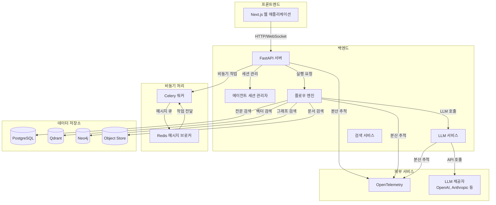
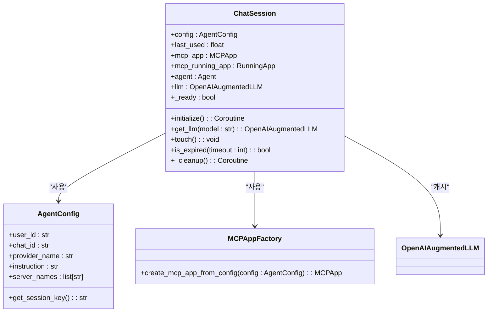
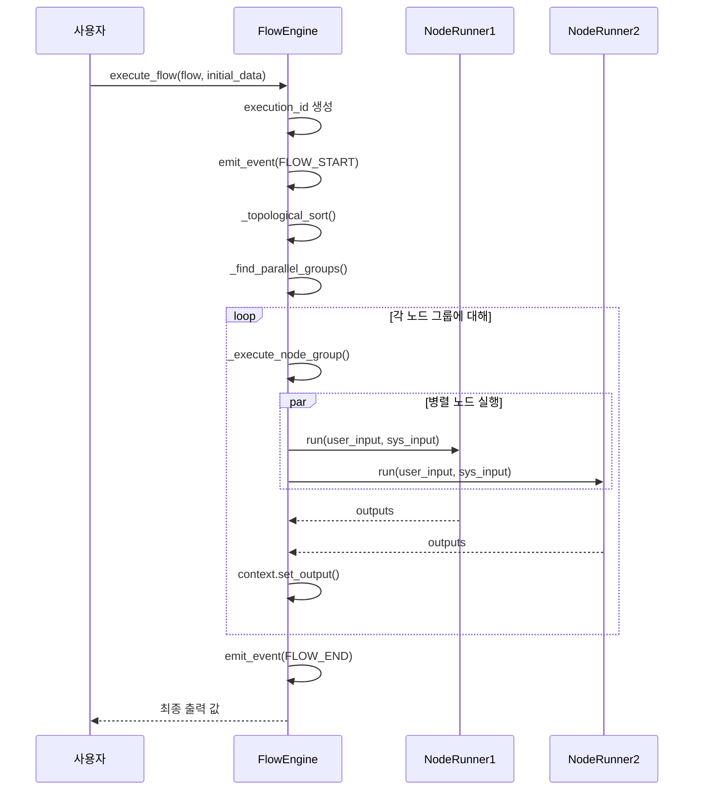
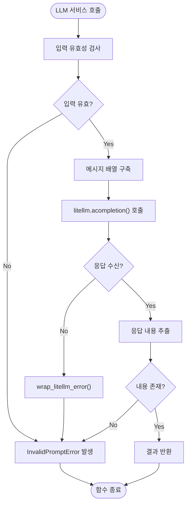
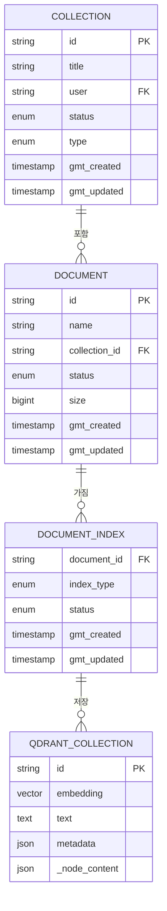
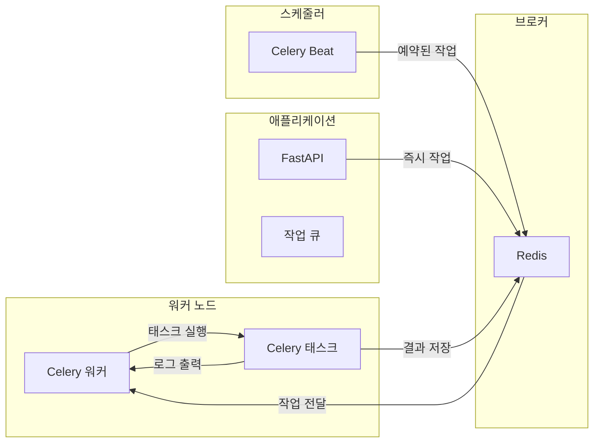
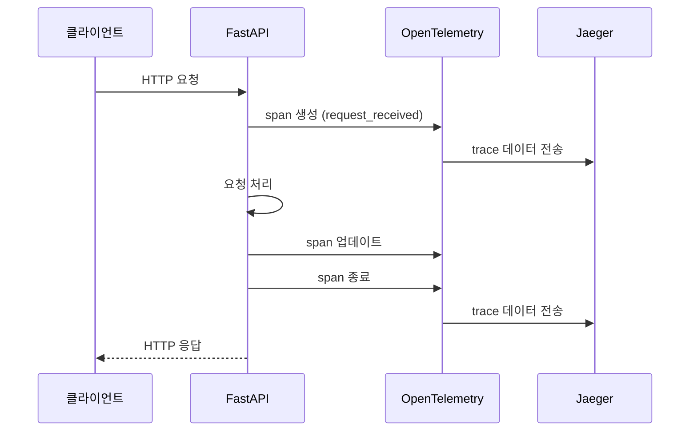

# 아키텍처 개요

<cite>
**이 문서에서 참조한 파일**
- [app.py](file://aperag/app.py)
- [celery.py](file://config/celery.py)
- [agent_session_manager.py](file://aperag/agent/agent_session_manager.py)
- [engine.py](file://aperag/flow/engine.py)
- [completion_service.py](file://aperag/llm/completion/completion_service.py)
- [qdrant_connector.py](file://aperag/vectorstore/qdrant_connector.py)
- [models.py](file://aperag/db/models.py)
</cite>

## 목차
1. [소개](#소개)
2. [전체 시스템 아키텍처](#전체-시스템-아키텍처)
3. [주요 컴포넌트 분석](#주요-컴포넌트-분석)
4. [데이터 저장소 및 인덱싱](#데이터-저장소-및-인덱싱)
5. [비동기 처리 및 작업 큐](#비동기-처리-및-작업-큐)
6. [분산 추적 및 모니터링](#분산-추적-및-모니터링)
7. [확장성 및 장애 복구 설계](#확장성-및-장애-복구-설계)

## 소개
ApeRAG는 지식 관리 및 검색을 위한 풀스택 애플리케이션으로, 사용자 쿼리에 대한 정확하고 맥락 기반의 응답을 생성하기 위해 다양한 구성 요소를 통합합니다. 이 문서는 ApeRAG의 전반적인 시스템 아키텍처를 설명하며, 백엔드(FastAPI), 프론트엔드(Next.js), 데이터 저장소(PostgreSQL, Qdrant, Neo4j 등) 간의 상호작용을 다이어그램과 함께 설명합니다. 주요 컴포넌트들(에이전트, 플로우 엔진, 검색 서비스, LLM 서비스)의 역할과 책임을 명확히 하고, 이들이 어떻게 협력하여 최종 결과를 생성하는지를 설명합니다.

## 전체 시스템 아키텍처

**다이어그램 출처**
- [app.py](file://aperag/app.py#L1-L122)
- [agent_session_manager.py](file://aperag/agent/agent_session_manager.py#L1-L250)
- [engine.py](file://aperag/flow/engine.py#L1-L455)
- [completion_service.py](file://aperag/llm/completion/completion_service.py#L1-L211)
- [qdrant_connector.py](file://aperag/vectorstore/qdrant_connector.py#L1-L115)

**섹션 출처**
- [app.py](file://aperag/app.py#L1-L122)
- [celery.py](file://config/celery.py#L1-L136)

## 주요 컴포넌트 분석

### 에이전트 컴포넌트
ApeRAG의 에이전트 컴포넌트는 사용자와의 대화 상태를 유지하고 관리하는 핵심 요소입니다. 각 채팅 세션은 독립된 에이전트 인스턴스를 가지며, 이는 대화 기억과 상태를 보존합니다. `ChatSession` 클래스는 사용자 ID, 채팅 ID, 제공자 이름을 기반으로 세션 키를 생성하고, 해당 세션에 대한 MCP(Multi-Component Platform) 앱, 에이전트, LLM 인스턴스를 관리합니다. 세션은 30분 동안 사용되지 않으면 만료되어 리소스를 효율적으로 관리합니다.

**다이어그램 출처**
- [agent_session_manager.py](file://aperag/agent/agent_session_manager.py#L1-L250)

**섹션 출처**
- [agent_session_manager.py](file://aperag/agent/agent_session_manager.py#L1-L250)

### 플로우 엔진 컴포넌트
플로우 엔진은 ApeRAG의 핵심 실행 엔진으로, 정의된 워크플로우를 실행하고 노드 간의 의존성을 관리합니다. `FlowEngine` 클래스는 위상 정렬을 사용하여 사이클을 감지하고, 병렬로 실행할 수 있는 노드 그룹을 식별합니다. 각 노드는 입력 값을 Jinja2 템플릿을 사용하여 해결하며, 실행 중에는 시작, 종료, 오류 등의 이벤트를 발생시켜 실시간 모니터링을 가능하게 합니다. 엔진은 UUID 기반 실행 ID를 생성하여 각 실행을 고유하게 식별하고 로깅 및 추적에 사용합니다.

**다이어그램 출처**
- [engine.py](file://aperag/flow/engine.py#L1-L455)

**섹션 출처**
- [engine.py](file://aperag/flow/engine.py#L1-L455)

### LLM 서비스 컴포넌트
LLM 서비스는 언어 모델과의 상호작용을 추상화하여 일관된 인터페이스를 제공합니다. `CompletionService` 클래스는 비동기 및 스트리밍 방식의 완성 생성을 지원하며, LiteLLM 라이브러리를 통해 다양한 LLM 제공자(OpenAI, Anthropic 등)와의 통합을 처리합니다. 서비스는 입력 유효성 검사, 메시지 구축, 응답 추출 등의 핵심 기능을 캡슐화하며, 오류가 발생하면 커스텀 예외(`CompletionError`, `InvalidPromptError`)를 발생시킵니다. 캐싱 옵션을 지원하여 반복적인 요청에 대한 성능을 향상시킵니다.

**다이어그램 출처**
- [completion_service.py](file://aperag/llm/completion/completion_service.py#L1-L211)

**섹션 출처**
- [completion_service.py](file://aperag/llm/completion/completion_service.py#L1-L211)

## 데이터 저장소 및 인덱싱

### 벡터 저장소(Qdrant)
ApeRAG는 Qdrant를 벡터 저장소로 사용하여 의미 기반 검색을 수행합니다. `QdrantVectorStoreConnector` 클래스는 Qdrant 클라이언트를 래핑하여 검색, 삭제, 컬렉션 관리 등의 기능을 제공합니다. 검색 시, 쿼리 임베딩과 일치하는 상위 K개의 문서를 반환하며, 점수 임계값과 필터 조건을 적용할 수 있습니다. 문서 메타데이터는 `_node_content` 페이로드에 JSON 형식으로 저장되며, 소스 정보는 관계에서 추출됩니다.

**다이어그램 출처**
- [qdrant_connector.py](file://aperag/vectorstore/qdrant_connector.py#L1-L115)
- [models.py](file://aperag/db/models.py#L1-L799)

**섹션 출처**
- [qdrant_connector.py](file://aperag/vectorstore/qdrant_connector.py#L1-L115)
- [models.py](file://aperag/db/models.py#L1-L799)

## 비동기 처리 및 작업 큐

### Celery 및 Redis 통합
ApeRAG는 Celery와 Redis를 사용하여 비동기 작업 처리를 구현합니다. `Celery` 앱은 `config/celery.py`에서 설정되며, 브로커 URL과 결과 백엔드로 Redis를 사용합니다. 주기적인 작업(스케줄링)은 `beat_schedule`에 정의되며, 인덱스 재조정, 컬렉션 요약 재조정, 만료된 문서 정리 등의 작업이 포함됩니다. 각 작업은 별도의 큐에 할당될 수 있으며, 로컬 큐 이름이 지정된 경우 특정 큐로 라우팅됩니다.

**다이어그램 출처**
- [celery.py](file://config/celery.py#L1-L136)

**섹션 출처**
- [celery.py](file://config/celery.py#L1-L136)

## 분산 추적 및 모니터링

### OpenTelemetry 통합
ApeRAG는 OpenTelemetry를 사용하여 분산 추적을 구현합니다. `init_tracing()` 함수는 애플리케이션 시작 시 호출되어 Jaeger 엔드포인트에 연결하고, FastAPI, SQLAlchemy, MCP 통합에 대한 자동 계측을 활성화합니다. 트레이싱은 서비스 이름과 버전으로 구성되며, 콘솔 출력을 통해 디버깅을 지원합니다. 모든 주요 컴포넌트(LLM 호출, 플로우 실행, API 요청)는 자동으로 추적이 활성화되어 성능 병목 현상을 진단할 수 있습니다.

**섹션 출처**
- [app.py](file://aperag/app.py#L1-L122)

## 확장성 및 장애 복구 설계

ApeRAG는 확장성과 장애 복구 능력을 보장하기 위해 다음과 같은 설계 결정을 내렸습니다:
1. **무상태 워커**: Celery 워커는 무상태로 설계되어 수평 확장이 용이하며, Redis 브로커를 통해 작업을 공유합니다.
2. **세션 만료 정책**: 에이전트 세션은 30분 후 자동 만료되어 메모리 누수를 방지하고 리소스를 효율적으로 관리합니다.
3. **재시도 메커니즘**: Celery는 `task_acks_late=True` 설정을 통해 작업 완료 후에만 확인을 보내므로, 워커 실패 시 작업이 재시도됩니다.
4. **마이크로서비스 아키텍처**: 각 주요 컴포넌트(에이전트, 플로우 엔진, LLM 서비스)는 느슨하게 결합되어 독립적으로 배포 및 확장할 수 있습니다.
5. **다중 데이터 저장소**: PostgreSQL(관계형 데이터), Qdrant(벡터 데이터), Neo4j(그래프 데이터)를 병행 사용하여 각 데이터 유형에 최적화된 저장소를 활용합니다.

**섹션 출처**
- [app.py](file://aperag/app.py#L1-L122)
- [celery.py](file://config/celery.py#L1-L136)
- [agent_session_manager.py](file://aperag/agent/agent_session_manager.py#L1-L250)