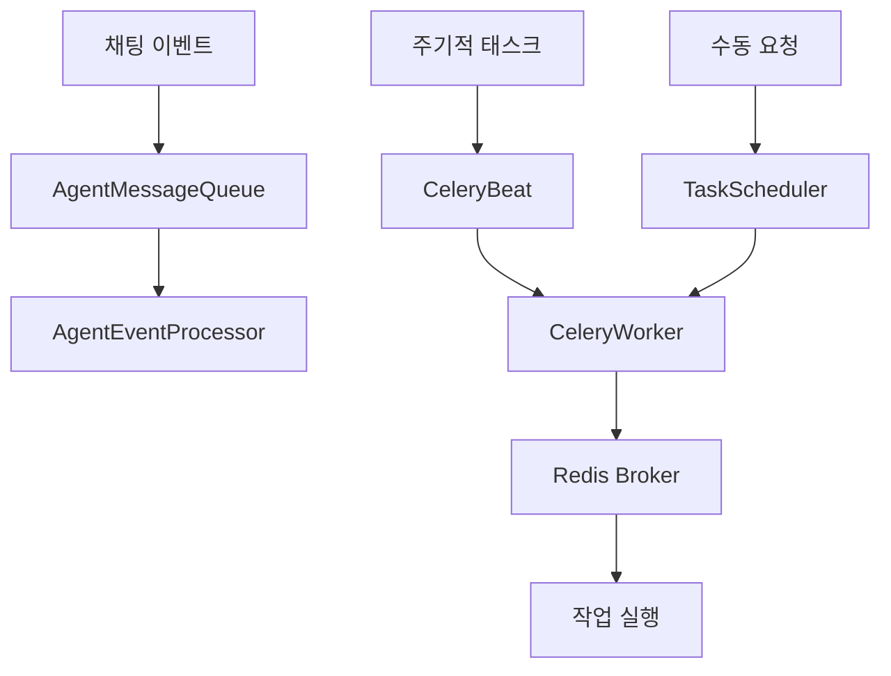
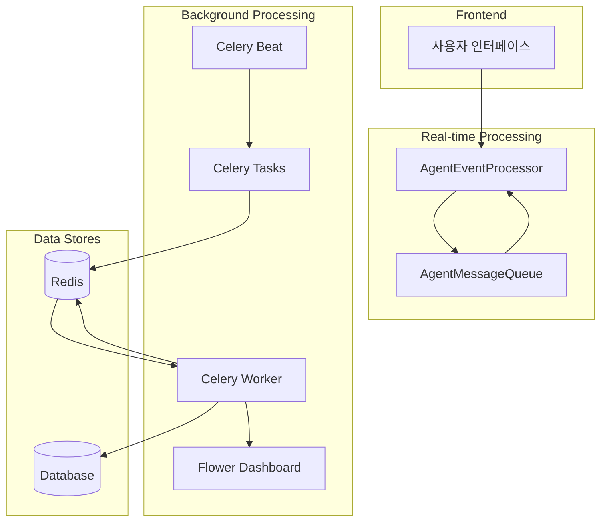
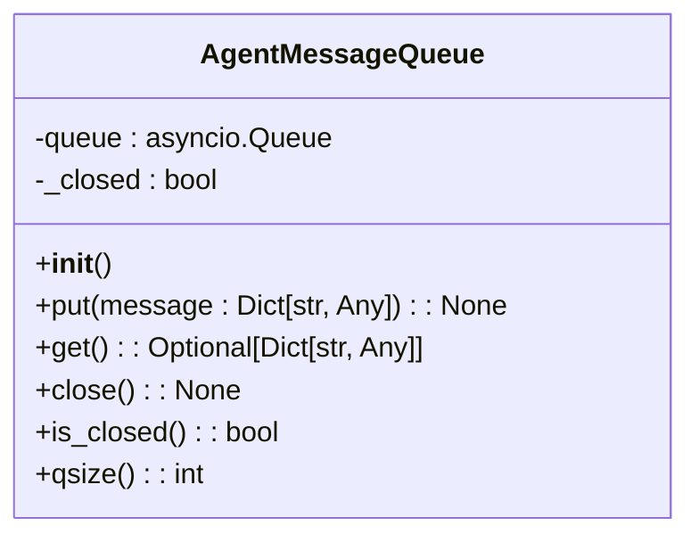
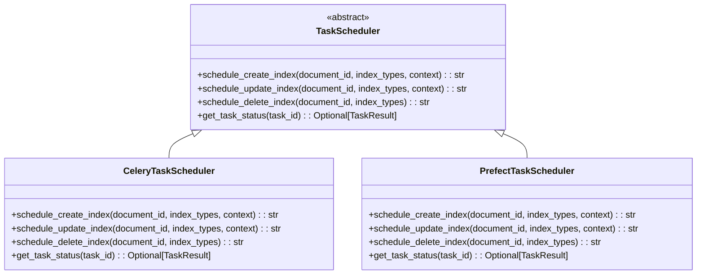
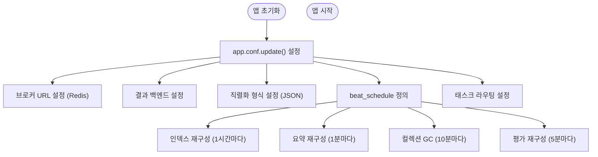
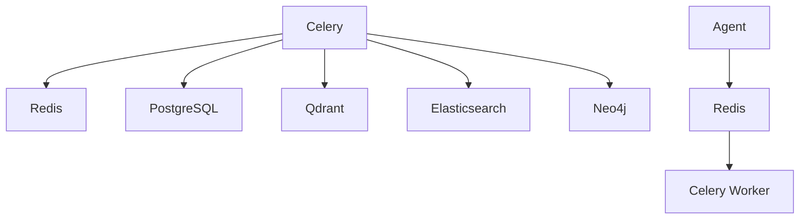

# 내부 비동기 통신

<cite>
**이 문서에서 참조한 파일**
- [agent_message_queue.py](file://aperag/agent/agent_message_queue.py)
- [scheduler.py](file://aperag/tasks/scheduler.py)
- [celery.py](file://config/celery.py)
- [celery_tasks.py](file://config/celery_tasks.py)
</cite>

## 목차
1. [소개](#소개)
2. [프로젝트 구조](#프로젝트-구조)
3. [코어 구성 요소](#코어-구성-요소)
4. [아키텍처 개요](#아키텍처-개요)
5. [상세 구성 요소 분석](#상세-구성-요소-분석)
6. [의존성 분석](#의존성-분석)
7. [성능 고려사항](#성능-고려사항)
8. [문제 해결 가이드](#문제-해결-가이드)
9. [결론](#결론)

## 소개
ApeRAG 시스템은 Celery와 Redis를 기반으로 한 강력한 비동기 작업 큐 아키텍처를 사용하여 내부 서비스 간의 효율적인 통신을 지원합니다. 이 문서는 agent_message_queue.py, scheduler.py 및 celery.py 파일을 중심으로 메시지 전달 방식, 주기적 태스크 예약, 워커 프로세스 구성, 장애 복구 정책, 성능 최적화 전략 등을 심층적으로 설명합니다.

## 프로젝트 구조
ApeRAG의 비동기 통신 관련 핵심 구성 요소는 다음과 같은 디렉터리 구조에 위치해 있습니다:

```
.
├── aperag/
│   └── agent/
│       ├── agent_message_queue.py    # 에이전트 채팅 메시지 큐
│       └── agent_event_processor.py  # 이벤트 처리기
├── config/
│   ├── celery.py                    # Celery 애플리케이션 설정
│   └── celery_tasks.py              # 작업 정의 및 워크플로우
└── aperag/
    └── tasks/
        └── scheduler.py             # 작업 스케줄러 인터페이스
```

비동기 처리는 `aperag/agent` 모듈에서 실시간 채팅 이벤트 처리를 위한 메시지 큐로 시작되며, `config/` 디렉터리의 Celery 설정과 `aperag/tasks/`의 스케줄러를 통해 문서 인덱싱, 컬렉션 정리 등의 백그라운드 작업이 조정됩니다.



**Diagram sources**
- [agent_message_queue.py](file://aperag/agent/agent_message_queue.py)
- [scheduler.py](file://aperag/tasks/scheduler.py)
- [celery.py](file://config/celery.py)

**Section sources**
- [agent_message_queue.py](file://aperag/agent/agent_message_queue.py)
- [scheduler.py](file://aperag/tasks/scheduler.py)
- [celery.py](file://config/celery.py)

## 코어 구성 요소
ApeRAG의 비동기 통신은 세 가지 핵심 구성 요소로 이루어져 있습니다: 실시간 메시지 전달을 위한 `AgentMessageQueue`, 주기적 및 수동 태스크를 관리하는 `CeleryTaskScheduler`, 그리고 Celery 기반의 작업 큐 인프라입니다. 이러한 구성 요소들은 Redis를 메시지 브로커로 사용하며, Celery를 통해 분산된 워커 프로세스에서 작업을 실행합니다.

**Section sources**
- [agent_message_queue.py](file://aperag/agent/agent_message_queue.py#L23-L64)
- [scheduler.py](file://aperag/tasks/scheduler.py#L105-L180)
- [celery.py](file://config/celery.py#L1-L136)

## 아키텍처 개요
ApeRAG의 비동기 아키텍처는 실시간 이벤트 처리와 배치 작업 처리라는 두 가지 주요 흐름으로 나뉩니다. 첫 번째 흐름은 사용자 채팅 이벤트 후처리를 위한 것이며, 두 번째 흐름은 문서 인덱싱, 컬렉션 정리 등 시스템 유지보수를 위한 주기적/요청 기반 작업입니다.



**Diagram sources**
- [agent_message_queue.py](file://aperag/agent/agent_message_queue.py)
- [scheduler.py](file://aperag/tasks/scheduler.py)
- [celery.py](file://config/celery.py)

## 상세 구성 요소 분석

### AgentMessageQueue 분석
`AgentMessageQueue` 클래스는 Go 언어의 채널과 유사한 비동기 메시지 큐를 제공합니다. 이 큐는 에이전트 채팅 통신에서 생산자가 메시지를 넣고 소비자가 메시지를 가져가는 패턴을 구현하며, 우아한 종료(shutdown)와 스트림 종료 신호화(end-of-stream signaling)를 지원합니다.

#### 클래스 다이어그램


**Diagram sources**
- [agent_message_queue.py](file://aperag/agent/agent_message_queue.py#L23-L64)

**Section sources**
- [agent_message_queue.py](file://aperag/agent/agent_message_queue.py#L23-L64)
- [agent_event_processor.py](file://aperag/agent/agent_event_processor.py#L23-L98)

### TaskScheduler 분석
`TaskScheduler`는 추상 기본 클래스로서 다양한 작업 스케줄링 백엔드(Prefect, Celery 등)를 지원할 수 있도록 설계되었습니다. 현재는 `CeleryTaskScheduler` 구현체가 사용되며, 문서 인덱싱 생성, 업데이트, 삭제 작업을 예약하고 상태를 추적하는 역할을 합니다.

#### 클래스 다이어그램


**Diagram sources**
- [scheduler.py](file://aperag/tasks/scheduler.py#L105-L180)

**Section sources**
- [scheduler.py](file://aperag/tasks/scheduler.py#L1-L201)

### Celery 설정 분석
`celery.py` 파일은 Celery 애플리케이션 인스턴스를 생성하고 구성하는 핵심 설정 파일입니다. 이 파일은 Redis를 브로커로 사용하도록 설정하며, 결과 백엔드, 직렬화 형식, 타임존 등을 정의합니다. 또한 주기적 작업(beat schedule)을 정의하여 인덱스 재구성, 컬렉션 요약 정리, 만료된 문서 정리 등의 작업을 자동으로 예약합니다.

#### 설정 흐름도


**Diagram sources**
- [celery.py](file://config/celery.py#L1-L136)

**Section sources**
- [celery.py](file://config/celery.py#L1-L136)

### Celery 작업 워크플로우 분석
`celery_tasks.py` 파일은 실제 작업의 정의와 동적 워크플로우 오케스트레이션을 담당합니다. 이 파일은 파싱, 인덱스 생성, 삭제, 업데이트 등의 세분화된 작업을 정의하고, `chord`, `chain`, `group`과 같은 Celery 원본(primitive)을 사용하여 복잡한 워크플로우를 구성합니다.

#### 워크플로우 시퀀스 다이어그램
```mermaid
sequenceDiagram
participant Client as "클라이언트"
participant Scheduler as "TaskScheduler"
participant Celery as "Celery App"
participant Worker as "Celery Worker"
participant DB as "데이터베이스"
Client->>Scheduler : schedule_create_index()
Scheduler->>Celery : create_document_indexes_workflow.delay()
Celery->>Worker : parse_document_task
Worker->>DB : 문서 데이터 조회
DB-->>Worker : 문서 데이터
Worker->>Worker : 문서 파싱
Worker-->>Celery : 파싱 완료
Celery->>Worker : trigger_create_indexes_workflow
Worker->>Worker : create_index_task(vector)
Worker->>Worker : create_index_task(fulltext)
Worker->>Worker : create_index_task(graph)
parallel Index Creation
Worker->>DB : 벡터 인덱스 생성
Worker->>DB : 풀텍스트 인덱스 생성
Worker->>DB : 그래프 인덱스 생성
end
Worker-->>Celery : 모든 인덱스 생성 완료
Celery->>Worker : notify_workflow_complete
Worker->>DB : 작업 상태 업데이트
Worker-->>Client : 워크플로우 ID 반환
```

**Diagram sources**
- [celery_tasks.py](file://config/celery_tasks.py#L1-L799)

**Section sources**
- [celery_tasks.py](file://config/celery_tasks.py#L1-L799)

## 의존성 분석
ApeRAG의 비동기 통신 아키텍처는 여러 핵심 의존성을 가지고 있습니다. 가장 중요한 것은 Redis이며, 이는 Celery의 메시지 브로커와 결과 백엔드로 사용됩니다. 또한 PostgreSQL 또는 기타 데이터베이스는 작업 상태와 인덱스 메타데이터를 저장하는 데 사용됩니다.



**Diagram sources**
- [celery.py](file://config/celery.py#L1-L136)
- [celery_tasks.py](file://config/celery_tasks.py#L1-L799)

**Section sources**
- [celery.py](file://config/celery.py#L1-L136)
- [celery_tasks.py](file://config/celery_tasks.py#L1-L799)

## 성능 고려사항
ApeRAG의 비동기 시스템 성능은 여러 요소에 의해 결정됩니다. 가장 중요한 것은 Celery 워커의 동시성(concurrency) 설정입니다. 스크립트 파일(`start-celery-worker.sh`)을 통해 워커는 `--concurrency=16` 옵션으로 실행되어 동시에 16개의 작업을 처리할 수 있습니다. 또한 `--pool=threads` 옵션을 사용하여 스레드 풀 기반의 동시성을 활용합니다.

또한 각 작업은 자체 재시도 메커니즘을 가지고 있으며, 최대 3회 재시도하고, 재시도 간격은 60초입니다. 이는 일시적인 네트워크 문제나 리소스 경합 상황에서도 작업이 성공적으로 완료될 가능성을 높입니다.

**Section sources**
- [celery.py](file://config/celery.py#L1-L136)
- [celery_tasks.py](file://config/celery_tasks.py#L1-L799)
- [start-celery-worker.sh](file://scripts/start-celery-worker.sh#L10)

## 문제 해결 가이드
비동기 작업의 문제 해결을 위해 ApeRAG는 Flower 대시보드를 통합합니다. Flower는 Celery 작업의 실시간 모니터링, 작업 상태 확인, 작업 재시도, 통계 분석 등을 제공합니다. `flower-deployment.yaml` 및 `start-celery-flower.sh` 스크립트를 통해 Flower는 `CELERY_FLOWER_USER` 및 `CELERY_FLOWER_PASSWORD` 환경 변수로 보호된 HTTP 인증을 통해 접근할 수 있습니다.

작업 실패 시, 시스템은 자세한 로깅을 수행하며, `BaseIndexTask` 클래스의 `_handle_index_failure` 메서드를 통해 실패 콜백을 실행합니다. 이는 문제 진단과 사용자에게 적절한 피드백을 제공하는 데 도움이 됩니다.

**Section sources**
- [celery.py](file://config/celery.py#L1-L136)
- [celery_tasks.py](file://config/celery_tasks.py#L1-L799)
- [flower-deployment.yaml](file://deploy/aperag/templates/flower-deployment.yaml#L1-L182)
- [start-celery-flower.sh](file://scripts/start-celery-flower.sh#L1-L7)

## 결론
ApeRAG의 내부 비동기 통신 메커니즘은 Celery와 Redis를 중심으로 견고하고 확장 가능한 아키텍처를 제공합니다. `AgentMessageQueue`는 실시간 채팅 이벤트를 처리하고, `CeleryTaskScheduler`와 `celery_tasks.py`는 문서 인덱싱과 같은 복잡한 백그라운드 작업을 동적으로 오케스트레이션합니다. 이 시스템은 재시도 정책, 상태 추적, Flower를 통한 모니터링을 통해 높은 신뢰성과 가시성을 보장하며, 동시성 설정을 통해 성능을 최적화할 수 있습니다. 이러한 설계는 ApeRAG가 대규모 문서 처리와 실시간 사용자 상호작용을 안정적으로 처리할 수 있도록 합니다.