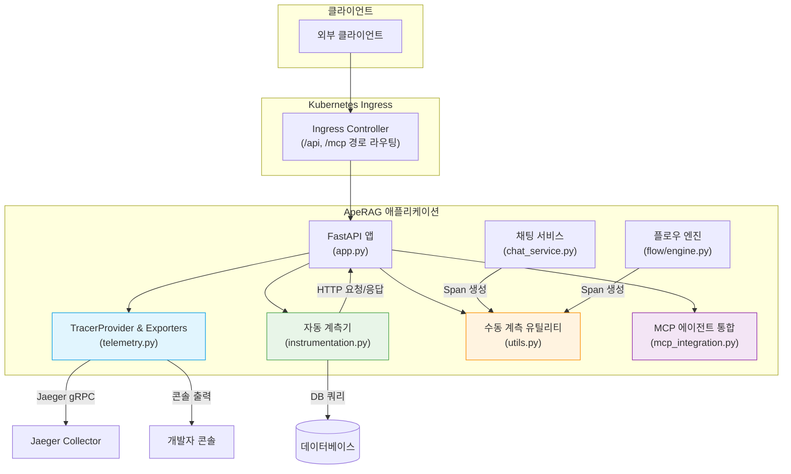
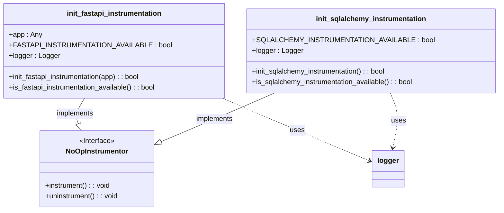
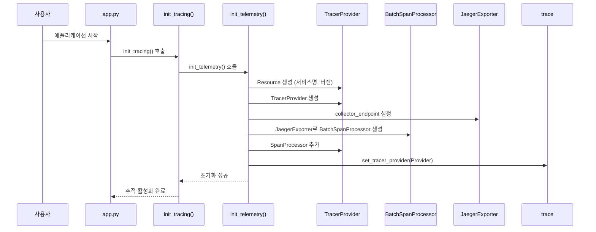
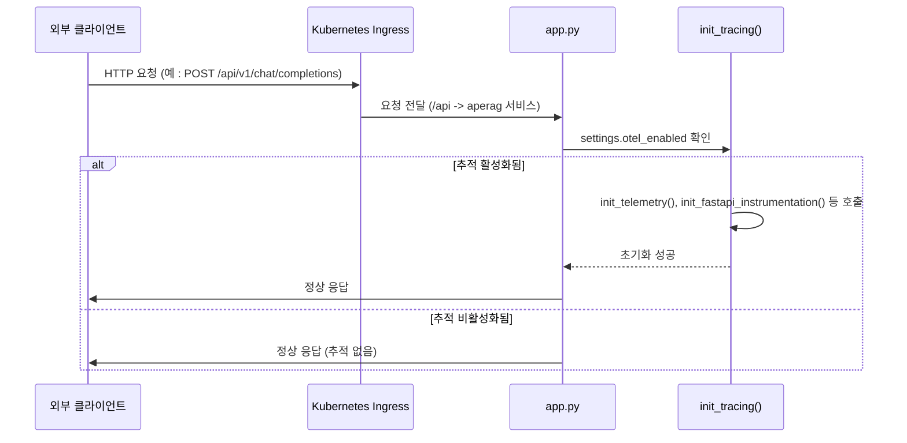
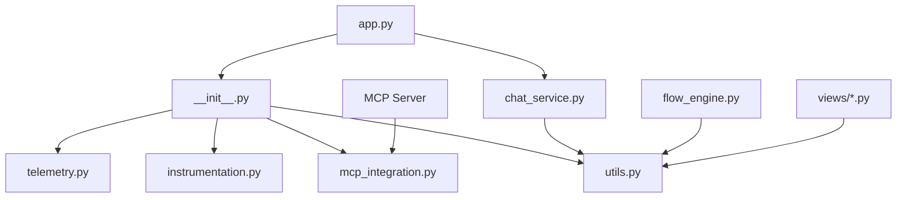

# 분산 추적

<cite>
**이 문서에서 참조한 파일**
- [instrumentation.py](file://aperag/trace/instrumentation.py)
- [telemetry.py](file://aperag/trace/telemetry.py)
- [app.py](file://aperag/app.py)
- [__init__.py](file://aperag/trace/__init__.py)
- [utils.py](file://aperag/trace/utils.py)
- [mcp_integration.py](file://aperag/trace/mcp_integration.py)
- [ingress.yaml](file://deploy/aperag/templates/ingress.yaml)
- [chat_service.py](file://aperag/service/chat_service.py)
- [flow/engine.py](file://aperag/flow/engine.py)
</cite>

## 목차
1. [소개](#소개)
2. [전체 아키텍처 개요](#전체-아키텍처-개요)
3. [핵심 구성 요소 분석](#핵심-구성-요소-분석)
4. [상세 구성 요소 분석](#상세-구성-요소-분석)
5. [의존성 분석](#의존성-분석)
6. [성능 고려사항](#성능-고려사항)
7. [문제 해결 가이드](#문제-해결-가이드)
8. [결론](#결론)

## 소개
ApeRAG 시스템은 OpenTelemetry 기반의 포괄적인 분산 추적 시스템을 구현하여, FastAPI 기반 백엔드 서비스 전반에 걸쳐 요청 흐름과 성능 지표를 모니터링합니다. 이 문서는 ApeRAG의 분산 추적 아키텍처를 설명하며, OpenTelemetry instrumentation의 초기화 과정, Span 생성 및 컨텍스트 전파 메커니즘, Jaeger와 같은 외부 백엔드로의 데이터 전송 프로세스, 그리고 주요 서비스 내 트레이싱 포인트 배치 전략을 다룹니다.

추적 시스템은 `aperag/trace` 디렉토리에 위치하며, 핵심적으로 `telemetry.py`, `instrumentation.py`, `utils.py`, `mcp_integration.py` 네 가지 모듈로 구성됩니다. `telemetry.py`는 OpenTelemetry SDK의 기본 설정과 추적 데이터를 내보내는 Exporter를 관리하고, `instrumentation.py`는 FastAPI 및 SQLAlchemy와 같은 프레임워크에 대한 자동 계측을 담당합니다. `utils.py`는 사용자 정의 Span 생성을 위한 유틸리티 함수와 데코레이터를 제공하며, `mcp_integration.py`는 MCP(Multi-Channel Platform) 에이전트와의 통합을 통해 추적 컨텍스트를 전파합니다. 전체 시스템은 `app.py`에서 초기화되며, `ingress.yaml`을 통해 클러스터 외부에서 들어오는 요청의 추적 컨텍스트가 시작됩니다.

## 전체 아키텍처 개요



**Diagram sources**
- [app.py](file://aperag/app.py#L1-L122)
- [telemetry.py](file://aperag/trace/telemetry.py#L1-L170)
- [instrumentation.py](file://aperag/trace/instrumentation.py#L1-L97)
- [utils.py](file://aperag/trace/utils.py#L1-L271)
- [mcp_integration.py](file://aperag/trace/mcp_integration.py#L1-L152)
- [ingress.yaml](file://deploy/aperag/templates/ingress.yaml#L1-L40)

**Section sources**
- [app.py](file://aperag/app.py#L1-L122)
- [telemetry.py](file://aperag/trace/telemetry.py#L1-L170)
- [instrumentation.py](file://aperag/trace/instrumentation.py#L1-L97)

## 핵심 구성 요소

ApeRAG의 분산 추적 시스템은 OpenTelemetry의 여러 컴포넌트를 조합하여 구성됩니다. 핵심은 `aperag.trace.__init__.py`에 정의된 `init_tracing` 함수입니다. 이 함수는 시스템 부팅 시 `app.py`에서 호출되어, `telemetry.py`의 `init_telemetry`, `instrumentation.py`의 `init_fastapi_instrumentation` 및 `init_sqlalchemy_instrumentation`, 그리고 `mcp_integration.py`의 `init_mcp_tracing`을 순차적으로 실행함으로써 전체 추적 환경을 설정합니다.

`telemetry.py` 모듈은 `TracerProvider`를 생성하고, 이를 글로벌 Tracer 공급자로 등록하는 역할을 합니다. `init_telemetry` 함수는 서비스 이름, 버전, 환경 등의 리소스 정보를 포함한 `Resource` 객체를 생성하고, `BatchSpanProcessor`를 통해 비동기적으로 Span을 처리합니다. 데이터 내보내기는 `JaegerExporter` 또는 `ConsoleSpanExporter`를 통해 수행되며, 설정에 따라 Jaeger 수집기로 전송되거나 개발 중에는 콘솔에 출력됩니다. 모든 내보내기가 실패할 경우, 추적 기능 자체는 유지하되 출력만 하지 않는 `NoOpSpanExporter`가 사용되어 시스템의 안정성을 보장합니다.

**Section sources**
- [__init__.py](file://aperag/trace/__init__.py#L46-L91)
- [telemetry.py](file://aperag/trace/telemetry.py#L1-L170)

## 상세 구성 요소 분석

### instrumentation.py 분석: 자동 계측

`instrumentation.py` 모듈은 OpenTelemetry의 오토 인스트루먼테이션(Auto-Instrumentation) 기능을 활용하여 코드 변경 없이도 주요 프레임워크의 추적 정보를 자동으로 수집합니다.



**Diagram sources**
- [instrumentation.py](file://aperag/trace/instrumentation.py#L1-L97)

**Section sources**
- [instrumentation.py](file://aperag/trace/instrumentation.py#L1-L97)

#### FastAPI 계측
`init_fastapi_instrumentation` 함수는 `opentelemetry.instrumentation.fastapi.FastAPIInstrumentor`를 사용하여 FastAPI 애플리케이션에 미들웨어를 삽입합니다. 이 미들웨어는 각 HTTP 요청이 도착할 때마다 새로운 Span을 생성하고, 응답이 완료되면 Span을 종료합니다. Span에는 HTTP 메서드(GET, POST 등), URL 경로, 상태 코드와 같은 중요한 속성이 태깅됩니다. 이는 API 엔드포인트별 성능 분석과 오류 진단에 매우 유용합니다. 함수는 특정 `app` 인스턴스를 인자로 받을 수도 있고, 인자가 없으면 현재 프로세스 내의 모든 FastAPI 앱에 대해 글로벌 계측을 활성화합니다.

#### SQLAlchemy 계측
`init_sqlalchemy_instrumentation` 함수는 `opentelemetry.instrumentation.sqlalchemy.SQLAlchemyInstrumentor`를 사용하여 SQLAlchemy ORM의 모든 데이터베이스 쿼리를 추적합니다. 이 계측기는 SQL 문, 바인딩 파라미터, 쿼리 실행 시간 등을 Span으로 기록합니다. 이를 통해 특정 API 요청이 어떤 데이터베이스 쿼리로 인해 지연되는지 쉽게 파악할 수 있으며, N+1 쿼리 문제와 같은 성능 병목 현상을 식별할 수 있습니다.

### telemetry.py 분석: 추적 데이터 전송

`telemetry.py` 모듈은 추적 데이터의 생성과 전송을 담당하는 핵심입니다. `init_telemetry` 함수는 OpenTelemetry SDK의 초기화를 수행합니다.



**Diagram sources**
- [telemetry.py](file://aperag/trace/telemetry.py#L1-L170)
- [__init__.py](file://aperag/trace/__init__.py#L46-L91)

**Section sources**
- [telemetry.py](file://aperag/trace/telemetry.py#L1-L170)

#### 초기화 및 내보내기 구성
`init_telemetry` 함수는 먼저 `service.name`, `service.version`, `service.environment` 등의 속성을 포함한 `Resource` 객체를 생성합니다. 이 정보는 추적 데이터를 분석할 때 서비스 인스턴스를 식별하는 데 필수적입니다. 다음으로, `TracerProvider`가 생성되고, 설정된 내보내기(Exporter)에 따라 하나 이상의 `BatchSpanProcessor`가 추가됩니다. 예를 들어, `jaeger_endpoint`가 설정되어 있으면 `JaegerExporter`가 생성되어 지정된 엔드포인트로 추적 데이터를 전송합니다. 개발 용도로 `enable_console`이 활성화되어 있으면, Span 정보가 JSON 형식으로 콘솔에 출력됩니다.

#### 장애 허용 설계
이 모듈은 `OTEL_AVAILABLE` 플래그를 사용하여 OpenTelemetry 라이브러리가 설치되지 않았을 경우 추적 기능을 조용히 비활성화합니다. 또한, `NoOpSpanExporter` 클래스를 정의하여 실제 내보내기 구성이 실패하거나 사용하지 않을 경우에도 추적 API 호출이 정상적으로 동작하도록 함으로써, 추적 시스템의 결함이 애플리케이션의 주요 기능에 영향을 미치지 않도록 설계되었습니다.

### utils.py 분석: 수동 계측 및 유틸리티

`utils.py` 모듈은 자동 계측이 적용되지 않는 비즈니스 로직이나 특정 함수에 대해 세밀한 제어를 필요로 할 때 사용되는 수동 계측 도구를 제공합니다.

```mermaid
flowchart TD
Start([trace_function 데코레이터]) --> CheckAvailable{"OPENTELEMETRY_AVAILABLE?"}
CheckAvailable --> |Yes| GetTracer[get_tracer(func.__module__)]
CheckAvailable --> |No| UseNullContext[nullcontext()]
GetTracer --> CreateSpan[create_span(tracer, span_name)]
CreateSpan --> EnterSpan["Span __enter__()"]
EnterSpan --> SetAttributes["Span에 function, module 속성 설정"]
SetAttributes --> ExecuteFunc[원본 함수 실행]
ExecuteFunc --> ExitSpan["Span __exit__()"]
ExitSpan --> End([함수 반환])
UseNullContext --> ExecuteFunc
```

**Diagram sources**
- [utils.py](file://aperag/trace/utils.py#L1-L271)

**Section sources**
- [utils.py](file://aperag/trace/utils.py#L1-L271)

#### 데코레이터 기반 계측
`trace_function`과 `trace_async_function` 두 가지 데코레이터를 제공합니다. `trace_function`은 일반 함수에 적용되며, 함수가 호출될 때 Span을 시작하고 반환될 때 종료합니다. `trace_async_function`은 비동기 함수에 적용되며, `new_trace=True` 옵션을 사용하면 기존 추적 체인과 무관한 새로운 독립적인 추적을 시작할 수 있습니다. 이는 메시지 큐나 배치 작업처럼 명확한 시작점이 필요한 시나리오에 유용합니다.

#### 저수준 유틸리티
`get_tracer` 함수는 지정된 모듈 이름으로 Tracer 인스턴스를 가져옵니다. `create_span` 함수는 Tracer와 Span 이름을 받아 실제로 Span을 생성하는 저수준 API이며, `add_trace_attributes` 함수는 현재 활성화된 Span에 임의의 키-값 쌍을 속성으로 추가할 수 있게 해줍니다. `get_current_trace_info` 함수는 현재 활성 Span의 `trace_id`와 `span_id`를 조회하여, 이를 로그나 다른 시스템에 전달하여 추적 컨텍스트를 연결(correlation)하는 데 사용할 수 있습니다.

### mcp_integration.py 분석: MCP 에이전트 통합

이 모듈은 ApeRAG의 MCP 에이전트와의 통합을 위해 특별히 설계되었습니다. `init_mcp_tracing` 함수는 `mcp_agent.logging.logger.Logger` 클래스의 `event` 메서드를 패치(Patch)하여, 모든 이벤트 로그에 현재의 추적 컨텍스트(`trace_id`, `span_id`)를 자동으로 주입합니다.

**Section sources**
- [mcp_integration.py](file://aperag/trace/mcp_integration.py#L1-L152)

#### 런타임 패치 메커니즘
이 접근 방식은 MCP 에이전트 코드를 수정하지 않고도 추적 정보를 확보할 수 있는 강력한 방법입니다. `_patched_event_method`는 원래의 `event` 메서드를 대체하며, 이벤트 생성 전에 `get_current_trace_info`를 호출하여 현재 Span의 ID를 가져온 후, 이를 `Event` 객체의 생성자 인자로 포함시킵니다. 이로 인해 MCP 에이전트가 발생시키는 모든 이벤트가 ApeRAG 백엔드의 추적 체인에 자연스럽게 연결되어, 사용자 질의부터 AI 응답 생성, 그리고 외부 도구 호출까지의 전체 흐름을 단일 추적으로 시각화할 수 있습니다.

### app.py 및 ingress.yaml 분석: 추적 시작점



**Diagram sources**
- [app.py](file://aperag/app.py#L1-L122)
- [ingress.yaml](file://deploy/aperag/templates/ingress.yaml#L1-L40)

**Section sources**
- [app.py](file://aperag/app.py#L1-L122)
- [ingress.yaml](file://deploy/aperag/templates/ingress.yaml#L1-L40)

`app.py`는 ApeRAG 애플리케이션의 진입점입니다. 가장 중요한 점은 OpenTelemetry 관련 모듈(`from aperag.trace import init_tracing`)을 **가장 먼저** 임포트하고 초기화한다는 것입니다. 이는 이후에 임포트되는 모든 모듈들이 초기화된 추적 환경을 이용할 수 있도록 보장합니다. `settings.otel_enabled` 설정 값에 따라 `init_tracing` 함수가 호출되며, 이 함수는 앞서 설명한 모든 추적 컴포넌트들을 조합하여 활성화합니다. `ingress.yaml`은 `/api` 경로를 통해 들어오는 모든 HTTP 요청이 ApeRAG 백엔드 서비스로 라우팅되도록 하여, 이 요청들이 FastAPI 계측기를 통해 자동으로 추적되는 시작점이 됩니다.

### 주요 서비스 내 트레이스 포인트 배치 전략

#### chat_service.py 분석
`chat_service.py` 파일의 `ChatService` 클래스는 비즈니스 로직의 중심입니다. 이 서비스는 `FrontendFormatter` 클래스를 통해 스트리밍 응답을 생성하며, `frontend_chat_completions` 메서드는 사용자 입력을 처리하고 `FlowEngine`을 실행하는 핵심 흐름을 담당합니다. 이 메서드 내에서는 `logger.info`를 통해 중요한 이벤트를 기록하고 있지만, `utils.py`의 데코레이터를 사용하여 `@trace_function("frontend_chat_completions")`와 같이 메서드 전체를 하나의 Span으로 감싸면 더 정확한 성능 분석이 가능합니다.

#### flow/engine.py 분석
`flow/engine.py`의 `FlowEngine` 클래스는 ApeRAG의 핵심인 플로우 실행 엔진입니다. 이 클래스는 `execute_flow`, `_execute_node`, `_execute_node_group` 등의 메서드를 통해 복잡한 워크플로우를 실행합니다. 특히, `emit_event` 메서드를 통해 `FLOW_START`, `NODE_START`, `NODE_END` 등의 이벤트를 발생시키며, 이는 추적과 밀접하게 연관될 수 있는 포텐셜한 트레이스 포인트입니다. 현재는 로깅을 통해 이루어지고 있으나, `add_trace_attributes`를 사용하여 현재 실행 중인 노드의 정보를 Span에 추가하거나, `@trace_function` 데코레이터를 `_execute_node` 메서드에 적용하면, 각 노드의 실행 시간과 의존 관계를 시각화할 수 있어 디버깅과 최적화에 큰 도움이 될 것입니다.

## 의존성 분석



**Diagram sources**
- [app.py](file://aperag/app.py#L1-L122)
- [__init__.py](file://aperag/trace/__init__.py#L1-L92)
- [telemetry.py](file://aperag/trace/telemetry.py#L1-L170)
- [instrumentation.py](file://aperag/trace/instrumentation.py#L1-L97)
- [mcp_integration.py](file://aperag/trace/mcp_integration.py#L1-L152)
- [utils.py](file://aperag/trace/utils.py#L1-L271)
- [chat_service.py](file://aperag/service/chat_service.py#L1-L555)
- [flow/engine.py](file://aperag/flow/engine.py#L1-L454)

**Section sources**
- [app.py](file://aperag/app.py#L1-L122)
- [__init__.py](file://aperag/trace/__init__.py#L1-L92)

전체 추적 시스템의 의존성은 명확하고 계층적으로 구성되어 있습니다. 최상위 진입점인 `app.py`는 `aperag.trace` 패키지의 `__init__.py`를 직접 의존합니다. `__init__.py`는 다시 내부의 `telemetry.py`, `instrumentation.py`, `mcp_integration.py`, `utils.py` 모듈들을 임포트하여, `init_tracing` 함수를 통해 하나의 통합된 인터페이스로 노출합니다. 이 설계는 `app.py`가 추적 시스템의 내부 구현细节에 직접 의존하지 않도록 하여, 추적 모듈의 내부 구조 변경이 애플리케이션 진입점에 영향을 미치지 않도록 하는 좋은 사례입니다. `utils.py`는 `get_tracer`, `add_trace_attributes` 등의 유틸리티를 제공하므로, `chat_service.py`, `flow/engine.py`와 같은 다양한 비즈니스 로직 모듈들이 직접 의존하여 수동 계측을 수행할 수 있습니다.

## 성능 고려사항

ApeRAG의 분산 추적 시스템은 성능에 미치는 영향을 최소화하기 위해 다음과 같은 전략을 취하고 있습니다.

1.  **배치 처리(Batching)**: `telemetry.py`에서 `BatchSpanProcessor`를 사용함으로써, Span 데이터를 즉시 내보내는 것이 아니라 일정량이 모이거나 일정 시간이 지난 후에 한 번에 전송합니다. 이는 네트워크 호출 횟수를 줄이고, 애플리케이션 스레드의 블로킹을 최소화합니다.
2.  **조건부 활성화**: `settings.py`의 설정 값(`otel_enabled`, `otel_fastapi_enabled` 등)을 통해 추적 기능을 완전히 비활성화하거나, 특정 부분만 선택적으로 활성화할 수 있습니다. 운영 환경에서 추적이 성능에 부담이 된다면, 콘솔 출력을 비활성화하고 Jaeger로만 전송하거나, 아니면 아예 꺼둘 수 있습니다.
3.  **장애 허용(Fail-Safe)**: 모든 추적 관련 함수들은 OpenTelemetry 라이브러리가 없거나 초기화에 실패했을 경우, 오류를 발생시키는 대신 조용히 실패하거나 no-op 동작을 수행합니다. 이는 추적 시스템의 불안정성이 애플리케이션의 핵심 기능에 치명적인 영향을 미치는 것을 방지합니다.
4.  **비동기 실행**: `BatchSpanProcessor`는 기본적으로 별도의 백그라운드 스레드에서 작동하므로, Span 생성은 애플리케이션의 메인 요청 처리 흐름에 거의 영향을 주지 않습니다.

## 문제 해결 가이드

분산 추적 시스템을 디버깅할 때는 다음의 절차를 따르는 것이 좋습니다.

1.  **초기화 확인**: `app.py`에서 `init_tracing`이 호출되었는지, 그리고 `settings.otel_enabled`가 `True`인지 확인하세요. 로그에서 `"OpenTelemetry initialized successfully"` 또는 `"FastAPI app instrumentation enabled"`와 같은 메시지를 찾으세요.
2.  **내보내기 구성 검증**: `telemetry.py`의 `init_telemetry` 함수에서 `jaeger_endpoint`가 올바른지, Jaeger Collector 서비스가 실행 중인지 확인하세요. `enable_console=True`로 설정하여 콘솔에 Span이 출력되는지 확인하면, 내보내기 문제를 격리할 수 있습니다.
3.  **Span 생성 확인**: `utils.py`의 `trace_function` 데코레이터를 간단한 테스트 함수에 적용하고, 그 함수를 호출했을 때 Span이 생성되는지 확인하세요. `get_current_trace_info()`를 호출하여 현재 활성 Span이 존재하는지도 확인할 수 있습니다.
4.  **MCP 통합 문제**: MCP 에이전트 이벤트에 `trace_id`가 누락되었다면, `mcp_integration.py`의 `init_mcp_tracing`이 성공적으로 호출되었는지, `Logger.event` 메서드가 패치되었는지 확인하세요. `is_mcp_tracing_enabled()` 함수를 사용하여 상태를 확인할 수 있습니다.
5.  **샘플링 전략**: 대량의 요청이 발생할 경우, 모든 요청을 추적하면 성능 저하와 저장 공간 낭비가 발생할 수 있습니다. OpenTelemetry SDK는 다양한 샘플링 전략(항상 샘플링, 확률 기반 샘플링, 속성 기반 샘플링 등)을 지원하므로, `TracerProvider` 생성 시 적절한 샘플러를 구성해야 합니다. 현재 ApeRAG 코드에는 명시적인 샘플러 설정이 없으므로, 기본적으로 모든 Span이 수집됩니다.
6.  **로그와의 상관관계**: `get_current_trace_info()`를 사용하여 현재 `trace_id`를 가져와, 애플리케이션 로그에 함께 기록하면, 특정 추적을 찾기 위해 Jaeger UI와 로그 시스템(Kibana, Loki 등)을 동시에 조회할 필요 없이, 하나의 `trace_id`로 모든 관련 정보를 연결할 수 있습니다.
7.  **주요 지표 통합**: 추적은 지연 시간과 오류율을 제공하지만, 시스템의 CPU, 메모리 사용량과 같은 주요 지표(Metrics)는 별도로 수집되어야 합니다. OpenTelemetry Metrics SDK를 사용하여 이러한 지표를 수집하고, Prometheus와 같은 시스템으로 내보낸 후, Grafana를 통해 추적 데이터와 함께 시각화하면, 보다 포괄적인 모니터링 환경을 구축할 수 있습니다.

## 결론

ApeRAG의 분산 추적 시스템은 OpenTelemetry를 중심으로 잘 설계된 아키텍처를 가지고 있습니다. 자동 계측과 수동 계측을 적절히 혼합하여, HTTP 요청부터 데이터베이스 쿼리, 비즈니스 로직, 외부 통합까지 다양한 레벨에서 추적 정보를 수집할 수 있습니다. `__init__.py`를 통한 모듈화된 초기화와 `utils.py`를 통한 재사용 가능한 유틸리티 제공은 코드의 유지보수성을 높였습니다. 그러나 `flow_engine.py`와 같은 핵심 비즈니스 로직에 아직 수동 계측이 충분히 적용되지 않았으며, 샘플링 전략이 명시적으로 정의되어 있지 않은 점은 향후 개선이 필요한 부분입니다. 전반적으로, 이 시스템은 ApeRAG의 복잡한 워크플로우를 이해하고 디버깅하며 성능을 최적화하는 데 매우 효과적인 기반을 제공합니다.