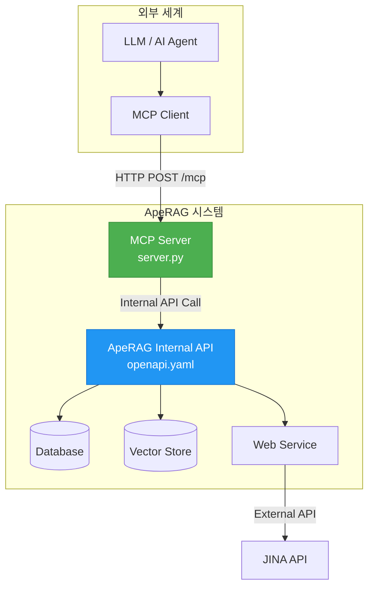
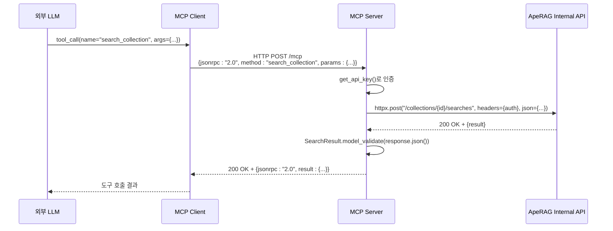
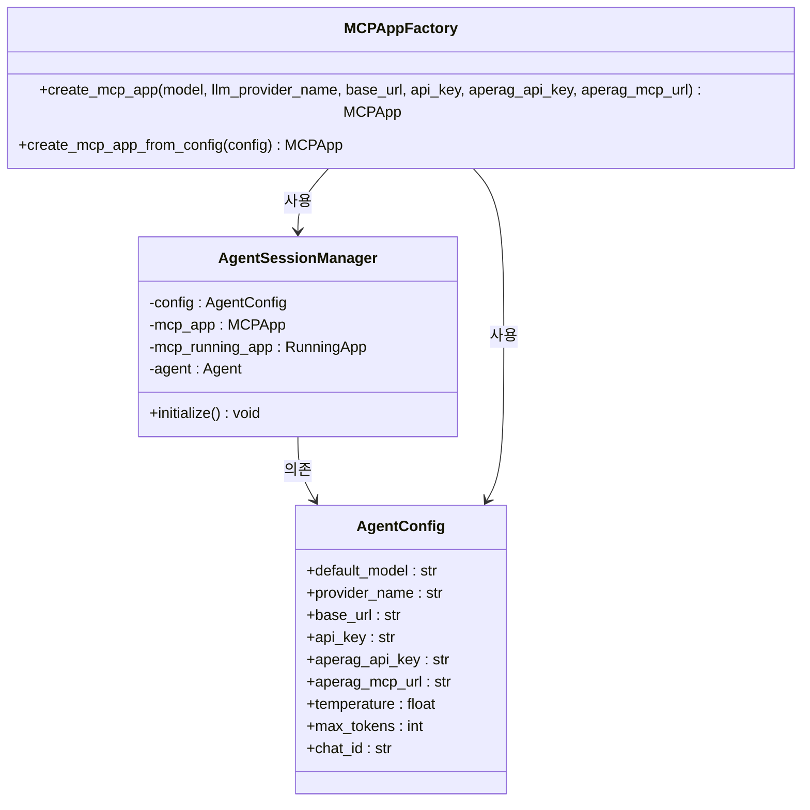

# 외부 동기 통신

<cite>
**이 문서에서 참조한 파일**
- [server.py](file://aperag/mcp/server.py)
- [openapi.yaml](file://aperag/api/openapi.yaml)
- [mcp_app_factory.py](file://aperag/agent/mcp_app_factory.py)
- [agent_session_manager.py](file://aperag/agent/agent_session_manager.py)
- [exceptions.py](file://aperag/agent/exceptions.py)
</cite>

## 목차
1. [소개](#소개)
2. [MCP 서버 아키텍처 개요](#mcp-서버-아키텍처-개요)
3. [외부 도구와의 HTTP 기반 상호작용](#외부-도구와의-http-기반-상호작용)
4. [JSON-RPC 메시지 구조 및 요청/응답 흐름](#json-rpc-메시지-구조-및-요청응답-흐름)
5. [인증 및 보안 메커니즘](#인증-및-보안-메커니즘)
6. [프론트엔드 클라이언트 통신 패턴](#프론트엔드-클라이언트-통신-패턴)
7. [오류 처리 전략](#오류-처리-전략)
8. [실제 통합 사례: 외부 LLM 도구 호출](#실제-통합-사례-외부-llm-도구-호출)
9. [결론](#결론)

## 소개
ApeRAG 시스템은 Model Context Protocol(MCP)을 통해 외부 도구와 동기식으로 통신하는 핵심 기능을 제공합니다. 이 문서는 `server.py`에 구현된 MCP 서버가 HTTP 엔드포인트를 통해 외부 도구와 어떻게 상호작용하는지를 상세히 설명합니다. 특히, `/mcp` 경로를 통한 RESTful API 라우팅, JSON-RPC 형식의 메시지 교환, JWT 또는 API 키 기반 인증 방식, 그리고 프론트엔드에서의 클라이언트 통신 패턴을 분석합니다. 또한 CORS 설정, 입력 검증, rate limiting 등 보안 고려사항과 실시간 응답 지연 최소화를 위한 스트리밍 지원 여부를 검토하며, 실제 외부 LLM 도구 호출 사례를 통해 통합 방법을 안내합니다.

## MCP 서버 아키텍처 개요
MCP 서버는 ApeRAG 내부 서비스와 외부 AI 에이전트 간의 표준화된 통신을 가능하게 하는 핵심 게이트웨이입니다. FastMCP 프레임워크 위에 구축되어 있으며, 다양한 도구(tool)를 노출하고, 리소스(resource)와 프롬프트(prompt)를 제공함으로써 외부 모델이 ApeRAG의 지식 기반에 접근할 수 있도록 합니다.



**다이어그램 출처**
- [server.py](file://aperag/mcp/server.py)
- [openapi.yaml](file://aperag/api/openapi.yaml)

**섹션 출처**
- [server.py](file://aperag/mcp/server.py#L1-L709)
- [openapi.yaml](file://aperag/api/openapi.yaml#L1-L225)

## 외부 도구와의 HTTP 기반 상호작용
MCP 서버는 HTTP 기반의 스트리밍 가능한 전송(transport)을 사용하여 외부 도구와 동기적으로 통신합니다. 이는 `mcp_app_factory.py`에서 MCP 애플리케이션을 구성할 때 명시적으로 정의됩니다.

### 엔드포인트 및 라우팅
`openapi.yaml` 파일은 ApeRAG의 모든 내부 API 엔드포인트를 정의하며, MCP 서버는 이러한 엔드포인트를 프록시하거나 직접 활용합니다. 쿠버네티스 Ingress 설정(`ingress.yaml`)에 따르면, `/mcp` 경로는 백엔드 서비스의 8000번 포트로 라우팅되며, 이는 MCP 서버가 실행되는 위치입니다.

#### 주요 MCP 도구 및 대응 내부 엔드포인트
| MCP 도구 | 설명 | 대응 내부 API 엔드포인트 |
| :--- | :--- | :--- |
| `list_collections` | 사용 가능한 컬렉션 목록 조회 | `GET /api/v1/collections` |
| `search_collection` | 컬렉션 내 지식 검색 | `POST /api/v1/collections/{collection_id}/searches` |
| `search_chat_files` | 채팅 파일 내 지식 검색 | `POST /api/v1/chats/{chat_id}/search` |
| `web_search` | 웹 검색 수행 | `POST /api/v1/web/search` |
| `web_read` | 웹 페이지 내용 추출 | `POST /api/v1/web/read` |

**섹션 출처**
- [server.py](file://aperag/mcp/server.py#L1-L709)
- [openapi.yaml](file://aperag/api/openapi.yaml#L1-L225)
- [ingress.yaml](file://deploy/aperag/templates/ingress.yaml#L1-L40)

## JSON-RPC 메시지 구조 및 요청/응답 흐름
MCP는 JSON-RPC 2.0 프로토콜을 기반으로 한 메시징 구조를 따릅니다. 외부 도구는 JSON 형식의 RPC 요청을 `/mcp` 엔드포인트로 보내고, MCP 서버는 결과를 JSON-RPC 응답 형식으로 반환합니다.

### 요청/응답 흐름
1.  **요청 생성**: 외부 LLM이 특정 작업(예: `search_collection`)을 수행해야 할 필요성을 인식합니다.
2.  **MCP 도구 호출**: LLM은 `tool_call` 메시지를 생성하여 도구 이름과 인수를 포함시킵니다.
3.  **HTTP 전송**: MCP 클라이언트는 이 `tool_call`을 JSON-RPC 요청으로 변환하고, `Authorization` 헤더를 포함해 `/mcp` 엔드포인트로 HTTP POST 요청을 보냅니다.
4.  **인증 및 유효성 검사**: MCP 서버는 `get_api_key()` 함수를 통해 요청을 인증합니다.
5.  **내부 API 호출**: 인증이 성공하면, MCP 서버는 `httpx.AsyncClient`를 사용하여 ApeRAG의 내부 API를 비동기적으로 호출합니다.
6.  **응답 처리**: 내부 API로부터 받은 응답을 `view_models` (예: `SearchResult`, `WebSearchResponse`)을 사용해 타입 안전하게 파싱합니다.
7.  **응답 반환**: 파싱된 결과를 JSON-RPC 응답 형식으로 변환하여 클라이언트에 반환합니다.



**다이어그램 출처**
- [server.py](file://aperag/mcp/server.py#L1-L709)
- [mcp_app_factory.py](file://aperag/agent/mcp_app_factory.py#L1-L105)

**섹션 출처**
- [server.py](file://aperag/mcp/server.py#L1-L709)
- [mcp_app_factory.py](file://aperag/agent/mcp_app_factory.py#L1-L105)

## 인증 및 보안 메커니즘
MCP 서버는 강력한 인증 메커니즘을 통해 안전한 통신을 보장합니다.

### 인증 우선순위
`get_api_key()` 함수는 두 가지 방법으로 API 키를 획득하며, 다음 순서로 우선순위를 둡니다:
1.  **HTTP Authorization 헤더**: `Authorization: Bearer <your-api-key>` 형태의 헤더.
2.  **환경 변수**: `APERAG_API_KEY` 환경 변수.

헤더 기반 인증이 실패하면(예: HTTP 컨텍스트가 아닌 경우), 환경 변수를 대체 수단으로 사용합니다. 두 방법 모두 실패하면 `ValueError`가 발생합니다.

### 보안 고려사항
-   **CORS(Cross-Origin Resource Sharing)**: 프론트엔드와의 통신을 위해 적절한 CORS 정책이 설정되어야 하며, 이는 일반적으로 백엔드 프레임워크(FastAPI 등)에서 구성됩니다.
-   **입력 검증**: MCP 서버는 내부 API에 전달하기 전에 `url_list` 등의 매개변수를 검증합니다. 내부 API(`openapi.yaml`)는 OpenAPI 스펙을 통해 자동으로 입력 검증을 수행합니다.
-   **Rate Limiting**: 문서에는 명시되어 있지 않지만, 프로덕션 환경에서는 `/mcp` 엔드포인트에 대해 rate limiting 전략(예: Redis 기반 카운터)을 적용하여 과도한 요청을 방지하는 것이 중요합니다.

**섹션 출처**
- [server.py](file://aperag/mcp/server.py#L657-L696)

## 프론트엔드 클라이언트 통신 패턴
프론트엔드는 `mcp-api.ts`와 같은 클라이언트 라이브러리를 사용하여 MCP 서버와 통신합니다. 이는 일반적으로 다음과 같은 패턴을 따릅니다:

1.  **설정 초기화**: 사용자 인증 정보(API 키 등)를 포함한 설정 객체를 생성합니다.
2.  **MCP 애플리케이션 생성**: `MCPAppFactory.create_mcp_app_from_config()`을 사용하여 MCP 애플리케이션 인스턴스를 생성합니다. 이 과정에서 `aperag_mcp_url`과 `aperag_api_key`가 설정에 포함됩니다.
3.  **세션 관리**: `AgentSessionManager`는 각 채팅 세션에 대해 독립적인 `mcp_app` 인스턴스를 생성하고 관리합니다. 이는 대화 상태와 메모리를 유지하는 데 필수적입니다.
4.  **도구 호출**: 생성된 MCP 애플리케이션을 통해 `list_collections`, `web_search` 등의 도구를 호출합니다.



**다이어그램 출처**
- [mcp_app_factory.py](file://aperag/agent/mcp_app_factory.py#L1-L105)
- [agent_session_manager.py](file://aperag/agent/agent_session_manager.py#L1-L72)
- [agent_config.py](file://aperag/agent/agent_config.py)

**섹션 출처**
- [mcp_app_factory.py](file://aperag/agent/mcp_app_factory.py#L1-L105)
- [agent_session_manager.py](file://aperag/agent/agent_session_manager.py#L1-L72)

## 오류 처리 전략
MCP 서버와 관련 컴포넌트는 다양한 오류 상황에 대해 체계적인 예외 처리를 구현하고 있습니다.

### MCP 서버 내 오류 처리
-   **내부 API 호출 실패**: HTTP 응답 코드가 200 또는 201이 아닌 경우, 오류 메시지와 상세 정보를 포함한 JSON 오류 응답을 반환합니다.
-   **응답 파싱 실패**: 내부 API의 응답을 `model_validate()`로 파싱할 수 없는 경우, 로깅 후 파싱 실패 오류를 반환합니다.
-   **API 키 누락**: `get_api_key()` 함수가 두 가지 방법 모두로 API 키를 찾지 못하면 `ValueError`를 발생시키며, 이는 최종적으로 JSON-RPC 오류 응답으로 변환됩니다.

### 에이전트 측 오류 처리
-   **MCP 연결 오류 (`MCPConnectionError`)**: MCP 서버에 연결할 수 없을 때 발생하며, 자동 재시도(retry)가 가능하도록 설계되었습니다.
-   **MCP 앱 초기화 오류 (`MCPAppInitializationError`)**: `MCPAppFactory`가 설정 오류로 인해 MCP 애플리케이션을 생성하지 못할 때 발생합니다.

이러한 계층화된 오류 처리는 시스템의 안정성과 디버깅 용이성을 높입니다.

**섹션 출처**
- [server.py](file://aperag/mcp/server.py#L1-L709)
- [exceptions.py](file://aperag/agent/exceptions.py#L39-L84)

## 실제 통합 사례: 외부 LLM 도구 호출
다음은 외부 LLM이 ApeRAG의 `web_search` 도구를 사용하는 실제 통합 흐름입니다.

1.  **사용자 질문**: 사용자가 "최신 AI 개발 동향에 대해 알려줘"라고 질문합니다.
2.  **도구 선택**: LLM은 이 질문에 답하기 위해 웹 검색이 필요하다고 판단합니다.
3.  **도구 호출 생성**: LLM은 다음과 같은 `tool_call`을 생성합니다:
    ```json
    {
      "name": "web_search",
      "arguments": {
        "query": "latest AI developments 2025",
        "max_results": 3
      }
    }
    ```
4.  **MCP 전송**: MCP 클라이언트는 이 호출을 JSON-RPC 요청으로 변환하고, `Bearer` 토큰을 포함한 헤더와 함께 `/mcp` 엔드포인트로 보냅니다.
5.  **내부 처리**: MCP 서버는 `APERAG_API_KEY`를 사용해 내부 `web_search` API를 호출합니다.
6.  **결과 반환**: 내부 서비스는 JINA API 등을 통해 검색을 수행한 후 결과를 반환합니다. MCP 서버는 이를 JSON-RPC 응답으로 변환하여 LLM에 전달합니다.
7.  **최종 답변 생성**: LLM은 웹 검색 결과를 바탕으로 자연어로 된 최종 답변을 생성하여 사용자에게 제공합니다.

이 사례는 MCP가 외부 LLM의 능력을 ApeRAG의 강력한 검색 기능으로 확장하는 핵심적인 역할을 한다는 것을 보여줍니다.

**섹션 출처**
- [server.py](file://aperag/mcp/server.py#L1-L709)
- [web.yaml](file://aperag/api/paths/web.yaml)

## 결론
ApeRAG의 MCP 서버는 HTTP 기반의 동기 통신을 통해 외부 도구와 원활하게 통합되는 강력한 인터페이스를 제공합니다. JSON-RPC 프로토콜을 사용하여 명확한 요청/응답 흐름을 정의하고, `Bearer` 토큰 기반의 인증을 통해 보안을 확보합니다. `mcp_app_factory.py`와 `agent_session_manager.py`는 클라이언트 측에서 MCP 애플리케이션을 안정적으로 초기화하고 세션을 관리하는 데 중요한 역할을 합니다. 이 구조는 외부 LLM이 ApeRAG의 `list_collections`, `search_collection`, `web_search` 등의 고급 기능을 활용할 수 있게 하여, 단순한 언어 생성을 넘어 사실 기반의 정확한 정보 제공이 가능하도록 합니다. 향후에는 현재 동기식인 `/mcp` 엔드포인트에 스트리밍 지원을 추가함으로써 실시간 응답 지연을 더욱 최소화할 수 있는 잠재력이 있습니다.