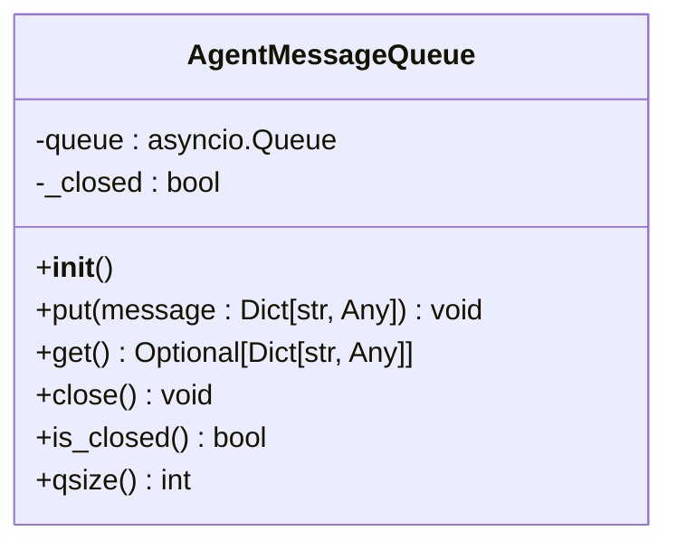
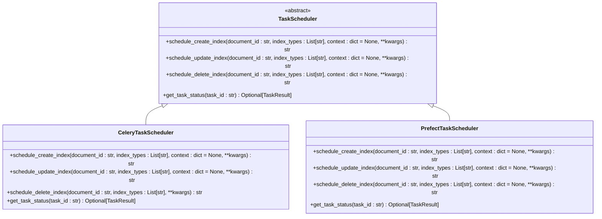
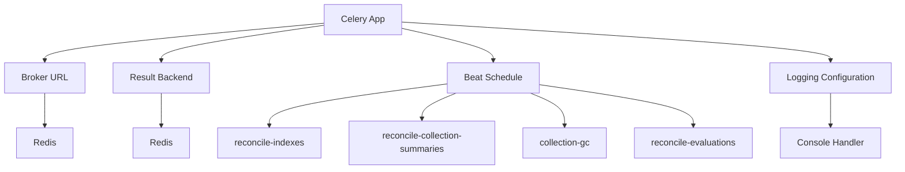
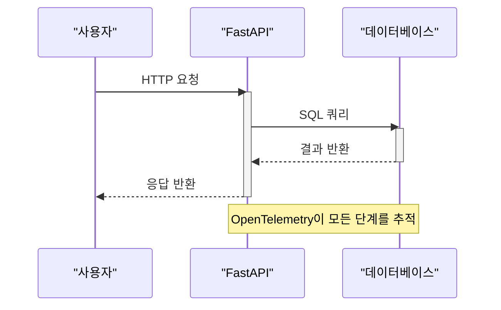
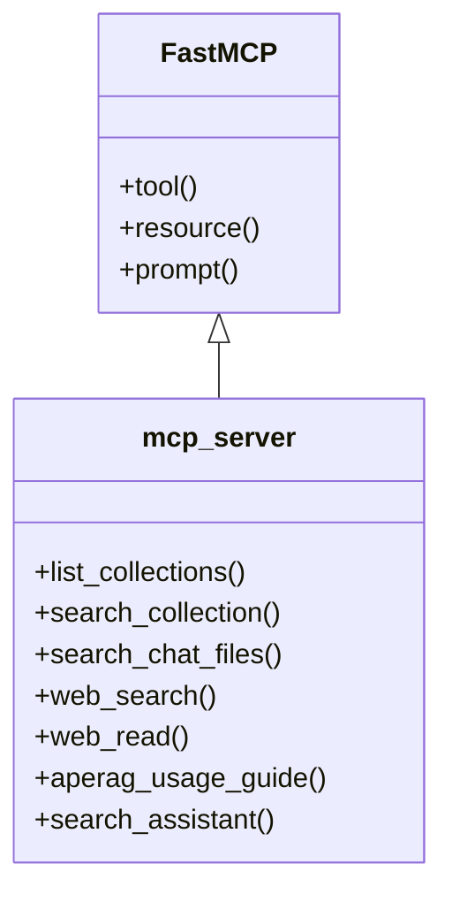
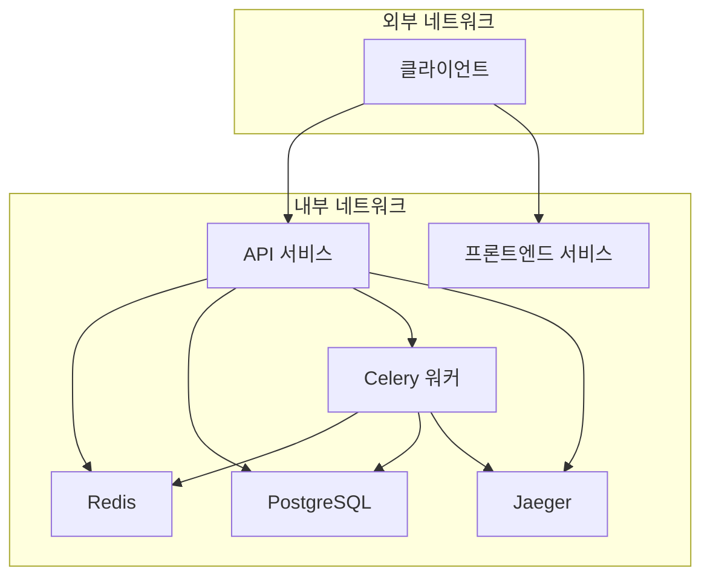
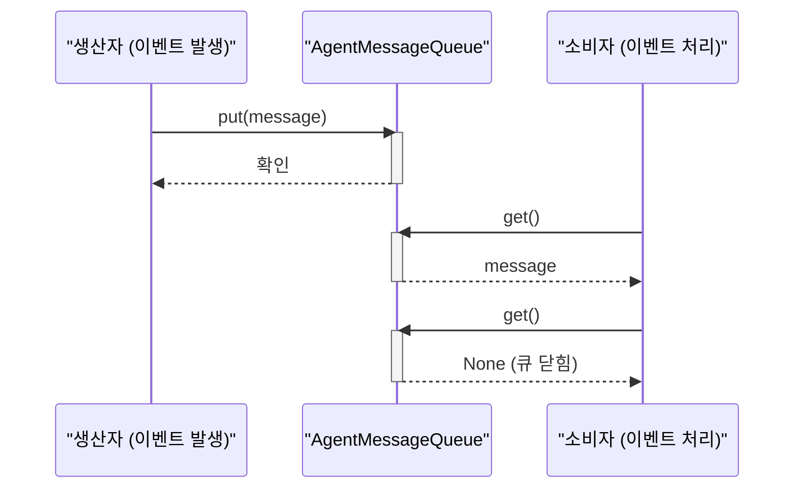
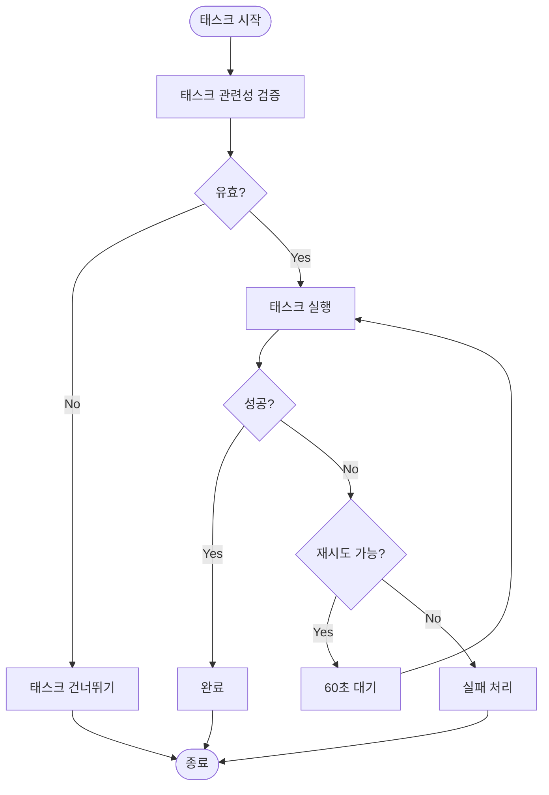

# 통신 메커니즘

<cite>
**이 문서에서 참조된 파일**
- [agent_message_queue.py](file://aperag/agent/agent_message_queue.py)
- [scheduler.py](file://aperag/tasks/scheduler.py)
- [instrumentation.py](file://aperag/trace/instrumentation.py)
- [server.py](file://aperag/mcp/server.py)
- [docker-compose.yml](file://docker-compose.yml)
- [celery.py](file://config/celery.py)
- [celery_tasks.py](file://config/celery_tasks.py)
- [config.py](file://aperag/config.py)
</cite>

## 목차
1. [소개](#소개)
2. [내부 서비스 간 비동기 통신](#내부-서비스-간-비동기-통신)
3. [분산 추적 및 모니터링](#분산-추적-및-모니터링)
4. [외부 도구 통합](#외부-도구-통합)
5. [네트워크 구성 및 보안](#네트워크-구성-및-보안)
6. [실시간 이벤트 전파](#실시간-이벤트-전파)
7. [장애 복구 전략](#장애-복구-전략)
8. [결론](#결론)

## 소개

ApeRAG 시스템은 내부 서비스 간의 효율적인 비동기 처리, 외부 도구와의 원활한 통합, 그리고 신뢰할 수 있는 실시간 통신을 위해 다양한 기술 스택과 아키텍처 패턴을 활용합니다. 본 문서는 시스템의 핵심 통신 메커니즘에 대해 설명하며, 내부 서비스 간의 비동기 작업 처리를 위한 Celery와 Redis 기반 메시지 큐, OpenTelemetry을 이용한 분산 추적, Model Context Protocol(MCP) 서버를 통한 외부 도구 통합, docker-compose.yml을 통한 네트워크 연결 및 포트 매핑, 그리고 인증과 보안 고려사항을 포함하여 실시간 이벤트 전파와 장애 복구 전략을 통해 신뢰성 있는 통신을 보장하는 방법을 다룹니다.

**Section sources**
- [agent_message_queue.py](file://aperag/agent/agent_message_queue.py#L1-L65)
- [scheduler.py](file://aperag/tasks/scheduler.py#L1-L201)
- [instrumentation.py](file://aperag/trace/instrumentation.py#L1-L97)
- [server.py](file://aperag/mcp/server.py#L1-L709)
- [docker-compose.yml](file://docker-compose.yml#L1-L264)

## 내부 서비스 간 비동기 통신

시스템 내부 서비스 간의 비동기 작업은 Celery와 Redis를 기반으로 한 메시지 큐를 통해 처리됩니다. 주요 구성 요소로는 `agent_message_queue.py`에 정의된 에이전트 메시지 큐와 `scheduler.py`에 구현된 태스크 스케줄러가 있습니다.

### 에이전트 메시지 큐

`AgentMessageQueue` 클래스는 에이전트 간 채팅 통신을 위한 비동기 메시지 큐를 제공합니다. Go 언어의 채널처럼 동작하며, 생산자(producer)가 메시지를 큐에 넣고 소비자(consumer)가 메시지를 가져오는 방식으로 작동합니다. 이 큐는 우아한 종료(graceful shutdown)와 스트림 종료(end-of-stream) 신호를 지원합니다.

**Diagram sources**
- [agent_message_queue.py](file://aperag/agent/agent_message_queue.py#L23-L64)

### 태스크 스케줄러

`TaskScheduler`는 태스크 스케줄링을 위한 추상 기본 클래스이며, `CeleryTaskScheduler`가 이를 구현하여 Celery를 사용한 직접적인 워크플로우 실행을 담당합니다. 문서 인덱스 생성, 업데이트, 삭제 등의 작업은 `schedule_create_index`, `schedule_update_index`, `schedule_delete_index` 메서드를 통해 예약되며, 각 작업은 고유한 태스크 ID로 추적할 수 있습니다.

**Diagram sources**
- [scheduler.py](file://aperag/tasks/scheduler.py#L31-L200)

### Celery 구성

`config/celery.py` 파일은 Celery 애플리케이션 인스턴스를 생성하고 구성합니다. 브로커 URL과 결과 백엔드는 설정 파일에서 가져오며, 주기적인 작업을 위한 `beat_schedule`이 정의되어 있습니다. 또한, 로깅 설정을 통해 Celery 워커의 상세한 로그를 출력하도록 구성되어 있습니다.

**Diagram sources**
- [celery.py](file://config/celery.py#L1-L136)

**Section sources**
- [agent_message_queue.py](file://aperag/agent/agent_message_queue.py#L1-L65)
- [scheduler.py](file://aperag/tasks/scheduler.py#L1-L201)
- [celery.py](file://config/celery.py#L1-L136)
- [celery_tasks.py](file://config/celery_tasks.py#L1-L799)

## 분산 추적 및 모니터링

분산 추적은 OpenTelemetry를 사용하여 `instrumentation.py` 파일에서 구현됩니다. 이 모듈은 FastAPI와 SQLAlchemy에 대한 자동 HTTP 요청 트레이싱과 데이터베이스 쿼리 트레이싱을 초기화합니다.

### 초기화 함수

`init_fastapi_instrumentation` 함수는 FastAPI 애플리케이션 인스턴스 또는 모든 FastAPI 앱에 대해 글로벌로 인스트루먼테이션을 활성화합니다. 마찬가지로, `init_sqlalchemy_instrumentation` 함수는 SQLAlchemy에 대한 인스트루먼테이션을 초기화하여 데이터베이스 쿼리를 추적합니다.

**Diagram sources**
- [instrumentation.py](file://aperag/trace/instrumentation.py#L39-L86)

### 설정 및 활성화

`config.py` 파일의 설정을 통해 OpenTelemetry 및 Jaeger 추적이 활성화될 수 있으며, `OTEL_ENABLED`, `JAEGER_ENABLED` 등의 플래그를 통해 제어됩니다. 또한, FastAPI와 SQLAlchemy에 대한 인스트루먼테이션이 개별적으로 활성화될 수 있습니다.

**Section sources**
- [instrumentation.py](file://aperag/trace/instrumentation.py#L1-L97)
- [config.py](file://aperag/config.py#L1-L331)

## 외부 도구 통합

외부 도구 통합은 MCP(Model Context Protocol) 서버(`server.py`)를 통해 HTTP 엔드포인트로 노출됩니다. 이 서버는 FastMCP 라이브러리를 사용하여 다양한 툴을 제공합니다.

### MCP 서버 구성

`mcp_server`는 FastMCP 인스턴스로 초기화되며, 여러 툴을 등록합니다. 각 툴은 특정 작업을 수행하기 위한 비동기 함수로 구현됩니다.

**Diagram sources**
- [server.py](file://aperag/mcp/server.py#L28-L28)

### 주요 툴

- **list_collections**: 사용 가능한 모든 컬렉션을 나열합니다.
- **search_collection**: 특정 컬렉션 내에서 지식을 검색합니다.
- **search_chat_files**: 채팅 파일 내에서 지식을 검색합니다.
- **web_search**: 다양한 검색 엔진을 사용하여 웹 검색을 수행합니다.
- **web_read**: 웹 페이지에서 콘텐츠를 읽고 추출합니다.

각 툴은 내부 API 호출을 통해 동작하며, `API_BASE_URL`을 사용하여 `httpx.AsyncClient`를 통해 요청을 보냅니다. 인증은 `get_api_key` 함수를 통해 HTTP 헤더 또는 환경 변수에서 API 키를 가져와 처리합니다.

**Section sources**
- [server.py](file://aperag/mcp/server.py#L1-L709)

## 네트워크 구성 및 보안

`docker-compose.yml` 파일은 각 서비스의 네트워크 연결과 포트 매핑을 정의합니다. 주요 서비스로는 API, 프론트엔드, Celery 워커, Celery 비트, 플라워(Flower), PostgreSQL, Redis, Qdrant, Elasticsearch, Jaeger 등이 있습니다.

### 서비스 및 포트 매핑

| 서비스 | 포트 매핑 | 목적 |
| --- | --- | --- |
| api | 8000:8000 | FastAPI 애플리케이션 |
| frontend | 3000:3000 | 프론트엔드 애플리케이션 |
| celeryworker | 없음 | 백그라운드 태스크 처리 |
| celerybeat | 없음 | 주기적 태스크 스케줄링 |
| flower | 5555:5555 | Celery 모니터링 대시보드 |
| postgres | 5432:5432 | 관계형 데이터베이스 |
| redis | 6379:6379 | 메시지 브로커 및 캐시 |
| qdrant | 6333:6333 | 벡터 데이터베이스 |
| es | 9200:9200 | 풀텍스트 검색 엔진 |
| jaeger | 16686:16686 | 분산 추적 시스템 |

### 인증 및 보안 고려사항

- **JWT 비밀키**: `jwt_secret` 설정을 통해 JWT 토큰의 서명에 사용됩니다.
- **OAuth 클라이언트 정보**: Google, GitHub, Auth0 등의 OAuth 제공자에 대한 클라이언트 ID와 비밀번호가 설정됩니다.
- **API 키**: MCP 서버는 `Authorization` 헤더 또는 `APERAG_API_KEY` 환경 변수를 통해 API 키를 인증합니다.
- **환경 변수**: 민감한 정보는 `.env` 파일이나 환경 변수를 통해 관리됩니다.

**Diagram sources**
- [docker-compose.yml](file://docker-compose.yml#L1-L264)

**Section sources**
- [docker-compose.yml](file://docker-compose.yml#L1-L264)
- [config.py](file://aperag/config.py#L1-L331)

## 실시간 이벤트 전파

실시간 이벤트 전파는 `AgentMessageQueue`를 통해 이루어집니다. 에이전트 이벤트 리스너와 프로세서는 이 큐를 사용하여 메시지를 교환합니다. `put` 메서드를 통해 메시지를 큐에 삽입하고, `get` 메서드를 통해 메시지를 가져옵니다. 큐가 닫히면 `None` 값을 반환하여 스트림의 끝을 알립니다.

**Diagram sources**
- [agent_message_queue.py](file://aperag/agent/agent_message_queue.py#L35-L49)

**Section sources**
- [agent_message_queue.py](file://aperag/agent/agent_message_queue.py#L1-L65)

## 장애 복구 전략

시스템은 다양한 장애 복구 전략을 통해 신뢰성을 보장합니다.

### 태스크 재시도

Celery 태스크는 `autoretry_for` 데코레이터를 사용하여 예외 발생 시 자동으로 재시도됩니다. 최대 재시도 횟수는 3회이며, 재시도 간격은 60초입니다. 이는 일시적인 네트워크 문제나 리소스 부족 상황에서 태스크가 실패하지 않도록 합니다.

### 상태 검증

태스크 실행 전에 `_validate_task_relevance` 함수를 통해 데이터베이스에서 태스크의 유효성을 두 번 확인합니다. 문서 상태나 버전이 변경되었을 경우 태스크를 건너뛰어 불필요한 작업을 방지합니다.

### 오류 처리

각 태스크는 예외를 적절히 처리하고 로깅하며, 실패 시 콜백을 통해 상태를 업데이트합니다. `notify_workflow_complete` 태스크는 병렬로 실행된 인덱스 작업들의 결과를 집계하여 전체 워크플로우의 성공, 부분 성공, 실패 여부를 판단합니다.

**Diagram sources**
- [celery_tasks.py](file://config/celery_tasks.py#L1-L799)

**Section sources**
- [celery_tasks.py](file://config/celery_tasks.py#L1-L799)
- [scheduler.py](file://aperag/tasks/scheduler.py#L1-L201)

## 결론

ApeRAG 시스템은 내부 서비스 간의 비동기 처리를 위해 Celery와 Redis 기반의 메시지 큐를 효과적으로 활용하며, OpenTelemetry을 통해 분산 추적과 모니터링을 구현합니다. MCP 서버를 통해 외부 도구와의 통합을 간편하게 제공하고, docker-compose.yml을 통해 명확한 네트워크 구성과 보안 설정을 유지합니다. 실시간 이벤트 전파와 함께, 태스크 재시도, 상태 검증, 오류 처리 등의 장애 복구 전략을 통해 신뢰성 있고 안정적인 통신을 보장합니다. 이러한 통합된 접근 방식은 시스템의 확장성, 유지보수성, 그리고 전반적인 성능을 극대화합니다.