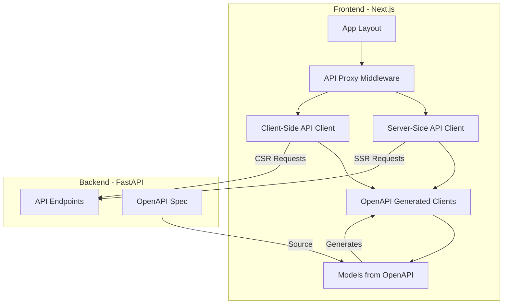
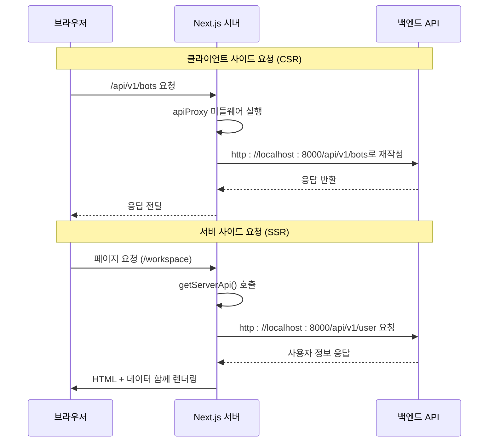
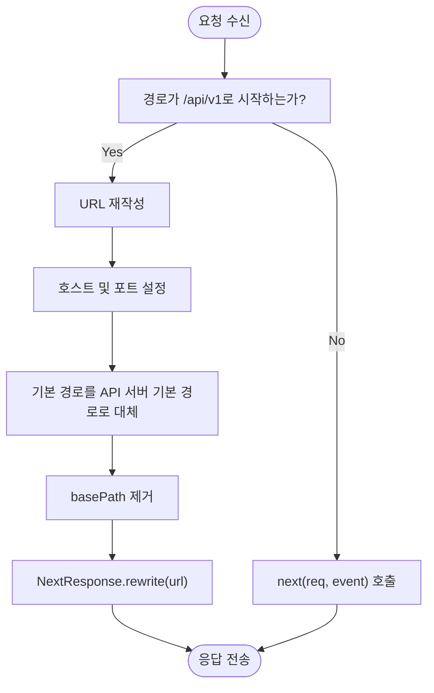
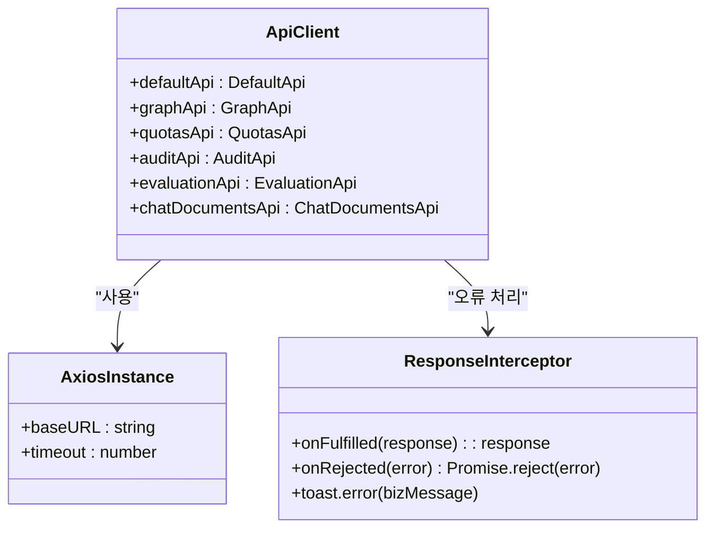
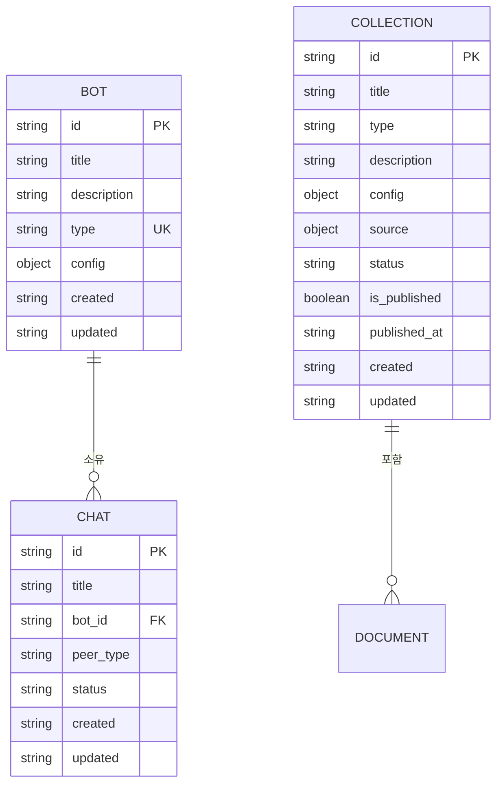
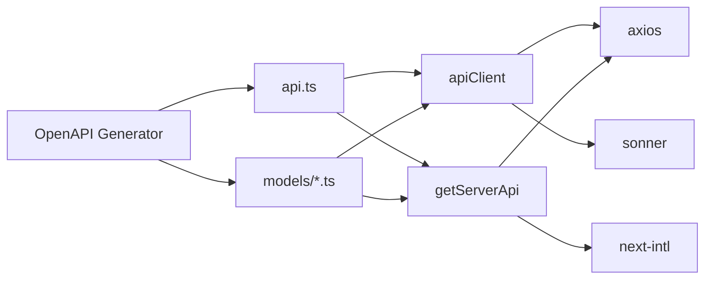

# API 통합 및 데이터 흐름

<cite>
**이 문서에서 참조한 파일**
- [apiProxy.ts](file://web/src/middlewares/apiProxy.ts)
- [client.ts](file://web/src/lib/api/client.ts)
- [server.ts](file://web/src/lib/api/server.ts)
- [api.ts](file://web/src/api/api.ts)
- [openapi.merged.yaml](file://web/src/api/openapi.merged.yaml)
- [Bot.ts](file://web/src/api/models/Bot.ts)
- [Chat.ts](file://web/src/api/models/Chat.ts)
- [Collection.ts](file://web/src/api/models/Collection.ts)
- [layout.tsx](file://web/src/app/layout.tsx)
</cite>

## 목차
1. [소개](#소개)
2. [프로젝트 구조](#프로젝트-구조)
3. [핵심 구성 요소](#핵심-구성-요소)
4. [아키텍처 개요](#아키텍처-개요)
5. [상세 구성 요소 분석](#상세-구성-요소-분석)
6. [의존성 분석](#의존성-분석)
7. [성능 고려사항](#성능-고려사항)
8. [문제 해결 가이드](#문제-해결-가이드)
9. [결론](#결론)

## 소개
ApeRAG 프로젝트는 지식 기반 RAG(Retrieval-Augmented Generation) 시스템을 위한 전면적이고 확장 가능한 아키텍처를 제공합니다. 이 문서는 프론트엔드와 백엔드 간의 API 통합 메커니즘과 데이터 흐름을 상세히 설명합니다. 특히, `apiProxy` 미들웨어를 통한 요청 경로 재작성 및 인증 헤더 주입 방식, 타입 안전한 API 클라이언트 설계, Next.js의 Server Actions와 fetch 함수를 활용한 다양한 데이터 가져오기 전략(SSR, ISR, CSR), 오류 처리, 로딩 상태 표현, 캐싱 전략, 그리고 OpenAPI 스펙 기반으로 생성된 타입 정의가 프론트엔드에 어떻게 반영되는지를 다룹니다.

## 프로젝트 구조
ApeRAG 프로젝트는 백엔드(Python 기반 FastAPI)와 프론트엔드(Next.js 기반 React)로 구성되어 있으며, 두 시스템은 RESTful API를 통해 통신합니다. 프론트엔드는 `/web` 디렉터리에 위치하며, TypeScript, Next.js, Tailwind CSS, ShadCN UI 등을 사용하여 구현되었습니다. 주요 디렉터리는 다음과 같습니다:
- `src/app`: 애플리케이션 라우팅 및 페이지 구성
- `src/api`: OpenAPI Generator를 통해 자동 생성된 API 클라이언트 및 모델 타입
- `src/lib/api`: 서버 및 클라이언트 사이드 API 인스턴스 관리
- `src/middlewares`: Next.js 미들웨어 (예: `apiProxy`)
- `src/components`: UI 컴포넌트 및 공급자(provider)



**Diagram sources**
- [apiProxy.ts](file://web/src/middlewares/apiProxy.ts)
- [client.ts](file://web/src/lib/api/client.ts)
- [server.ts](file://web/src/lib/api/server.ts)
- [api.ts](file://web/src/api/api.ts)
- [openapi.merged.yaml](file://web/src/api/openapi.merged.yaml)

**Section sources**
- [apiProxy.ts](file://web/src/middlewares/apiProxy.ts)
- [client.ts](file://web/src/lib/api/client.ts)
- [server.ts](file://web/src/lib/api/server.ts)
- [api.ts](file://web/src/api/api.ts)
- [openapi.merged.yaml](file://web/src/api/openapi.merged.yaml)

## 핵심 구성 요소
프론트엔드의 핵심 구성 요소는 API 통신을 위한 두 가지 클라이언트(`apiClient` 및 `getServerApi`)와 이를 지원하는 미들웨어(`apiProxy`)입니다. 또한, OpenAPI 스펙을 기반으로 자동 생성된 타입 안전한 API 클라이언트와 모델 인터페이스가 프론트엔드의 신뢰성과 개발 생산성을 크게 향상시킵니다.

**Section sources**
- [client.ts](file://web/src/lib/api/client.ts)
- [server.ts](file://web/src/lib/api/server.ts)
- [apiProxy.ts](file://web/src/middlewares/apiProxy.ts)
- [api.ts](file://web/src/api/api.ts)

## 아키텍처 개요
ApeRAG의 프론트엔드 아키텍처는 클라이언트 사이드와 서버 사이드 모두에서 일관된 API 접근 방식을 제공하도록 설계되었습니다. 클라이언트 사이드에서는 `'use client'` 지시자를 사용하는 `apiClient`가, 서버 사이드에서는 `'use server'` 지시자를 사용하는 `getServerApi()` 함수가 각각 Axios 인스턴스를 통해 백엔드 API와 통신합니다. 모든 요청은 `apiProxy` 미들웨어를 거쳐 실제 백엔드 서버로 리다이렉트되며, 이 과정에서 인증 쿠키와 언어 설정이 자동으로 주입됩니다.



**Diagram sources**
- [apiProxy.ts](file://web/src/middlewares/apiProxy.ts)
- [client.ts](file://web/src/lib/api/client.ts)
- [server.ts](file://web/src/lib/api/server.ts)
- [layout.tsx](file://web/src/app/layout.tsx)

## 상세 구성 요소 분석

### API 프록시 미들웨어 분석
`apiProxy` 미들웨어는 프론트엔드와 백엔드 간의 네트워크 격차를 해소하고 보안을 강화하는 핵심 역할을 합니다. 이 미들웨어는 `/api/v1` 경로로 들어오는 모든 요청을 환경 변수 `API_SERVER_ENDPOINT`로 지정된 실제 백엔드 서버로 리다이렉트합니다. 또한, `NEXT_PUBLIC_BASE_PATH`가 설정된 경우 경로를 적절히 변환하여 유연한 배포 환경을 지원합니다.



**Diagram sources**
- [apiProxy.ts](file://web/src/middlewares/apiProxy.ts#L7-L34)

**Section sources**
- [apiProxy.ts](file://web/src/middlewares/apiProxy.ts#L7-L34)

### 타입 안전한 API 클라이언트 분석
`client.ts`와 `server.ts` 파일은 OpenAPI 스펙을 기반으로 생성된 타입 안전한 API 클라이언트를 제공합니다. `client.ts`는 클라이언트 사이드에서 사용되며, Axios 인터셉터를 통해 응답 오류를 감지하고 `sonner` 라이브러리를 사용하여 사용자에게 알림을 표시합니다. 반면, `server.ts`는 서버 사이드에서 사용되며, 요청 인터셉터를 통해 현재 사용자의 언어 설정과 쿠키를 자동으로 포함시킵니다.

#### 클라이언트 사이드 API 클라이언트


**Diagram sources**
- [client.ts](file://web/src/lib/api/client.ts#L47-L54)

**Section sources**
- [client.ts](file://web/src/lib/api/client.ts#L1-L54)

#### 서버 사이드 API 클라이언트
```mermaid
classDiagram
class ServerApiClient {
+getServerApi() : Promise~ApiInstances~
}
class RequestInterceptor {
+onFulfilled(config) : config
+Lang : lang
+Cookie : allCookies
}
ServerApiClient --> RequestInterceptor : "요청 헤더 주입"
ServerApiClient --> AxiosInstance : "사용"
note right of ServerApiClient
'use server' 지시자로
서버 전용 함수임을 명시
end note
```

**Diagram sources**
- [server.ts](file://web/src/lib/api/server.ts#L51-L53)

**Section sources**
- [server.ts](file://web/src/lib/api/server.ts#L1-L53)

### OpenAPI 기반 타입 정의 분석
`/src/api/models` 디렉터리의 모든 타입 정의 파일(Bot.ts, Chat.ts 등)은 `openapi.merged.yaml` 파일을 소스로 하여 OpenAPI Generator 도구가 자동 생성합니다. 이는 백엔드 API의 변경 사항이 프론트엔드에 즉시 반영되도록 하며, 타입 안정성을 보장합니다. 예를 들어, `Bot` 인터페이스는 `id`, `title`, `description` 등의 속성을 정의하며, `BotTypeEnum` 열거형은 `knowledge`, `common`, `agent` 세 가지 값을 가집니다.



**Diagram sources**
- [openapi.merged.yaml](file://web/src/api/openapi.merged.yaml)
- [Bot.ts](file://web/src/api/models/Bot.ts)
- [Chat.ts](file://web/src/api/models/Chat.ts)
- [Collection.ts](file://web/src/api/models/Collection.ts)

**Section sources**
- [openapi.merged.yaml](file://web/src/api/openapi.merged.yaml)
- [Bot.ts](file://web/src/api/models/Bot.ts)
- [Chat.ts](file://web/src/api/models/Chat.ts)
- [Collection.ts](file://web/src/api/models/Collection.ts)

## 의존성 분석
프론트엔드의 API 통합 계층은 여러 외부 라이브러리와 밀접하게 연동됩니다. 주요 의존성은 다음과 같습니다:
- **axios**: HTTP 요청을 위한 핵심 라이브러리로, 클라이언트와 서버 모두에서 사용됩니다.
- **next-intl**: 다국어 지원을 위해 사용되며, `getServerApi`에서 현재 언어를 가져와 요청 헤더에 포함합니다.
- **sonner**: 사용자 피드백을 위한 토스트 알림 라이브러리로, `client.ts`의 응답 인터셉터에서 오류 메시지를 표시합니다.
- **OpenAPI Generator**: `openapi.merged.yaml`을 기반으로 API 클라이언트와 모델 타입을 자동 생성합니다.



**Diagram sources**
- [client.ts](file://web/src/lib/api/client.ts)
- [server.ts](file://web/src/lib/api/server.ts)
- [api.ts](file://web/src/api/api.ts)
- [openapi.merged.yaml](file://web/src/api/openapi.merged.yaml)

**Section sources**
- [client.ts](file://web/src/lib/api/client.ts)
- [server.ts](file://web/src/lib/api/server.ts)
- [api.ts](file://web/src/api/api.ts)
- [openapi.merged.yaml](file://web/src/api/openapi.merged.yaml)

## 성능 고려사항
- **서버 사이드 렌더링(SSR)**: `layout.tsx`에서 `getServerApi()`를 사용하여 초기 사용자 정보를 가져오므로, 첫 페이지 로딩 시 추가적인 클라이언트 사이드 요청 없이 사용자 데이터를 렌더링할 수 있습니다. 이는 LCP(Largest Contentful Paint) 성능 지표를 개선합니다.
- **클라이언트 사이드 요청 최적화**: 모든 Axios 인스턴스는 5초의 타임아웃이 설정되어 있어, 느린 네트워크 환경에서도 UI가 멈추는 것을 방지합니다.
- **에러 처리 통합**: 클라이언트 사이드에서 발생하는 모든 API 오류는 중앙 집중식 인터셉터에서 처리되어 일관된 사용자 경험을 제공합니다.

## 문제 해결 가이드
- **API 요청이 401 Unauthorized 오류를 반환하는 경우**: `apiProxy` 미들웨어가 올바르게 작동하고 있는지 확인하세요. 백엔드 서버의 `API_SERVER_ENDPOINT` 환경 변수가 정확한지 검사하고, 브라우저 쿠키가 올바르게 전달되고 있는지 확인해야 합니다.
- **타입 오류가 발생하는 경우**: 백엔드 API가 변경된 후 OpenAPI 스펙이 업데이트되었는지 확인하세요. `openapi.merged.yaml` 파일을 갱신하고, OpenAPI Generator를 다시 실행하여 `src/api` 디렉터리의 코드를 재생성해야 할 수 있습니다.
- **서버 사이드에서 API 호출이 실패하는 경우**: `getServerApi` 함수 내의 `request` 인스턴스가 올바른 `baseURL`을 가지고 있는지 확인하세요. `API_SERVER_ENDPOINT` 및 `API_SERVER_BASE_PATH` 환경 변수가 서버 환경에 맞게 설정되어 있는지 점검하세요.

**Section sources**
- [apiProxy.ts](file://web/src/middlewares/apiProxy.ts)
- [client.ts](file://web/src/lib/api/client.ts)
- [server.ts](file://web/src/lib/api/server.ts)
- [openapi.merged.yaml](file://web/src/api/openapi.merged.yaml)

## 결론
ApeRAG 프로젝트의 프론트엔드 API 통합 아키텍처는 보안, 유지보수성, 개발 생산성을 극대화하도록 설계되었습니다. `apiProxy` 미들웨어는 프런트엔드와 백엔드 간의 간편한 통신을 가능하게 하며, OpenAPI 기반의 타입 안전한 클라이언트는 버그를 줄이고 개발 속도를 높입니다. SSR과 CSR을 위한 별도의 API 인스턴스는 각각의 실행 환경에 최적화된 데이터 가져오기 전략을 제공하여 전체적인 사용자 경험을 향상시킵니다.