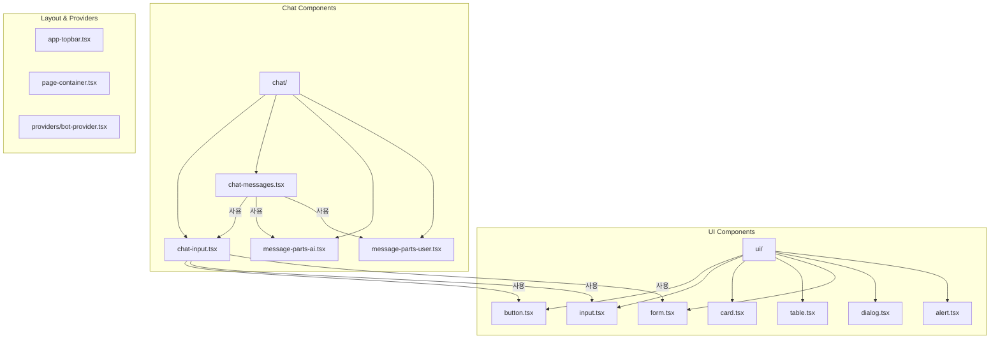
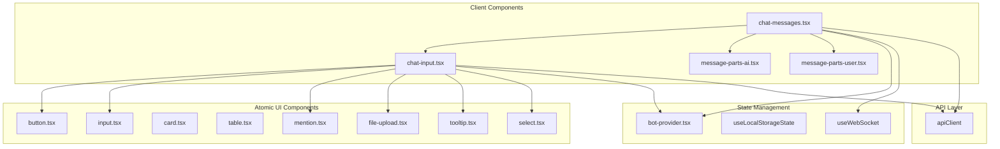
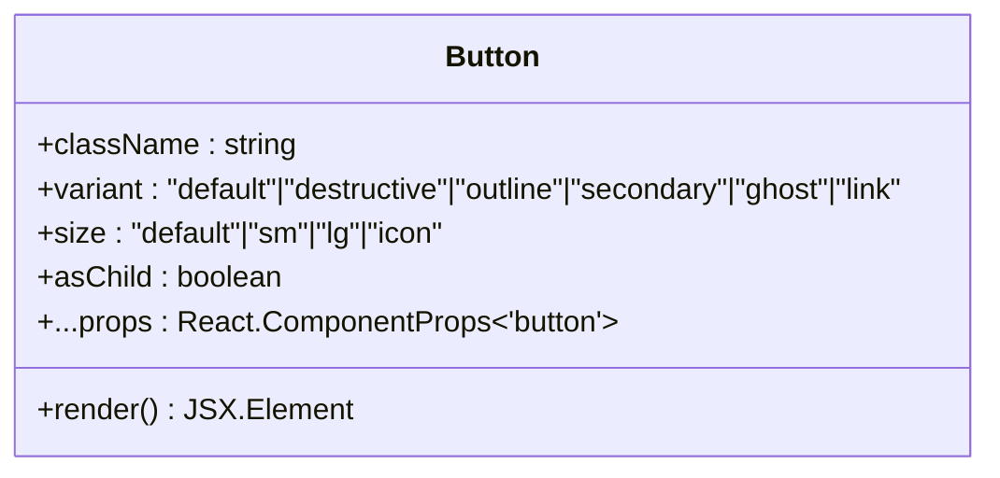
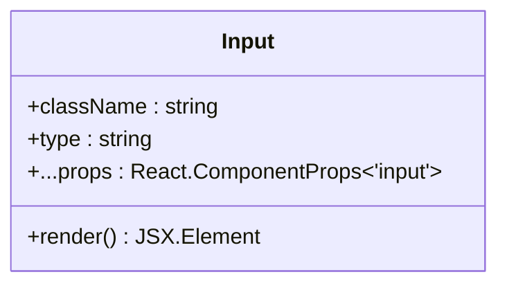
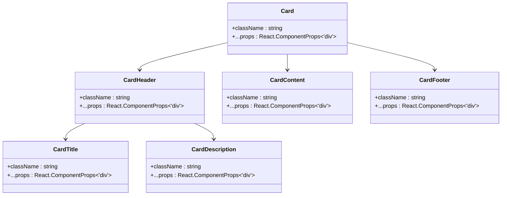
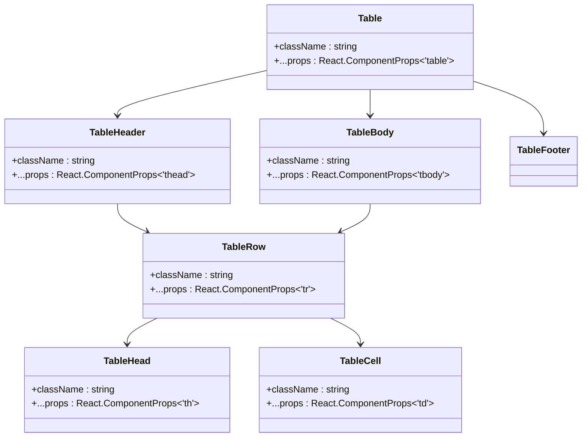
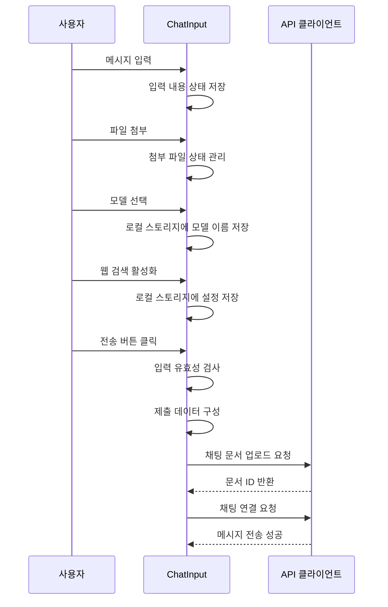
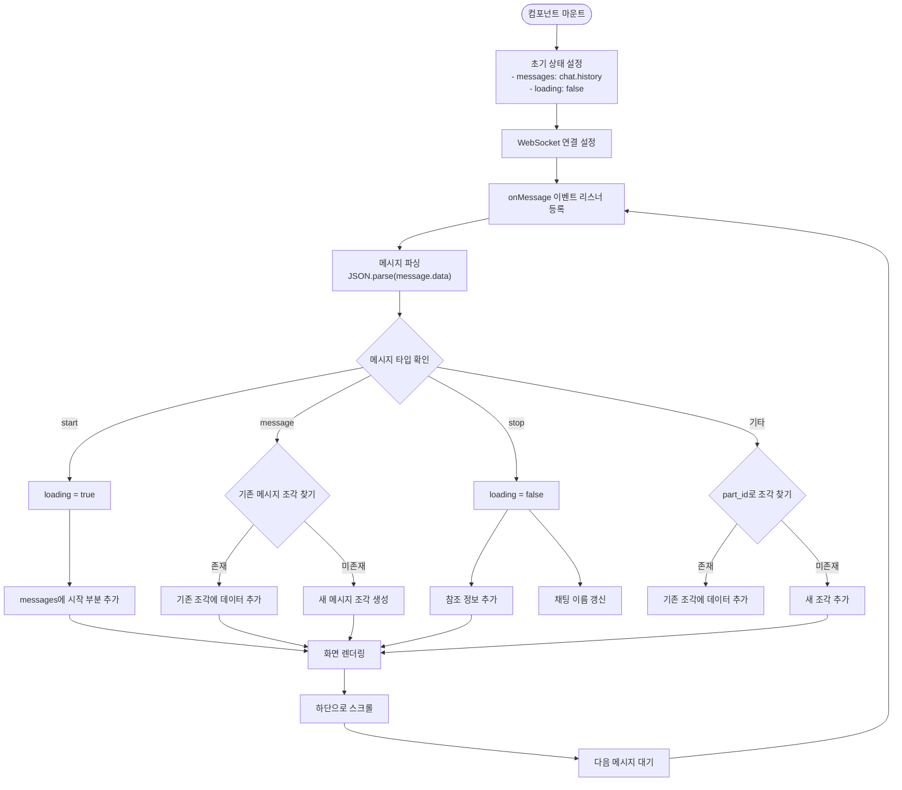
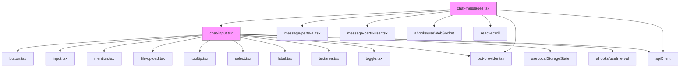

# UI 컴포넌트 구조

<cite>
**이 문서에서 참조된 파일**
- [button.tsx](file://web/src/components/ui/button.tsx)
- [input.tsx](file://web/src/components/ui/input.tsx)
- [card.tsx](file://web/src/components/ui/card.tsx)
- [table.tsx](file://web/src/components/ui/table.tsx)
- [chat-input.tsx](file://web/src/components/chat/chat-input.tsx)
- [chat-messages.tsx](file://web/src/components/chat/chat-messages.tsx)
</cite>

## 목차
1. [소개](#소개)
2. [프로젝트 구조](#프로젝트-구조)
3. [핵심 구성 요소](#핵심-구성-요소)
4. [아키텍처 개요](#아키텍처-개요)
5. [상세 구성 요소 분석](#상세-구성-요소-분석)
6. [의존성 분석](#의존성-분석)

## 소개
ApeRAG 프로젝트는 그래프 기반 RAG(Retrieval-Augmented Generation), 벡터 검색, 풀텍스트 검색을 결합한 프로덕션 준비 완료된 AI 플랫폼입니다. 이 문서는 `web/src/components` 디렉토리에 위치한 UI 컴포넌트들의 계층적 구조를 설명하며, 원자성 컴포넌트부터 고차원 채팅 인터페이스까지의 아키텍처와 설계 원칙을 분석합니다.

## 프로젝트 구조
UI 컴포넌트는 `web/src/components` 디렉토리 아래에 계층적으로 구성되어 있습니다. 주요 디렉토리는 다음과 같습니다:

- `ui/`: 버튼, 입력 필드, 카드, 테이블 등 재사용 가능한 원자성 컴포넌트들
- `chat/`: 채팅 인터페이스 관련 고차원 컴포넌트들
- `providers/`: 상태 관리 및 컨텍스트 제공자
- `app-topbar.tsx`, `page-container.tsx`: 애플리케이션 전반의 레이아웃 컴포넌트

**Diagram sources**
- [web/src/components/ui/button.tsx](file://web/src/components/ui/button.tsx)
- [web/src/components/ui/input.tsx](file://web/src/components/ui/input.tsx)
- [web/src/components/ui/card.tsx](file://web/src/components/ui/card.tsx)
- [web/src/components/ui/table.tsx](file://web/src/components/ui/table.tsx)
- [web/src/components/chat/chat-input.tsx](file://web/src/components/chat/chat-input.tsx)
- [web/src/components/chat/chat-messages.tsx](file://web/src/components/chat/chat-messages.tsx)

**Section sources**
- [web/src/components/ui](file://web/src/components/ui)
- [web/src/components/chat](file://web/src/components/chat)

## 핵심 구성 요소

### 원자성 UI 컴포넌트
`ui/` 디렉토리에는 Tailwind CSS와 class-variance-authority(cva)를 활용하여 스타일링된 재사용 가능한 원자성 컴포넌트들이 포함되어 있습니다. 이러한 컴포넌트들은 일관된 디자인 시스템을 제공하며, 접근성(a11y) 요구사항을 준수합니다.

### 고차원 채팅 컴포넌트
`chat/` 디렉토리에는 채팅 인터페이스를 구성하는 고차원 컴포넌트들이 위치해 있습니다. `chat-input`과 `chat-messages` 컴포넌트는 사용자 상호작용과 메시지 렌더링의 핵심 역할을 수행합니다.

**Section sources**
- [web/src/components/ui/button.tsx](file://web/src/components/ui/button.tsx#L1-L61)
- [web/src/components/chat/chat-input.tsx](file://web/src/components/chat/chat-input.tsx#L1-L600)

## 아키텍처 개요

**Diagram sources**
- [web/src/components/chat/chat-input.tsx](file://web/src/components/chat/chat-input.tsx)
- [web/src/components/chat/chat-messages.tsx](file://web/src/components/chat/chat-messages.tsx)
- [web/src/components/ui/button.tsx](file://web/src/components/ui/button.tsx)
- [web/src/components/providers/bot-provider.tsx](file://web/src/components/providers/bot-provider.tsx)

## 상세 구성 요소 분석

### 원자성 컴포넌트 분석

#### Button 컴포넌트
버튼 컴포넌트는 cva 라이브러리를 사용하여 다양한 변형(variant)과 크기(size) 옵션을 제공합니다. 기본, 파괴적, 외곽선, 보조, ghost, 링크 등 6가지 변형과 기본, 소형, 대형, 아이콘 등 4가지 크기 옵션이 정의되어 있습니다.

**Diagram sources**
- [web/src/components/ui/button.tsx](file://web/src/components/ui/button.tsx#L42-L58)

**Section sources**
- [web/src/components/ui/button.tsx](file://web/src/components/ui/button.tsx#L1-L61)

#### Input 컴포넌트
입력 필드 컴포넌트는 접근성과 반응형 디자인을 고려하여 설계되었습니다. 포커스 상태, 유효성 검사 오류 상태 등을 위한 적절한 스타일링과 aria-invalid 속성을 포함하고 있습니다.

**Diagram sources**
- [web/src/components/ui/input.tsx](file://web/src/components/ui/input.tsx#L4-L18)

**Section sources**
- [web/src/components/ui/input.tsx](file://web/src/components/ui/input.tsx#L1-L22)

#### Card 컴포넌트
카드 컴포넌트는 헤더, 본문, 바닥글 등의 하위 컴포넌트와 함께 사용되는 컨테이너 역할을 합니다. 그림자 효과와 여백을 통해 콘텐츠를 시각적으로 그룹화합니다.

**Diagram sources**
- [web/src/components/ui/card.tsx](file://web/src/components/ui/card.tsx#L4-L15)

**Section sources**
- [web/src/components/ui/card.tsx](file://web/src/components/ui/card.tsx#L1-L93)

#### Table 컴포넌트
테이블 컴포넌트는 반응형 디자인을 위해 외부 div 컨테이너를 사용하여 수평 스크롤을 지원합니다. 헤더, 본문, 바닥글, 행, 셀 등의 하위 컴포넌트로 구성되어 있으며, hover 상태와 선택 상태를 위한 스타일링도 포함되어 있습니다.

**Diagram sources**
- [web/src/components/ui/table.tsx](file://web/src/components/ui/table.tsx#L6-L19)

**Section sources**
- [web/src/components/ui/table.tsx](file://web/src/components/ui/table.tsx#L1-L117)

### 고차원 채팅 컴포넌트 분석

#### ChatInput 컴포넌트
채팅 입력 컴포넌트는 사용자의 쿼리를 입력받고 제출하는 핵심 인터페이스입니다. 이 컴포넌트는 여러 원자성 컴포넌트들을 조합하여 복잡한 기능을 제공합니다.

**Diagram sources**
- [web/src/components/chat/chat-input.tsx](file://web/src/components/chat/chat-input.tsx#L81-L598)

**Section sources**
- [web/src/components/chat/chat-input.tsx](file://web/src/components/chat/chat-input.tsx#L1-L600)

#### ChatMessages 컴포넌트
채팅 메시지 컴포넌트는 메시지 기록을 렌더링하고 실시간 메시지를 처리하는 역할을 합니다. WebSocket을 통해 서버로부터 실시간으로 메시지 조각을 수신하고, 이를 누적하여 표시합니다.

**Diagram sources**
- [web/src/components/chat/chat-messages.tsx](file://web/src/components/chat/chat-messages.tsx#L18-L240)

**Section sources**
- [web/src/components/chat/chat-messages.tsx](file://web/src/components/chat/chat-messages.tsx#L1-L242)

## 의존성 분석

**Diagram sources**
- [web/src/components/chat/chat-input.tsx](file://web/src/components/chat/chat-input.tsx)
- [web/src/components/chat/chat-messages.tsx](file://web/src/components/chat/chat-messages.tsx)

**Section sources**
- [web/src/components/chat/chat-input.tsx](file://web/src/components/chat/chat-input.tsx)
- [web/src/components/chat/chat-messages.tsx](file://web/src/components/chat/chat-messages.tsx)