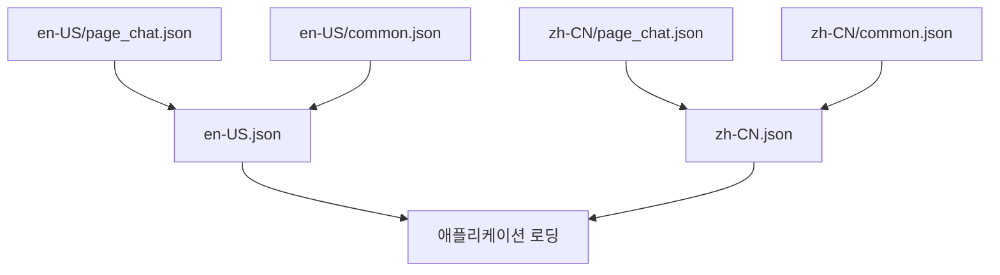
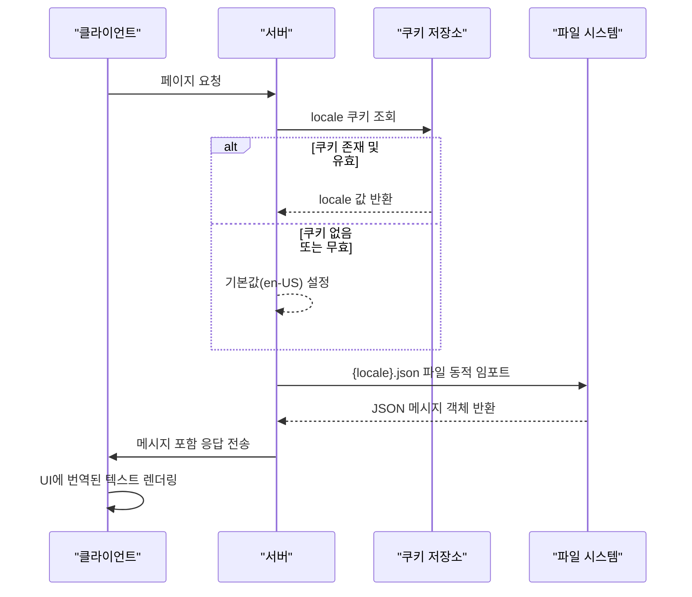
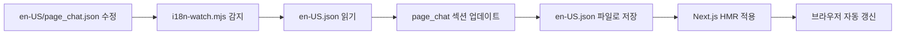

# 다국어 지원 (i18n)

<cite>
**이 문서에서 참조한 파일**  
- [request.ts](file://web/src/i18n/request.ts)
- [cookies.ts](file://web/src/services/cookies.ts)
- [i18n-watch.mjs](file://web/scripts/i18n-watch.mjs)
- [en-US.json](file://web/src/i18n/en-US.json)
- [zh-CN.json](file://web/src/i18n/zh-CN.json)
</cite>

## 목차
1. [소개](#소개)  
2. [다국어 리소스 파일 구조](#다국어-리소스-파일-구조)  
3. [실행 시 언어 감지 및 로딩 전략](#실행-시-언어-감지-및-로딩-전략)  
4. [개발 중 번역 파일 자동 동기화](#개발-중-번역-파일-자동-동기화)  
5. [UI에서의 번역 텍스트 렌더링 흐름](#ui에서의-번역-텍스트-렌더링-흐름)  
6. [새로운 언어 추가 절차](#새로운-언어-추가-절차)  
7. [번역 일관성 유지 방법](#번역-일관성-유지-방법)  
8. [성능 고려사항](#성능-고려사항)  
9. [결론](#결론)

## 소개
ApeRAG 프로젝트는 다국어 사용자를 위한 국제화(i18n) 기능을 제공합니다. 이 문서는 JSON 기반 리소스 파일을 활용한 다국어 지원 구현 방식, 실행 시점의 언어 감지 및 로딩 전략, 개발 중 자동 동기화 스크립트의 작동 원리, UI에서의 실제 번역 텍스트 렌더링 흐름을 설명합니다. 또한 새로운 언어를 추가하는 절차, 번역 일관성 유지 방법, 그리고 성능에 미치는 영향(번들 크기, 초기 로딩 시간 등)에 대한 고려사항도 포함됩니다.

## 다국어 리소스 파일 구조

다국어 리소스는 `web/src/i18n` 디렉터리에 위치하며, 다음과 같은 구조를 가집니다:

```
src/i18n/
├── en-US/
│   ├── common.json
│   ├── page_chat.json
│   └── ...
├── zh-CN/
│   ├── common.json
│   ├── page_chat.json
│   └── ...
├── en-US.json
└── zh-CN.json
```

각 언어별 하위 디렉터리(`en-US`, `zh-CN`)에는 페이지 또는 컴포넌트 단위로 분리된 JSON 파일들이 존재합니다. 예를 들어, `common.json`은 공통적으로 사용되는 문구들을, `page_chat.json`은 채팅 페이지 관련 문구들을 포함합니다. 이러한 세분화된 구조는 관리 용이성을 높입니다.

빌드 과정에서 `i18n-watch.mjs` 스크립트가 각 언어별 폴더 내의 모든 `.json` 파일들을 읽어와 통합된 단일 파일(`en-US.json`, `zh-CN.json`)로 병합합니다. 최종 생성된 JSON 파일은 중첩된 객체 구조를 가지며, 키 경로를 통해 특정 메시지에 접근할 수 있습니다.



**Diagram sources**
- [en-US.json](file://web/src/i18n/en-US.json)
- [zh-CN.json](file://web/src/i18n/zh-CN.json)

**Section sources**
- [en-US.json](file://web/src/i18n/en-US.json)
- [zh-CN.json](file://web/src/i18n/zh-CN.json)

## 실행 시 언어 감지 및 로딩 전략

애플리케이션 실행 시 현재 사용자의 언어 설정을 결정하고 해당 언어의 번역 메시지를 로딩하는 전략은 다음과 같습니다.

### 언어 감지
현재 언어는 `getLocale()` 함수를 통해 결정됩니다. 이 함수는 클라이언트 측 쿠키에서 `locale` 값을 우선적으로 읽어옵니다. 만약 쿠키에 값이 없거나 유효하지 않은 경우, 기본값으로 `en-US`를 반환합니다. 지원되는 언어 목록은 `['en-US', 'zh-CN']`으로 정의되어 있으며, 쿠키 값이 이 목록에 포함되지 않으면 기본값이 사용됩니다.

### 메시지 로딩
Next.js의 `next-intl` 라이브러리를 사용하여 서버 사이드에서 메시지를 동적으로 로딩합니다. `getRequestConfig` 함수는 요청 시점에 실행되며, 감지된 `locale` 값을 기반으로 해당 언어의 통합된 JSON 파일(`./{locale}.json`)을 동적 임포트(`import()`)를 통해 불러옵니다. 이렇게 로딩된 메시지는 Next.js의 i18n 컨텍스트에 주입되어, 이후 클라이언트 사이드에서 사용할 수 있게 됩니다.



**Diagram sources**
- [request.ts](file://web/src/i18n/request.ts)
- [cookies.ts](file://web/src/services/cookies.ts)

**Section sources**
- [request.ts](file://web/src/i18n/request.ts)
- [cookies.ts](file://web/src/services/cookies.ts)

## 개발 중 번역 파일 자동 동기화

개발 환경에서는 `i18n-watch.mjs` 스크립트가 실시간으로 번역 파일의 변경을 감지하고 자동으로 통합 파일을 재생성함으로써 효율적인 작업 흐름을 제공합니다.

### 작동 원리
1.  **초기화**: 스크립트는 `src/i18n` 디렉터리를 기준으로 `en-US` 및 `zh-CN`과 같은 언어별 폴더를 감시 대상으로 설정합니다.
2.  **파일 삭제**: 시작 시점에 기존의 `en-US.json` 및 `zh-CN.json` 통합 파일을 삭제하여 깨끗한 상태에서 시작합니다.
3.  **변경 감지**: `chokidar` 라이브러리를 사용하여 감시 대상 폴더 내의 모든 `.json` 파일에 대해 `change`(수정), `add`(생성), `unlink`(삭제) 이벤트를 모니터링합니다.
4.  **재생성**: 이벤트 발생 시, 해당 파일의 내용을 읽어와 적절한 언어의 통합 JSON 객체에 반영합니다. 예를 들어, `en-US/page_chat.json`이 수정되면, `en-US.json` 파일 내의 `page_chat` 객체가 업데이트됩니다.
5.  **파일 출력**: 갱신된 통합 객체를 `JSON.stringify`를 사용해 포맷팅한 후, 다시 `en-US.json` 또는 `zh-CN.json` 파일로 저장합니다.

이 과정을 통해 개발자는 개별 번역 파일만 수정하면, 저장 즉시 애플리케이션이 새로고침되어 최신 번역 결과를 확인할 수 있습니다.



**Diagram sources**
- [i18n-watch.mjs](file://web/scripts/i18n-watch.mjs)

**Section sources**
- [i18n-watch.mjs](file://web/scripts/i18n-watch.mjs)

## UI에서의 번역 텍스트 렌더링 흐름

사용자 인터페이스(UI)에서 실제 번역 텍스트가 렌더링되는 흐름은 다음과 같습니다.

1.  **컴포넌트 렌더링 요청**: 사용자가 특정 페이지(예: 채팅 페이지)에 접속하면, 해당 페이지의 React 컴포넌트가 렌더링을 시작합니다.
2.  **메시지 훅 호출**: 컴포넌트 내부에서는 `next-intl`에서 제공하는 `useTranslations` 또는 `useFormatter` 등의 훅을 사용하여 번역 서비스를 호출합니다.
3.  **메시지 검색**: 훅은 Next.js 서버에서 사전에 로딩된 메시지 객체(`messages`)를 컨텍스트로부터 가져온 후, 개발자가 지정한 키(예: `'page_chat.hello_world'`)를 기반으로 해당하는 번역 문자열을 검색합니다.
4.  **텍스트 렌더링**: 검색된 번역 문자열이 React Virtual DOM에 삽입되고, 최종적으로 브라우저에 표시됩니다.

이러한 흐름 덕분에 개발자는 하드코딩된 문자열 대신 의미 있는 키를 사용하여 코드를 작성할 수 있으며, 런타임 시점에 올바른 언어의 메시지가 자동으로 바인딩됩니다.

**Section sources**
- [request.ts](file://web/src/i18n/request.ts)
- [en-US.json](file://web/src/i18n/en-US.json)

## 새로운 언어 추가 절차

새로운 언어(예: 일본어 `ja-JP`)를 프로젝트에 추가하기 위한 절차는 다음과 같습니다.

1.  **지원 언어 목록 업데이트**: `web/src/services/cookies.ts` 파일 내의 `locales` 상수 배열에 새 언어 코드를 추가합니다.
    ```ts
    const locales = ['en-US', 'zh-CN', 'ja-JP'] as const;
    ```
2.  **디렉터리 생성**: `web/src/i18n` 디렉터리 내에 새 언어 코드와 동일한 이름의 폴더(예: `ja-JP`)를 생성합니다.
3.  **기본 번역 파일 복사**: 기존 언어 폴더(예: `en-US`) 내의 모든 `.json` 파일을 새 폴더로 복사합니다.
4.  **번역 수행**: 복사된 각 `.json` 파일 내의 모든 문자열 값을 일본어로 번역합니다.
5.  **기본값 설정 (선택)**: 필요 시, `defaultLocale` 상수를 새 언어로 변경하거나, 배포 환경 변수를 통해 설정합니다.
6.  **스크립트 재시작**: `i18n-watch.mjs` 스크립트가 새 폴더를 감시하도록 하기 위해 개발 서버를 재시작합니다.

이후부터는 기존 언어들과 동일한 방식으로 새 언어가 지원됩니다.

**Section sources**
- [cookies.ts](file://web/src/services/cookies.ts)

## 번역 일관성 유지 방법

번역의 일관성을 유지하기 위해 다음과 같은 방법들이 사용됩니다.

-   **모듈화된 JSON 파일**: `common.json`과 같이 공통 문구를 별도 파일로 분리하여, 여러 페이지에서 동일한 키를 사용하도록 강제함으로써 일관성을 보장합니다.
-   **명확한 키 네이밍**: 키는 `페이지_또는_컴포넌트_설명` 형식(예: `page_chat.hello_world`)을 따르도록 하여, 번역 담당자가 문맥을 쉽게 파악할 수 있도록 합니다.
-   **자동화된 동기화**: `i18n-watch.mjs` 스크립트가 모든 변경 사항을 실시간으로 반영하므로, 개발자가 실수로 이전 버전의 파일을 사용하는 것을 방지합니다.
-   **형식 지정 지원**: `request.ts` 내 `formats` 설정을 통해 날짜, 시간 등의 형식을 언어별로 일관되게 처리할 수 있습니다.

**Section sources**
- [request.ts](file://web/src/i18n/request.ts)
- [en-US.json](file://web/src/i18n/en-US.json)

## 성능 고려사항

다국어 지원은 사용자 경험을 향상시키지만, 다음과 같은 성능 측면의 고려가 필요합니다.

-   **번들 크기 증가**: 각 언어의 번역 데이터가 애플리케이션 번들에 포함되므로, 지원하는 언어가 많아질수록 번들 크기가 선형적으로 증가합니다. 이는 초기 다운로드 시간을 늘릴 수 있습니다.
-   **초기 로딩 시간**: `getRequestConfig`에서 동적 임포트를 수행하는 동안, 해당 언어의 전체 JSON 파일을 로딩해야 하므로, 파일 크기가 크면 초기 로딩 지연이 발생할 수 있습니다.
-   **최적화 방안**:
    -   **코드 스플리팅**: 언어별 번역 파일을 별도의 청크로 분리하여, 사용자가 선택한 언어의 파일만 로딩하도록 할 수 있습니다.
    -   **지연 로딩(Lazy Loading)**: 현재 페이지에서 필요한 메시지만을 초기에 로딩하고, 나머지는 필요 시점에 로딩하는 전략을 고려할 수 있습니다.
    -   **압축**: JSON 파일을 빌드 과정에서 Gzip 또는 Brotli로 압축하여 전송 크기를 줄입니다.

현재 구현은 단순성과 개발 편의성을 우선시했으며, 향후 확장 시 위의 최적화 방안을 적용할 수 있습니다.

## 결론

ApeRAG의 다국어 지원 시스템은 JSON 기반의 모듈화된 리소스 관리, `next-intl`을 활용한 서버 사이드 메시지 로딩, 그리고 `i18n-watch.mjs`에 의한 개발 중 자동 동기화라는 세 가지 핵심 요소로 구성되어 있습니다. 이 아키텍처는 개발 생산성을 극대화하면서도, 사용자에게 매끄럽고 일관된 다국어 경험을 제공합니다. 새로운 언어 추가도 비교적 직관적인 절차를 따르며 가능합니다. 향후에는 번들 크기와 초기 로딩 시간을 고려한 성능 최적화를 통해, 더 많은 언어를 지원하면서도 빠른 사용자 경험을 유지할 수 있을 것입니다.