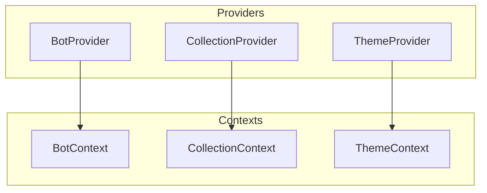
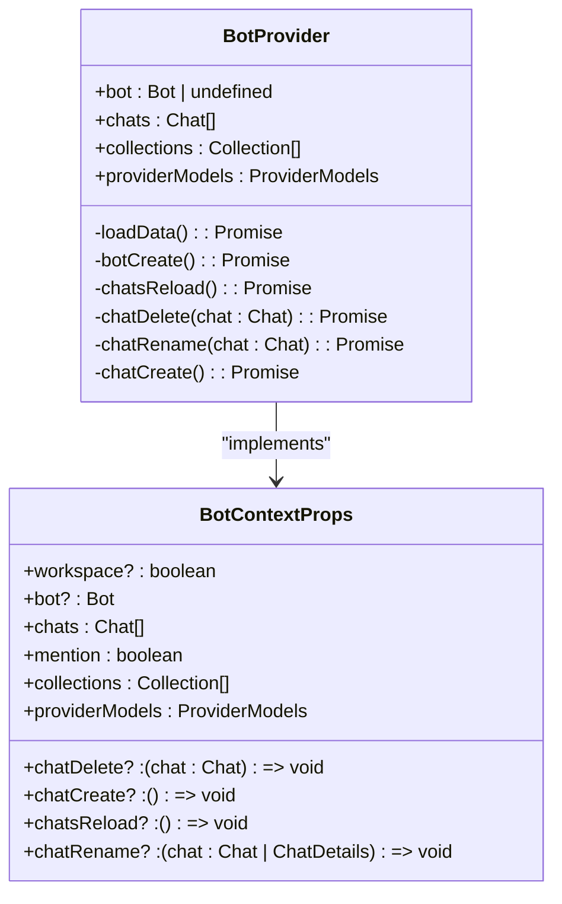
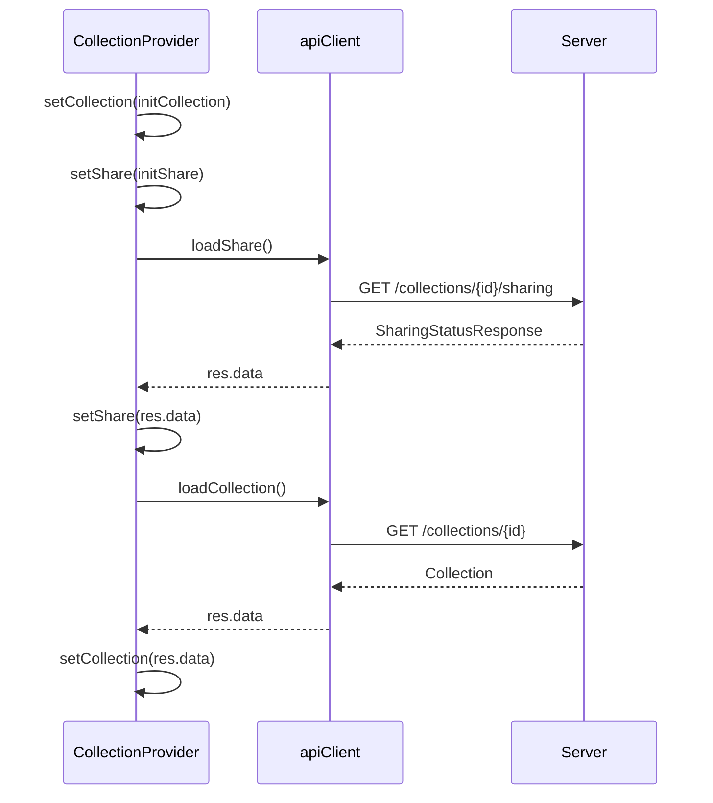
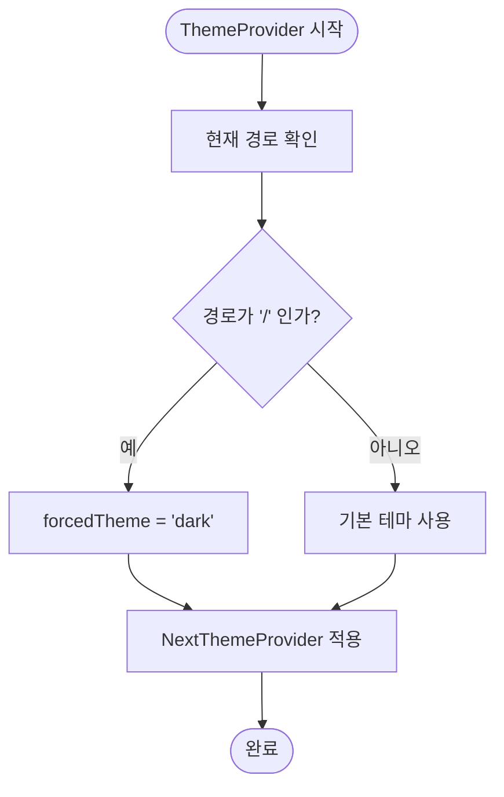
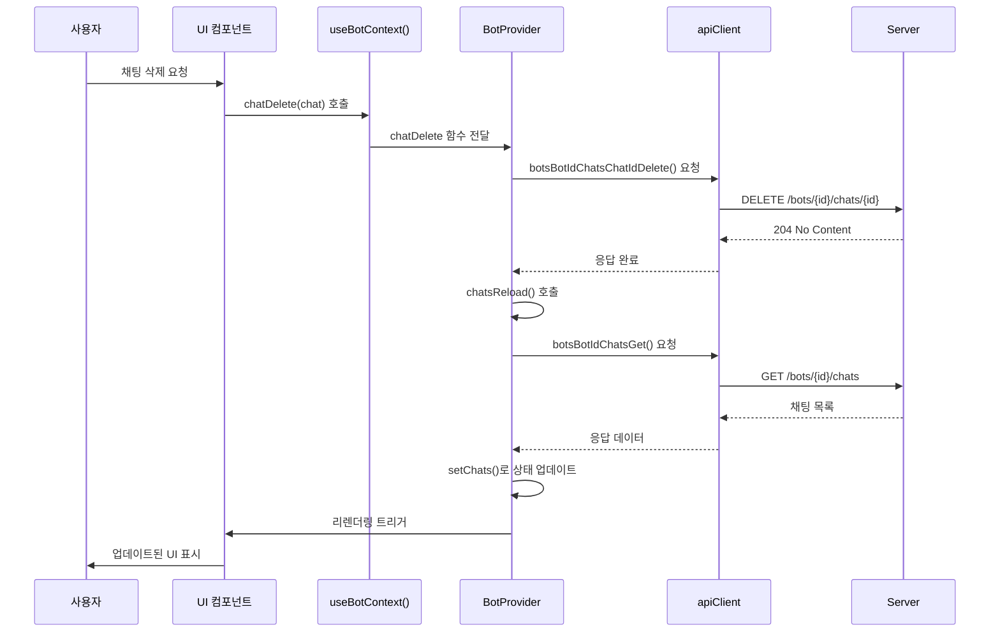

# 상태 관리 전략

<cite>
**이 문서에서 참조된 파일**
- [bot-provider.tsx](file://web/src/components/providers/bot-provider.tsx)
- [collection-provider.tsx](file://web/src/components/providers/collection-provider.tsx)
- [theme-provider.tsx](file://web/src/components/providers/theme-provider.tsx)
</cite>

## 목차
1. [소개](#소개)
2. [프로젝트 구조 분석](#프로젝트-구조-분석)
3. [핵심 상태 관리 컴포넌트](#핵심-상태-관리-컴포넌트)
4. [BotProvider 심층 분석](#botprovider-심층-분석)
5. [CollectionProvider 심층 분석](#collectionprovider-심층-분석)
6. [ThemeProvider 분석](#themeprovider-분석)
7. [상태 변화와 UI 반영 메커니즘](#상태-변화와-ui-반영-메커니즘)
8. [서버 데이터 동기화 전략](#서버-데이터-동기화-전략)
9. [불필요한 리렌더링 방지 최적화](#불필요한-리렌더링-방지-최적화)
10. [내장 상태 관리의 적절성 평가](#내장-상태-관리의-적절성-평가)

## 소개

ApeRAG 프로젝트는 Next.js 기반의 애플리케이션으로, React Context API를 활용하여 전역 상태를 효과적으로 관리하고 있습니다. 본 문서는 봇(bot), 컬렉션(collection), 테마(theme) 등의 전역 상태를 Provider 패턴을 통해 관리하는 방법을 심층적으로 분석합니다. 특히, 외부 상태 관리 라이브러리 없이 React의 내장 메커니즘만으로 복잡한 상태를 효율적으로 처리하는 아키텍처 설계를 살펴보고, 상태 변화가 UI에 어떻게 반영되는지, 서버 데이터와 클라이언트 상태의 동기화 전략, 그리고 성능 최적화 기법들을 상세히 설명합니다.

## 프로젝트 구조 분석

프로젝트의 상태 관리 관련 핵심 구성 요소들은 `web/src/components/providers` 디렉터리에 집중되어 있습니다. 이 디렉터리는 애플리케이션의 다양한 전역 상태를 캡슐화하고 제공하는 전용 공간으로, 다음과 같은 주요 Provider 컴포넌트를 포함하고 있습니다:

- `bot-provider.tsx`: 봇과 관련된 상태 및 비즈니스 로직을 관리
- `collection-provider.tsx`: 컬렉션과 공유 상태를 관리
- `theme-provider.tsx`: UI 테마 상태를 관리

이러한 모듈화된 구조는 각 상태 도메인을 명확히 분리함으로써 코드의 유지보수성과 확장성을 극대화합니다.



**Diagram sources**
- [bot-provider.tsx](file://web/src/components/providers/bot-provider.tsx)
- [collection-provider.tsx](file://web/src/components/providers/collection-provider.tsx)
- [theme-provider.tsx](file://web/src/components/providers/theme-provider.tsx)

**Section sources**
- [bot-provider.tsx](file://web/src/components/providers/bot-provider.tsx)
- [collection-provider.tsx](file://web/src/components/providers/collection-provider.tsx)
- [theme-provider.tsx](file://web/src/components/providers/theme-provider.tsx)

## 핵심 상태 관리 컴포넌트

ApeRAG은 React Context API 기반의 Provider 패턴을 사용하여 전역 상태를 관리합니다. 각 Provider는 특정 도메인의 상태(state)와 이를 조작할 수 있는 함수(setters/actions)를 포함하는 컨텍스트(Context)를 생성하고 제공합니다. 이 접근 방식은 상태 로직을 재사용 가능한 컴포넌트로 캡슐화함으로써, 상태 관리의 일관성과 예측 가능성을 보장합니다.

주요 Provider 컴포넌트들은 다음과 같은 공통적인 구조를 따릅니다:
1. 상태 정의: `useState` 훅을 사용하여 내부 상태 선언
2. 비즈니스 로직 구현: `useCallback`을 사용하여 메모이제이션된 함수 정의
3. 초기화 및 부수 효과 처리: `useEffect`를 통한 데이터 로딩 및 상태 초기화
4. 컨텍스트 제공: `createContext`와 `Provider`를 사용하여 하위 컴포넌트에 상태와 함수 제공

이러한 일관된 패턴은 개발자가 새로운 Provider를 추가하거나 기존 Provider를 이해하는 데 있어 직관적인 경험을 제공합니다.

**Section sources**
- [bot-provider.tsx](file://web/src/components/providers/bot-provider.tsx)
- [collection-provider.tsx](file://web/src/components/providers/collection-provider.tsx)

## BotProvider 심층 분석

`BotProvider`는 봇과 관련된 복잡한 상태를 중앙집중식으로 관리하는 핵심 컴포넌트입니다. 이 Provider는 단순한 상태 저장소를 넘어서, 봇 생성, 채팅 관리, 모델 정보 로딩 등 다양한 비즈니스 로직을 포함하고 있습니다.

### 상태 구조

`BotProvider`는 다음과 같은 주요 상태를 관리합니다:
- `bot`: 현재 활성화된 봇 객체
- `chats`: 현재 봇과 연결된 채팅 목록
- `collections`: 시스템 내 모든 컬렉션 목록
- `providerModels`: 사용 가능한 LLM 모델 목록

### 비즈니스 로직

`BotProvider`는 다음과 같은 중요한 비즈니스 함수를 제공합니다:
- `botCreate`: 새 봇을 생성하고 상태를 업데이트
- `chatCreate`: 새 채팅을 생성하고 라우터를 통해 페이지 이동
- `chatDelete`: 채팅을 삭제하고 관련 UI 상태를 동기화
- `chatRename`: 채팅 제목을 자동 생성 및 업데이트
- `chatsReload`: 서버에서 최신 채팅 목록을 다시 로드

이러한 함수들은 대부분 `useCallback`으로 메모이제이션되어 있으며, 의존성 배열을 정교하게 관리함으로써 불필요한 리렌더링을 방지합니다.



**Diagram sources**
- [bot-provider.tsx](file://web/src/components/providers/bot-provider.tsx#L38-L208)

**Section sources**
- [bot-provider.tsx](file://web/src/components/providers/bot-provider.tsx#L38-L208)

## CollectionProvider 심층 분석

`CollectionProvider`는 컬렉션과 그 공유 상태를 관리하는 전담 컴포넌트입니다. 이 Provider는 비교적 간단한 상태 구조를 가지지만, 서버와의 정확한 동기화를 보장하기 위한 정교한 메커니즘을 포함하고 있습니다.

### 상태 구조

`CollectionProvider`는 다음과 같은 상태를 관리합니다:
- `collection`: 현재 활성화된 컬렉션 객체
- `share`: 컬렉션의 공유 상태 정보

### 데이터 동기화 전략

`CollectionProvider`는 두 가지 주요 함수를 통해 서버 데이터와의 동기화를 유지합니다:
- `loadShare`: 컬렉션의 공유 상태를 서버에서 다시 로드
- `loadCollection`: 컬렉션 자체의 최신 정보를 서버에서 다시 로드

이러한 분리된 로딩 함수는 특정 정보만 필요할 때 전체 데이터를 다시 가져오지 않도록 함으로써 네트워크 트래픽을 최적화합니다. 또한, `useEffect` 훅을 사용하여 초기 상태(initCollection, initShare)가 변경될 때마다 내부 상태를 자동으로 동기화합니다.



**Diagram sources**
- [collection-provider.tsx](file://web/src/components/providers/collection-provider.tsx#L27-L76)

**Section sources**
- [collection-provider.tsx](file://web/src/components/providers/collection-provider.tsx#L27-L76)

## ThemeProvider 분석

`ThemeProvider`는 UI의 시각적 테마(다크/라이트 모드)를 관리하는 컴포넌트입니다. 이 Provider는 외부 라이브러리(`next-themes`)를 래핑하여, 애플리케이션 전반에 걸쳐 일관된 테마 적용을 가능하게 합니다.

### 특징적인 동작

`ThemeProvider`의 가장 주목할 만한 특징은 라우트에 따라 기본 테마를 동적으로 설정한다는 점입니다. `/` 루트 경로에서는 강제로 다크 테마를 적용하지만, 다른 경로에서는 사용자 설정을 따릅니다. 이는 특정 페이지에서만 특정 테마를 원할 경우 유용한 기능입니다.



**Diagram sources**
- [theme-provider.tsx](file://web/src/components/providers/theme-provider.tsx#L5-L18)

**Section sources**
- [theme-provider.tsx](file://web/src/components/providers/theme-provider.tsx#L5-L18)

## 상태 변화와 UI 반영 메커니즘

ApeRAG의 상태 관리 시스템은 상태 변화가 즉시 UI에 반영되도록 설계되어 있습니다. 이 메커니즘은 React의 리액티브 시스템과 긴밀하게 통합되어 작동합니다.

### 상태 업데이트 흐름

1. **사용자 상호작용**: 사용자가 UI 요소(예: 버튼 클릭)와 상호작용
2. **비즈니스 함수 호출**: `useBotContext()` 또는 `useCollectionContext()`를 통해 노출된 함수 호출
3. **API 요청**: 비즈니스 함수 내부에서 서버에 대한 비동기 API 요청 실행
4. **상태 업데이트**: API 응답 후 `useState` 훅을 사용하여 내부 상태 업데이트
5. **UI 리렌더링**: 상태 변경으로 인해 Provider 컴포넌트와 이를 사용하는 모든 하위 컴포넌트가 리렌더링

이러한 흐름은 상태 변화가 항상 예측 가능하고 추적 가능하도록 보장합니다.

### 컨텍스트 소비

하위 컴포넌트는 `useBotContext()` 또는 `useCollectionContext()` 훅을 사용하여 Provider에서 제공하는 상태와 함수를 소비합니다. 이러한 훅 기반 접근 방식은 의존성 주입(Dependency Injection) 패턴과 유사하며, 컴포넌트 간의 결합도를 낮춥니다.



**Diagram sources**
- [bot-provider.tsx](file://web/src/components/providers/bot-provider.tsx#L36-L36)
- [collection-provider.tsx](file://web/src/components/providers/collection-provider.tsx#L25-L25)

**Section sources**
- [bot-provider.tsx](file://web/src/components/providers/bot-provider.tsx#L36-L36)
- [collection-provider.tsx](file://web/src/components/providers/collection-provider.tsx#L25-L25)

## 서버 데이터 동기화 전략

ApeRAG은 클라이언트 상태와 서버 상태의 일관성을 유지하기 위해 여러 가지 전략을 사용합니다.

### 초기 데이터 로딩

각 Provider는 `useEffect` 훅을 사용하여 컴포넌트 마운트 시점에 필요한 초기 데이터를 서버에서 로드합니다:
- `BotProvider`는 `useEffect`를 통해 `loadData()` 함수를 호출하여 모델 정보와 컬렉션 목록을 로드
- `CollectionProvider`는 `useEffect`를 통해 초기 상태를 내부 상태로 설정

### 상태 변경 후 동기화

상태가 변경된 후에는 관련 데이터를 다시 로드하여 일관성을 유지합니다:
- `chatDelete` 후 `chatsReload()`를 호출하여 채팅 목록을 갱신
- `chatRename` 후 `chatsReload()`를 호출하여 업데이트된 제목 반영

### 선택적 데이터 로딩

`CollectionProvider`는 `loadShare`와 `loadCollection`이라는 분리된 함수를 제공함으로써, 필요한 정보만 선택적으로 로딩할 수 있도록 합니다. 이는 네트워크 자원을 절약하고 응답 속도를 향상시키는 데 기여합니다.

**Section sources**
- [bot-provider.tsx](file://web/src/components/providers/bot-provider.tsx#L38-L208)
- [collection-provider.tsx](file://web/src/components/providers/collection-provider.tsx#L27-L76)

## 불필요한 리렌더링 방지 최적화

ApeRAG은 성능을 극대화하기 위해 다양한 최적화 기법을 적용하고 있습니다.

### useCallback을 통한 함수 메모이제이션

모든 비즈니스 로직 함수는 `useCallback` 훅을 사용하여 메모이제이션됩니다. 이는 함수의 참조가 불필요하게 변경되는 것을 방지하여, 하위 컴포넌트의 불필요한 리렌더링을 막습니다.

```typescript
const chatDelete = useCallback(
  async (chat: Chat) => {
    // ...
  },
  [bot?.id, chats, chatsReload, params.chatId, router, workspace],
);
```

의존성 배열을 정확히 지정함으로써, 실제로 변경이 필요한 경우에만 함수가 재생성됩니다.

### useEffect의 정교한 의존성 관리

`useEffect` 훅은 정교한 의존성 배열을 사용하여 불필요한 부수 효과 실행을 방지합니다:
- `[]` (빈 배열): 컴포넌트 마운트 시 한 번만 실행
- `[bot?.id]`: 봇 ID가 변경될 때만 실행
- `[initCollection]`: 초기 컬렉션이 변경될 때만 실행

이러한 정밀한 제어는 애플리케이션의 전반적인 성능을 크게 향상시킵니다.

**Section sources**
- [bot-provider.tsx](file://web/src/components/providers/bot-provider.tsx#L38-L208)
- [collection-provider.tsx](file://web/src/components/providers/collection-provider.tsx#L27-L76)

## 내장 상태 관리의 적절성 평가

ApeRAG 프로젝트는 Zustand나 Redux와 같은 외부 상태 관리 라이브러리를 사용하지 않고, React의 내장 메커니즘만으로 충분한 이유가 프로젝트의 규모와 복잡도 맥락에서 명확히 드러납니다.

### 적절성 판단 기준

1. **상태 도메인의 명확한 분리**: 봇, 컬렉션, 테마 등 각 상태 도메인이 명확히 분리되어 있어, 복잡한 글로벌 상태 관리가 필요하지 않음
2. **중간 수준의 상태 복잡도**: 상태 변화가 깊게 중첩되지 않으며, 대부분의 상태 전이는 로컬 또는 중간 범위에 국한됨
3. **예측 가능한 데이터 흐름**: 단방향 데이터 흐름이 명확하게 유지되어, 상태 변화의 추적이 용이함
4. **성능 요구사항 충족**: `useCallback`과 `useEffect`를 통한 정교한 최적화로 충분한 성능을 확보

### 장점

- **의존성 감소**: 외부 라이브러리 없이도 기능을 완성할 수 있어, 번들 크기와 의존성 그래프를 최소화
- **학습 곡선 완만**: 팀원들이 추가로 배워야 할 개념이 줄어들어 개발 생산성 향상
- **디버깅 용이성**: React DevTools를 통해 상태 변화를 직접 추적 가능

결론적으로, ApeRAG의 현재 규모와 아키텍처에서는 React Context API 기반의 내장 상태 관리가 과잉 설계 없이도 충분히 효과적인 해결책임을 알 수 있습니다.