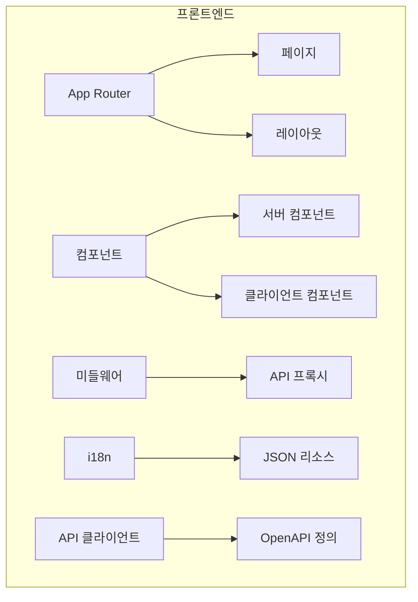
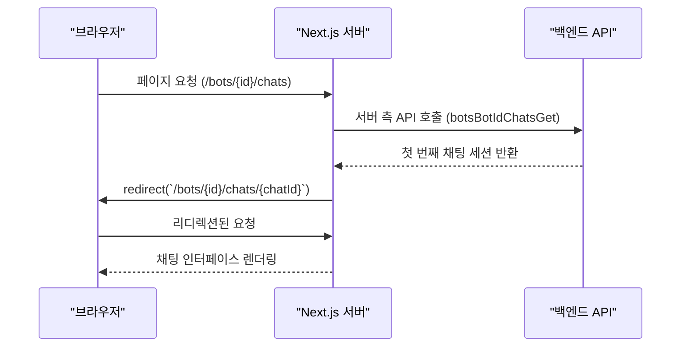
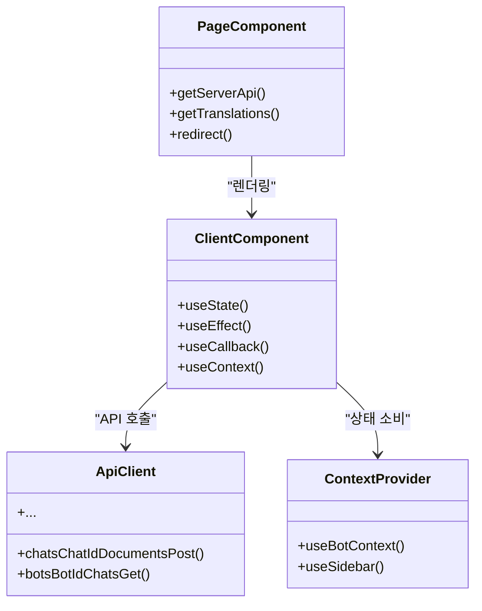

# 프론트엔드 아키텍처

<cite>
**이 문서에서 참조한 파일**
- [apiProxy.ts](file://web/src/middlewares/apiProxy.ts)
- [chat-input.tsx](file://web/src/components/chat/chat-input.tsx)
- [en-US.json](file://web/src/i18n/en-US.json)
- [zh-CN.json](file://web/src/i18n/zh-CN.json)
- [page.tsx](file://web/src/app/workspace/bots/[botId]/chats/page.tsx)
</cite>

## 목차
1. [소개](#소개)
2. [프로젝트 구조](#프로젝트-구조)
3. [앱 라우팅](#앱-라우팅)
4. [데이터 가져오기 전략](#데이터-가져오기-전략)
5. [상태 관리 방식](#상태-관리-방식)
6. [백엔드 API 통신](#백엔드-api-통신)
7. [UI 컴포넌트 구조](#ui-컴포넌트-구조)
8. [채팅 인터페이스](#채팅-인터페이스)
9. [다국어 지원(i18n)](#다국어-지원i18n)
10. [사용자 경험(UX) 설계 원칙](#사용자-경험ux-설계-원칙)

## 소개
ApeRAG은 그래프, 벡터 및 풀텍스트 검색을 결합한 프로덕션 준비된 RAG(검색 증강 생성) 플랫폼입니다. 이 문서는 Next.js 기반의 프론트엔드 아키텍처를 설명하며, 앱 라우팅, 데이터 가져오기 전략, 상태 관리 방식, 백엔드와의 통신 메커니즘, 주요 UI 구성 요소 및 다국어 지원 구현에 대해 다룹니다.

## 프로젝트 구조
프론트엔드 코드베이스는 `web` 디렉터리 내에 위치하며, Next.js 13 이상의 App Router를 기반으로 합니다. 핵심 디렉터리는 다음과 같습니다:
- `app`: 라우팅 및 페이지 구성 요소 포함
- `components`: 재사용 가능한 UI 컴포넌트
- `lib`: 유틸리티 함수 및 API 클라이언트
- `middlewares`: 미들웨어 로직
- `i18n`: 다국어 리소스 파일
- `api`: OpenAPI 기반 자동 생성된 API 클라이언트



**Diagram sources**
- [page.tsx](file://web/src/app/workspace/bots/[botId]/chats/page.tsx)
- [apiProxy.ts](file://web/src/middlewares/apiProxy.ts)
- [en-US.json](file://web/src/i18n/en-US.json)

**Section sources**
- [page.tsx](file://web/src/app/workspace/bots/[botId]/chats/page.tsx)
- [apiProxy.ts](file://web/src/middlewares/apiProxy.ts)

## 앱 라우팅
앱은 Next.js의 App Router를 사용하여 파일 시스템 기반 라우팅을 구현합니다. 주요 라우트는 다음과 같은 계층 구조를 따릅니다:
- `/auth`: 인증 관련 페이지 (로그인, 회원가입)
- `/workspace`: 사용자 작업 공간 (지식고, 챗봇, 세션 등)
- `/marketplace`: 커뮤니티 지식고 마켓플레이스
- `/admin`: 관리자 설정 및 감사 로그

라우팅은 동적 세그먼트(`[id]`)와 중첩된 레이아웃을 통해 구현되며, 각 섹션은 독립적인 레이아웃과 네비게이션을 가집니다.

**Section sources**
- [page.tsx](file://web/src/app/workspace/bots/[botId]/chats/page.tsx)

## 데이터 가져오기 전략
데이터 가져오기는 React Server Components(RSC)와 클라이언트 사이드 데이터 요청의 혼합으로 이루어집니다:
- **서버 컴포넌트**: 초기 데이터 로딩에는 `getServerApi()`를 사용하여 서버 측에서 데이터를 가져옵니다.
- **클라이언트 컴포넌트**: 상호작용 후 데이터 갱신에는 `apiClient` 인스턴스를 사용합니다.
- **자동 리디렉션**: 예를 들어, 새 챗봇 생성 시 가장 최근의 채팅 세션으로 자동 리디렉션합니다.



**Diagram sources**
- [page.tsx](file://web/src/app/workspace/bots/[botId]/chats/page.tsx)

**Section sources**
- [page.tsx](file://web/src/app/workspace/bots/[botId]/chats/page.tsx)

## 상태 관리 방식
상태 관리는 여러 수준에서 관리됩니다:
- **URL 기반 상태**: 라우팅 파라미터를 통해 챗봇 ID, 채팅 ID 등의 상태를 유지합니다.
- **로컬 스토리지**: `useLocalStorageState` 훅을 사용하여 웹 검색 활성화 여부, 기본 모델 선택 등의 사용자 선호도를 저장합니다.
- **React 상태**: `useState`, `useEffect`, `useCallback` 등을 사용하여 컴포넌트 내부 상태를 관리합니다.
- **컨텍스트**: `useBotContext`를 통해 하위 컴포넌트에 봇 설정, 모델, 지식고 정보를 제공합니다.

**Section sources**
- [chat-input.tsx](file://web/src/components/chat/chat-input.tsx)

## 백엔드 API 통신
백엔드와의 통신은 두 가지 주요 메커니즘을 통해 이루어집니다:

### API 프록시 미들웨어
`apiProxy.ts`는 모든 `/api/v1` 요청을 백엔드 API 서버로 리라이트합니다. 이를 통해 CORS 문제를 해결하고 개발/배포 환경에서 일관된 엔드포인트를 제공합니다.

```typescript
// apiProxy.ts 핵심 로직
if (pathname.match(/\/api\/v1/)) {
  const destination = new URL(host);
  url.host = destination.host;
  url.port = destination.port;
  return NextResponse.rewrite(url);
}
```

### 클라이언트 API 라이브러리
OpenAPI 정의(`openapi.merged.yaml`)를 기반으로 생성된 타입 안전한 API 클라이언트(`apiClient`)를 사용합니다. 이 클라이언트는 `axios` 기반으로, 모든 API 호출을 추상화합니다.

**Section sources**
- [apiProxy.ts](file://web/src/middlewares/apiProxy.ts)

## UI 컴포넌트 구조
UI는 React Server Components와 클라이언트 컴포넌트의 혼합으로 구성됩니다:

### 서버 컴포넌트
- 페이지 레벨 컴포넌트 (`page.tsx`)
- 데이터를 사전 가져오는 레이아웃 및 컨테이너
- 정적 콘텐츠 렌더링

### 클라이언트 컴포넌트
- 상호작용형 UI (`Button`, `Textarea`, `Select`)
- 폼 입력 및 제출 처리
- 실시간 피드백 제공
- `use client` 지시자를 사용하여 클라이언트 전용 기능 활성화



**Diagram sources**
- [page.tsx](file://web/src/app/workspace/bots/[botId]/chats/page.tsx)
- [chat-input.tsx](file://web/src/components/chat/chat-input.tsx)

**Section sources**
- [page.tsx](file://web/src/app/workspace/bots/[botId]/chats/page.tsx)
- [chat-input.tsx](file://web/src/components/chat/chat-input.tsx)

## 채팅 인터페이스
`chat-input.tsx`는 주요 채팅 인터페이스를 구현하며, 다음 기능을 포함합니다:

### 주요 기능
- **멘션(@)**: 지식고를 언급하여 컨텍스트 제공
- **파일 첨부**: 최대 10MB의 문서 업로드 및 인덱싱 상태 추적
- **모델 선택**: 사용 가능한 LLM 모델 중에서 선택
- **웹 검색 토글**: 실시간 웹 검색 기능 활성화/비활성화
- **실시간 상태 피드백**: 업로드 및 인덱싱 진행 상황 표시

### 실시간 상호작용
- `useInterval`을 사용하여 3초마다 문서 인덱싱 상태를 폴링
- `onSubmit` 콜백을 통해 부모 컴포넌트에 쿼리 전달
- 스트리밍 응답을 위한 준비된 인터페이스 구조

**Section sources**
- [chat-input.tsx](file://web/src/components/chat/chat-input.tsx)

## 다국어 지원(i18n)
다국어 지원은 `next-intl` 라이브러리를 기반으로 JSON 리소스 파일로 구현됩니다.

### 구현 방식
- `src/i18n/` 디렉터리에 `en-US.json` 및 `zh-CN.json` 파일 존재
- `useTranslations()` 훅을 사용하여 컴포넌트에서 번역 문자열 접근
- 메시지 키는 페이지 및 컴포넌트 단위로 구조화됨 (예: `page_chat.hello_world`)
- 전체 애플리케이션에서 일관된 번역 패턴 적용

### 예시
```json
{
  "page_chat": {
    "hello_world": "Hi, I'm ApeRAG.",
    "rag_description": "ApeRAG is a production-ready RAG platform..."
  }
}
```

**Section sources**
- [en-US.json](file://web/src/i18n/en-US.json)
- [zh-CN.json](file://web/src/i18n/zh-CN.json)

## 사용자 경험(UX) 설계 원칙
프론트엔드는 사용자 중심 설계 원칙을 반영하여 직관적이고 효율적인 경험을 제공합니다.

### 핵심 UX 특징
- **즉각적인 피드백**: 업로드 진행률, 인덱싱 상태, 오류 메시지 즉시 표시
- **접근성 고려**: 키보드 네비게이션, 적절한 대비, 의미 있는 레이블
- **모바일 최적화**: 반응형 디자인 및 모바일 친화적 UI
- **상황 인식 인터페이스**: 지식고 선택, 모델 선택 등의 컨텍스트 기반 옵션 제공
- **무결성 보장**: 중복 파일 업로드 방지, 유효성 검사, 오류 복구 경로 제공

### 구현 사례
- `FileUpload` 컴포넌트에서 `onFileValidate`를 사용하여 중복 파일 차단
- `toast` 알림을 통해 사용자 작업 결과 즉시 피드백
- `disabled` 상태 관리를 통해 동시 제출 방지
- `motion` 애니메이션을 사용하여 전환 과정 부드럽게 처리

**Section sources**
- [chat-input.tsx](file://web/src/components/chat/chat-input.tsx)