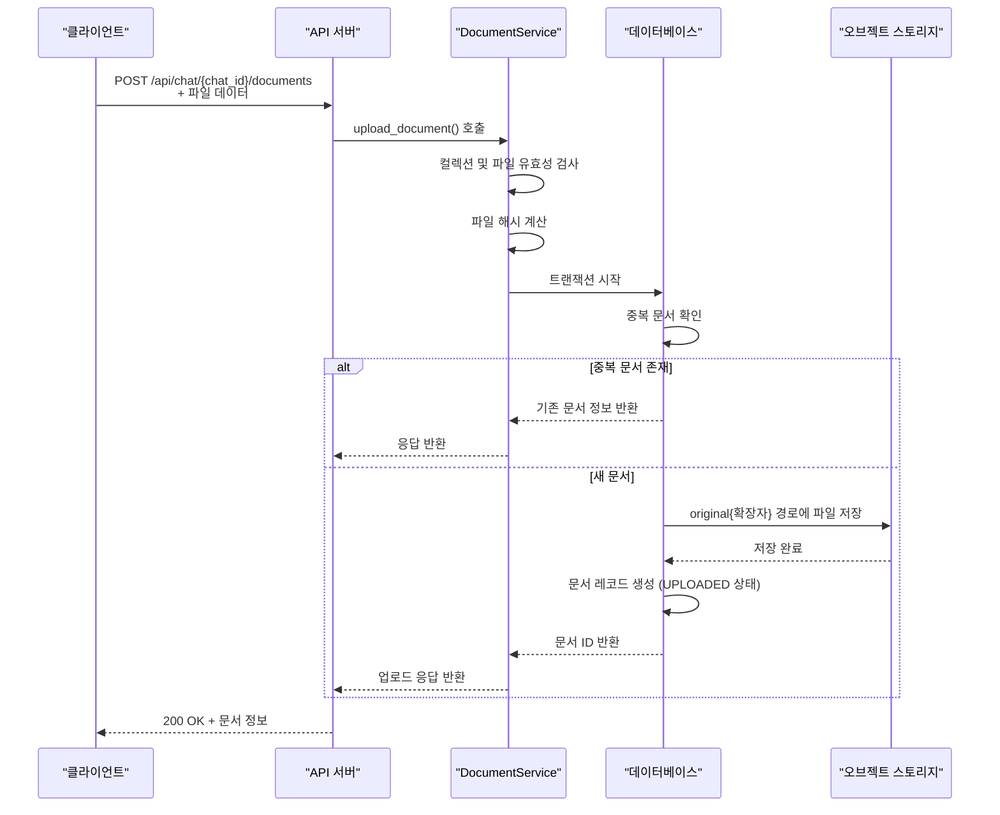
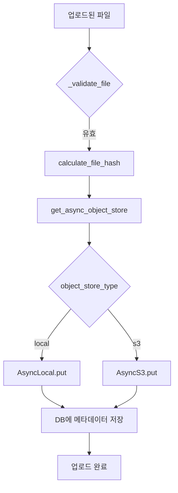

# 문서 업로드

<cite>
**이 문서에서 참조된 파일**
- [upload.py](file://aperag/source/upload.py)
- [document_service.py](file://aperag/service/document_service.py)
- [base.py](file://aperag/objectstore/base.py)
- [s3.py](file://aperag/objectstore/s3.py)
- [celery_tasks.py](file://config/celery_tasks.py)
</cite>

## 목차
1. [소개](#소개)
2. [HTTP 요청 흐름](#http-요청-흐름)
3. [인증 및 유효성 검사](#인증-및-유효성-검사)
4. [파일 저장 프로세스](#파일-저장-프로세스)
5. [메타데이터 생성 및 Celery 태스크 트리거링](#메타데이터-생성-및-celery-태스크-트리거링)
6. [대용량 파일 업로드 성능 고려사항](#대용량-파일-업로드-성능-고려사항)
7. [에러 핸들링 전략](#에러-핸들링-전략)
8. [커스텀 소스 확장 방법](#커스텀-소스-확장-방법)

## 소개
ApeRAG 시스템의 문서 업로드 프로세스는 사용자가 문서를 시스템에 제출할 때 발생하는 일련의 작업을 설명합니다. 이 프로세스는 HTTP 요청 처리, 인증 검사, 파일 유효성 검사, 오브젝트 스토리지(S3 또는 로컬)에 파일 저장, 메타데이터 생성, 비동기 인덱싱 태스크 트리거링 등을 포함합니다. 본 문서는 `upload.py`를 중심으로 전체 업로드 흐름을 단계별로 분석하며, 대용량 파일 처리와 에러 복구 전략도 다룹니다.

## HTTP 요청 흐름
문서 업로드는 클라이언트가 `/api/chat/{chat_id}/documents` 엔드포인트로 `multipart/form-data` 형식의 POST 요청을 보내는 것으로 시작됩니다. 이 요청은 FastAPI 기반 백엔드에서 처리되며, `DocumentService.upload_document()` 메서드가 주요 업로드 로직을 담당합니다. 업로드된 파일은 임시 상태(`UPLOADED`)로 데이터베이스에 기록되고, 이후 인덱싱 작업을 통해 최종 상태로 전환됩니다.

**다이어그램 출처**
- [document_service.py](file://aperag/service/document_service.py#L1070-L1120)
- [base.py](file://aperag/objectstore/base.py#L211-L248)

## 인증 및 유효성 검사
업로드 프로세스는 철저한 보안과 무결성 검사를 수행합니다. 첫째, 사용자의 인증 토큰(BearerAuth) 또는 쿠키(CookieAuth)를 검증하여 접근 권한을 확인합니다. 둘째, `DocumentService._validate_collection()`을 통해 지정된 컬렉션이 존재하고 활성화 상태인지 확인합니다. 셋째, `_validate_file()` 메서드는 파일 확장자와 크기를 검사합니다. 지원되는 확장자는 `DocParser().supported_extensions()`에 정의되어 있으며, 최대 파일 크기는 설정 파일의 `max_document_size` 값으로 제한됩니다. 넷째, 파일 내용의 SHA256 해시를 계산하여 중복 여부를 판단합니다. 동일한 이름과 해시를 가진 문서가 이미 존재하면 새로운 업로드를 거부하고 기존 문서 정보를 반환함으로써 멱등성을 보장합니다.

**섹션 출처**
- [document_service.py](file://aperag/service/document_service.py#L80-L1028)

## 파일 저장 프로세스
유효성 검사를 통과한 파일은 오브젝트 스토리지에 저장됩니다. `DocumentService._create_document_record()` 메서드는 비동기 방식으로 이 작업을 수행합니다. 먼저, `get_async_object_store()` 팩토리 함수를 호출하여 설정에 따라 S3 또는 로컬 스토리지 인스턴스를 가져옵니다. 그 다음, 문서 고유의 베이스 경로 아래 `original{확장자}`라는 이름으로 파일을 저장합니다. 예를 들어, 문서 ID가 `doc_123`이고 확장자가 `.pdf`라면, 실제 저장 경로는 `{base_path}/original.pdf`가 됩니다. 저장 후, 이 경로 정보는 문서 레코드의 `doc_metadata` 필드에 JSON 형식으로 기록되어 추후 접근에 사용됩니다.

**다이어그램 출처**
- [document_service.py](file://aperag/service/document_service.py#L200-L248)
- [base.py](file://aperag/objectstore/base.py#L232-L248)
- [s3.py](file://aperag/objectstore/s3.py#L190-L220)

## 메타데이터 생성 및 Celery 태스크 트리거링
파일 저장과 동시에 메타데이터가 생성됩니다. 메타데이터는 `{"object_path": "저장된_경로"}` 구조의 JSON 객체이며, 필요 시 사용자 정의 메타데이터를 추가할 수 있습니다. 문서 레코드가 데이터베이스에 커밋되면, `_trigger_index_reconciliation()` 함수가 즉시 호출되어 `reconcile_indexes_task` Celery 태스크를 큐에 삽입합니다. 이 태스크는 주기적으로 실행되는 인덱스 조정 작업 외에도 실시간으로 인덱싱을 시작하기 위해 트리거됩니다. `reconcile_indexes_task`는 `index_reconciler.reconcile_all()`을 실행하여 `PENDING` 상태의 문서들을 찾아 각각의 인덱스 생성 워크플로우(예: `create_document_indexes_workflow`)를 비동기적으로 시작합니다. 이 워크플로우는 문서 파싱, 벡터/풀텍스트/그래프 인덱스 생성 등의 하위 태스크로 구성됩니다.

**섹션 출처**
- [document_service.py](file://aperag/service/document_service.py#L1070-L1120)
- [celery_tasks.py](file://config/celery_tasks.py#L707-L722)

## 대용량 파일 업로드 성능 고려사항
대용량 파일 업로드를 위한 성능 최적화는 여러 계층에서 이루어집니다. 첫째, `UploadFile` 클래스는 스트리밍 방식으로 파일을 읽으므로, 메모리 부족(OOM) 문제를 피할 수 있습니다. 둘째, 오브젝트 스토리지 클라이언트(aioboto3 for S3, aiofiles for local)는 비동기 I/O를 사용하여 네트워크 지연 시간을 최소화합니다. 셋째, 업로드와 인덱싱 프로세스가 분리되어 있으므로, 사용자는 파일 저장만으로도 빠른 응답을 받을 수 있습니다. 인덱싱은 백그라운드에서 비동기적으로 진행됩니다. 넷째, `create_document_indexes_workflow` 내에서 벡터, 풀텍스트, 그래프 인덱스 생성 태스크는 `chord`를 사용해 병렬로 실행되므로, 전체 처리 시간이 크게 단축됩니다.

## 에러 핸들링 전략
시스템은 다양한 실패 상황에 대비한 강력한 에러 핸들링 전략을 갖추고 있습니다. 첫째, 모든 데이터베이스 작업은 원자성 트랜잭션 내에서 수행되므로, 중간에 오류가 발생하면 변경 사항이 롤백됩니다. 둘째, Celery 태스크는 `autoretry_for=(Exception,)` 및 `retry_kwargs={'max_retries': 3, 'countdown': 60}` 설정을 통해 자동 재시도 기능을 제공합니다. 네트워크 일시적 장애나 리소스 경합 등으로 인한 실패는 최대 3회까지 재시도됩니다. 셋째, `notify_workflow_complete` 태스크는 각 인덱스 생성 결과를 집계하여 부분 성공(PARTIAL_SUCCESS)이나 완전 실패(FAILED) 상태를 기록하므로, 문제 진단이 용이합니다. 마지막으로, `delete_objects_by_prefix` 메서드는 접두사 기반으로 문서와 관련된 모든 파일(원본, 청크, PDF 변환본 등)을 한 번에 삭제하여 리소스 누수를 방지합니다.

**섹션 출처**
- [celery_tasks.py](file://config/celery_tasks.py#L707-L722)
- [s3.py](file://aperag/objectstore/s3.py#L300-L350)

## 커스텀 소스 확장 방법
Feishu, Email 등의 커스텀 소스에서 직접 업로드하려면 `source` 디렉터리의 아키텍처를 따르면 됩니다. 핵심은 `Source` 추상 클래스를 상속받는 커스텀 소스 클래스를 작성하는 것입니다. 예를 들어, `EmailSource` 클래스를 만들 경우, `scan_documents()` 메서드를 구현하여 이메일 첨부 파일 목록을 조회하고, `prepare_document()` 메서드를 구현하여 첨부 파일을 임시 파일로 다운로드한 후 `LocalDocument` 객체를 반환해야 합니다. `UploadSource`는 이미 구현된 예제로, `metadata`에서 `object_path`를 추출하고, `get_object_store()`를 사용해 오브젝트 스토리지에서 파일을 가져와 `shutil.copyfileobj()`로 임시 파일에 복사합니다. 이렇게 준비된 `LocalDocument`는 이후 표준 인덱싱 프로세스를 거칩니다. 새로운 소스를 추가한 후에는 `source/__init__.py`에 해당 소스를 등록해야 합니다.

**섹션 출처**
- [upload.py](file://aperag/source/upload.py#L23-L45)
- [base.py](file://aperag/source/base.py)