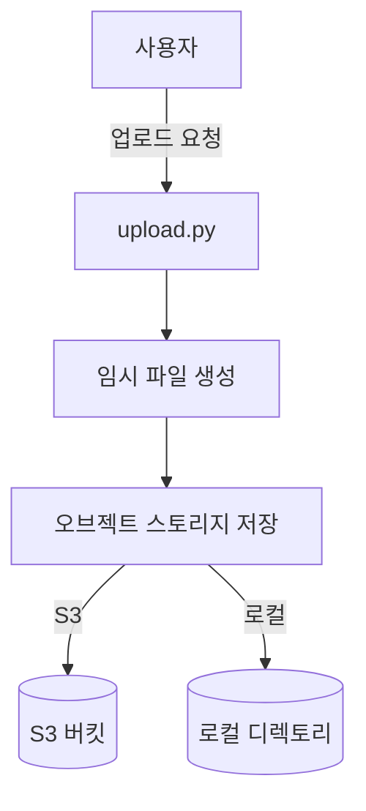
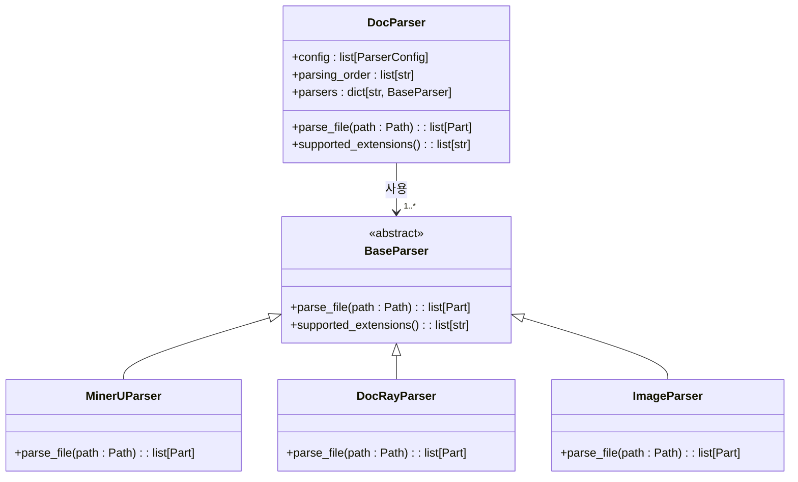
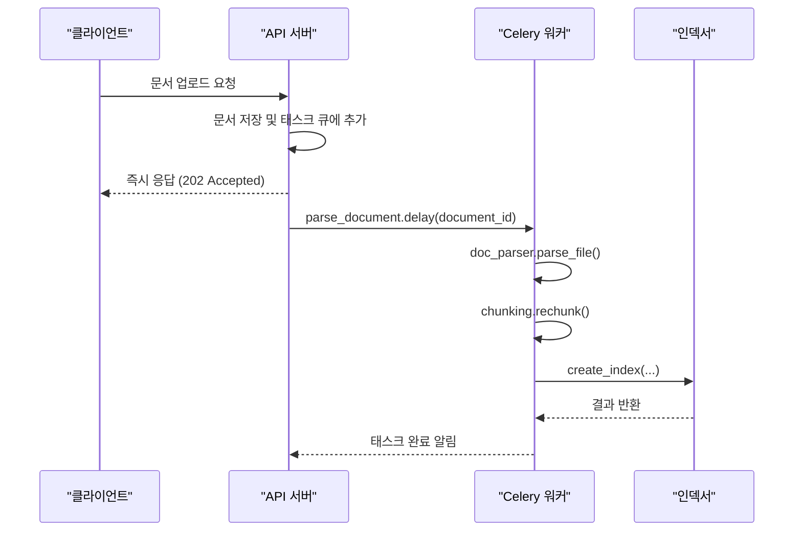

# 문서 처리 파이프라인

<cite>
**이 문서에서 참조한 파일**
- [upload.py](file://aperag/source/upload.py)
- [doc_parser.py](file://aperag/docparser/doc_parser.py)
- [chunking.py](file://aperag/docparser/chunking.py)
- [document.py](file://aperag/tasks/document.py)
- [s3.py](file://aperag/objectstore/s3.py)
- [local.py](file://aperag/objectstore/local.py)
</cite>

## 목차
1. [소개](#소개)
2. [문서 업로드 및 저장](#문서-업로드-및-저장)
3. [파싱 및 멀티모달 데이터 추출](#파싱-및-멀티모달-데이터-추출)
4. [청크화 전략](#청크화-전략)
5. [비동기 태스크 처리](#비동기-태스크-처리)
6. [사용자 정의 설정](#사용자-정의-설정)

## 소개
ApeRAG 시스템은 사용자가 업로드한 다양한 형식의 문서(PDF, 이미지, Office 문서 등)를 효과적으로 인덱싱하고 검색 가능하게 만드는 파이프라인을 제공합니다. 이 문서는 문서가 ApeRAG 내부에서 어떻게 처리되는지를 단계별로 설명하며, 오류 처리 및 재시도 메커니즘, 비동기 작업 실행 방식에 대해 다룹니다.

## 문서 업로드 및 저장

문서 업로드 프로세스는 `aperag/source/upload.py` 파일에 정의된 `UploadSource` 클래스를 통해 시작됩니다. 사용자가 문서를 업로드하면, 이 컴포넌트는 업로드된 파일을 임시 위치에 저장하고, 이를 오브젝트 스토리지(S3 또는 로컬)에 영구적으로 저장합니다. 저장 후에는 해당 객체의 경로(`object_path`)를 생성하여 이후 처리 단계에서 참조할 수 있도록 합니다.

오브젝트 스토리지는 `aperag/objectstore/base.py`에서 정의된 인터페이스를 따르며, 현재 S3와 로컬 파일 시스템 두 가지 백엔드를 지원합니다. `S3` 클래스는 AWS S3 호환 API를 사용하여 클라우드 스토리지와 상호작용하며, `Local` 클래스는 지정된 디렉토리에 파일을 직접 저장합니다. 두 구현 모두 `put`, `get`, `delete` 등의 핵심 메서드를 제공하여 일관된 인터페이스를 유지합니다.

**다이어그램 출처**
- [upload.py](file://aperag/source/upload.py#L1-L47)
- [s3.py](file://aperag/objectstore/s3.py#L1-L392)
- [local.py](file://aperag/objectstore/local.py#L1-L415)

**섹션 출처**
- [upload.py](file://aperag/source/upload.py#L1-L47)
- [s3.py](file://aperag/objectstore/s3.py#L1-L392)
- [local.py](file://aperag/objectstore/local.py#L1-L415)

## 파싱 및 멀티모달 데이터 추출

문서 저장 후, `doc_parser.py` 모듈이 문서의 실제 내용을 추출하는 역할을 담당합니다. 이 과정은 MinerU 또는 DocRay와 같은 외부 파서 기반으로 수행되며, 다양한 파일 형식(MS Office, PDF, 이미지 등)을 지원합니다.

`DocParser` 클래스는 여러 파서(`MinerUParser`, `DocRayParser`, `ImageParser` 등)를 관리하며, 각 파서는 특정 파일 확장자를 처리할 수 있습니다. 파서의 활성화 여부와 설정은 `ParserConfig`를 통해 제어되며, 환경 변수나 컬렉션 설정을 통해 동적으로 조정할 수 있습니다. 예를 들어, `USE_MINERU_API` 환경 변수가 설정되어 있으면 MinerU 파서가 활성화됩니다.

파일이 입력되면, `DocParser`는 파일 확장자에 따라 적절한 파서를 선택하고 `parse_file` 메서드를 호출하여 텍스트 및 메타데이터를 추출합니다. 추출된 내용은 `Part` 객체의 리스트 형태로 반환되며, 각 `Part`는 텍스트 콘텐츠와 함께 소스 맵(예: PDF 페이지 번호)과 같은 부가 정보를 포함할 수 있습니다.

**다이어그램 출처**
- [doc_parser.py](file://aperag/docparser/doc_parser.py#L1-L144)

**섹션 출처**
- [doc_parser.py](file://aperag/docparser/doc_parser.py#L1-L144)

## 청크화 전략

파싱된 문서는 일반적으로 너무 크기 때문에 검색이나 RAG(Retrieval-Augmented Generation)에 직접 사용될 수 없습니다. 따라서 `chunking.py` 파일에 구현된 `Rechunker` 클래스를 사용하여 더 작은 청크(chunk)로 분할합니다.

청크화는 `rechunk` 함수를 통해 수행되며, 다음 매개변수를 고려합니다:
- **청크 크기**(chunk_size): 각 청크의 최대 토큰 수.
- **청크 중첩**(chunk_overlap): 연속된 청크 간에 중복되는 토큰 수.
- **토크나이저**(tokenizer): 텍스트를 토큰으로 변환하는 함수.

알고리즘은 먼저 문서를 논리적 그룹(예: 제목과 그 아래의 본문)으로 구성한 후, 이 그룹들을 지정된 크기 제약 조건 내에서 다시 결합하거나 분할합니다. 특히, 제목 계층 구조를 보존하면서 의미적 일관성을 유지하려고 노력합니다. 개별 청크가 너무 큰 경우, `SimpleSemanticSplitter`가 문장 경계나 마침표와 같은 의미 있는 구분자를 사용하여 추가로 분할합니다.

**섹션 출처**
- [chunking.py](file://aperag/docparser/chunking.py#L1-L388)

## 비동기 태스크 처리

문서 처리 파이프라인의 모든 무거운 작업(파싱, 인덱싱 등)은 Celery를 사용하여 비동기적으로 실행됩니다. `tasks/document.py` 파일에 정의된 `DocumentIndexTask` 클래스는 이러한 작업을 오케스트레이션합니다.

주요 태스크는 다음과 같습니다:
- `parse_document`: 문서 ID를 받아 파싱된 내용과 메타데이터를 반환합니다.
- `create_index`: 벡터, 풀텍스트, 그래프 등 다양한 유형의 인덱스를 생성합니다.
- `update_index`: 기존 인덱스를 업데이트합니다.
- `delete_index`: 인덱스를 삭제합니다.

각 태스크는 독립적으로 실행되며, 실패 시 자동으로 재시도됩니다. 예외가 발생하면 `IndexTaskResult` 객체를 통해 오류 메시지가 기록되고, 로깅 시스템을 통해 문제를 진단할 수 있습니다. 이 아키텍처는 웹 요청의 응답 시간을 짧게 유지하면서도 대규모 문서 처리를 가능하게 합니다.

**다이어그램 출처**
- [document.py](file://aperag/tasks/document.py#L1-L370)

**섹션 출처**
- [document.py](file://aperag/tasks/document.py#L1-L370)

## 사용자 정의 설정

### 커스텀 파서 추가
새로운 파일 형식을 지원하기 위해 커스텀 파서를 추가할 수 있습니다. 이를 위해서는 `BaseParser`를 상속하는 새로운 파서 클래스를 작성하고, `ALL_PARSERS` 리스트와 `PARSER_MAP` 사전에 등록해야 합니다. 또한, `ParserConfig`를 통해 새 파서의 이름과 기본 활성화 상태를 정의해야 합니다.

### 청크 크기 조정
청크 크기와 중첩은 `Rechunker` 클래스의 생성자 인자를 통해 조정할 수 있습니다. 이 설정은 일반적으로 컬렉션 구성(config)의 일부로 전달되며, `DocumentIndexTask`가 인덱스 생성 시 `rechunk` 함수를 호출할 때 적용됩니다. 사용자는 UI 또는 API를 통해 이러한 값을 지정할 수 있습니다.

**섹션 출처**
- [doc_parser.py](file://aperag/docparser/doc_parser.py#L1-L144)
- [chunking.py](file://aperag/docparser/chunking.py#L1-L388)
- [document.py](file://aperag/tasks/document.py#L1-L370)