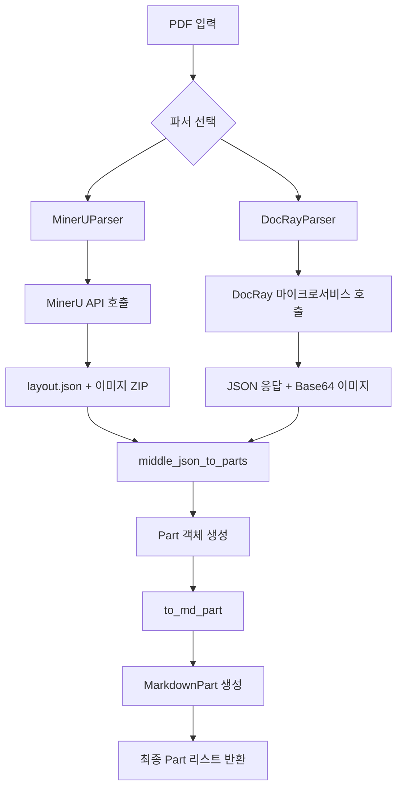
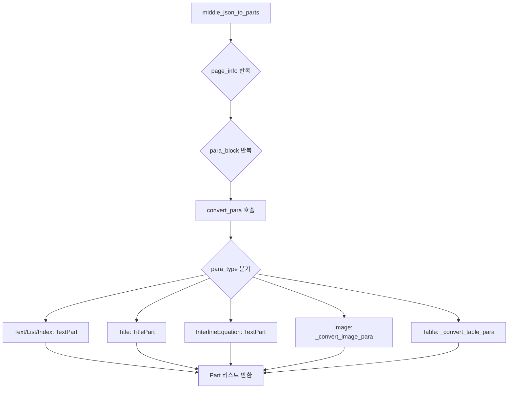
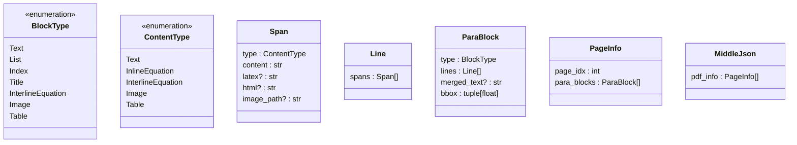

# PDF 파싱

<cite>
**이 문서에서 참조한 파일**
- [mineru_parser.py](file://aperag/docparser/mineru_parser.py)
- [docray_parser.py](file://aperag/docparser/docray_parser.py)
- [mineru_common.py](file://aperag/docparser/mineru_common.py)
- [parse_md.py](file://aperag/docparser/parse_md.py)
</cite>

## 목차
1. [소개](#소개)
2. [MinerU와 DocRay 기반 파서 아키텍처](#mineru와-docray-기반-파서-아키텍처)
3. [MinerU 파서의 PDF 처리 절차](#mineru-파서의-pdf-처리-절차)
4. [DocRay 파서의 동작 방식](#docray-파서의-동작-방식)
5. [레이아웃 인식과 내용 재구성](#레이아웃-인식과-내용-재구성)
6. [복잡한 레이아웃 및 수식 처리](#복잡한-레이아웃-및-수식-처리)
7. [오류 처리 및 폴백 메커니즘](#오류-처리-및-폴백-메커니즘)
8. [사용자 정의 옵션](#사용자-정의-옵션)
9. [파싱 결과 후처리](#파싱-결과-후처리)

## 소개
ApeRAG 시스템은 다양한 문서 형식을 구조화된 텍스트로 변환하기 위해 `docparser` 모듈을 사용합니다. 이 문서는 MinerU와 DocRay를 활용하여 PDF 문서의 구조화된 텍스트, 표, 수식을 추출하는 과정을 상세히 설명합니다. 특히 `mineru_parser.py`가 PDF를 분석하고 Markdown 형식으로 변환하는 절차, 레이아웃 인식 기반의 내용 재구성, 복잡한 다중 열 레이아웃 및 수학 공식 처리 방식에 중점을 둡니다. 또한 오류 발생 시 폴백 파서로 전환되는 로직, 페이지 범위 지정, 이미지 포함 여부 설정 등 사용자 정의 옵션도 포함하며, 실제 코드 예제를 통해 파싱 결과의 후처리 방법을 안내합니다.

## MinerU와 DocRay 기반 파서 아키텍처



**Diagram sources**
- [mineru_parser.py](file://aperag/docparser/mineru_parser.py#L43-L177)
- [docray_parser.py](file://aperag/docparser/docray_parser.py#L43-L139)
- [mineru_common.py](file://aperag/docparser/mineru_common.py#L52-L63)

**Section sources**
- [mineru_parser.py](file://aperag/docparser/mineru_parser.py#L1-L225)
- [docray_parser.py](file://aperag/docparser/docray_parser.py#L1-L141)

## MinerU 파서의 PDF 처리 절차
`MinerUParser`는 외부 MinerU 서비스를 활용하여 PDF 문서를 구조화된 데이터로 변환합니다. 먼저 API 토큰을 확인한 후, MinerU 서버에 업로드 URL을 요청합니다. 이후 파일을 해당 URL로 업로드하고, 비동기적으로 처리 상태를轮이팅합니다. 작업이 완료되면 결과 ZIP 파일의 다운로드 URL을 받아와 이를 해제합니다. ZIP 내에는 레이아웃 정보를 담은 `layout.json`, 추출된 이미지들이 포함되어 있으며, 이들을 기반으로 `middle_json_to_parts` 함수를 통해 `Part` 객체 리스트를 생성합니다. 마지막으로 `to_md_part` 함수를 사용해 전체 Markdown 표현을 생성하여 최종 결과에 추가합니다.

**Section sources**
- [mineru_parser.py](file://aperag/docparser/mineru_parser.py#L53-L177)

## DocRay 파서의 동작 방식
`DocRayParser`는 내부 배포된 DocRay 마이크로서비스와 통신하여 문서를 파싱합니다. 먼저 설정된 `DOCRAY_HOST`를 확인하고, 파일을 `/submit` 엔드포인트로 전송하여 작업 ID를 받습니다. 이후 `/status/{job_id}`를轮이팅하여 처리 상태를 확인하며, 완료 시 `/result/{job_id}`에서 JSON 형식의 결과를 가져옵니다. 이 결과에는 `middle_json`(레이아웃 정보), Base64 인코딩된 이미지 데이터, 원본 PDF 데이터가 포함됩니다. 이미지는 임시 디렉터리에 디코딩되어 저장되고, `middle_json`은 `middle_json_to_parts` 함수를 통해 `Part` 객체로 변환됩니다. 필요 시 원본 PDF 데이터도 `PdfPart`로 추가됩니다.

**Section sources**
- [docray_parser.py](file://aperag/docparser/docray_parser.py#L49-L139)

## 레이아웃 인식과 내용 재구성
두 파서 모두 레이아웃 인식 기반의 내용 재구성을 수행합니다. 핵심은 `middle_json_to_parts` 함수입니다. 이 함수는 `layout.json` 또는 DocRay의 `middle_json`을 파싱하여 각 페이지의 `para_blocks`를 순회합니다. 각 `para_block`은 타입(`type`) 필드를 가지며, 이 값을 기준으로 적절한 `convert_para` 함수가 호출됩니다. `convert_para`는 블록 타입에 따라 `TextPart`, `TitlePart`, `ImagePart`, `Table` 등의 `Part` 객체를 생성합니다. 이 과정에서 `pdf_source_map` 메타데이터가 추가되어, 출력된 텍스트가 원본 PDF의 어느 위치(page_idx, bbox)에 있었는지를 추적할 수 있습니다.



**Diagram sources**
- [mineru_common.py](file://aperag/docparser/mineru_common.py#L52-L63)
- [mineru_common.py](file://aperag/docparser/mineru_common.py#L127-L175)

**Section sources**
- [mineru_common.py](file://aperag/docparser/mineru_common.py#L52-L175)

## 복잡한 레이아웃 및 수식 처리
### 다중 열 레이아웃
MinerU와 DocRay는 고급 OCR 및 레이아웃 분석 기술을 사용하여 다중 열 레이아웃을 효과적으로 처리합니다. `para_blocks`는 문서의 논리적 단락(Paragraph) 단위로 구성되므로, 물리적인 열 순서가 아닌 의미론적 순서대로 텍스트가 추출됩니다. 이는 학술 논문이나 보고서와 같은 복잡한 레이아웃에서도 자연스러운 읽기 순서를 유지합니다.

### 수식 처리
수식은 두 가지 유형으로 처리됩니다:
1.  **줄 사이 수식 (InterlineEquation)**: `BlockType.InterlineEquation` 타입의 블록으로 인식되며, `merge_para_with_text` 함수를 통해 `$$ ... $$` 구분자로 감싸진 LaTeX 수식으로 변환됩니다.
2.  **인라인 수식 (InlineEquation)**: 일반 텍스트 블록 내에서 `ContentType.InlineEquation` 타입의 span으로 인식되며, `$ ... $` 구분자로 감싸져 인라인 수식으로 처리됩니다.

이러한 처리는 `parse_md.py`에서 Markdown 파싱 시 수식 렌더링이 가능하게 합니다.



**Diagram sources**
- [mineru_common.py](file://aperag/docparser/mineru_common.py#L100-L125)

**Section sources**
- [mineru_common.py](file://aperag/docparser/mineru_common.py#L66-L71)

## 오류 처리 및 폴백 메커니즘
시스템은 견고한 오류 처리 메커니즘을 갖추고 있습니다.
*   **MinerUParser**: API 토큰이 없거나 네트워크 요청 실패 시 `RuntimeError`를 발생시키며, 이는 다른 파서로의 폴백 없이 실패로 간주됩니다.
*   **DocRayParser**: `DOCRAY_HOST` 설정이 누락된 경우 `FallbackError`를 발생시켜, `DocParser`가 다른 파서(예: `MarkItDownParser`)로 전환될 수 있도록 합니다. 이는 DocRay 서비스가 일시적으로 불가능한 환경에서도 시스템이 작동할 수 있게 합니다.
*   **공통**: 외부 서비스에서 작업이 실패하면(`state == "failed"`), 그 이유를 포함한 `RuntimeError`가 발생하여 처리 프로세스가 종료됩니다.

**Section sources**
- [mineru_parser.py](file://aperag/docparser/mineru_parser.py#L53-L133)
- [docray_parser.py](file://aperag/docparser/docray_parser.py#L49-L139)

## 사용자 정의 옵션
현재 제공된 코드에서는 다음과 같은 사용자 정의 옵션이 암시적으로 지원됩니다:
*   **API 토큰 설정**: `MinerUParser` 생성자에서 `api_token` 매개변수를 통해 MinerU 서비스 인증을 설정할 수 있습니다.
*   **페이지 범위 지정**: 직접적인 옵션은 없으나, `pdf_source_map` 메타데이터를 활용하면 후처리 단계에서 특정 페이지의 `Part` 객체만 선택적으로 사용할 수 있습니다.
*   **이미지 포함 여부**: `AssetBinPart`와 `ImagePart`는 기본적으로 생성되지만, 후처리 과정에서 이러한 타입의 `Part`를 필터링함으로써 이미지 포함 여부를 제어할 수 있습니다.
*   **OCR 강제 적용**: MinerU 파서는 `upload_url_payload`에서 `"is_ocr": True`로 설정되어 있어, 모든 문서에 OCR을 적용합니다.

**Section sources**
- [mineru_parser.py](file://aperag/docparser/mineru_parser.py#L53-L133)
- [docray_parser.py](file://aperag/docparser/docray_parser.py#L49-L139)

## 파싱 결과 후처리
파싱 결과는 `Part` 객체의 리스트 형태로 반환됩니다. 이 리스트를 후처리하기 위한 일반적인 접근법은 다음과 같습니다:

```python
from aperag.docparser.base import TextPart, TitlePart, ImagePart, AssetBinPart

def postprocess_parts(parts: list[Part]) -> str:
    # 1. MarkdownPart 추출 (전체 Markdown)
    md_part = next((p for p in parts if isinstance(p, MarkdownPart)), None)
    if md_part:
        full_markdown = md_part.markdown
        # 여기서 Markdown 문자열에 대한 추가 처리 수행
    
    # 2. 특정 타입의 Part 필터링
    text_and_titles = [p for p in parts if isinstance(p, (TextPart, TitlePart))]
    
    # 3. 이미지 제거 (AssetBinPart와 ImagePart 제외)
    text_only_parts = [p for p in parts if not isinstance(p, (ImagePart, AssetBinPart))]
    
    # 4. 페이지 기반 필터링 (예: 첫 번째 페이지만)
    first_page_parts = []
    for part in parts:
        source_map = part.metadata.get("pdf_source_map", [])
        if source_map and source_map[0].get("page_idx") == 0:
            first_page_parts.append(part)
    
    # 5. 내용 결합
    combined_text = "\n".join(
        p.content for p in text_only_parts 
        if hasattr(p, 'content') and p.content is not None
    )
    
    return combined_text
```
이 코드 예제는 `Part` 객체 리스트를 받아, 전체 Markdown 추출, 특정 타입 필터링, 이미지 제거, 페이지 기반 필터링, 그리고 최종 텍스트 결합이라는 일반적인 후처리 작업을 수행하는 방법을 보여줍니다.

**Section sources**
- [parse_md.py](file://aperag/docparser/parse_md.py#L1-L472)
- [mineru_common.py](file://aperag/docparser/mineru_common.py#L33-L49)