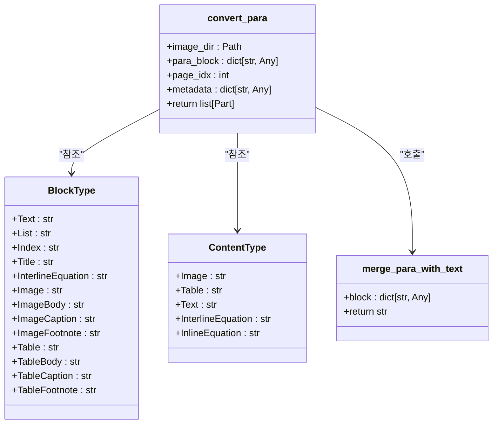
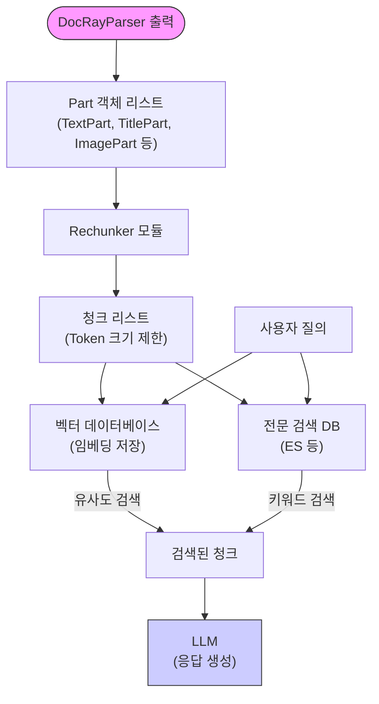

# 레이아웃 분석

<cite>
**이 문서에서 참조된 파일**
- [docray_parser.py](file://aperag/docparser/docray_parser.py)
- [base.py](file://aperag/docparser/base.py)
- [mineru_common.py](file://aperag/docparser/mineru_common.py)
- [config.py](file://aperag/config.py)
</cite>

## 목차
1. [소개](#소개)
2. [핵심 구성 요소](#핵심-구성-요소)
3. [DocRay 파서 아키텍처 개요](#docray-파서-아키텍처-개요)
4. [레이아웃 분석 절차](#레이아웃-분석-절차)
5. [머신러닝 기반 요소 분류 및 텍스트 순서 복원](#머신러닝-기반-요소-분류-및-텍스트-순서-복원)
6. [멀티컬럼 레이아웃 처리 전략](#멀티컬럼-레이아웃-처리-전략)
7. [출력 결과의 검색 및 인덱싱 활용](#출력-결과의-검색-및-인덱싱-활용)
8. [성능 최적화: 배치 처리 및 캐싱 전략](#성능-최적화-배치-처리-및-캐싱-전략)
9. [결론](#결론)

## 소개
`docray_parser.py`는 DocRay라는 외부 마이크로서비스를 활용하여 PDF, DOCX, PPTX 등 레이아웃이 복잡한 문서의 시각적 구조를 정밀하게 분석하는 핵심 모듈입니다. 이 문서는 `DocRayParser`가 문서 이미지 또는 PDF를 입력으로 받아 머신러닝을 통해 요소별 바운딩 박스를 추출하고 의미 있는 계층 구조로 재구성하는 전체 과정을 설명합니다. 또한, 분석된 출력이 후속 검색 및 인덱싱 단계에 어떻게 활용되는지와 성능을 위한 배치 처리 및 캐싱 전략도 다룹니다.

## 핵심 구성 요소
`DocRayParser`는 여러 핵심 구성 요소와 상호작용하여 작동합니다. 주요 클래스와 함수는 다음과 같습니다:
- **`DocRayParser`**: DocRay 서비스와 통신하여 문서를 제출하고 상태를 폴링하며 결과를 가져오는 주요 클래스.
- **`BaseParser`**: 모든 파서가 상속해야 하는 추상 기본 클래스로, `parse_file`과 같은 공통 인터페이스를 정의합니다.
- **`Part` 객체들**: `TextPart`, `TitlePart`, `ImagePart`, `AssetBinPart` 등 다양한 유형의 문서 조각을 표현하는 Pydantic 모델.
- **`middle_json_to_parts`**: DocRay로부터 받은 JSON 형식의 중간 결과를 `Part` 객체 리스트로 변환하는 함수.
- **`to_md_part`**: `Part` 객체들을 하나의 통합된 Markdown 문자열로 생성하는 함수.
- **`settings.docray_host`**: DocRay 마이크로서비스의 엔드포인트를 저장하는 설정 값.

**Section sources**
- [docray_parser.py](file://aperag/docparser/docray_parser.py#L43-L139)
- [base.py](file://aperag/docparser/base.py#L70-L81)
- [mineru_common.py](file://aperag/docparser/mineru_common.py#L52-L63)
- [mineru_common.py](file://aperag/docparser/mineru_common.py#L33-L49)
- [config.py](file://aperag/config.py#L250-L255)

## DocRay 파서 아키텍처 개요
`DocRayParser`는 클라이언트-서버 아키텍처를 따릅니다. ApeRAG 애플리케이션 내의 `DocRayParser` 인스턴스는 DocRay라는 독립적인 마이크로서비스에 HTTP 요청을 보내고, 그 응답을 처리합니다. 이 설계는 복잡한 레이아웃 분석이라는 컴퓨팅 집약적인 작업을 메인 애플리케이션에서 분리함으로써 확장성과 유지보수성을 높입니다.

```mermaid
graph TD
subgraph "ApeRAG Application"
DP[DocRayParser]
BP[BaseParser]
MC[mineru_common.py]
C[Config]
end
subgraph "External Microservice"
DR["DocRay Service"]
end
DP --> |HTTP POST /submit| DR
DP --> |HTTP GET /status/{job_id}| DR
DP --> |HTTP GET /result/{job_id}| DR
DR --> |Job ID| DP
DR --> |Processing Status| DP
DR --> |Structured JSON & Images| DP
C --> |docray_host| DP
DP --> MC
MC --> BP
```

**Diagram sources**
- [docray_parser.py](file://aperag/docparser/docray_parser.py#L43-L139)
- [config.py](file://aperag/config.py#L250-L255)

## 레이아웃 분석 절차
`DocRayParser`의 `parse_file` 메서드는 다음과 같은 일련의 절차를 따라 문서를 분석합니다:

1.  **입력 검증 및 초기화**: 먼저, `settings.docray_host`가 설정되어 있는지 확인하고, 임시 디렉토리를 생성하여 추출된 이미지를 저장할 준비를 합니다.
2.  **문서 제출**: 분석할 문서 파일을 바이너리 데이터로 읽어, `requests.post()`를 사용해 DocRay 서비스의 `/submit` 엔드포인트에 제출합니다. 이 요청은 파일과 함께 전송됩니다.
3.  **상태 폴링**: 제출 후, 서버는 고유한 `job_id`를 반환합니다. `DocRayParser`는 이 `job_id`를 사용하여 `/status/{job_id}` 엔드포인트를 주기적으로 폴링(예: 5초 간격)하여 처리 상태를 확인합니다. 상태는 `"processing"`, `"completed"`, `"failed"` 중 하나입니다.
4.  **결과 수신**: 상태가 `"completed"`로 변경되면, `/result/{job_id}` 엔드포인트를 통해 최종 결과를 가져옵니다. 이 결과는 구조화된 JSON 데이터(`middle_json`)와 Base64로 인코딩된 추출된 이미지 데이터를 포함합니다.
5.  **임시 파일 처리**: 수신된 이미지 데이터는 안전하게 검증된 후, 앞서 생성한 임시 디렉토리에 디코딩되어 저장됩니다.
6.  **데이터 변환**: 저장된 이미지 경로와 `middle_json` 데이터를 `middle_json_to_parts` 함수에 전달하여, 문서의 각 요소(본문, 제목, 표, 이미지 등)를 나타내는 `Part` 객체 리스트로 변환합니다.
7.  **추가 출력 생성**: 필요 시, 원본 PDF 데이터를 `PdfPart`로 추가하고, 모든 `Part` 객체를 기반으로 통합된 Markdown 문자열을 생성하여 `MarkdownPart`로 반환합니다.

```mermaid
sequenceDiagram
participant Client as "ApeRAG 애플리케이션"
participant Parser as "DocRayParser"
participant DocRay as "DocRay 서비스"
Client->>Parser : parse_file(path, metadata)
activate Parser
alt DOCRAY_HOST 미설정
Parser-->>Client : FallbackError 발생
deactivate Parser
return
end
Parser->>Parser : 임시 디렉토리 생성
Parser->>DocRay : POST /submit (파일 첨부)
activate DocRay
DocRay-->>Parser : {job_id}
loop 상태 폴링
Parser->>DocRay : GET /status/{job_id}
DocRay-->>Parser : {status : "processing"}
delay 5s
end
DocRay-->>Parser : {status : "completed"}
Parser->>DocRay : GET /result/{job_id}
DocRay-->>Parser : {result : {middle_json, images}}
deactivate DocRay
Parser->>Parser : 이미지 디코딩 및 저장
Parser->>Parser : middle_json_to_parts() 호출
Parser->>Parser : to_md_part() 호출
Parser-->>Client : [MarkdownPart, ... , PdfPart]
deactivate Parser
```

**Diagram sources**
- [docray_parser.py](file://aperag/docparser/docray_parser.py#L49-L139)

**Section sources**
- [docray_parser.py](file://aperag/docparser/docray_parser.py#L49-L139)

## 머신러닝 기반 요소 분류 및 텍스트 순서 복원
DocRay 마이크로서비스는 내부적으로 머신러닝 모델을 사용하여 문서의 시각적 요소를 식별하고 분류합니다. `mineru_common.py` 모듈의 `BlockType`과 `ContentType` 열거형은 DocRay가 인식할 수 있는 요소의 종류를 정의합니다.

- **요소 분류**: DocRay는 페이지를 스캔하여 텍스트 블록, 제목, 이미지, 표 등의 다양한 요소를 감지하고, 각 요소의 타입(`para_block["type"]`)을 `BlockType` 열거형의 값(예: `"text"`, `"title"`, `"image"`, `"table"`)으로 분류합니다. 이 분류는 머신러닝 기반의 객체 탐지 및 OCR 기술을 통해 수행됩니다.
- **텍스트 순서 복원**: 레이아웃이 복잡한 문서(특히 멀티컬럼)에서는 물리적 위치가 텍스트의 논리적 순서와 다를 수 있습니다. DocRay는 요소들의 바운딩 박스 좌표를 분석하여, 왼쪽에서 오른쪽, 위에서 아래로 올바른 읽기 순서를 결정합니다. `convert_para` 함수는 이 정보를 바탕으로 `merge_para_with_text`를 호출하여, 여러 줄과 스팬(span)을 올바른 순서로 결합하여 하나의 연속된 텍스트 문자열로 만듭니다. 이 과정은 수식(`InlineEquation`, `InterlineEquation`)도 적절한 델리미터로 감싸서 처리합니다.



**Diagram sources**
- [mineru_common.py](file://aperag/docparser/mineru_common.py#L103-L116)
- [mineru_common.py](file://aperag/docparser/mineru_common.py#L119-L124)
- [mineru_common.py](file://aperag/docparser/mineru_common.py#L127-L175)
- [mineru_common.py](file://aperag/docparser/mineru_common.py#L78-L100)

## 멀티컬럼 레이아웃 처리 전략
멀티컬럼 레이아웃은 텍스트 순서를 복원하는 데 가장 큰 도전 과제 중 하나입니다. `DocRayParser`는 이를 해결하기 위해 두 가지 전략을 사용합니다:

1.  **외부 서비스의 지능적인 분석**: 핵심 전략은 DocRay 마이크로서비스 자체에 있습니다. DocRay는 머신러닝 모델을 통해 각 텍스트 블록의 정확한 바운딩 박스 좌표(x_min, y_min, x_max, y_max)를 추출합니다. 이 좌표 정보를 바탕으로, DocRay는 레이아웃의 구조를 이해하고, 컬럼 간의 텍스트 흐름을 올바르게 판단하여 논리적인 순서로 요소들을 배열합니다. 이 정보는 `middle_json`의 `para_blocks` 배열 내에서 이미 정렬된 순서로 제공됩니다.
2.  **클라이언트 측의 신뢰적 변환**: `DocRayParser`는 DocRay가 제공하는 이 정렬된 순서를 신뢰하고, `middle_json_to_parts` 함수를 통해 순서대로 `Part` 객체를 생성합니다. 즉, `DocRayParser`는 순서 복원 알고리즘을 직접 구현하지 않고, DocRay의 분석 결과를 그대로 활용함으로써 복잡한 로직을 단순화하고 정확성을 보장합니다.

## 출력 결과의 검색 및 인덱싱 활용
`DocRayParser`가 생성하는 `Part` 객체들은 이후의 검색 및 인덱싱 파이프라인에서 중요한 역할을 합니다.

- **메타데이터 연결**: 각 `Part` 객체는 `pdf_source_map`과 같은 메타데이터를 포함합니다. 이 메타데이터는 해당 조각이 원본 문서의 어느 페이지와 어떤 위치(bbox)에 있었는지를 기록합니다. 이 정보는 검색 결과를 사용자에게 표시할 때, 관련 내용을 원본 문서 내에서 하이라이팅하거나 링크를 걸어주는 데 사용됩니다.
- **계층 구조 유지**: `TitlePart`는 `level` 속성을 통해 문서의 계층 구조(예: #, ##, ###)를 보존합니다. 이는 `Rechunker`가 의미 있는 문맥을 유지하면서 텍스트를 청크(chunks)로 나누는 데 필수적이며, 검색 시 더 높은 수준의 섹션 정보를 함께 제공할 수 있게 합니다.
- **이미지 및 자산 관리**: `_convert_image_para` 및 `_convert_table_para` 함수는 이미지와 표를 `AssetBinPart`로 저장하고, 이를 참조하는 `ImagePart`를 생성합니다. 이는 RAG(Retrieval-Augmented Generation) 프로세스에서 이미지나 표가 포함된 청크를 검색했을 때, LLM이 그림이나 표의 존재를 인지하고, 필요한 경우 이를 참조할 수 있도록 합니다.



**Diagram sources**
- [mineru_common.py](file://aperag/docparser/mineru_common.py#L178-L227)
- [mineru_common.py](file://aperag/docparser/mineru_common.py#L230-L292)
- [chunking.py](file://aperag/docparser/chunking.py)

## 성능 최적화: 배치 처리 및 캐싱 전략
`DocRayParser`는 다음과 같은 전략을 통해 성능을 최적화합니다.

- **비동기 처리 및 리소스 관리**: `parse_file` 메서드는 동기식이지만, DocRay 서비스와의 통신은 비동기적으로 설계될 수 있습니다. `time.sleep(5)` 대신 비동기 폴링을 사용하면, 하나의 요청이 처리되는 동안 다른 작업을 수행할 수 있어 효율성이 향상됩니다. 또한, `tempfile.TemporaryDirectory()`와 `finally` 블록을 사용하여 임시 파일과 네트워크 연결을 반드시 정리함으로써 리소스 누수를 방지합니다.
- **외부 캐싱**: 코드 자체에는 명시적인 캐싱 로직이 없지만, `settings.cache_enabled` 및 `settings.cache_ttl`과 같은 전역 설정이 존재합니다. 이는 ApeRAG의 상위 레벨에서, 동일한 문서에 대한 `DocRayParser`의 출력을 캐싱하여 반복적인 분석 요청을 피할 수 있음을 시사합니다. DocRay 서비스 자체도 입력 문서의 해시 등을 기반으로 캐싱을 수행할 수 있습니다.
- **오류 복구**: `requests.exceptions.RequestException`과 일반 예외를 포착하여 로깅하고 다시 발생시키므로, 네트워크 문제나 서비스 장애 시에도 시스템이 안정적으로 동작하고 문제를 진단할 수 있습니다.

**Section sources**
- [docray_parser.py](file://aperag/docparser/docray_parser.py#L49-L139)
- [config.py](file://aperag/config.py#L290-L292)

## 결론
`docray_parser.py`는 DocRay 마이크로서비스와의 협업을 통해 복잡한 문서의 레이아웃을 정밀하게 분석하는 강력한 도구입니다. 이 모듈은 문서 제출, 상태 폴링, 결과 수신 및 변환의 일련의 절차를 통해, 머신러닝 기반의 요소 분류와 텍스트 순서 복원 기능을 효과적으로 활용합니다. 특히 멀티컬럼 레이아웃 처리를 외부 서비스에 위임함으로써 정확성을 보장하고, 생성된 `Part` 객체의 풍부한 메타데이터는 후속 검색 및 인덱싱 파이프라인의 정확성과 유용성을 크게 향상시킵니다. 이처럼, `DocRayParser`는 ApeRAG 시스템에서 고품질의 문서 인식과 구조화된 데이터 추출을 가능하게 하는 핵심 구성 요소입니다.