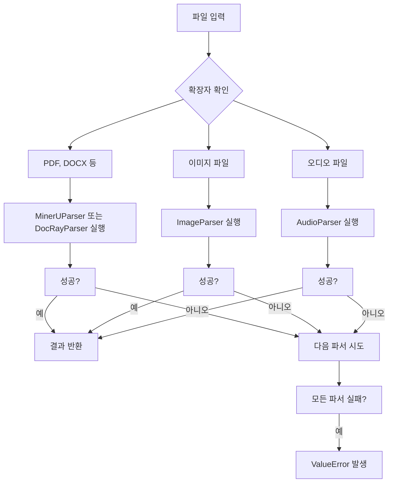
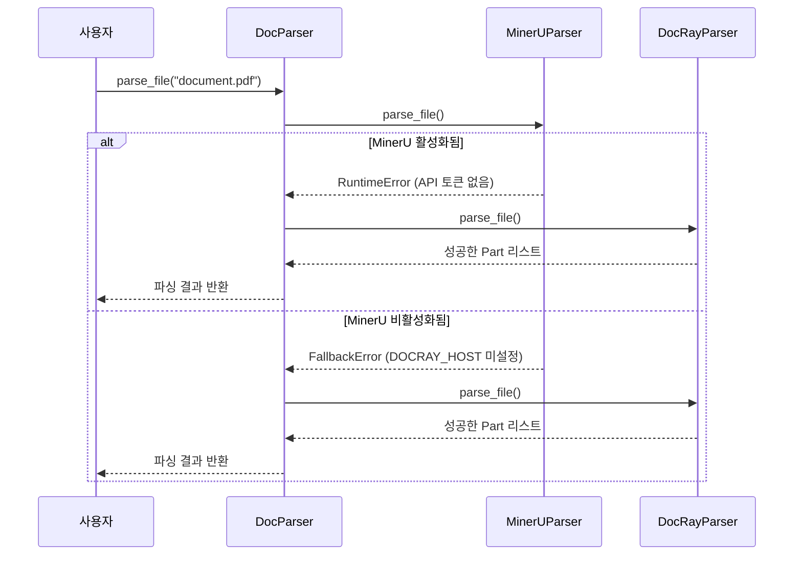
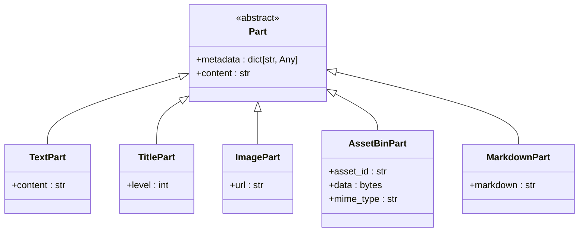

# 문서 파싱

<cite>
**이 문서에서 참조한 파일**
- [doc_parser.py](file://aperag/docparser/doc_parser.py)
- [mineru_parser.py](file://aperag/docparser/mineru_parser.py)
- [docray_parser.py](file://aperag/docparser/docray_parser.py)
- [image_parser.py](file://aperag/docparser/image_parser.py)
- [audio_parser.py](file://aperag/docparser/audio_parser.py)
- [base.py](file://aperag/docparser/base.py)
- [mineru_common.py](file://aperag/docparser/mineru_common.py)
- [utils.py](file://aperag/docparser/utils.py)
</cite>

## 목차
1. [소개](#소개)
2. [핵심 구성 요소](#핵심-구성-요소)
3. [파서 선택 로직](#파서-선택-로직)
4. [외부 API 통합 및 인증](#외부-api-통합-및-인증)
5. [폴백 전략](#폴백-전략)
6. [플러그인 아키텍처](#플러그인-아키텍처)
7. [멀티모달 데이터 처리](#멀티모달-데이터-처리)
8. [결론](#결론)

## 소개
ApeRAG 시스템은 다양한 형식의 문서(PDF, 이미지, Office 파일 등)를 구조화된 텍스트와 멀티모달 데이터로 변환하는 고급 파싱 기능을 제공합니다. 이 과정에서는 MinerU를 통한 PDF 내 테이블과 수식 추출, DocRay를 활용한 문서 레이아웃 인식, 이미지 OCR, 오디오 STT(음성-텍스트 변환) 등의 첨단 기술이 적용됩니다. 본 문서는 이러한 복잡한 파싱 프로세스의 내부 동작 원리, 파서 선택 로직, 외부 서비스 통합 방식, 실패 대응 전략 및 확장 가능한 플러그인 아키텍처에 대해 상세히 설명합니다.

## 핵심 구성 요소

문서 파싱 시스템의 핵심은 `BaseParser` 인터페이스를 기반으로 하는 모듈화된 설계입니다. 모든 파서는 이 기본 클래스를 상속받아 일관된 인터페이스를 따르며, 주요 메서드로는 지원되는 파일 확장자를 반환하는 `supported_extensions()`와 실제 파싱을 수행하는 `parse_file()`이 있습니다. 각 파서는 특정 유형의 파일을 처리하도록 설계되어 있으며, 전체 시스템은 이러한 파서들의 조합을 통해 다양한 문서 형식을 처리할 수 있습니다.

**Section sources**
- [base.py](file://aperag/docparser/base.py#L70-L81)
- [doc_parser.py](file://aperag/docparser/doc_parser.py#L69-L142)

## 파서 선택 로직

시스템의 중심에는 `DocParser` 클래스가 있으며, 이는 다수의 하위 파서들을 관리하고 적절한 파서를 선택하는 역할을 합니다. 파서 선택 로직은 다음과 같은 단계로 이루어집니다:

1.  **설정 기반 초기화**: `DocParser`는 `get_default_config()` 함수를 통해 기본 파서 설정 리스트를 가져옵니다. 이 설정은 각 파서의 이름, 활성화 여부, 지원 확장자 오버라이드, 설정 정보 등을 포함합니다.
2.  **동적 설정 업데이트**: 사용자 설정이나 환경 변수를 기반으로 파서의 활성화 상태를 동적으로 변경합니다. 예를 들어, `MinerUParser`는 `USE_MINERU_API` 환경 변수와 `MINERU_API_TOKEN`이 존재해야 활성화됩니다.
3.  **파서 인스턴스 생성**: 활성화된 파서들만 인스턴스화하여 `parsers` 딕셔너리에 저장합니다. 이때 `PARSER_MAP`이라는 정적 맵을 사용하여 문자열 이름을 실제 클래스 타입으로 매핑합니다.
4.  **우선순위 기반 파싱**: `parsing_order` 리스트에 정의된 순서대로 파서를 실행합니다. 파일의 확장자를 확인하여 해당 파서가 지원하는지 판단한 후, 지원한다면 `parse_file()` 메서드를 호출합니다. 첫 번째로 성공적인 결과를 반환하는 파서의 출력이 최종 결과가 됩니다.

**Diagram sources**
- [doc_parser.py](file://aperag/docparser/doc_parser.py#L69-L142)

**Section sources**
- [doc_parser.py](file://aperag/docparser/doc_parser.py#L69-L142)

## 외부 API 통합 및 인증

주요 파서들은 외부 API를 호출하여 고급 기능을 수행합니다. 이 과정에서 안전하고 신뢰할 수 있는 인증 및 오류 처리가 필수적입니다.

*   **MinerUParser**: MinerU 클라우드 서비스에 접근하기 위해 `api_token`을 사용합니다. 요청 헤더에 `Bearer {token}` 형식으로 인증 정보를 포함시킵니다. 토큰이 설정되지 않은 경우 즉시 `RuntimeError`를 발생시켜 후속 작업을 중단합니다.
*   **DocRayParser**: 자체 배포된 DocRay 서버에 연결합니다. 연결 호스트(`DOCRAY_HOST`)가 설정되어 있지 않으면 `FallbackError`를 발생시켜 폴백 메커니즘을 트리거합니다.
*   **ImageParser 및 AudioParser**: PaddleOCR 및 Whisper ASR 웹서비스와 같은 내부 마이크로서비스에 연결합니다. 이들 서비스의 호스트 주소(`PADDLEOCR_HOST`, `WHISPER_HOST`)가 누락되면 마찬가지로 `FallbackError`를 발생시킵니다.

모든 외부 API 호출은 `requests.exceptions.RequestException`을 포착하여 네트워크 오류나 HTTP 에러를 적절히 처리하며, 자세한 오류 정보는 로깅을 통해 기록됩니다.

**Section sources**
- [mineru_parser.py](file://aperag/docparser/mineru_parser.py#L43-L177)
- [docray_parser.py](file://aperag/docparser/docray_parser.py#L43-L139)
- [image_parser.py](file://aperag/docparser/image_parser.py#L36-L74)
- [audio_parser.py](file://aperag/docparser/audio_parser.py#L35-L69)

## 폴백 전략

시스템은 높은 가용성과 견고성을 보장하기 위해 강력한 폴백 전략을 채택하고 있습니다. 이 전략은 두 가지 핵심 요소로 구성됩니다.

1.  **파서 간 폴백**: `DocParser`는 여러 파서를 우선순위 순서로 관리합니다. 현재 파서가 파일을 처리할 수 없거나 오류가 발생하면, 다음 파서로 제어가 넘어갑니다. 예를 들어, MinerU API가 일시적으로 불안정하더라도, DocRayParser가 PDF를 처리할 수 있다면 시스템은 계속 작동합니다.
2.  **조건부 폴백 예외(FallbackError)**: 일부 파서는 특정 조건이 충족되지 않을 때 `FallbackError`를 발생시킵니다. 이는 일반적인 `Exception`과 달리, `DocParser`의 `parse_file()` 메서드에서 특별히 처리됩니다. `FallbackError`가 발생하면 현재 파서의 실행을 중단하고 바로 다음 파서로 넘어가기 때문에, 비활성화된 서비스로 인해 전체 파싱이 실패하는 것을 방지합니다. 반면, `RuntimeError`와 같은 다른 예외는 심각한 문제를 나타내며, 일반적으로 더 이상의 시도 없이 상위로 전파됩니다.

**Diagram sources**
- [doc_parser.py](file://aperag/docparser/doc_parser.py#L135-L142)
- [docray_parser.py](file://aperag/docparser/docray_parser.py#L50-L52)

**Section sources**
- [doc_parser.py](file://aperag/docparser/doc_parser.py#L69-L142)
- [docray_parser.py](file://aperag/docparser/docray_parser.py#L43-L139)

## 플러그인 아키텍처

시스템은 새로운 파서를 쉽게 추가할 수 있도록 확장 가능한 플러그인 아키텍처를 제공합니다. 이 아키텍처의 핵심은 다음과 같습니다.

1.  **표준화된 인터페이스**: 모든 새 파서는 `BaseParser` 클래스를 상속받아야 하며, `name`, `supported_extensions()`, `parse_file()` 등의 추상 메서드를 반드시 구현해야 합니다.
2.  **정적 등록 메커니즘**: 새 파서 클래스를 작성한 후, 이를 `ALL_PARSERS` 리스트에 추가하고, `PARSER_MAP` 딕셔너리에 자동으로 등록되도록 합니다. 이는 `PARSER_MAP = {cls.name: cls for cls in ALL_PARSERS}` 코드를 통해 이루어집니다.
3.  **설정 기반 제어**: 새로 추가된 파서는 `get_default_config()` 함수의 반환값에 `ParserConfig` 객체로 포함되어야 합니다. 이를 통해 사용자는 설정 파일이나 환경 변수를 통해 해당 파서의 활성화 여부, 지원 확장자, API 키 등을 동적으로 제어할 수 있습니다.

이러한 설계 덕분에 개발자는 기존 코드의 큰 수정 없이도 새로운 파일 형식을 지원하는 파서를 독립적으로 개발하고 통합할 수 있습니다.

**Section sources**
- [doc_parser.py](file://aperag/docparser/doc_parser.py#L35-L45)
- [base.py](file://aperag/docparser/base.py#L70-L81)

## 멀티모달 데이터 처리

파싱 결과는 단순한 텍스트 이상의 의미를 갖는 구조화된 데이터인 `Part` 객체의 리스트로 표현됩니다. `mineru_common.py` 모듈은 이 과정의 핵심 역할을 합니다.

*   **중간 JSON 구조 해석**: MinerU 및 DocRay 파서는 먼저 문서를 분석하여 `layout.json`과 같은 중간 JSON 형식으로 변환합니다. 이 JSON은 페이지, 문단, 텍스트, 표, 이미지 등 문서의 논리적 구조를 포함합니다.
*   **Part 객체 생성**: `middle_json_to_parts()` 함수는 이 중간 JSON을 순회하면서 각 요소를 적절한 `Part` 하위 타입으로 변환합니다. 예를 들어, 텍스트 블록은 `TextPart`, 제목은 `TitlePart`로 변환됩니다.
*   **테이블 및 이미지 처리**: `_convert_table_para()` 및 `_convert_image_para()` 함수는 표와 이미지를 특별히 처리합니다. 표의 경우 HTML 또는 LaTeX 형식의 데이터를 함께 저장하며, 이미지의 경우 바이너리 데이터를 `AssetBinPart`에 저장하고, 이를 참조하는 URL을 포함한 마크다운 형식의 `ImagePart`를 생성합니다.
*   **마크다운 통합**: `to_md_part()` 함수는 모든 `Part` 객체를 하나의 연속적인 마크다운 문자열로 통합합니다. 각 `Part`의 내용은 줄바꿈과 함께 연결되며, 소스 맵 정보가 메타데이터에 추가되어 원본 문서 내 위치를 추적할 수 있게 합니다.

이러한 방식으로, 시스템은 원본 문서의 시맨틱 구조와 시각적 요소를 모두 보존하면서도 검색과 분석이 용이한 형태로 데이터를 변환합니다.

**Diagram sources**
- [mineru_common.py](file://aperag/docparser/mineru_common.py#L33-L63)
- [base.py](file://aperag/docparser/base.py#L70-L81)

**Section sources**
- [mineru_common.py](file://aperag/docparser/mineru_common.py#L33-L292)
- [utils.py](file://aperag/docparser/utils.py#L57-L87)

## 결론

ApeRAG의 문서 파싱 시스템은 모듈화되고 확장 가능한 설계를 통해 다양한 형식의 문서를 효과적으로 처리합니다. `DocParser`는 파서 선택 로직과 폴백 전략을 중앙에서 관리하며, 각 전문 파서(MinerU, DocRay 등)는 외부 서비스를 활용하여 고급 인식 기능을 수행합니다. `FallbackError`를 활용한 조건부 폴백 메커니즘은 시스템의 견고성을 크게 향상시키며, 표준화된 인터페이스와 정적 등록 방식은 새로운 파서의 통합을 매우 용이하게 만듭니다. 마지막으로, `Part` 객체를 통한 멀티모달 데이터 표현은 원본 문서의 풍부한 정보를 손실 없이 구조화된 형태로 유지함으로써, 후속 RAG(Retrieval-Augmented Generation) 프로세스의 정확성과 효율성을 극대화합니다.