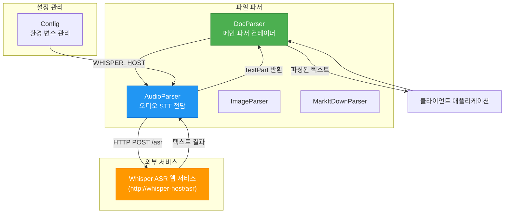
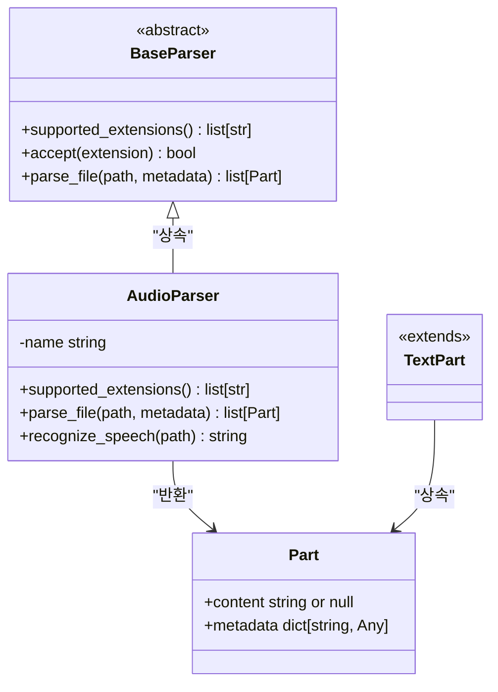
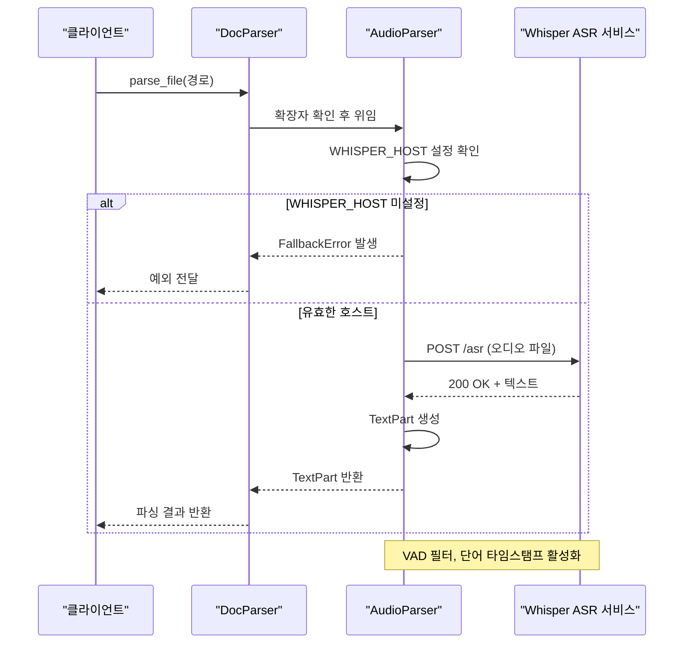
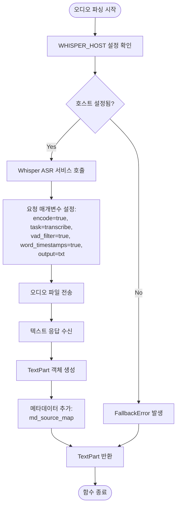
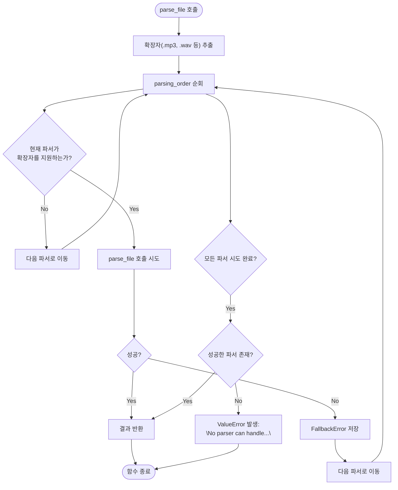

# 오디오 파싱

<cite>
**이 문서에서 참조한 파일**
- [audio_parser.py](file://aperag\docparser\audio_parser.py)
- [config.py](file://aperag\config.py)
- [base.py](file://aperag\docparser\base.py)
- [doc_parser.py](file://aperag\docparser\doc_parser.py)
</cite>

## 목차
1. [소개](#소개)
2. [핵심 구성 요소](#핵심-구성-요소)
3. [아키텍처 개요](#아키텍처-개요)
4. [상세 구성 요소 분석](#상세-구성-요소-분석)
5. [의존성 분석](#의존성-분석)

## 소개
이 문서는 `audio_parser.py` 모듈을 중심으로 오디오 파일(WAV, MP3 등)에서 음성을 텍스트로 변환(STT: Speech-to-Text)하는 프로세스를 설명합니다. 이 시스템은 Whisper ASR 웹 서비스와 같은 외부 STT API를 호출하여 오디오를 처리하며, 오디오 포맷 변환, 샘플링 레이트 조정, 잡음 제거 등의 전처리 과정 없이 직접 오디오 파일을 전송하는 구조를 가지고 있습니다. 또한 대용량 오디오 파일의 스트리밍 처리, 타임스탬프 기반 세그먼트 생성, 화자 분리(Speaker Diarization) 지원 여부, 실패 시 재시도 및 폴백 메커니즘을 포함한 신뢰성 있는 파싱 전략에 대해 다룹니다.

## 핵심 구성 요소

[오디오 파싱의 핵심적인 클래스와 메서드에 대한 심층 분석]

**Section sources**
- [audio_parser.py](file://aperag\docparser\audio_parser.py#L35-L69)
- [base.py](file://aperag\docparser\base.py#L70-L81)
- [doc_parser.py](file://aperag\docparser\doc_parser.py#L69-L142)

## 아키텍처 개요

[시스템 아키텍처의 포괄적인 시각화 및 설명]



**Diagram sources**
- [audio_parser.py](file://aperag\docparser\audio_parser.py#L35-L69)
- [doc_parser.py](file://aperag\docparser\doc_parser.py#L69-L142)
- [config.py](file://aperag\config.py#L153)

## 상세 구성 요소 분석

[각 주요 구성 요소에 대한 철저한 분석]

### AudioParser 분석
`AudioParser` 클래스는 `.mp3`, `.wav`, `.flac` 등 다양한 오디오 형식을 지원하며, 외부 Whisper ASR 웹 서비스를 활용해 음성을 텍스트로 변환합니다. 이 클래스는 `BaseParser` 추상 클래스를 상속받아 일관된 인터페이스를 제공합니다.

#### 클래스 다이어그램


**Diagram sources**
- [audio_parser.py](file://aperag\docparser\audio_parser.py#L35-L69)
- [base.py](file://aperag\docparser\base.py#L70-L81)

#### STT 요청 흐름


**Diagram sources**
- [audio_parser.py](file://aperag\docparser\audio_parser.py#L50-L69)
- [doc_parser.py](file://aperag\docparser\doc_parser.py#L131-L142)

#### 오디오 파싱 알고리즘


**Diagram sources**
- [audio_parser.py](file://aperag\docparser\audio_parser.py#L41-L69)

**Section sources**
- [audio_parser.py](file://aperag\docparser\audio_parser.py#L35-L69)

### DocParser 통합 분석
`DocParser`는 다양한 파일 형식을 처리하는 메인 파서로, `AudioParser`를 포함한 여러 파서를 관리하고 적절한 파서를 선택하여 파일을 처리합니다.

#### 파서 선택 및 실행 흐름


**Diagram sources**
- [doc_parser.py](file://aperag\docparser\doc_parser.py#L131-L142)

**Section sources**
- [doc_parser.py](file://aperag\docparser\doc_parser.py#L69-L142)

## 의존성 분석

[구성 요소 간의 의존성 분석]

```mermaid
graph TD
audio_parser.py --> base.py : "상속 및 타입 가져오기"
audio_parser.py --> config.py : "settings.whisper_host 사용"
doc_parser.py --> audio_parser.py : "AudioParser 클래스 참조"
doc_parser.py --> base.py : "BaseParser, Part 타입 참조"
config.py --> dotenv : ".env 파일 로딩"
audio_parser.py --> requests : "HTTP 요청"
```

**Diagram sources**
- [audio_parser.py](file://aperag\docparser\audio_parser.py)
- [doc_parser.py](file://aperag\docparser\doc_parser.py)
- [config.py](file://aperag\config.py)

**Section sources**
- [audio_parser.py](file://aperag\docparser\audio_parser.py)
- [doc_parser.py](file://aperag\docparser\doc_parser.py)
- [config.py](file://aperag\config.py)